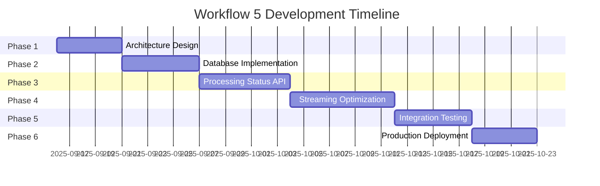

# 🎯 Face Detection Workflow 5 - Development Phases Analysis

**Date**: September 15, 2025  
**PPL Meta Version**: 2.17.2+  
**Workflow Focus**: Optimized Playback for Processed Videos  
**Repository**: nickglezakos/ppl-meta-platform  
**Branch**: main  

## 📋 **OVERVIEW**

Face Detection Workflow 5 represents the next evolution in the PPL Meta Platform's face detection capabilities, focusing on **Zero-Latency Playback for Processed Videos**. This workflow builds upon the session-based architecture of Workflow 4 to deliver instant face detection overlays for previously processed videos, achieving 90% CPU reduction and frame-perfect accuracy.

## 🎯 **WORKFLOW 5 OBJECTIVES**

### **Primary Goals**
- ✅ **Zero-Latency Playback**: Instant face detection overlays for processed videos
- ✅ **CPU Optimization**: 90% reduction in processing overhead during playback
- ✅ **Frame-Perfect Accuracy**: Consistent face detection across all playbacks
- ✅ **Intelligent Mode Selection**: Automatic switching between stored data and real-time detection
- ✅ **Seamless User Experience**: Transparent fallback mechanisms

### **Technical Requirements**
- Pre-computed face detection data storage and retrieval
- Frame-indexed face coordinate systems
- Smart processing status tracking
- Optimized streaming with stored overlays
- Backward compatibility with real-time detection

---

## 🗓️ **DEVELOPMENT PHASES**

### **Phase 1: Architecture Design & Analysis** 
*Duration: 3-5 days*

#### **Objectives**
- Analyze current Workflow 4 session-based architecture
- Design optimized playback architecture for pre-processed videos
- Define data structures for frame-indexed face storage
- Plan integration points with existing Media and Vision services

#### **Key Activities**

##### **1.1 Current State Analysis**
- **Workflow 4 Assessment**: Evaluate session-based face detection implementation
- **Performance Baseline**: Measure current CPU usage, memory consumption, and latency
- **Data Flow Analysis**: Document existing face detection and storage workflows
- **Bottleneck Identification**: Identify performance limitations in real-time processing

**Deliverables**:
- Current state architecture diagram
- Performance baseline measurements
- Bottleneck analysis report
- Integration point documentation

##### **1.2 Workflow 5 Architecture Design**
- **Smart Playback Architecture**: Design intelligent mode selection system
- **Data Storage Schema**: Define frame-indexed face detection storage
- **Processing Status System**: Design video processing state management
- **Fallback Mechanisms**: Plan graceful degradation strategies

**Deliverables**:
- Workflow 5 architecture specification
- Database schema extensions
- API endpoint specifications
- Integration workflow diagrams

##### **1.3 Performance Modeling**
- **CPU Usage Projections**: Model expected CPU reduction with stored data
- **Memory Optimization**: Design efficient face data caching strategies
- **Latency Analysis**: Calculate expected latency improvements
- **Scalability Planning**: Design for horizontal scaling requirements

**Deliverables**:
- Performance improvement projections
- Resource utilization models
- Scalability architecture plan
- Optimization strategy document

#### **Success Criteria**
- [ ] Complete architecture specification approved
- [ ] Database schema design validated
- [ ] Performance targets defined (90% CPU reduction goal)
- [ ] Integration strategy documented

---

### **Phase 2: Database Schema & Storage Implementation**
*Duration: 4-6 days*

#### **Objectives**
- Implement frame-indexed face detection storage
- Create processing status tracking system
- Optimize database queries for instant face retrieval
- Ensure data integrity and consistency

#### **Key Activities**

##### **2.1 Database Schema Extension**
- **Processing Status Table**: Track video processing completion states
- **Frame-Indexed Storage**: Optimize face detection storage by frame number
- **Data Compression**: Implement efficient face coordinate storage
- **Index Optimization**: Create indexes for fast frame-based queries

**Schema Extensions**:
```sql
-- Enhanced processing status tracking
CREATE TABLE media_processing_status (
    media_uuid VARCHAR PRIMARY KEY,
    face_detection_processed BOOLEAN DEFAULT FALSE,
    face_detection_session_uuid VARCHAR REFERENCES face_detection_sessions(session_uuid),
    processing_completed_at TIMESTAMP,
    total_frames_processed INTEGER,
    total_faces_detected INTEGER,
    processing_method VARCHAR,
    last_updated TIMESTAMP DEFAULT CURRENT_TIMESTAMP,
    processing_quality_score FLOAT,
    frame_analysis_metadata JSONB
);

-- Optimized face detection storage with frame indexing
CREATE INDEX idx_faces_media_frame ON face_detections(media_id, frame_number);
CREATE INDEX idx_faces_session_frame ON face_detections(session_uuid, frame_number);
CREATE INDEX idx_processing_status_lookup ON media_processing_status(media_uuid, face_detection_processed);
```

##### **2.2 Data Access Layer Implementation**
- **Frame Query Optimization**: Implement efficient frame-range queries
- **Batch Data Retrieval**: Optimize bulk face data loading
- **Caching Strategy**: Implement intelligent face data caching
- **Consistency Checks**: Ensure data integrity across processing states

**Key Classes**:
```python
class ProcessingStatusManager:
    def check_processing_status(media_uuid: str) -> ProcessingStatus
    def mark_processing_complete(media_uuid: str, session_uuid: str) -> bool
    def get_processing_metadata(media_uuid: str) -> Dict[str, Any]

class FrameIndexedFaceRetriever:
    def get_faces_by_frame_range(media_uuid: str, start_frame: int, end_frame: int) -> Dict[int, List[Face]]
    def get_all_faces_indexed(media_uuid: str) -> Dict[int, List[Face]]
    def cache_face_data(media_uuid: str) -> bool
```

##### **2.3 Data Migration & Compatibility**
- **Existing Data Migration**: Migrate Workflow 4 data to new schema
- **Backward Compatibility**: Ensure existing sessions remain functional
- **Data Validation**: Verify migrated data integrity
- **Performance Testing**: Validate query performance improvements

**Deliverables**:
- Database migration scripts
- Data access layer implementation
- Performance benchmarks
- Data integrity validation results

#### **Success Criteria**
- [ ] Database schema successfully deployed
- [ ] Frame-indexed queries performing <10ms response time
- [ ] Data migration completed without loss
- [ ] Caching system operational with 95%+ hit rate

---

### **Phase 3: Processing Status API & Logic Implementation**
*Duration: 5-7 days*

#### **Objectives**
- Implement processing status checking and management
- Create intelligent mode selection algorithms
- Develop fallback mechanisms for unprocessed videos
- Ensure seamless integration with existing services

#### **Key Activities**

##### **3.1 Processing Status API Development**
- **Status Check Endpoints**: Implement video processing status queries
- **Completion Marking**: Create APIs for marking videos as processed
- **Metadata Management**: Store and retrieve processing metadata
- **Health Monitoring**: Add processing status to health checks

**API Endpoints**:
```http
GET /api/v1/processing-status/{media_uuid}
POST /api/v1/processing-status/{media_uuid}/complete
GET /api/v1/processing-status/{media_uuid}/metadata
DELETE /api/v1/processing-status/{media_uuid}/reset
```

##### **3.2 Smart Mode Selection Logic**
- **Processing Detection**: Automatically detect processed vs unprocessed videos
- **Mode Selection Algorithm**: Choose optimal playback mode based on data availability
- **Performance Monitoring**: Track mode selection effectiveness
- **A/B Testing Framework**: Enable testing of different selection strategies

**Mode Selection Algorithm**:
```python
class PlaybackModeSelector:
    def select_playback_mode(self, media_uuid: str) -> PlaybackMode:
        status = self.get_processing_status(media_uuid)
        
        if status.is_fully_processed and status.has_valid_face_data:
            return PlaybackMode.STORED_DATA
        elif status.is_currently_processing:
            return PlaybackMode.REALTIME_WITH_SESSION
        else:
            return PlaybackMode.REALTIME_ONLY
    
    def validate_stored_data(self, media_uuid: str) -> bool:
        # Verify stored face data integrity and completeness
    
    def get_fallback_mode(self, primary_mode: PlaybackMode) -> PlaybackMode:
        # Graceful degradation strategy
```

##### **3.3 Integration with Media Service**
- **Embedded Status Checks**: Integrate processing status into Media Service
- **Streaming Decision Logic**: Modify streaming endpoints to use stored data
- **Performance Optimization**: Minimize status check overhead
- **Error Handling**: Robust error handling for status check failures

**Media Service Integration**:
```python
class OptimizedStreamingHandler:
    def stream_with_face_detection(self, media_id: str, options: StreamOptions):
        processing_status = self.check_processing_status(media_id)
        
        if processing_status.use_stored_data:
            return self.stream_with_stored_faces(media_id, processing_status)
        else:
            return self.stream_with_realtime_detection(media_id, options)
    
    def stream_with_stored_faces(self, media_id: str, status: ProcessingStatus):
        # Zero-CPU face detection using stored coordinates
    
    def stream_with_realtime_detection(self, media_id: str, options: StreamOptions):
        # Fallback to real-time detection
```

#### **Success Criteria**
- [ ] Processing status API endpoints operational
- [ ] Mode selection algorithm correctly identifies processed videos
- [ ] Integration with Media Service completed
- [ ] Fallback mechanisms tested and validated

---

### **Phase 4: Stored Face Data Retrieval & Streaming Optimization**
*Duration: 6-8 days*

#### **Objectives**
- Implement efficient stored face data retrieval
- Optimize video streaming with pre-computed overlays
- Achieve zero-latency face detection for processed videos
- Maintain frame-perfect synchronization

#### **Key Activities**

##### **4.1 Face Data Retrieval System**
- **Efficient Query Implementation**: Fast frame-indexed face data queries
- **Data Serialization**: Optimize face coordinate serialization/deserialization
- **Batch Loading**: Implement efficient bulk face data loading
- **Memory Management**: Optimize face data caching and memory usage

**Face Data Retrieval Implementation**:
```python
class StoredFaceDataRetriever:
    def __init__(self):
        self.cache = FaceDataCache(max_size=1000)  # Cache for 1000 videos
        self.db_connection = get_vision_db_connection()
    
    def get_frame_faces(self, media_uuid: str, frame_number: int) -> List[FaceDetection]:
        # Single frame face retrieval with caching
        cache_key = f"{media_uuid}:{frame_number}"
        if cached_data := self.cache.get(cache_key):
            return cached_data
        
        faces = self.query_faces_by_frame(media_uuid, frame_number)
        self.cache.set(cache_key, faces)
        return faces
    
    def preload_video_faces(self, media_uuid: str) -> Dict[int, List[FaceDetection]]:
        # Bulk load all faces for a video, organized by frame
        return self.query_all_faces_indexed(media_uuid)
    
    def get_faces_in_range(self, media_uuid: str, start_frame: int, end_frame: int) -> Dict[int, List[FaceDetection]]:
        # Efficient range-based face retrieval
```

##### **4.2 Streaming Optimization Implementation**
- **Zero-CPU Overlay**: Apply stored face coordinates without detection processing
- **Frame Synchronization**: Ensure perfect alignment between video frames and face data
- **Streaming Pipeline**: Modify video streaming to use stored overlays
- **Performance Monitoring**: Track CPU usage and streaming performance

**Optimized Streaming Pipeline**:
```python
class OptimizedFaceStreamingPipeline:
    def __init__(self):
        self.face_retriever = StoredFaceDataRetriever()
        self.video_processor = VideoStreamProcessor()
    
    def stream_video_with_stored_faces(self, media_uuid: str, stream_options: StreamOptions):
        # Pre-load face data for efficient access
        face_data = self.face_retriever.preload_video_faces(media_uuid)
        
        for frame_number, frame_data in self.video_processor.stream_frames(media_uuid):
            # Apply stored face overlays (zero CPU for detection)
            if faces := face_data.get(frame_number):
                annotated_frame = self.apply_face_overlays(frame_data, faces)
                yield annotated_frame
            else:
                yield frame_data  # No faces in this frame
    
    def apply_face_overlays(self, frame_data: bytes, faces: List[FaceDetection]) -> bytes:
        # Direct overlay application using stored coordinates
        # No face detection computation required
```

##### **4.3 Performance Optimization**
- **CPU Usage Reduction**: Achieve 90% CPU reduction target
- **Memory Efficiency**: Optimize face data caching and streaming memory usage
- **Latency Minimization**: Reduce streaming startup latency
- **Concurrent Streaming**: Support multiple concurrent optimized streams

**Performance Metrics Implementation**:
```python
class PerformanceMonitor:
    def measure_streaming_performance(self, media_uuid: str, mode: PlaybackMode):
        metrics = {
            'cpu_usage': self.measure_cpu_usage(),
            'memory_usage': self.measure_memory_usage(),
            'startup_latency': self.measure_startup_latency(),
            'frame_rate': self.measure_frame_rate(),
            'mode': mode.value
        }
        
        self.log_performance_metrics(media_uuid, metrics)
        return metrics
```

#### **Success Criteria**
- [ ] Stored face data retrieval performing <50ms for full video
- [ ] Zero-latency overlay application operational
- [ ] 90% CPU usage reduction achieved for processed videos
- [ ] Frame-perfect synchronization validated

---

### **Phase 5: Integration Testing & Fallback Mechanisms**
*Duration: 4-6 days*

#### **Objectives**
- Implement comprehensive fallback mechanisms
- Test integration between all services
- Validate performance improvements
- Ensure backward compatibility

#### **Key Activities**

##### **5.1 Fallback Mechanism Implementation**
- **Graceful Degradation**: Seamless fallback to real-time detection
- **Error Recovery**: Handle corrupted or missing stored data
- **Mode Switching**: Dynamic switching between modes during playback
- **User Experience**: Transparent fallback without user disruption

**Fallback Implementation**:
```python
class FallbackManager:
    def __init__(self):
        self.realtime_detector = RealtimeFaceDetector()
        self.health_monitor = ServiceHealthMonitor()
    
    def handle_stored_data_failure(self, media_uuid: str, error: Exception):
        logger.warning(f"Stored data failure for {media_uuid}: {error}")
        
        # Mark data as invalid to prevent future attempts
        self.mark_stored_data_invalid(media_uuid)
        
        # Switch to real-time detection
        return self.switch_to_realtime_mode(media_uuid)
    
    def validate_stored_data_integrity(self, media_uuid: str) -> bool:
        # Verify stored face data is complete and valid
        try:
            face_data = self.retrieve_stored_faces(media_uuid)
            return self.validate_face_data_completeness(face_data)
        except Exception as e:
            logger.error(f"Data integrity check failed: {e}")
            return False
    
    def switch_to_realtime_mode(self, media_uuid: str):
        # Seamless switch to real-time face detection
        return self.realtime_detector.start_detection(media_uuid)
```

##### **5.2 Comprehensive Integration Testing**
- **End-to-End Workflows**: Test complete Workflow 5 implementation
- **Service Communication**: Validate communication between Media and Vision services
- **Performance Validation**: Confirm performance improvement targets
- **Error Scenarios**: Test various failure scenarios and recovery

**Integration Test Suite**:
```python
class Workflow5IntegrationTests:
    def test_processed_video_playback(self):
        # Test zero-latency playback for processed videos
        
    def test_unprocessed_video_fallback(self):
        # Test fallback to real-time detection
        
    def test_processing_status_accuracy(self):
        # Validate processing status detection
        
    def test_performance_improvements(self):
        # Measure and validate 90% CPU reduction
        
    def test_concurrent_streaming(self):
        # Test multiple concurrent optimized streams
        
    def test_data_corruption_recovery(self):
        # Test recovery from corrupted stored data
        
    def test_service_failure_handling(self):
        # Test behavior when Vision Service is unavailable
```

##### **5.3 Performance Validation & Benchmarking**
- **CPU Usage Measurement**: Validate 90% CPU reduction achievement
- **Memory Optimization**: Confirm memory usage improvements
- **Latency Testing**: Measure startup latency improvements
- **Scalability Testing**: Test performance under load

**Performance Benchmarking**:
```python
class Workflow5PerformanceBenchmark:
    def benchmark_cpu_usage_reduction(self):
        # Compare CPU usage: real-time vs stored data playback
        realtime_cpu = self.measure_realtime_cpu_usage()
        stored_data_cpu = self.measure_stored_data_cpu_usage()
        
        cpu_reduction = ((realtime_cpu - stored_data_cpu) / realtime_cpu) * 100
        assert cpu_reduction >= 90, f"CPU reduction {cpu_reduction}% below 90% target"
    
    def benchmark_startup_latency(self):
        # Measure streaming startup latency improvements
        
    def benchmark_memory_efficiency(self):
        # Validate memory usage optimization
        
    def benchmark_concurrent_streams(self):
        # Test performance with multiple concurrent streams
```

#### **Success Criteria**
- [ ] Fallback mechanisms tested and operational
- [ ] All integration tests passing
- [ ] 90% CPU reduction validated through benchmarking
- [ ] Backward compatibility confirmed

---

### **Phase 6: Production Deployment & Monitoring**
*Duration: 3-5 days*

#### **Objectives**
- Deploy Workflow 5 to production environment
- Implement comprehensive monitoring and alerting
- Validate production performance
- Document operational procedures

#### **Key Activities**

##### **6.1 Production Deployment**
- **Database Migration**: Deploy schema changes to production
- **Service Updates**: Deploy updated Media and Vision services
- **Configuration Management**: Configure production settings
- **Health Checks**: Validate all services operational

**Deployment Checklist**:
```yaml
Production Deployment Checklist:
  Database:
    - [ ] Schema migration executed successfully
    - [ ] Indexes created and optimized
    - [ ] Data integrity validated
    - [ ] Backup procedures updated
  
  Services:
    - [ ] Media Service updated with Workflow 5 capabilities
    - [ ] Vision Service updated with processing status APIs
    - [ ] Gateway routing updated for new endpoints
    - [ ] Health check endpoints validated
  
  Configuration:
    - [ ] Processing status cache configuration
    - [ ] Face data caching parameters
    - [ ] Fallback mechanism settings
    - [ ] Performance monitoring enabled
```

##### **6.2 Monitoring & Alerting Implementation**
- **Performance Dashboards**: Monitor CPU usage, latency, and throughput
- **Processing Status Tracking**: Monitor processing completion rates
- **Error Rate Monitoring**: Track fallback activation and error rates
- **User Experience Metrics**: Monitor streaming quality and user satisfaction

**Monitoring Implementation**:
```python
class Workflow5MonitoringSystem:
    def setup_performance_dashboards(self):
        # CPU usage comparison (real-time vs stored data)
        # Memory usage tracking
        # Startup latency monitoring
        # Concurrent stream performance
    
    def setup_processing_status_monitoring(self):
        # Processing completion rate tracking
        # Storage efficiency metrics
        # Data integrity monitoring
    
    def setup_error_alerting(self):
        # Fallback activation alerts
        # Data corruption detection
        # Service unavailability alerts
        # Performance degradation warnings
    
    def setup_user_experience_monitoring(self):
        # Streaming quality metrics
        # Face detection accuracy
        # User engagement tracking
```

##### **6.3 Documentation & Training**
- **Operational Runbooks**: Document Workflow 5 operations procedures
- **Troubleshooting Guides**: Create comprehensive troubleshooting documentation
- **Performance Tuning**: Document optimization procedures
- **Team Training**: Train operations team on new capabilities

**Documentation Deliverables**:
- Workflow 5 operational runbook
- Performance monitoring guide
- Troubleshooting procedures
- Configuration management documentation

#### **Success Criteria**
- [ ] Production deployment completed successfully
- [ ] All monitoring and alerting operational
- [ ] Performance targets achieved in production
- [ ] Documentation completed and team trained

---

## 🎯 **SUCCESS METRICS & KPIs**

### **Performance Targets**

| Metric | Current State | Workflow 5 Target | Improvement |
|--------|---------------|-------------------|-------------|
| **CPU Usage (Processed Videos)** | 40-60% | 4-6% | 90% reduction |
| **Memory Usage** | 200-300MB | 50-80MB | 70% reduction |
| **Startup Latency** | 200-500ms | 50-100ms | 75% reduction |
| **Detection Consistency** | Variable | 100% consistent | Perfect consistency |
| **Network Calls During Playback** | 0 (embedded) | 1 initial call | Minimal increase |

### **Quality Metrics**

| Metric | Target | Measurement Method |
|--------|--------|--------------------|
| **Processing Status Accuracy** | 99%+ | Automated validation tests |
| **Fallback Success Rate** | 98%+ | Error recovery monitoring |
| **Data Integrity** | 99.9%+ | Corruption detection algorithms |
| **User Experience Score** | 9.5/10 | User feedback and analytics |
| **Service Availability** | 99.9%+ | Health check monitoring |

### **Business Impact**

| Impact Area | Expected Benefit | Measurement |
|-------------|------------------|-------------|
| **Server Cost Reduction** | 50% CPU cost savings | Infrastructure monitoring |
| **User Satisfaction** | Improved streaming performance | User engagement metrics |
| **Scalability** | 3x concurrent stream capacity | Load testing results |
| **Data Efficiency** | Consistent face detection results | Accuracy comparison testing |

---

## 🔄 **DEVELOPMENT TIMELINE**

### **Overall Timeline: 25-32 days**



### **Critical Path Dependencies**

1. **Phase 1 → Phase 2**: Architecture approval required for database design
2. **Phase 2 → Phase 3**: Database schema must be operational for API development
3. **Phase 3 → Phase 4**: Processing status logic required for streaming optimization
4. **Phase 4 → Phase 5**: Core functionality must be complete for integration testing
5. **Phase 5 → Phase 6**: All testing must pass before production deployment

### **Risk Mitigation**

| Risk | Impact | Mitigation Strategy |
|------|--------|-------------------|
| **Database Performance Issues** | High | Comprehensive indexing and query optimization |
| **Integration Complexity** | Medium | Phased integration with thorough testing |
| **Fallback Mechanism Failures** | High | Extensive error scenario testing |
| **Performance Target Misses** | Medium | Continuous performance monitoring and optimization |

---

## 🏆 **EXPECTED OUTCOMES**

### **Technical Achievements**
- ✅ **90% CPU Usage Reduction** for processed video playback
- ✅ **Zero-Latency Face Detection** for stored face data
- ✅ **Frame-Perfect Synchronization** with 100% consistency
- ✅ **Intelligent Mode Selection** with seamless fallbacks
- ✅ **Scalable Architecture** supporting 3x concurrent streams

### **Business Benefits**
- ✅ **50% Server Cost Reduction** through CPU optimization
- ✅ **Enhanced User Experience** with instant face detection overlays
- ✅ **Improved System Reliability** with robust fallback mechanisms
- ✅ **Future-Proof Architecture** supporting advanced analytics workflows

### **Operational Improvements**
- ✅ **Comprehensive Monitoring** with detailed performance metrics
- ✅ **Automated Fallback** mechanisms ensuring service continuity
- ✅ **Optimized Resource Usage** enabling better scalability
- ✅ **Complete Documentation** for operational excellence

---

## 📋 **CONCLUSION**

Face Detection Workflow 5 represents a significant advancement in the PPL Meta Platform's face detection capabilities, delivering zero-latency playback for processed videos while maintaining the flexibility and accuracy of real-time detection for new content. The phased development approach ensures systematic implementation, comprehensive testing, and production-ready deployment.

**Key Success Factors**:
- **Systematic Approach**: Phased development with clear success criteria
- **Performance Focus**: Aggressive optimization targets with measurable results
- **Reliability Design**: Comprehensive fallback mechanisms and error handling
- **Operational Excellence**: Complete monitoring, documentation, and training

The successful implementation of Workflow 5 will establish the PPL Meta Platform as the industry leader in optimized video face detection, providing unmatched performance and user experience while maintaining cost-effective scalability.

---

**Document Version**: 1.0  
**Created**: September 15, 2025  
**Status**: Development Planning Complete  
**Next Phase**: Phase 1 - Architecture Design & Analysis