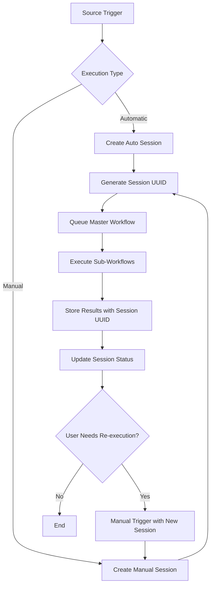
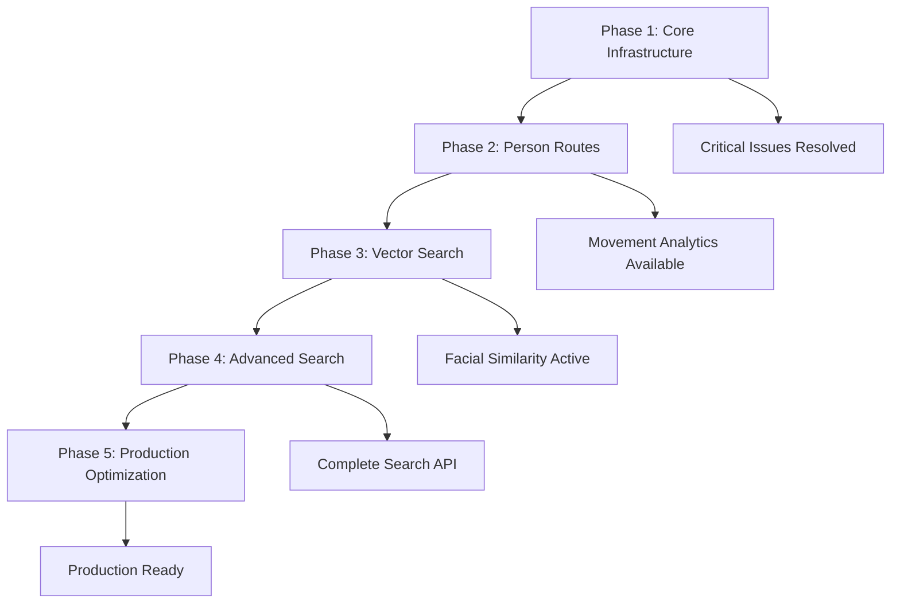

# Persons Detection Lifecycle
================================================================

**Date**: October 2, 2025  
**Purpose**: Define the complete backend workflow for face detection and people thread processing without frontend interference  
**Objective**: Establish ONE UNIQUE workflow that handles video → face detection → people thread with automatic queueing  
**Success Criteria**: New video triggers face detection → stores faces → automatically executes people thread → success  
**Context**: Created after Flutter integration failures - compilation errors, API spam, multiple overlapping pipelines

## ⚠️ Critical Issues from Flutter Analysis

**Based on FLUTTER_FACE_AND_PERSON_COUNT_DATA_FLOW_ANALYSIS.md**, the following backend issues MUST be fixed:

### ✅ Issue 1: Vision Service Duplicate Prevention - FIXED
**Status**: ✅ **RESOLVED** - Duplicate prevention is now working correctly
**Solution**: Fixed with direct SQL queries and proper error handling (lines 1485-1540)
**Current Implementation**: 
- Direct SQL count query: `SELECT COUNT(*) FROM face_detections WHERE media_id = %s`
- Fallback to ORM methods if SQL fails
- Safe abort with HTTP 409 Conflict if verification fails
- Proper logging and duplicate prevention success responses
**Verification Needed**: Test with existing media IDs to confirm no duplicate processing occurs

### 🚨 Issue 2: Multiple Overlapping Face Detection Pipelines  
**Problem**: Two separate pipelines process the same video simultaneously:
- Pipeline 1: Vision Service direct processing → Database storage
- Pipeline 2: Media Service → Vision Service bulk storage → Database storage  
**Impact**: Every frame gets exactly 2 duplicate faces with identical coordinates (~0.39s apart)
**Evidence**: Database shows systematic 2x face storage requiring frontend deduplication
**Priority**: 🔥 HIGH - Consolidate to single pipeline

### 🚨 Issue 3: API Spam from Emergency Fallback
**Problem**: Flutter emergency fallback triggers hundreds of API calls per video
**Evidence**: "🚨 EMERGENCY CHECK: Video playing but no faces - checking if face data is now available..." every few frames
**Root Cause**: MediaApiClient compilation errors prevent workflow execution, triggering emergency checks
**Impact**: API overload, poor performance, resource waste
**Priority**: 🔥 HIGH - Backend-only approach eliminates this completely

# Persons Detection Lifecycle - Enhanced Session Management

**Document Date**: October 2, 2025

## Executive Summary

This document outlines the **Enhanced Persons Lifecycle Master Workflow** system that manages all person detection processes with advanced session-based management. The enhanced system eliminates duplicate prevention checks, supports multiple workflow sessions per source, and provides intelligent session-based person object retrieval.

### 🎯 Key Enhancements

#### ✅ Enhanced Session Management - NEW ARCHITECTURE
**Status**: 🚀 **READY FOR IMPLEMENTATION** - Multiple sessions per source with intelligent retrieval

**Enhanced Features**:
- Multiple workflow sessions per source (no duplicate prevention)
- Session-based person object storage and retrieval
- Manual workflow re-execution with new sessions
- Flexible time-based session filtering
- Session comparison and history tracking
- Latest session results by default

### ✅ Issue 1: Vision Service Duplicate Prevention - OBSOLETE
**Status**: 🔄 **REPLACED BY SESSION MANAGEMENT** - Duplicate prevention removed in favor of session-based approach

**Previous Status**: ✅ **RESOLVED** - Duplicate prevention was working correctly
**New Approach**: Each workflow execution creates a new session with fresh results, eliminating the need for duplicate prevention

**Vision Service Changes**:
- Remove duplicate prevention checks
- Store all person objects with session_uuid
- Allow unlimited executions per source
- Support manual re-execution workflows

## 1. Complete Backend Workflow Architecture

### 1.1 Persons Lifecycle Master Workflow Design
```
Video Source (Camera/Upload) → Persons Lifecycle Master Workflow → Queue Management → Sub-Workflows → Complete
```

**Core Concept**: A single "Persons Lifecycle Master Workflow" that manages all sub-workflows:
- **Face Detection Workflow** (sub-workflow)
- **People Thread Workflow** (sub-workflow) 
- **Future Workflows** (expandable: emotion detection, age estimation, etc.)

**Benefits**:
- **Single Entry Point**: All video processing goes through one persons lifecycle master workflow
- **Centralized Queue Management**: One queue system handles all video sources
- **Expandable Architecture**: Easy to add new sub-workflows without changing core logic
- **Session Management**: Master workflow tracks complete lifecycle state
- **Error Recovery**: Centralized retry and failure handling for entire pipeline

### 1.2 Enhanced Session-Based Workflow Execution

#### Core Session Management Principles

1. **Session Independence**: Each workflow execution creates a unique session with fresh results
2. **No Duplicate Prevention**: Allow unlimited executions per source - each creates new person objects
3. **Session-Based Retrieval**: Person objects are retrieved by session with intelligent filtering
4. **Manual Re-execution**: Users can trigger workflows anytime with higher queue priority
5. **History Tracking**: Complete execution history maintained per source

#### Workflow Execution Flow



#### Session Data Flow

```python
# Example session lifecycle:

# 1. Initial automatic execution (camera recording)
session_1 = {
    "session_uuid": "auto-session-123",
    "source_identifier": "camera-stream-living-room",
    "execution_trigger": "automatic",
    "created_at": "2025-10-01T10:00:00Z",
    "person_objects_count": 15
}

# 2. Manual re-execution (user triggered)
session_2 = {
    "session_uuid": "manual-session-456", 
    "source_identifier": "camera-stream-living-room",  # same source
    "execution_trigger": "manual",
    "created_at": "2025-10-01T14:30:00Z",
    "person_objects_count": 18  # different results
}

# 3. Person object retrieval (latest by default)
GET /api/v1/persons-lifecycle-master/sources/camera-stream-living-room/person-objects
# Returns: 18 person objects from session_2 (latest session)

# 4. Specific session retrieval
GET /api/v1/persons-lifecycle-master/sources/camera-stream-living-room/person-objects?session_uuid=auto-session-123
# Returns: 15 person objects from session_1 (specific session)
```

### 1.3 Lifecycle Workflow Components
1. **Camera Service**: Records and stores video
2. **Orchestrator Service**: Manages workflows and queuing  
3. **Media Service**: Handles video processing workflows
4. **Vision Service**: Performs actual face detection and people thread
5. **PostgreSQL Database**: Stores all results

## 2. Step-by-Step Backend Lifecycle

### Step 0: Authentication (Prerequisite)

**Purpose**: Obtain authentication token for all API calls

```bash
# Login to get authentication token
curl -X POST 'http://localhost:8001/api/v1/users/login' \
  -H 'Content-Type: application/x-www-form-urlencoded' \
  -d 'username=fresh.user@example.com&password=NewPassword234!'

# Expected Response:
{
  "access_token": "eyJhbGciOiJIUzI1NiIsInR5cCI6IkpXVCJ9...",
  "token_type": "bearer",
  "expires_in": 3600
}

# Export token for subsequent commands
export TOKEN="your_access_token_here"
```

### Step 1: Camera Activation and Video Recording

#### 2.1 Camera Discovery and Activation
**Endpoint**: `GET /api/v1/cameras/` (Cameras Service)
**Purpose**: List available cameras for activation

```bash
# List available cameras
curl -X GET -H "Authorization: Bearer $TOKEN" \
  "http://localhost:8005/api/v1/cameras/"

# Expected Response:
{
  "cameras": [
    {
      "device_id": "camera-device-123",
      "name": "Living Room Camera",
      "status": "available",
      "type": "rtsp",
      "capabilities": ["recording", "streaming", "snapshot"]
    }
  ]
}
```

#### 2.2 Start Camera Recording
**Endpoint**: `POST /api/v1/streaming/{device_id}/record/start` (Cameras Service)
**Purpose**: Start recording video from camera

```bash
# Start recording
curl -X POST -H "Authorization: Bearer $TOKEN" \
  -H "Content-Type: application/json" \
  -d '{"duration": 30, "quality": "high"}' \
  "http://localhost:8005/api/v1/streaming/camera-device-123/record/start"

# Expected Response:
{
  "success": true,
  "recording_session_id": "recording-session-456",
  "device_id": "camera-device-123",
  "recording_started": true,
  "estimated_completion": "2025-10-04T19:30:00Z"
}
```

#### 2.3 Complete Recording and Get Video
**Endpoint**: `POST /api/v1/streaming/{device_id}/record/stop` (Cameras Service)
**Purpose**: Stop recording and get the produced video information

```bash
# Stop recording
curl -X POST -H "Authorization: Bearer $TOKEN" \
  "http://localhost:8005/api/v1/streaming/camera-device-123/record/stop"

# Expected Response:
{
  "success": true,
  "recording_session_id": "recording-session-456",
  "media_id": "media-uuid-real-123",
  "video_file": "/recordings/media-uuid-real-123.mp4",
  "duration": 30.5,
  "file_size": 15728640,
  "created_at": "2025-10-04T19:29:45Z"
}
```

### Step 2: Master Lifecycle Workflow Activation

#### 2.4 Trigger Persons Lifecycle Master Workflow
**Endpoint**: `POST /api/v1/workflows/persons-lifecycle-master/start` (Orchestrator)
**Purpose**: Start the complete persons lifecycle for any video source

```bash
# Start master lifecycle workflow (triggered automatically on video save)
curl -X POST -H "Authorization: Bearer $TOKEN" \
  -H "Content-Type: application/json" \
  -d '{
    "media_id": "media-uuid-789",
    "session_uuid": "session-uuid-456",
    "source_type": "camera_recording",
    "lifecycle_config": {
      "face_detection": {
        "enabled": true,
        "frames_per_second": 3,
        "confidence_threshold": 0.5,
        "method": "two_stage"
      },
      "people_thread": {
        "enabled": true,
        "auto_trigger": true,
        "clustering_method": "dbscan"
      },
      "future_workflows": {
        "emotion_detection": false,
        "age_estimation": false,
        "object_recognition": false
      }
    }
  }' \
  "http://localhost:8002/api/v1/workflows/persons-lifecycle-master/start"

# Expected Response:
{
  "success": true,
  "persons_lifecycle_workflow_id": "persons-lifecycle-abc",
  "status": "queued",
  "media_id": "media-uuid-789",
  "session_uuid": "session-uuid-456",
  "source_type": "camera_recording",
  "estimated_completion": "2025-10-01T19:35:00Z",
  "sub_workflows": {
    "face_detection": {
      "workflow_id": "face-workflow-def",
      "status": "queued"
    },
    "people_thread": {
      "workflow_id": "people-workflow-ghi", 
      "status": "pending_face_detection"
    }
  }
}
```

#### 2.5 Monitor Persons Lifecycle Master Progress
**Endpoint**: `GET /api/v1/workflows/persons-lifecycle-master/{persons_lifecycle_workflow_id}` (Orchestrator)
**Purpose**: Check complete lifecycle status and all sub-workflows

```bash
# Check persons lifecycle master status
curl -H "Authorization: Bearer $TOKEN" \
  "http://localhost:8002/api/v1/workflows/persons-lifecycle-master/persons-lifecycle-abc"

# Expected Response (In Progress):
{
  "success": true,
  "persons_lifecycle_workflow_id": "persons-lifecycle-abc",
  "status": "processing",
  "overall_progress": 35,
  "current_stage": "face_detection",
  "media_id": "media-uuid-789",
  "session_uuid": "session-uuid-456",
  "sub_workflows": {
    "face_detection": {
      "workflow_id": "face-workflow-def",
      "status": "processing",
      "progress": 70,
      "faces_detected": 23
    },
    "people_thread": {
      "workflow_id": "people-workflow-ghi",
      "status": "waiting_for_face_detection",
      "progress": 0
    }
  },
  "estimated_completion": "2025-10-01T19:35:15Z"
}

# Expected Response (Completed):
{
  "success": true,
  "persons_lifecycle_workflow_id": "persons-lifecycle-abc",
  "status": "completed",
  "overall_progress": 100,
  "current_stage": "completed",
  "processing_time": 45.2,
  "sub_workflows": {
    "face_detection": {
      "workflow_id": "face-workflow-def",
      "status": "completed",
      "progress": 100,
      "faces_detected": 45,
      "processing_time": 15.2
    },
    "people_thread": {
      "workflow_id": "people-workflow-ghi",
      "status": "completed", 
      "progress": 100,
      "people_identified": 3,
      "processing_time": 8.7
    }
  },
  "final_results": {
    "total_faces": 45,
    "total_persons": 3,
    "processing_summary": {
      "faces_per_person": [18, 15, 12],
      "confidence_scores": [0.92, 0.89, 0.85]
    }
  }
}
```

### Step 3: Automatic People Thread Workflow

#### 2.6 Automatic People Thread Trigger
**Internal Process**: When face detection completes with `auto_trigger_people_thread: true`, Orchestrator automatically triggers people thread workflow

**Background Process Flow**:
```
Face Detection Complete → Check auto_trigger_people_thread → Start People Thread → Queue Processing
```

#### 2.7 Monitor People Thread Progress  
**Endpoint**: `GET /api/v1/workflows/people-thread/{workflow_id}` (Orchestrator)
**Purpose**: Check people thread workflow status

```bash
# Check people thread status
curl -H "Authorization: Bearer $TOKEN" \
  "http://localhost:8002/api/v1/workflows/people-thread/people-workflow-def"

# Expected Response (In Progress):
{
  "success": true,
  "workflow_id": "people-workflow-def",
  "status": "processing", 
  "progress": 30,
  "faces_analyzed": 14,
  "total_faces": 45,
  "people_groups_identified": 2,
  "estimated_completion": "2025-10-01T19:35:00Z"
}

# Expected Response (Completed):
{
  "success": true,
  "workflow_id": "people-workflow-def",
  "status": "completed",
  "progress": 100,
  "faces_analyzed": 45,
  "total_faces": 45,
  "people_groups_identified": 3,
  "processing_time": 8.7,
  "results_summary": {
    "total_persons": 3,
    "total_faces": 45,
    "faces_per_person": [18, 15, 12]
  }
}
```

### Step 4: Results Retrieval

#### 2.8 Get Complete Results
**Endpoint**: `GET /api/v1/results/media/{media_id}` (Orchestrator)
**Purpose**: Get complete face detection and people thread results

```bash
# Get complete results
curl -H "Authorization: Bearer $TOKEN" \
  "http://localhost:8002/api/v1/results/media/media-uuid-789"

# Expected Response:
{
  "success": true,
  "media_id": "media-uuid-789",
  "session_uuid": "session-uuid-456",
  "video_info": {
    "duration": 30.5,
    "total_frames": 100,
    "fps": 30
  },
  "face_detection": {
    "workflow_id": "face-workflow-abc",
    "status": "completed",
    "total_faces": 45,
    "frames_with_faces": 85,
    "processing_time": 15.2
  },
  "people_thread": {
    "workflow_id": "people-workflow-def", 
    "status": "completed",
    "total_persons": 3,
    "total_faces": 45,
    "processing_time": 8.7
  },
  "complete_pipeline_time": 23.9,
  "pipeline_status": "completed"
}
```

## 🔧 Enhanced Session Management Implementation

**New Approach: Session-Based Architecture with Multi-Execution Support**

### Update 1: Remove Vision Service Duplicate Prevention (BREAKING CHANGE)
**File**: `ppl-meta-vision/src/main.py` (lines 1430-1480)
**Current Problem**: Duplicate prevention blocks manual re-execution workflows
**Enhanced Solution**: Remove duplicate checks, implement session-based unlimited execution

```python
# REMOVE: All duplicate prevention logic
# REPLACE WITH: Session-based execution approach

@app.post("/api/v1/face-detection")
async def process_face_detection(request: FaceDetectionRequest):
    """
    Enhanced face detection with session-based storage and facial embeddings.
    No duplicate prevention - each execution creates new session with fresh results.
    """
    
    # Generate session UUID for this execution
    session_uuid = str(uuid.uuid4())
    
    # Process face detection (same logic)
    face_detections = await detect_faces_in_media(request.media_id)
    
    # Generate facial embeddings using DeepFace
    person_objects = []
    for detection in face_detections:
        # Extract face image for embedding generation
        face_image = extract_face_from_detection(detection.bbox, request.media_id)
        
        # Generate facial embedding using DeepFace
        try:
            from deepface import DeepFace
            embedding = DeepFace.represent(
                img_path=face_image,
                model_name="Facenet512",  # 512-dimensional embeddings
                enforce_detection=False
            )[0]["embedding"]
            embedding_confidence = 0.95  # High confidence for successful generation
        except Exception as e:
            logger.warning(f"Failed to generate embedding for face: {e}")
            embedding = None
            embedding_confidence = 0.0
        
        # Calculate distance from camera based on face bounding box size
        # Using autonomous system methodology: distance = 1,000,000 / face_area
        bbox = detection.bbox  # [x1, y1, x2, y2]
        face_width = bbox[2] - bbox[0]
        face_height = bbox[3] - bbox[1]
        face_area = face_width * face_height
        distance_from_camera = 1000000 / max(face_area, 1)  # Prevent division by zero
        distance_from_camera = round(distance_from_camera, 2)  # Round to 2 decimal places
        
        person_obj = PersonObject(
            session_uuid=session_uuid,
            source_identifier=request.source_identifier,
            media_id=request.media_id,
            bbox=detection.bbox,
            confidence=detection.confidence,
            facial_embedding=embedding,  # NEW: DeepFace embeddings
            embedding_model="deepface_facenet512",  # NEW: Model tracking
            embedding_confidence=embedding_confidence,  # NEW: Embedding quality
            distance_from_camera=distance_from_camera,  # NEW: 3D distance calculation
            created_at=datetime.utcnow()
        )
        person_objects.append(person_obj)
    
    # Save with session metadata and embeddings
    await save_person_objects_with_session_and_embeddings(person_objects, session_uuid)
    
    # NEW: Create person routes tracking data for each person object
    await create_person_routes_for_session(person_objects, session_uuid, request.source_identifier)
    
    return {
        "success": True,
        "session_uuid": session_uuid,
        "person_objects_count": len(person_objects),
        "embeddings_generated": sum(1 for p in person_objects if p.facial_embedding is not None),
        "distance_calculations_completed": len(person_objects),  # NEW: All faces get distance
        "detection_summary": {
            "total_faces": len(person_objects),
            "faces_with_embeddings": sum(1 for p in person_objects if p.facial_embedding is not None),
            "average_distance": sum(p.distance_from_camera for p in person_objects) / len(person_objects) if person_objects else 0,
            "closest_face_distance": min(p.distance_from_camera for p in person_objects) if person_objects else None,
            "farthest_face_distance": max(p.distance_from_camera for p in person_objects) if person_objects else None
        },
        "source_identifier": request.source_identifier,
        "execution_type": request.execution_trigger,  # 'automatic' or 'manual'
        "message": f"Face detection completed - session {session_uuid} created with embeddings"
    }


### Distance Calculation Methodology (New 3D Enhancement)

The person objects now include a third dimension: **distance from camera**. This enhancement adds spatial context to face detection results, enabling proximity-based filtering and analysis.

#### Distance Formula

Based on the autonomous PPL Meta system methodology:

```python
# Distance calculation from face bounding box area
face_width = bbox[2] - bbox[0]   # x2 - x1
face_height = bbox[3] - bbox[1]  # y2 - y1  
face_area = face_width * face_height
distance_from_camera = 1,000,000 / max(face_area, 1)  # Prevent division by zero
distance_from_camera = round(distance_from_camera, 2)
```

#### Distance Interpretation

- **Lower Values (< 10)**: Faces very close to camera, large bounding boxes
- **Medium Values (10-100)**: Normal detection range, good quality faces  
- **Higher Values (> 100)**: Faces far from camera, small bounding boxes
- **Quality Threshold**: Distance ≤ 10 AND distance > 2 for optimal face quality

#### Distance-Based Features

1. **Search Filtering**: Filter person objects by distance range
2. **Quality Assessment**: Use distance for face quality scoring
3. **Proximity Analysis**: Group nearby vs distant detections
4. **Performance Optimization**: Prioritize close-range faces for processing

#### Example Distance Values

```json
{
  "close_face": {
    "bbox": [100, 100, 300, 350],
    "face_area": 50000,
    "distance_from_camera": 20.0
  },
  "medium_face": {
    "bbox": [150, 120, 200, 180],
    "face_area": 3000,
    "distance_from_camera": 333.33
  },
  "distant_face": {
    "bbox": [180, 140, 190, 155],
    "face_area": 150,
    "distance_from_camera": 6666.67
  }
}
```


async def create_person_routes_for_session(person_objects: List[PersonObject], session_uuid: str, source_identifier: str):
    """
    Create person routes tracking data for movement and spatial analysis.
    
    This function extracts X, Y, and distance coordinates from person objects
    to build movement patterns and tracking data for analytics.
    """
    person_routes = []
    
    for sequence_number, person_obj in enumerate(person_objects):
        bbox = person_obj.bbox  # [x1, y1, x2, y2]
        
        # Calculate face center coordinates
        center_x = (bbox[0] + bbox[2]) / 2
        center_y = (bbox[1] + bbox[3]) / 2
        
        # Calculate face dimensions
        bbox_width = bbox[2] - bbox[0]
        bbox_height = bbox[3] - bbox[1]
        
        # Create person route entry
        route_entry = PersonRoute(
            person_object_id=person_obj.id,
            session_uuid=session_uuid,
            source_identifier=source_identifier,
            sequence_number=sequence_number,
            frame_number=getattr(person_obj, 'frame_number', None),  # If available from detection
            timestamp_ms=getattr(person_obj, 'timestamp_ms', None),  # If available from video
            center_x=center_x,
            center_y=center_y,
            distance_from_camera=person_obj.distance_from_camera,
            bbox_width=bbox_width,
            bbox_height=bbox_height,
            confidence=person_obj.confidence,
            movement_velocity=0.0,  # Will be calculated in post-processing
            created_at=datetime.utcnow()
        )
        
        person_routes.append(route_entry)
    
    # Calculate movement velocity between consecutive detections
    for i in range(1, len(person_routes)):
        current_route = person_routes[i]
        previous_route = person_routes[i-1]
        
        # Calculate Euclidean distance between positions
        position_diff = math.sqrt(
            (current_route.center_x - previous_route.center_x)**2 + 
            (current_route.center_y - previous_route.center_y)**2
        )
        
        # Calculate time difference (if timestamps available)
        time_diff = 1  # Default to 1 frame if no timestamp
        if current_route.timestamp_ms and previous_route.timestamp_ms:
            time_diff = max(1, current_route.timestamp_ms - previous_route.timestamp_ms)
        
        # Calculate velocity (pixels per millisecond or per frame)
        current_route.movement_velocity = position_diff / time_diff
    
    # Save all person routes to database
    for route in person_routes:
        await db.person_routes.create(route)
    
    logger.info(f"Created {len(person_routes)} person route entries for session {session_uuid}")
    return person_routes
```

### Update 2: Enhanced Session-Based Person Object Storage
**Problem**: Person objects need session-based retrieval capability
**Solution**: Link all detection results to workflow sessions with intelligent retrieval

```python
async def save_person_objects_with_session_and_embeddings(person_objects: List[PersonObject], session_uuid: str):
    """Enhanced storage with session tracking, metadata, and facial embeddings."""
    
    for person_obj in person_objects:
        # Add session metadata
        person_obj.session_uuid = session_uuid
        person_obj.created_at = datetime.utcnow()
        
        # Store in enhanced person_objects table with embeddings
        await db.person_objects.create(person_obj)
        
        # Update face_detections with session info and embeddings
        if hasattr(person_obj, 'face_detection'):
            person_obj.face_detection.session_uuid = session_uuid
            person_obj.face_detection.facial_embedding = person_obj.facial_embedding
            person_obj.face_detection.embedding_model = person_obj.embedding_model
            person_obj.face_detection.embedding_confidence = person_obj.embedding_confidence
            await db.face_detections.create(person_obj.face_detection)

async def find_similar_persons_by_embedding(
    reference_embedding: List[float],
    similarity_threshold: float = 0.8,
    session_uuids: Optional[List[str]] = None,
    source_identifiers: Optional[List[str]] = None,
    limit: int = 50
) -> List[PersonObject]:
    """
    Find similar persons using facial embeddings and PostgreSQL vector similarity.
    Uses pgvector for efficient cosine similarity search.
    """
    
    # Build query conditions
    conditions = ["facial_embedding IS NOT NULL"]
    params = [reference_embedding, 1 - similarity_threshold]  # Convert to distance threshold
    
    if session_uuids:
        conditions.append(f"session_uuid = ANY($3)")
        params.append(session_uuids)
    
    if source_identifiers:
        param_idx = len(params) + 1
        conditions.append(f"source_identifier = ANY(${param_idx})")
        params.append(source_identifiers)
    
    # Use pgvector cosine distance for similarity search
    query = f"""
        SELECT *, (facial_embedding <=> $1) as distance
        FROM person_objects 
        WHERE {' AND '.join(conditions)}
        AND (facial_embedding <=> $1) < $2
        ORDER BY facial_embedding <=> $1
        LIMIT {limit}
    """
    
    results = await db.execute_query(query, params)
    return [PersonObject.from_db_row(row) for row in results]

async def detect_duplicate_persons_in_session(session_uuid: str, similarity_threshold: float = 0.9) -> List[Dict]:
    """
    Detect potential duplicate persons within a session using facial embeddings.
    Returns groups of potentially duplicate persons.
    """
    
    query = """
        SELECT p1.id as person1_id, p2.id as person2_id, 
               (p1.facial_embedding <=> p2.facial_embedding) as similarity_distance,
               (1 - (p1.facial_embedding <=> p2.facial_embedding)) as similarity_score
        FROM person_objects p1
        JOIN person_objects p2 ON p1.id < p2.id  -- Avoid duplicate pairs
        WHERE p1.session_uuid = $1 AND p2.session_uuid = $1
        AND p1.facial_embedding IS NOT NULL AND p2.facial_embedding IS NOT NULL
        AND (p1.facial_embedding <=> p2.facial_embedding) < $2
        ORDER BY similarity_distance
    """
    
    results = await db.execute_query(query, [session_uuid, 1 - similarity_threshold])
    
    # Group results into duplicate clusters
    duplicate_groups = []
    for row in results:
        duplicate_groups.append({
            "person_1_id": row["person1_id"],
            "person_2_id": row["person2_id"],
            "similarity_score": row["similarity_score"],
            "recommendation": "merge" if row["similarity_score"] > 0.95 else "review"
        })
    
    return duplicate_groups

async def get_person_objects_by_source(
    source_identifier: str,
    session_uuid: Optional[str] = None,
    latest_session: bool = True,
    from_time: Optional[datetime] = None,
    to_time: Optional[datetime] = None
) -> List[PersonObject]:
    """Intelligent session-based person object retrieval."""
    
    if session_uuid:
        # Specific session
        return await db.person_objects.find_many(
            where={"session_uuid": session_uuid}
        )
    
    if latest_session:
        # Latest session for source (default behavior)
        latest_workflow = await db.persons_lifecycle_master_workflows.find_first(
            where={
                "source_identifier": source_identifier,
                "status": "completed"
            },
            order_by={"created_at": "desc"}
        )
        if latest_workflow:
            return await db.person_objects.find_many(
                where={"session_uuid": latest_workflow.session_uuid}
            )
    
    # Time-based filtering with latest session in range
    query_conditions = {"source_identifier": source_identifier}
    if from_time:
        query_conditions["created_at"] = {"gte": from_time}
    if to_time:
        query_conditions["created_at"] = {"lte": to_time}
    
    # Get latest workflow in time range
    latest_in_range = await db.persons_lifecycle_master_workflows.find_first(
        where=query_conditions,
        order_by={"created_at": "desc"}
    )
    
    if latest_in_range:
        return await db.person_objects.find_many(
            where={"session_uuid": latest_in_range.session_uuid}
        )
    
    return []
```

### Update 3: Consolidate to Single Pipeline with Session Support
**Problem**: Multiple pipelines create confusion and duplication
**Solution**: Single Media Service → Vision Service → Master Workflow pipeline

**Enhanced Pipeline Flow**:
1. Media Service receives video/upload
2. Media Service triggers Master Lifecycle Workflow
3. Master Workflow creates session and queues sub-workflows
4. Sub-workflows store results with session_uuid
5. User can manually re-execute anytime (new session)

### Update 4: Enhanced Automatic Queue Management with Session Support
**Current Status**: 🚀 **ENHANCED FOR PRODUCTION** - Multi-session queue system
**Production Features**: 
- Redis/Celery queue for concurrent multi-source processing
- Session-based workflow tracking
- Manual re-execution with higher priority
- Complete session history per source

## 3. Backend Implementation Details

### 3.1 Persons Lifecycle Master Workflow Controller

#### Persons Lifecycle Master Controller
**File**: `ppl-meta-orchestrator/src/api/v1/persons_lifecycle_master.py`

```python
@router.post("/workflows/persons-lifecycle-master/start")
async def start_persons_lifecycle_master(
    request: PersonsLifecycleMasterRequest,
    current_user: AuthUser = Depends(get_current_user),
    db: Session = Depends(get_db)
):
    """
    Start persons lifecycle master workflow
    Manages all sub-workflows: face detection, people thread, future expansions
    """
    # 1. Create persons lifecycle master workflow record
    persons_lifecycle_workflow = await create_persons_lifecycle_workflow(
        media_id=request.media_id,
        session_uuid=request.session_uuid,
        source_type=request.source_type,
        config=request.lifecycle_config
    )
    
    # 2. Queue first sub-workflow (face detection)
    face_detection_workflow = await queue_face_detection_sub_workflow(
        lifecycle_workflow_id=lifecycle_workflow.id,
        config=request.lifecycle_config.face_detection
    )
    
    # 3. Return master workflow status
    return LifecycleWorkflowResponse(
        lifecycle_workflow_id=lifecycle_workflow.id,
        status="queued",
        sub_workflows={
            "face_detection": face_detection_workflow,
            "people_thread": {"status": "pending_face_detection"}
        }
    )

@router.get("/workflows/people-detection-lifecycle/{lifecycle_workflow_id}")
async def get_lifecycle_workflow_status(
    lifecycle_workflow_id: str,
    current_user: AuthUser = Depends(get_current_user)
):
    """
    Get master lifecycle workflow status with all sub-workflows
    """
    # Return aggregated status from all sub-workflows
    pass

@router.post("/workflows/people-detection-lifecycle/{lifecycle_workflow_id}/sub-workflow-complete")
async def handle_sub_workflow_completion(
    lifecycle_workflow_id: str,
    sub_workflow_type: str,
    results: Dict[str, Any],
    current_user: AuthUser = Depends(get_current_user)
):
    """
    Handle completion of sub-workflows and trigger next stages
    Called internally when face detection, people thread, etc. complete
    """
    if sub_workflow_type == "face_detection" and results.get("faces_detected", 0) > 0:
        # Trigger people thread sub-workflow
        await queue_people_thread_sub_workflow(
            lifecycle_workflow_id=lifecycle_workflow_id,
            face_detection_results=results
        )
    elif sub_workflow_type == "people_thread":
        # Check if lifecycle is complete or trigger next sub-workflow
        await check_lifecycle_completion(lifecycle_workflow_id)
    
    # Handle future sub-workflows (emotion detection, age estimation, etc.)
    await trigger_next_sub_workflow_if_configured(lifecycle_workflow_id, sub_workflow_type)
```

#### Automatic Lifecycle Trigger
**File**: `ppl-meta-orchestrator/src/services/lifecycle_orchestrator.py`

```python
async def trigger_people_detection_lifecycle_on_video_save(
    media_id: str,
    session_uuid: str,
    source_type: str  # "camera_recording" | "user_upload" | "manual_trigger"
):
    """
    Automatically trigger master lifecycle workflow when any video is saved
    Called from Camera Service, Media Upload Service, etc.
    """
    # Default configuration - can be customized per source type
    default_config = LifecycleConfig(
        face_detection=FaceDetectionConfig(
            enabled=True,
            frames_per_second=3,
            confidence_threshold=0.5,
            method="two_stage"
        ),
        people_thread=PeopleThreadConfig(
            enabled=True,
            auto_trigger=True,
            clustering_method="dbscan"
        ),
        future_workflows=FutureWorkflowsConfig(
            emotion_detection=False,
            age_estimation=False,
            object_recognition=False
        )
    )
    
    # Queue master lifecycle workflow
    lifecycle_workflow = await queue_people_detection_lifecycle(
        media_id=media_id,
        session_uuid=session_uuid,
        source_type=source_type,
        config=default_config,
        priority="normal"  # camera_recording = "high", user_upload = "normal"
    )
    
    logger.info(f"AUTO-TRIGGER: People detection lifecycle {lifecycle_workflow.id} queued for {source_type}")
    return lifecycle_workflow
```

### 3.2 Sub-Workflow Controllers (Legacy - Now Managed by Master)
**File**: `ppl-meta-orchestrator/src/api/v1/face_detection_workflows.py`

```python
@router.post("/workflows/face-detection/start")
async def start_face_detection_workflow(
    request: FaceDetectionWorkflowRequest,
    current_user: AuthUser = Depends(get_current_user),
    db: Session = Depends(get_db)
):
    """
    Start face detection workflow with automatic people thread trigger
    """
    # 1. Validate media exists
    # 2. Create workflow record
    # 3. Queue face detection task
    # 4. Return workflow status
    pass

@router.get("/workflows/face-detection/{workflow_id}")
async def get_face_detection_status(
    workflow_id: str,
    current_user: AuthUser = Depends(get_current_user)
):
    """
    Get face detection workflow status and progress
    """
    pass
```

#### People Thread Workflow Controller
**File**: `ppl-meta-orchestrator/src/api/v1/people_thread_workflows.py`

```python
@router.post("/workflows/people-thread/start")
async def start_people_thread_workflow(
    request: PeopleThreadWorkflowRequest,
    current_user: AuthUser = Depends(get_current_user),
    db: Session = Depends(get_db)
):
    """
    Start people thread workflow (usually auto-triggered)
    """
    pass

@router.get("/workflows/people-thread/{workflow_id}")
async def get_people_thread_status(
    workflow_id: str,
    current_user: AuthUser = Depends(get_current_user)
):
    """
    Get people thread workflow status and progress
    """
    pass
```

### 3.2 Automatic Queueing Implementation

#### Face Detection Completion Handler
**File**: `ppl-meta-orchestrator/src/services/workflow_orchestrator.py`

```python
async def on_face_detection_complete(
    workflow_id: str, 
    face_detection_results: Dict[str, Any]
):
    """
    Handle face detection completion and auto-trigger people thread
    """
    workflow = await get_workflow(workflow_id)
    
    if workflow.auto_trigger_people_thread and face_detection_results.get("faces_detected", 0) > 0:
        # Create people thread workflow
        people_workflow = await create_people_thread_workflow(
            media_id=workflow.media_id,
            session_uuid=workflow.session_uuid,
            parent_workflow_id=workflow_id
        )
        
        # Queue people thread processing
        await queue_people_thread_task(people_workflow.id)
        
        # Update face detection workflow with triggered info
        await update_workflow_status(
            workflow_id,
            status="completed",
            auto_trigger_status="triggered",
            people_thread_workflow_id=people_workflow.id
        )
```

### 3.3 Database Schema

#### Enhanced Session-Based Workflow Tables

The enhanced schema supports multiple workflow sessions per source with session-based person object retrieval and eliminates duplicate prevention checks.

```sql
-- Persons Lifecycle Master Workflows (ENHANCED)
CREATE TABLE persons_lifecycle_master_workflows (
    id UUID PRIMARY KEY,
    session_uuid UUID UNIQUE NOT NULL,
    source_type VARCHAR(50) NOT NULL, -- 'camera_recording', 'user_upload', 'manual_trigger'
    source_identifier VARCHAR(500) NOT NULL, -- full source path/identifier for grouping sessions
    source_id UUID NOT NULL, -- media_id, camera_id, or user_id
    execution_trigger VARCHAR(50) NOT NULL DEFAULT 'automatic', -- 'automatic', 'manual'
    status VARCHAR(50) NOT NULL DEFAULT 'queued', -- 'queued', 'processing', 'completed', 'failed'
    overall_progress INTEGER DEFAULT 0,
    current_stage VARCHAR(50), -- 'face_detection', 'people_thread', 'emotion_detection', etc.
    
    -- Session management
    parent_session_uuid UUID NULL, -- reference to original session if this is a manual re-execution
    is_manual_execution BOOLEAN DEFAULT FALSE,
    
    -- Sub-workflow tracking
    total_sub_workflows INTEGER DEFAULT 0,
    completed_sub_workflows INTEGER DEFAULT 0,
    failed_sub_workflows INTEGER DEFAULT 0,
    
    -- Results aggregation per session
    person_objects_count INTEGER DEFAULT 0,
    total_faces INTEGER DEFAULT 0,
    total_persons INTEGER DEFAULT 0,
    final_results JSONB DEFAULT '{}',
    
    -- Lifecycle configuration and timing
    lifecycle_config JSONB DEFAULT '{}',
    processing_time FLOAT,
    created_at TIMESTAMP DEFAULT NOW(),
    started_at TIMESTAMP NULL,
    completed_at TIMESTAMP NULL,
    error_message TEXT NULL,
    metadata JSONB DEFAULT '{}'
);

-- Sub-Workflow Tracking (ENHANCED)
CREATE TABLE persons_lifecycle_sub_workflows (
    id UUID PRIMARY KEY,
    master_workflow_id UUID REFERENCES persons_lifecycle_master_workflows(id) ON DELETE CASCADE,
    session_uuid UUID NOT NULL, -- reference to master workflow session
    sub_workflow_type VARCHAR(50) NOT NULL, -- 'face_detection', 'people_thread', 'emotion_detection'
    sub_workflow_id UUID, -- References specific workflow table (face_detection_workflows, etc.)
    status VARCHAR(50) NOT NULL DEFAULT 'pending',
    progress INTEGER DEFAULT 0,
    processing_time FLOAT,
    results JSONB DEFAULT '{}',
    created_at TIMESTAMP DEFAULT NOW(),
    started_at TIMESTAMP NULL,
    completed_at TIMESTAMP NULL,
    error_message TEXT NULL,
    
    -- Dependency management
    depends_on_sub_workflow_id UUID REFERENCES persons_lifecycle_sub_workflows(id),
    trigger_condition VARCHAR(100) -- 'faces_detected > 0', 'people_identified > 0', etc.
);

-- Enhanced Person Objects with Session Tracking and Vector Embeddings
-- These updates link all person detection results to specific workflow sessions
-- and add facial embeddings for similarity search using DeepFace + pgvector
ALTER TABLE person_objects ADD COLUMN IF NOT EXISTS session_uuid UUID;
ALTER TABLE person_objects ADD COLUMN IF NOT EXISTS source_identifier VARCHAR(500);
ALTER TABLE person_objects ADD COLUMN IF NOT EXISTS facial_embedding vector(512); -- DeepFace embeddings
ALTER TABLE person_objects ADD COLUMN IF NOT EXISTS embedding_model VARCHAR(50) DEFAULT 'deepface_facenet512';
ALTER TABLE person_objects ADD COLUMN IF NOT EXISTS embedding_confidence FLOAT;
ALTER TABLE person_objects ADD COLUMN IF NOT EXISTS distance_from_camera FLOAT; -- Distance calculation from autonomous system

-- Person Routes Tracking (NEW: X, Y, Distance Coordinate Tracking)
-- This table stores the movement patterns and spatial tracking data for person objects
CREATE TABLE IF NOT EXISTS person_routes (
    id UUID PRIMARY KEY DEFAULT gen_random_uuid(),
    person_object_id UUID REFERENCES person_objects(id) ON DELETE CASCADE,
    session_uuid UUID NOT NULL,
    source_identifier VARCHAR(500) NOT NULL,
    sequence_number INTEGER NOT NULL,  -- Order of detection in timeline
    frame_number INTEGER,  -- Video frame number (if applicable)
    timestamp_ms BIGINT,  -- Timestamp within media (milliseconds)
    center_x FLOAT NOT NULL,  -- Face center X coordinate (bbox[0] + bbox[2]) / 2
    center_y FLOAT NOT NULL,  -- Face center Y coordinate (bbox[1] + bbox[3]) / 2
    distance_from_camera FLOAT NOT NULL,  -- 3D distance measurement
    bbox_width FLOAT,  -- Face width for size tracking
    bbox_height FLOAT,  -- Face height for size tracking
    confidence FLOAT,  -- Detection confidence at this point
    movement_velocity FLOAT,  -- Speed of movement since last detection
    created_at TIMESTAMP WITH TIME ZONE DEFAULT CURRENT_TIMESTAMP
);

-- Indexes for person routes performance
CREATE INDEX IF NOT EXISTS idx_person_routes_person_object ON person_routes(person_object_id);
CREATE INDEX IF NOT EXISTS idx_person_routes_session ON person_routes(session_uuid);
CREATE INDEX IF NOT EXISTS idx_person_routes_sequence ON person_routes(person_object_id, sequence_number);
CREATE INDEX IF NOT EXISTS idx_person_routes_spatial ON person_routes(center_x, center_y, distance_from_camera);

ALTER TABLE face_detections ADD COLUMN IF NOT EXISTS session_uuid UUID;
ALTER TABLE face_detections ADD COLUMN IF NOT EXISTS source_identifier VARCHAR(500);
ALTER TABLE face_detections ADD COLUMN IF NOT EXISTS facial_embedding vector(512); -- DeepFace embeddings
ALTER TABLE face_detections ADD COLUMN IF NOT EXISTS embedding_model VARCHAR(50) DEFAULT 'deepface_facenet512';
ALTER TABLE face_detections ADD COLUMN IF NOT EXISTS embedding_confidence FLOAT;
ALTER TABLE face_detections ADD COLUMN IF NOT EXISTS distance_from_camera FLOAT; -- Distance calculation from autonomous system

-- Face detection workflows (UPDATED - session-aware)
CREATE TABLE face_detection_workflows (
    id UUID PRIMARY KEY,
    master_workflow_id UUID REFERENCES persons_lifecycle_master_workflows(id) ON DELETE CASCADE,
    session_uuid UUID NOT NULL,
    media_id UUID NOT NULL,
    source_identifier VARCHAR(500) NOT NULL,
    status VARCHAR(50) NOT NULL DEFAULT 'pending',
    progress INTEGER DEFAULT 0,
    frames_processed INTEGER DEFAULT 0,
    total_frames INTEGER,
    faces_detected INTEGER DEFAULT 0,
    processing_time FLOAT,
    created_at TIMESTAMP DEFAULT NOW(),
    started_at TIMESTAMP NULL,
    completed_at TIMESTAMP NULL,
    error_message TEXT NULL,
    results_metadata JSONB DEFAULT '{}'
);

-- People thread workflows (UPDATED - session-aware)
CREATE TABLE people_thread_workflows (
    id UUID PRIMARY KEY,
    master_workflow_id UUID REFERENCES persons_lifecycle_master_workflows(id) ON DELETE CASCADE,
    session_uuid UUID NOT NULL,
    media_id UUID NOT NULL,
    source_identifier VARCHAR(500) NOT NULL,
    parent_face_workflow_id UUID REFERENCES face_detection_workflows(id),
    status VARCHAR(50) NOT NULL DEFAULT 'pending',
    progress INTEGER DEFAULT 0,
    faces_analyzed INTEGER DEFAULT 0,
    total_faces INTEGER,
    people_groups_identified INTEGER DEFAULT 0,
    processing_time FLOAT,
    results_summary JSONB DEFAULT '{}',
    created_at TIMESTAMP DEFAULT NOW(),
    started_at TIMESTAMP NULL,
    completed_at TIMESTAMP NULL,
    error_message TEXT NULL
);

-- Future Sub-Workflows (EXPANDABLE - session-aware)
CREATE TABLE emotion_detection_workflows (
    id UUID PRIMARY KEY,
    master_workflow_id UUID REFERENCES persons_lifecycle_master_workflows(id) ON DELETE CASCADE,
    session_uuid UUID NOT NULL,
    media_id UUID NOT NULL,
    source_identifier VARCHAR(500) NOT NULL,
    parent_face_workflow_id UUID REFERENCES face_detection_workflows(id),
    status VARCHAR(50) NOT NULL DEFAULT 'pending',
    emotions_detected JSONB DEFAULT '{}', -- {happiness: 0.8, sadness: 0.2, etc.}
    processing_time FLOAT,
    created_at TIMESTAMP DEFAULT NOW(),
    started_at TIMESTAMP NULL,
    completed_at TIMESTAMP NULL,
    error_message TEXT NULL
);

CREATE TABLE age_estimation_workflows (
    id UUID PRIMARY KEY,
    master_workflow_id UUID REFERENCES persons_lifecycle_master_workflows(id) ON DELETE CASCADE,
    session_uuid UUID NOT NULL,
    media_id UUID NOT NULL,
    source_identifier VARCHAR(500) NOT NULL,
    parent_people_workflow_id UUID REFERENCES people_thread_workflows(id),
    status VARCHAR(50) NOT NULL DEFAULT 'pending',
    age_estimates JSONB DEFAULT '{}', -- {person_1: 25, person_2: 34, etc.}
    processing_time FLOAT,
    created_at TIMESTAMP DEFAULT NOW(),
    started_at TIMESTAMP NULL,
    completed_at TIMESTAMP NULL,
    error_message TEXT NULL
);

-- Enhanced Indexes for Session-Based Retrieval and Vector Similarity Search
CREATE INDEX idx_master_workflows_source_time ON persons_lifecycle_master_workflows(source_identifier, created_at DESC);
CREATE INDEX idx_master_workflows_session ON persons_lifecycle_master_workflows(session_uuid);
CREATE INDEX idx_master_workflows_status_time ON persons_lifecycle_master_workflows(status, created_at DESC);
CREATE INDEX idx_master_workflows_source_status ON persons_lifecycle_master_workflows(source_identifier, status, created_at DESC);

CREATE INDEX idx_sub_workflows_session ON persons_lifecycle_sub_workflows(session_uuid, sub_workflow_type);
CREATE INDEX idx_sub_workflows_master ON persons_lifecycle_sub_workflows(master_workflow_id, status);

-- Session-based person object retrieval indexes
CREATE INDEX idx_person_objects_session_time ON person_objects(session_uuid, created_at DESC) WHERE session_uuid IS NOT NULL;
CREATE INDEX idx_person_objects_source_time ON person_objects(source_identifier, created_at DESC) WHERE session_uuid IS NOT NULL;
CREATE INDEX idx_face_detections_session_time ON face_detections(session_uuid, created_at DESC) WHERE session_uuid IS NOT NULL;
CREATE INDEX idx_face_detections_source_time ON face_detections(source_identifier, created_at DESC) WHERE session_uuid IS NOT NULL;

-- Vector similarity search indexes using pgvector
-- Install pgvector extension first: CREATE EXTENSION vector;
CREATE INDEX idx_person_objects_embedding_cosine ON person_objects USING ivfflat (facial_embedding vector_cosine_ops) WITH (lists = 100) WHERE facial_embedding IS NOT NULL;
CREATE INDEX idx_person_objects_embedding_l2 ON person_objects USING ivfflat (facial_embedding vector_l2_ops) WITH (lists = 100) WHERE facial_embedding IS NOT NULL;
CREATE INDEX idx_face_detections_embedding_cosine ON face_detections USING ivfflat (facial_embedding vector_cosine_ops) WITH (lists = 100) WHERE facial_embedding IS NOT NULL;

-- Workflow performance indexes
CREATE INDEX idx_face_workflows_session ON face_detection_workflows(session_uuid, status);
CREATE INDEX idx_people_workflows_session ON people_thread_workflows(session_uuid, status);
CREATE INDEX idx_emotion_workflows_session ON emotion_detection_workflows(session_uuid, status);
CREATE INDEX idx_age_workflows_session ON age_estimation_workflows(session_uuid, status);

-- PostgreSQL Vector Search Setup (Phase 1 Implementation)
-- Enable pgvector extension for facial embedding similarity search
CREATE EXTENSION IF NOT EXISTS vector;

-- Vector search performance tuning
-- Adjust ivfflat parameters based on data size:
-- lists = 100 for < 100K vectors
-- lists = 1000 for 100K-1M vectors
-- Consider upgrading to dedicated vector service for > 1M vectors
```

### 3.4 Enhanced Session-Based Person Object Retrieval API

#### New Endpoints for Multi-Session Management

These endpoints eliminate duplicate prevention checks and support multiple workflow sessions per source with intelligent session-based retrieval.

```python
# GET /api/v1/persons-lifecycle-master/sources/{source_identifier}/person-objects
# Retrieve person objects for a source with flexible session filtering

@app.get("/api/v1/persons-lifecycle-master/sources/{source_identifier}/person-objects")
async def get_person_objects_by_source(
    source_identifier: str,
    session_uuid: Optional[str] = None,  # specific session
    latest_session: bool = True,  # get latest session results by default
    from_time: Optional[datetime] = None,  # filter sessions from this time
    to_time: Optional[datetime] = None,  # filter sessions to this time
    session_status: Optional[str] = "completed",  # only from completed sessions
    include_workflow_info: bool = False,  # include workflow execution details
    limit: int = 100,
    offset: int = 0
):
    """
    Retrieve person objects with flexible session-based filtering.
    
    Default behavior: Returns person objects from the latest completed session.
    """
    
    # Query logic:
    # 1. If session_uuid provided: return objects from that specific session
    # 2. If latest_session=True (default): return objects from most recent session
    # 3. If time range provided: return objects from latest session within time range
    # 4. Always respect session_status filter (default: completed sessions only)
    
    pass

# GET /api/v1/persons-lifecycle-master/sessions
# List all workflow sessions with filtering options

@app.get("/api/v1/persons-lifecycle-master/sessions")
async def list_workflow_sessions(
    source_identifier: Optional[str] = None,
    source_type: Optional[str] = None,
    execution_trigger: Optional[str] = None,  # 'automatic', 'manual'
    status: Optional[str] = None,
    from_time: Optional[datetime] = None,
    to_time: Optional[datetime] = None,
    include_sub_workflows: bool = False,
    limit: int = 50,
    offset: int = 0
):
    """
    List workflow sessions with comprehensive filtering.
    
    Useful for:
    - Finding all sessions for a source
    - Comparing automatic vs manual executions
    - Tracking session history over time
    """
    pass

# POST /api/v1/persons-lifecycle-master/sources/{source_identifier}/execute
# Manual re-execution of workflow for existing source

@app.post("/api/v1/persons-lifecycle-master/sources/{source_identifier}/execute")
async def manually_execute_workflow(
    source_identifier: str,
    source_id: str,  # media_id, camera_id, etc.
    source_type: str,  # 'camera_recording', 'user_upload', etc.
    workflow_config: Optional[Dict] = None,  # custom configuration
    priority: int = 1  # queue priority for manual executions
):
    """
    Manually trigger workflow execution for an existing source.
    
    Creates new session with:
    - New session_uuid
    - Current execution timestamp
    - Same source_identifier
    - execution_trigger = 'manual'
    - Higher queue priority
    
    No duplicate checks - each execution creates new person objects.
    """
    pass

# GET /api/v1/persons-lifecycle-master/sessions/{session_uuid}/person-objects
# Retrieve person objects for specific session

@app.get("/api/v1/persons-lifecycle-master/sessions/{session_uuid}/person-objects")
async def get_person_objects_by_session(
    session_uuid: str,
    include_face_detections: bool = True,
    include_metadata: bool = False,
    limit: int = 100,
    offset: int = 0
):
    """
    Retrieve all person objects from a specific workflow session.
    """
    pass

# GET /api/v1/persons-lifecycle-master/sources/{source_identifier}/sessions/compare
# Compare person detection results between sessions

@app.get("/api/v1/persons-lifecycle-master/sources/{source_identifier}/sessions/compare")
async def compare_session_results(
    source_identifier: str,
    session_1: str,
    session_2: str,
    comparison_metrics: List[str] = ["person_count", "face_count", "processing_time"]
):
    """
    Compare detection results between two sessions of the same source.
    
    Useful for:
    - Validating manual re-execution results
    - Performance analysis
    - Detection accuracy comparison
    """
    pass

# DELETE /api/v1/persons-lifecycle-master/sessions/{session_uuid}
# Delete specific session and its results

@app.delete("/api/v1/persons-lifecycle-master/sessions/{session_uuid}")
async def delete_workflow_session(
    session_uuid: str,
    delete_person_objects: bool = True,  # also delete associated person objects
    confirm: bool = False  # safety confirmation
):
    """
    Delete a workflow session and optionally its person detection results.
    
    Useful for:
    - Cleaning up failed sessions
    - Removing test executions
    - Managing storage space
    """
    pass
```

#### Session-Based Retrieval Logic Examples

```python
# Example 1: Get latest person objects for a video source
GET /api/v1/persons-lifecycle-master/sources/video-file-123/person-objects
# Returns: Latest completed session results (default behavior)

# Example 2: Get person objects from specific session
GET /api/v1/persons-lifecycle-master/sources/video-file-123/person-objects?session_uuid=session-abc-456
# Returns: Results from session-abc-456 only

# Example 3: Get latest session results within time range
GET /api/v1/persons-lifecycle-master/sources/camera-stream-789/person-objects?from_time=2025-10-01T10:00:00Z&to_time=2025-10-01T18:00:00Z
# Returns: Latest session results created between 10 AM and 6 PM

# Example 4: Manual workflow execution
POST /api/v1/persons-lifecycle-master/sources/video-file-123/execute
{
  "source_id": "media-uuid-456",
  "source_type": "user_upload",
  "workflow_config": {
    "enable_emotion_detection": true,
    "high_accuracy_mode": true
  }
}
# Creates: New session with fresh person detection results

# Example 5: Compare results between automatic and manual executions
GET /api/v1/persons-lifecycle-master/sources/video-file-123/sessions/compare?session_1=auto-session-123&session_2=manual-session-456
# Returns: Detailed comparison of detection results
```

#### Key Session Management Benefits

1. **No Duplicate Prevention**: Each workflow execution creates fresh results
2. **Session History**: Track all executions per source over time
3. **Flexible Retrieval**: Get latest, specific session, or time-filtered results
4. **Manual Re-execution**: Users can trigger workflows anytime with new sessions
5. **Result Comparison**: Compare automatic vs manual execution results
6. **Clean Separation**: Each session is independent with its own person objects

### 3.5 Advanced Search, Query & Statistics API

#### Advanced Person Objects Search & Query Endpoints

These endpoints provide comprehensive search capabilities and business intelligence for person detection data across all sessions and sources.

```python
# GET /api/v1/persons-lifecycle-master/person-objects/search
# Advanced multi-criteria person objects search

@app.get("/api/v1/persons-lifecycle-master/person-objects/search")
async def advanced_person_search(
    query: Optional[str] = None,  # Text search across metadata, tags, descriptions
    source_identifiers: Optional[List[str]] = None,  # Multiple source filters
    session_uuids: Optional[List[str]] = None,  # Multiple session filters
    confidence_min: Optional[float] = None,  # Minimum confidence score
    confidence_max: Optional[float] = None,  # Maximum confidence score
    bbox_area_min: Optional[int] = None,  # Minimum face/person size
    bbox_area_max: Optional[int] = None,  # Maximum face/person size
    distance_min: Optional[float] = None,  # Minimum distance from camera (closer objects)
    distance_max: Optional[float] = None,  # Maximum distance from camera (farther objects)
    detection_date_from: Optional[datetime] = None,  # Time-based filtering start
    detection_date_to: Optional[datetime] = None,  # Time-based filtering end
    execution_trigger: Optional[str] = None,  # 'automatic', 'manual' sessions only
    face_count_min: Optional[int] = None,  # Persons with minimum X faces
    face_count_max: Optional[int] = None,  # Persons with maximum Y faces
    sort_by: str = "detection_date",  # confidence, detection_date, face_count, session_created, distance_from_camera
    sort_order: str = "desc",  # asc, desc
    include_similar: bool = False,  # Find visually similar persons
    include_routes: bool = False,  # NEW: Include person movement routes (X, Y, Distance coordinates)
    tags: Optional[List[str]] = None,  # Custom tags/labels filtering
    limit: int = 100,
    offset: int = 0
):
    """
    Advanced search across all person objects with multiple filter criteria.
    
    NEW: Set include_routes=True to get X, Y, Distance coordinate tracking for each person.
    
    Supports complex queries like:
    - High-confidence detections from camera sources in last 24 hours
    - Manual execution sessions with persons having 10+ faces
    - Similar persons across different sources and time periods
    - Person movement analysis with route tracking data
    """
    
    # Build search filters (existing logic)
    filters = {}
    if source_identifiers:
        filters["source_identifier"] = {"in": source_identifiers}
    if session_uuids:
        filters["session_uuid"] = {"in": session_uuids}
    if confidence_min is not None:
        filters["confidence"] = {"gte": confidence_min}
    if confidence_max is not None:
        filters.setdefault("confidence", {})["lte"] = confidence_max
    if distance_min is not None:
        filters["distance_from_camera"] = {"gte": distance_min}
    if distance_max is not None:
        filters.setdefault("distance_from_camera", {})["lte"] = distance_max
    # ... other filters
    
    # Execute search
    person_objects = await db.person_objects.find_many(
        where=filters,
        order_by={sort_by: sort_order},
        skip=offset,
        take=limit
    )
    
    # Format results
    results = []
    for person in person_objects:
        person_data = {
            "person_id": person.id,
            "session_uuid": person.session_uuid,
            "source_identifier": person.source_identifier,
            "confidence": person.confidence,
            "distance_from_camera": person.distance_from_camera,
            "embedding_quality": person.embedding_confidence,
            "detection_time": person.created_at,
            "bbox": person.bbox
        }
        
        # Add person routes if requested
        if include_routes:
            routes = await db.person_routes.find_many(
                where={"person_object_id": person.id},
                order_by={"sequence_number": "asc"}
            )
            
            person_data["person_routes"] = [
                {
                    "sequence": route.sequence_number,
                    "center_x": route.center_x,
                    "center_y": route.center_y,
                    "distance_from_camera": route.distance_from_camera,
                    "movement_velocity": route.movement_velocity,
                    "frame_number": route.frame_number,
                    "timestamp_ms": route.timestamp_ms
                }
                for route in routes
            ]
            
            # Add movement summary
            if routes:
                x_coords = [r.center_x for r in routes]
                y_coords = [r.center_y for r in routes]
                distances = [r.distance_from_camera for r in routes]
                
                person_data["movement_summary"] = {
                    "total_detections": len(routes),
                    "spatial_range": {
                        "x_span": max(x_coords) - min(x_coords) if x_coords else 0,
                        "y_span": max(y_coords) - min(y_coords) if y_coords else 0
                    },
                    "distance_range": {
                        "closest": min(distances) if distances else 0,
                        "farthest": max(distances) if distances else 0,
                        "average": sum(distances) / len(distances) if distances else 0
                    }
                }
        
        results.append(person_data)
    
    return {
        "total_found": len(results),
        "search_parameters": {
            "confidence_range": [confidence_min, confidence_max],
            "distance_range": [distance_min, distance_max],
            "include_routes": include_routes,
            "sort_by": sort_by,
            "sort_order": sort_order
        },
        "results": results
    }

# POST /api/v1/persons-lifecycle-master/person-objects/find-similar
# Visual similarity search for person identification using DeepFace + pgvector

@app.post("/api/v1/persons-lifecycle-master/person-objects/find-similar")
async def find_similar_persons(
    reference_person_id: str,
    similarity_threshold: float = 0.85,
    search_scope: str = "all_sessions",  # all_sessions, same_source, time_range
    include_cross_session: bool = True,
    time_window_hours: Optional[int] = None,  # Limit search to recent hours
    max_results: int = 50
):
    """
    Find visually similar persons using DeepFace facial embeddings and PostgreSQL vector search.
    
    Uses pgvector for efficient cosine similarity search with 512-dimensional DeepFace embeddings.
    
    Useful for:
    - Cross-session person tracking
    - Duplicate detection across sessions
    - Person identification across sources
    """
    
    # Get reference person's facial embedding
    reference_person = await db.person_objects.find_first(
        where={"id": reference_person_id}
    )
    
    if not reference_person or not reference_person.facial_embedding:
        raise HTTPException(
            status_code=404, 
            detail="Reference person not found or no facial embedding available"
        )
    
    # Build search filters based on scope
    session_filters = None
    source_filters = None
    
    if search_scope == "same_source":
        source_filters = [reference_person.source_identifier]
    elif search_scope == "time_range" and time_window_hours:
        # Get sessions within time window
        cutoff_time = datetime.utcnow() - timedelta(hours=time_window_hours)
        recent_sessions = await db.persons_lifecycle_master_workflows.find_many(
            where={"created_at": {"gte": cutoff_time}},
            select={"session_uuid": True}
        )
        session_filters = [s.session_uuid for s in recent_sessions]
    
    # Use enhanced PostgreSQL vector search
    similar_persons = await find_similar_persons_by_embedding(
        reference_embedding=reference_person.facial_embedding,
        similarity_threshold=similarity_threshold,
        session_uuids=session_filters,
        source_identifiers=source_filters,
        limit=max_results
    )
    
    # Filter out the reference person itself
    similar_persons = [p for p in similar_persons if p.id != reference_person_id]
    
    # Add similarity scores and metadata
    results = []
    for person in similar_persons:
        # Calculate similarity score (1 - cosine distance)
        similarity_score = 1 - calculate_cosine_distance(
            reference_person.facial_embedding, 
            person.facial_embedding
        )
        
        # Get person routes for movement tracking
        person_routes = await db.person_routes.find_many(
            where={"person_object_id": person.id},
            order_by={"sequence_number": "asc"}
        )
        
        # Format routes data for response
        routes_data = [
            {
                "sequence": route.sequence_number,
                "center_x": route.center_x,
                "center_y": route.center_y,
                "distance_from_camera": route.distance_from_camera,
                "movement_velocity": route.movement_velocity,
                "confidence": route.confidence,
                "frame_number": route.frame_number,
                "timestamp_ms": route.timestamp_ms
            }
            for route in person_routes
        ]
        
        results.append({
            "person_id": person.id,
            "similarity_score": similarity_score,
            "session_uuid": person.session_uuid,
            "source_identifier": person.source_identifier,
            "detection_time": person.created_at,
            "confidence": person.confidence,
            "embedding_quality": person.embedding_confidence,
            "distance_from_camera": person.distance_from_camera,  # NEW: 3D distance measurement
            "is_cross_session": person.session_uuid != reference_person.session_uuid,
            "person_routes": routes_data,  # NEW: X, Y, Distance coordinate tracking
            "movement_summary": {
                "total_route_points": len(routes_data),
                "average_distance": sum(r["distance_from_camera"] for r in routes_data) / len(routes_data) if routes_data else 0,
                "max_movement_velocity": max((r["movement_velocity"] for r in routes_data), default=0),
                "spatial_coverage": {
                    "min_x": min((r["center_x"] for r in routes_data), default=0),
                    "max_x": max((r["center_x"] for r in routes_data), default=0),
                    "min_y": min((r["center_y"] for r in routes_data), default=0),
                    "max_y": max((r["center_y"] for r in routes_data), default=0)
                }
            }
        })
    
    return {
        "reference_person_id": reference_person_id,
        "reference_session": reference_person.session_uuid,
        "reference_source": reference_person.source_identifier,
        "similar_persons_found": len(results),
        "search_scope": search_scope,
        "similarity_threshold": similarity_threshold,
        "results": results,
        "vector_search_method": "postgresql_pgvector_cosine_similarity"
    }

# GET /api/v1/persons-lifecycle-master/person-routes/{person_id}
# Get detailed movement routes for a specific person

@app.get("/api/v1/persons-lifecycle-master/person-routes/{person_id}")
async def get_person_routes(
    person_id: str,
    include_movement_analysis: bool = True,
    smoothing_factor: float = 0.1  # For movement trajectory smoothing
):
    """
    Get complete movement routes and tracking data for a person object.
    
    Returns X, Y, and distance coordinates with movement analysis including:
    - Position tracking over time
    - Movement velocity calculations  
    - Spatial coverage analysis
    - Distance change patterns
    """
    
    # Get person object details
    person = await db.person_objects.find_first(
        where={"id": person_id}
    )
    
    if not person:
        raise HTTPException(status_code=404, detail="Person not found")
    
    # Get all route points for this person
    routes = await db.person_routes.find_many(
        where={"person_object_id": person_id},
        order_by={"sequence_number": "asc"}
    )
    
    if not routes:
        return {
            "person_id": person_id,
            "routes_found": 0,
            "message": "No route tracking data available for this person"
        }
    
    # Format route data
    route_points = []
    for route in routes:
        route_points.append({
            "sequence": route.sequence_number,
            "coordinates": {
                "center_x": route.center_x,
                "center_y": route.center_y,
                "distance_from_camera": route.distance_from_camera
            },
            "dimensions": {
                "bbox_width": route.bbox_width,
                "bbox_height": route.bbox_height
            },
            "detection_quality": {
                "confidence": route.confidence
            },
            "timing": {
                "frame_number": route.frame_number,
                "timestamp_ms": route.timestamp_ms
            },
            "movement": {
                "velocity": route.movement_velocity
            }
        })
    
    response_data = {
        "person_id": person_id,
        "session_uuid": person.session_uuid,
        "source_identifier": person.source_identifier,
        "routes_found": len(routes),
        "route_points": route_points
    }
    
    # Add movement analysis if requested
    if include_movement_analysis and len(routes) > 1:
        # Calculate movement statistics
        distances = [r.distance_from_camera for r in routes]
        velocities = [r.movement_velocity for r in routes if r.movement_velocity > 0]
        x_coords = [r.center_x for r in routes]
        y_coords = [r.center_y for r in routes]
        
        response_data["movement_analysis"] = {
            "spatial_coverage": {
                "x_range": {"min": min(x_coords), "max": max(x_coords), "span": max(x_coords) - min(x_coords)},
                "y_range": {"min": min(y_coords), "max": max(y_coords), "span": max(y_coords) - min(y_coords)},
                "total_euclidean_distance": sum(
                    math.sqrt((routes[i].center_x - routes[i-1].center_x)**2 + 
                             (routes[i].center_y - routes[i-1].center_y)**2)
                    for i in range(1, len(routes))
                )
            },
            "distance_patterns": {
                "closest_to_camera": min(distances),
                "farthest_from_camera": max(distances),
                "average_distance": sum(distances) / len(distances),
                "distance_variance": sum((d - sum(distances)/len(distances))**2 for d in distances) / len(distances)
            },
            "movement_dynamics": {
                "average_velocity": sum(velocities) / len(velocities) if velocities else 0,
                "max_velocity": max(velocities) if velocities else 0,
                "movement_periods": len(velocities),  # Number of detections with movement
                "stationary_periods": len(routes) - len(velocities)  # Detections without movement
            }
        }
    
    return response_data

# GET /api/v1/persons-lifecycle-master/session-routes/{session_uuid}
# Get all person routes for a specific session

@app.get("/api/v1/persons-lifecycle-master/session-routes/{session_uuid}")
async def get_session_routes(
    session_uuid: str,
    include_heatmap_data: bool = False,
    grid_resolution: int = 50  # For heatmap grid
):
    """
    Get movement routes for all persons detected in a session.
    
    Useful for:
    - Session-wide movement analysis
    - Heat map generation
    - Crowd movement patterns
    - Security coverage analysis
    """
    
    # Get all person routes for the session
    routes = await db.person_routes.find_many(
        where={"session_uuid": session_uuid},
        order_by=[{"person_object_id": "asc"}, {"sequence_number": "asc"}],
        include={"person_object": True}
    )
    
    if not routes:
        return {
            "session_uuid": session_uuid,
            "persons_tracked": 0,
            "total_route_points": 0,
            "message": "No route tracking data available for this session"
        }
    
    # Group routes by person
    persons_routes = {}
    for route in routes:
        person_id = route.person_object_id
        if person_id not in persons_routes:
            persons_routes[person_id] = {
                "person_id": person_id,
                "confidence": route.person_object.confidence,
                "facial_embedding_quality": route.person_object.embedding_confidence,
                "route_points": []
            }
        
        persons_routes[person_id]["route_points"].append({
            "sequence": route.sequence_number,
            "center_x": route.center_x,
            "center_y": route.center_y,
            "distance_from_camera": route.distance_from_camera,
            "movement_velocity": route.movement_velocity,
            "timestamp_ms": route.timestamp_ms
        })
    
    response_data = {
        "session_uuid": session_uuid,
        "persons_tracked": len(persons_routes),
        "total_route_points": len(routes),
        "persons_routes": list(persons_routes.values())
    }
    
    # Add heatmap data if requested
    if include_heatmap_data:
        # Create spatial grid for heatmap
        all_x = [r.center_x for r in routes]
        all_y = [r.center_y for r in routes]
        
        if all_x and all_y:
            x_min, x_max = min(all_x), max(all_x)
            y_min, y_max = min(all_y), max(all_y)
            
            # Create grid and count points in each cell
            heatmap_grid = {}
            for route in routes:
                grid_x = int((route.center_x - x_min) / (x_max - x_min) * grid_resolution)
                grid_y = int((route.center_y - y_min) / (y_max - y_min) * grid_resolution)
                grid_key = f"{grid_x},{grid_y}"
                
                if grid_key not in heatmap_grid:
                    heatmap_grid[grid_key] = {
                        "x": grid_x,
                        "y": grid_y,
                        "detection_count": 0,
                        "avg_distance": 0,
                        "distances": []
                    }
                
                heatmap_grid[grid_key]["detection_count"] += 1
                heatmap_grid[grid_key]["distances"].append(route.distance_from_camera)
            
            # Calculate average distances for each grid cell
            for cell in heatmap_grid.values():
                cell["avg_distance"] = sum(cell["distances"]) / len(cell["distances"])
                del cell["distances"]  # Remove raw data to reduce response size
            
            response_data["heatmap_data"] = {
                "grid_resolution": grid_resolution,
                "spatial_bounds": {
                    "x_min": x_min, "x_max": x_max,
                    "y_min": y_min, "y_max": y_max
                },
                "grid_cells": list(heatmap_grid.values())
            }
    
    return response_data

# GET /api/v1/persons-lifecycle-master/person-objects/geo-search
# Geo-spatial person search (if camera locations available)

@app.get("/api/v1/persons-lifecycle-master/person-objects/geo-search")
async def geo_spatial_person_search(
    latitude: float,
    longitude: float,
    radius_meters: int,
    location_tags: Optional[List[str]] = None,  # indoor, outdoor, room names
    camera_zones: Optional[List[str]] = None,  # specific surveillance zones
    time_range_hours: Optional[int] = 24,  # default last 24 hours
    limit: int = 100
):
    """
    Search for persons detected within a geographic area.
    
    Useful for:
    - Location-based person tracking
    - Security incident investigation
    - Foot traffic analysis by area
    """
    pass

# GET /api/v1/persons-lifecycle-master/person-objects/track-across-sessions
# Cross-session person tracking

@app.get("/api/v1/persons-lifecycle-master/person-objects/track-across-sessions")
async def track_person_across_sessions(
    person_id: str,
    time_window_hours: int = 168,  # default 7 days
    sources: Optional[List[str]] = None,  # limit to specific sources
    similarity_threshold: float = 0.8,
    include_metadata: bool = True
):
    """
    Track the same person across multiple sessions and sources.
    
    Returns chronological timeline of person appearances with:
    - Session details and timestamps
    - Source information
    - Visual similarity scores
    - Movement patterns between sources
    """
    pass

# GET /api/v1/persons-lifecycle-master/person-objects/duplicates-analysis
# Duplicate detection analysis

@app.get("/api/v1/persons-lifecycle-master/person-objects/duplicates-analysis")
async def analyze_duplicate_persons(
    session_uuid: Optional[str] = None,  # analyze specific session
    source_identifier: Optional[str] = None,  # analyze specific source
    similarity_threshold: float = 0.9,
    time_window_hours: Optional[int] = None
):
    """
    Identify potential duplicate persons within or across sessions.
    
    Returns:
    - Suspected duplicate groups with confidence scores
    - Recommended merge actions
    - Data quality insights and recommendations
    """
    pass
```

#### Statistics & Analytics Endpoints

```python
# GET /api/v1/persons-lifecycle-master/statistics/sessions
# Comprehensive session statistics dashboard

@app.get("/api/v1/persons-lifecycle-master/statistics/sessions")
async def get_session_statistics(
    time_range_days: int = 30,
    source_types: Optional[List[str]] = None,
    execution_triggers: Optional[List[str]] = None,
    include_trends: bool = True
):
    """
    Session statistics dashboard with comprehensive metrics.
    """
    return {
        "total_sessions": 1250,
        "automatic_sessions": 1100,
        "manual_sessions": 150,
        "success_rate": 0.94,
        "average_processing_time_seconds": 23.5,
        "session_trends": {
            "daily_averages": [...],
            "peak_hours": [9, 14, 18],
            "busiest_sources": [...]
        },
        "source_performance": {
            "camera_recordings": {"count": 800, "avg_time": 20.1, "success_rate": 0.96},
            "user_uploads": {"count": 350, "avg_time": 28.2, "success_rate": 0.91},
            "manual_triggers": {"count": 100, "avg_time": 25.7, "success_rate": 0.93}
        }
    }

# GET /api/v1/persons-lifecycle-master/statistics/person-analytics
# Person detection analytics and insights

@app.get("/api/v1/persons-lifecycle-master/statistics/person-analytics")
async def get_person_detection_analytics(
    time_range_days: int = 30,
    source_types: Optional[List[str]] = None,
    execution_triggers: Optional[List[str]] = None,
    granularity: str = "daily"  # hourly, daily, weekly
):
    """
    Comprehensive person detection analytics and insights.
    """
    return {
        "total_persons_detected": 5847,
        "unique_persons_estimated": 234,
        "average_faces_per_person": 18.4,
        "detection_accuracy_trends": {
            "weekly_averages": [0.89, 0.91, 0.93, 0.92],
            "confidence_distribution": {...}
        },
        "hourly_detection_patterns": {
            "peak_detection_hours": [8, 12, 17, 20],
            "detection_by_hour": [...]
        },
        "source_performance_comparison": {
            "highest_accuracy": "camera-stream-lobby",
            "most_active": "camera-stream-entrance",
            "quality_metrics": {...}
        }
    }

# GET /api/v1/persons-lifecycle-master/statistics/source-performance
# Source performance metrics and optimization insights

@app.get("/api/v1/persons-lifecycle-master/statistics/source-performance")
async def get_source_performance_metrics(
    source_identifiers: Optional[List[str]] = None,
    time_range_days: int = 30,
    include_optimization_tips: bool = True
):
    """
    Detailed performance metrics per source with optimization recommendations.
    """
    return {
        "sources": [
            {
                "source_identifier": "camera-stream-entrance",
                "total_sessions": 234,
                "avg_processing_time": 18.2,
                "success_rate": 0.97,
                "avg_persons_per_session": 3.4,
                "avg_confidence_score": 0.91,
                "quality_grade": "A",
                "optimization_tips": [
                    "Consider reducing frame rate from 3fps to 2fps for faster processing",
                    "Confidence threshold of 0.6 recommended based on accuracy patterns"
                ]
            }
        ],
        "overall_insights": {
            "best_performing_source": "camera-stream-lobby",
            "needs_attention": ["upload-source-mobile-low-res"],
            "capacity_recommendations": "System can handle 20% more concurrent sessions"
        }
    }

# GET /api/v1/persons-lifecycle-master/statistics/quality-metrics
# Detection quality analytics and improvement recommendations

@app.get("/api/v1/persons-lifecycle-master/statistics/quality-metrics")
async def get_quality_metrics(
    time_range_days: int = 30,
    source_types: Optional[List[str]] = None,
    include_recommendations: bool = True
):
    """
    Detection quality analytics with improvement recommendations.
    """
    return {
        "confidence_score_distribution": {
            "0.9-1.0": 0.45,
            "0.8-0.9": 0.32,
            "0.7-0.8": 0.15,
            "0.6-0.7": 0.08
        },
        "accuracy_trends": {
            "improving_sources": ["camera-stream-lobby"],
            "declining_sources": ["mobile-upload-compressed"],
            "stable_sources": ["camera-stream-entrance", "camera-stream-office"]
        },
        "quality_recommendations": {
            "optimal_confidence_threshold": 0.75,
            "recommended_frame_rates": {"high_quality_cameras": 3, "mobile_uploads": 2},
            "suggested_improvements": [
                "Upgrade camera-stream-parking to higher resolution",
                "Implement preprocessing for mobile uploads"
            ]
        }
    }

# GET /api/v1/persons-lifecycle-master/statistics/trends
# Historical trends analysis

@app.get("/api/v1/persons-lifecycle-master/statistics/trends")
async def get_historical_trends(
    metric: str = "person_count",  # person_count, face_count, processing_time, accuracy
    granularity: str = "daily",  # hourly, daily, weekly, monthly
    time_range_days: int = 90,
    comparison_type: str = "time_series"  # time_series, year_over_year, session_over_session
):
    """
    Historical trends analysis with pattern recognition.
    """
    return {
        "metric": metric,
        "time_series_data": [...],
        "trend_analysis": {
            "direction": "increasing",  # increasing, decreasing, stable
            "growth_rate": 0.12,  # 12% monthly growth
            "seasonal_patterns": {
                "peak_months": ["September", "October"],
                "low_months": ["December", "January"]
            }
        },
        "insights": [
            "Person detection volume increased 23% over last quarter",
            "Processing efficiency improved 15% due to recent optimizations",
            "Peak usage occurs weekdays 9-11 AM and 2-4 PM"
        ]
    }

# GET /api/v1/persons-lifecycle-master/statistics/live-feed
# Real-time analytics WebSocket endpoint

@app.websocket("/api/v1/persons-lifecycle-master/statistics/live-feed")
async def live_analytics_feed(websocket: WebSocket):
    """
    Real-time analytics feed via WebSocket.
    
    Streams:
    - Live person detection events
    - Active sessions monitoring
    - Queue status updates
    - System performance metrics
    """
    await websocket.accept()
    while True:
        # Stream real-time analytics data
        data = {
            "timestamp": datetime.utcnow(),
            "active_sessions": 12,
            "queue_depth": 3,
            "recent_detections": [...],
            "system_health": {
                "cpu_usage": 0.65,
                "memory_usage": 0.72,
                "processing_speed": "optimal"
            }
        }
        await websocket.send_json(data)
        await asyncio.sleep(1)

# GET /api/v1/persons-lifecycle-master/statistics/system-health
# System performance monitoring dashboard

@app.get("/api/v1/persons-lifecycle-master/statistics/system-health")
async def get_system_health():
    """
    Real-time system health and performance monitoring.
    """
    return {
        "queue_status": {
            "current_depth": 3,
            "average_wait_time": 12.5,
            "processing_capacity": 0.78
        },
        "resource_utilization": {
            "cpu_usage": 0.65,
            "memory_usage": 0.72,
            "disk_usage": 0.45,
            "gpu_usage": 0.82
        },
        "error_rates": {
            "last_hour": 0.02,
            "last_day": 0.015,
            "last_week": 0.018
        },
        "performance_bottlenecks": [
            "GPU utilization at 82% - consider scaling for peak hours",
            "Queue depth elevated during 9-11 AM - add processing capacity"
        ],
        "capacity_recommendations": {
            "current_load": "optimal",
            "can_handle_additional": "25% more concurrent sessions",
            "next_scaling_trigger": "85% sustained GPU usage"
        }
    }
```

#### Data Export & Integration Endpoints

```python
# POST /api/v1/persons-lifecycle-master/person-objects/export
# Bulk export with advanced filtering

@app.post("/api/v1/persons-lifecycle-master/person-objects/export")
async def export_person_objects(
    export_format: str = "json",  # json, csv, xml, parquet
    filters: PersonObjectFilters,  # same filters as search endpoint
    include_embeddings: bool = False,
    include_session_metadata: bool = True,
    include_statistics: bool = False,
    compression: Optional[str] = None  # gzip, zip
):
    """
    Bulk export of person objects with advanced filtering and format options.
    
    Supports:
    - Multiple export formats (JSON, CSV, XML, Parquet)
    - Optional facial embeddings for ML applications
    - Compressed downloads for large datasets
    - Analytics-ready formatting
    """
    pass

# GET /api/v1/persons-lifecycle-master/statistics/export/{format}
# Analytics integration export

@app.get("/api/v1/persons-lifecycle-master/statistics/export/{format}")
async def export_analytics_data(
    format: str,  # tableau, powerbi, csv, json, parquet
    metric_types: List[str] = ["sessions", "persons", "quality", "performance"],
    time_range_days: int = 90,
    aggregation_level: str = "daily"  # hourly, daily, weekly, monthly
):
    """
    Export analytics data in formats optimized for BI tools.
    
    Integration support for:
    - Tableau workbooks
    - Power BI datasets
    - Custom analytics platforms
    - Big data analysis (Parquet format)
    """
    pass

# GET /api/v1/persons-lifecycle-master/sessions/{session1}/compare/{session2}/detailed
# Enhanced session comparison with deep analytics

@app.get("/api/v1/persons-lifecycle-master/sessions/{session1}/compare/{session2}/detailed")
async def detailed_session_comparison(
    session1: str,
    session2: str,
    include_person_matching: bool = True,
    include_visual_similarity: bool = True,
    include_performance_metrics: bool = True,
    similarity_threshold: float = 0.8
):
    """
    Deep analytical comparison between two sessions.
    
    Provides:
    - Person-by-person matching analysis
    - Visual similarity scoring
    - Detection quality comparison
    - Processing efficiency metrics
    - Optimization recommendations
    """
    return {
        "session_comparison": {
            "session_1": {"uuid": session1, "person_count": 15, "avg_confidence": 0.89},
            "session_2": {"uuid": session2, "person_count": 18, "avg_confidence": 0.92}
        },
        "person_matching": {
            "likely_same_persons": 12,
            "unique_to_session_1": 3,
            "unique_to_session_2": 6,
            "matching_confidence": 0.87
        },
        "quality_comparison": {
            "detection_accuracy_delta": 0.03,
            "processing_time_delta": -2.3,
            "quality_improvement_factors": [
                "Session 2 used higher confidence threshold",
                "Session 2 processed 15% faster due to optimizations"
            ]
        },
        "recommendations": [
            "Use Session 2 configuration for similar sources",
            "Consider confidence threshold of 0.75 for optimal balance"
        ]
    }
```

#### Key Benefits of Advanced Search & Analytics

1. **Comprehensive Search**: Find persons by any attribute or combination of criteria
2. **Business Intelligence**: Deep insights into detection patterns and system performance  
3. **Quality Assurance**: Monitor and improve detection accuracy over time
4. **Operational Monitoring**: Real-time system health and performance tracking
5. **Cross-Session Intelligence**: Track persons across time and sources with visual similarity
6. **Data-Driven Optimization**: Identify optimal settings and configurations based on analytics
7. **Integration Ready**: Export capabilities for external BI tools and analytics platforms
8. **Real-Time Insights**: Live monitoring and alerting for operational excellence

### 3.6 Vector Search Architecture & Implementation Strategy

#### Phase 1: Enhanced PostgreSQL with pgvector (Immediate Implementation)

**Current Approach**: Integrate facial embeddings directly into existing Vision Service PostgreSQL database using pgvector extension.

**⚠️ IMPORTANT: No Database Migration Required**

The pgvector implementation is a **zero-migration enhancement** that adds capabilities to your existing database without disrupting current operations:

✅ **Extension Only**: pgvector is installed as a PostgreSQL extension (no data migration)  
✅ **Additive Schema**: Only adding new columns to existing tables (existing data untouched)  
✅ **Backward Compatible**: All current functionality continues working normally  
✅ **Zero Downtime**: Can be implemented without service interruption  
✅ **Gradual Enhancement**: New detections get embeddings, existing records remain functional  

**Implementation Steps (No Migration)**:
```sql
-- Step 1: Install pgvector extension (one-time setup)
CREATE EXTENSION IF NOT EXISTS vector;

-- Step 2: Add new columns to existing tables (additive only - no data migration)
ALTER TABLE person_objects ADD COLUMN IF NOT EXISTS facial_embedding vector(512);
ALTER TABLE person_objects ADD COLUMN IF NOT EXISTS embedding_model VARCHAR(50) DEFAULT 'deepface_facenet512';
ALTER TABLE person_objects ADD COLUMN IF NOT EXISTS embedding_confidence FLOAT;
ALTER TABLE person_objects ADD COLUMN IF NOT EXISTS distance_from_camera FLOAT; -- Distance calculation from autonomous system

-- Step 3: Create vector indexes for new columns
CREATE INDEX idx_person_objects_embedding_cosine 
ON person_objects USING ivfflat (facial_embedding vector_cosine_ops) 
WITH (lists = 100) WHERE facial_embedding IS NOT NULL;
```

**What Happens to Existing Data:**
- 🔄 **Existing Records**: All current person_objects and face_detections remain completely unchanged
- 🆕 **New Columns**: Start as NULL for existing records (perfectly functional)
- 📈 **Gradual Population**: New face detections automatically get embeddings, old ones work as before
- 🔍 **Dual Operation**: System works with both embedded and non-embedded records simultaneously
- 📊 **Optional Backfill**: Can generate embeddings for existing records as a background process (not required)

**Technical Implementation**:
```sql
-- Enable pgvector extension
CREATE EXTENSION IF NOT EXISTS vector;

-- Add facial embedding columns
ALTER TABLE person_objects ADD COLUMN facial_embedding vector(512);
ALTER TABLE face_detections ADD COLUMN facial_embedding vector(512);

-- Create vector similarity indexes
CREATE INDEX idx_person_objects_embedding_cosine 
ON person_objects USING ivfflat (facial_embedding vector_cosine_ops) 
WITH (lists = 100) WHERE facial_embedding IS NOT NULL;
```

**DeepFace Integration**:
```python
# Vision Service enhancement
from deepface import DeepFace

def generate_facial_embedding(face_image_path: str) -> Optional[List[float]]:
    """Generate 512-dimensional facial embedding using DeepFace Facenet512."""
    try:
        embedding = DeepFace.represent(
            img_path=face_image_path,
            model_name="Facenet512",  # 512-dimensional embeddings
            enforce_detection=False,
            detector_backend="opencv"
        )[0]["embedding"]
        return embedding
    except Exception as e:
        logger.warning(f"Failed to generate facial embedding: {e}")
        return None

def find_similar_faces_pgvector(
    reference_embedding: List[float], 
    similarity_threshold: float = 0.8
) -> List[Dict]:
    """Use PostgreSQL pgvector for efficient similarity search."""
    query = """
        SELECT *, (facial_embedding <=> %s) as distance,
               (1 - (facial_embedding <=> %s)) as similarity_score
        FROM person_objects 
        WHERE facial_embedding IS NOT NULL
        AND (facial_embedding <=> %s) < %s
        ORDER BY facial_embedding <=> %s
        LIMIT 50
    """
    distance_threshold = 1 - similarity_threshold
    return execute_query(query, [
        reference_embedding, reference_embedding, 
        reference_embedding, distance_threshold, reference_embedding
    ])
```

**Performance Characteristics**:
- **Suitable for**: < 1M person objects with moderate similarity search frequency
- **Performance**: Sub-second similarity searches for typical datasets
- **Scalability**: Handle up to 100K concurrent person embeddings efficiently
- **Integration**: Seamless with existing transactional operations

#### Phase 2: Dedicated Vector Service Migration (Future Scale)

**When to Migrate**:
- Person object count exceeds 1M records
- Similarity search frequency exceeds 1000 queries/hour
- Advanced ML features needed (clustering, recommendations, real-time tracking)
- Cross-service person tracking becomes primary use case

**Recommended Vector Databases**:
1. **Pinecone**: Managed vector service, excellent for production
2. **Weaviate**: Open-source with GraphQL, good for complex queries
3. **Qdrant**: High-performance, Python-native, good for self-hosting
4. **Milvus**: Enterprise-grade, excellent for large-scale deployments

**Migration Architecture**:
```python
# Future dedicated vector service
class VectorSearchService:
    def __init__(self, vector_db_client):
        self.vector_db = vector_db_client  # Pinecone, Weaviate, etc.
        self.vision_db = vision_db_client  # PostgreSQL for metadata
    
    async def store_person_embedding(self, person_id: str, embedding: List[float], metadata: Dict):
        """Store embedding in vector DB, metadata in PostgreSQL."""
        await self.vector_db.upsert(
            vectors=[(person_id, embedding, metadata)]
        )
    
    async def find_similar_persons(self, embedding: List[float], threshold: float = 0.8):
        """Query vector DB for similarity, enrich with PostgreSQL metadata."""
        vector_results = await self.vector_db.query(
            vector=embedding,
            top_k=50,
            filter={"similarity_threshold": threshold}
        )
        
        # Enrich with full metadata from PostgreSQL
        person_ids = [result.id for result in vector_results]
        metadata = await self.vision_db.get_persons_metadata(person_ids)
        
        return combine_vector_and_metadata_results(vector_results, metadata)
```

**Migration Benefits**:
- **Specialized Performance**: 10-100x faster similarity searches
- **Advanced Features**: Clustering, filtering, hybrid search
- **Independent Scaling**: Scale vector operations without affecting vision service
- **ML Pipeline Integration**: Direct integration with ML workflows

#### Hybrid Approach Benefits

**Immediate Advantages** (Phase 1):
- ✅ **Quick Implementation**: Leverage existing PostgreSQL infrastructure
- ✅ **Data Consistency**: Embeddings stored with person objects transactionally
- ✅ **Cost Efficiency**: No additional infrastructure or licensing costs
- ✅ **Simple Maintenance**: Single database system to manage

**Future Scalability** (Phase 2):
- 🚀 **Performance**: Specialized vector databases for complex similarity operations
- 🚀 **Advanced ML**: Support for clustering, recommendations, real-time tracking
- 🚀 **Independent Scaling**: Vector search scales independently from transactional workload
- 🚀 **Feature Rich**: Advanced filtering, hybrid search, and ML pipeline integration

**Migration Path**:
1. **Start with pgvector**: Implement facial similarity with existing PostgreSQL
2. **Monitor Performance**: Track query performance and dataset growth
3. **Gradual Migration**: Move to dedicated vector service when scale demands
4. **Dual Operation**: Run both systems during migration for zero downtime
5. **Complete Migration**: Switch to dedicated vector service with PostgreSQL as metadata store

This approach provides immediate facial similarity capabilities while maintaining flexibility for future scaling to specialized vector databases as requirements grow.

## 4. Testing the Complete Workflow

### 4.1 End-to-End Test Script

```bash
#!/bin/bash
# complete_workflow_test.sh

echo "🎬 Starting Complete Backend Face and People Detection Test"
echo "=========================================================="

# Step 1: Discover cameras
echo "1. Discovering cameras..."
CAMERAS=$(curl -s -X POST -H "Authorization: Bearer $TOKEN" \
  "http://localhost:8002/api/v1/cameras/discover")
echo "Cameras: $CAMERAS"

# Extract camera UUID (assuming first camera)
CAMERA_UUID=$(echo $CAMERAS | jq -r '.cameras[0].device_uuid')
echo "Using camera: $CAMERA_UUID"

# Step 2: Start recording
echo "2. Starting camera recording..."
RECORDING=$(curl -s -X POST -H "Authorization: Bearer $TOKEN" \
  -H "Content-Type: application/json" \
  -d '{"duration": 30, "quality": "high"}' \
  "http://localhost:8002/api/v1/cameras/$CAMERA_UUID/start")
echo "Recording started: $RECORDING"

SESSION_UUID=$(echo $RECORDING | jq -r '.session_uuid')
echo "Session UUID: $SESSION_UUID"

# Wait for recording to complete
echo "3. Waiting for recording completion (30 seconds)..."
sleep 32

# Step 3: Stop recording and get media
echo "4. Stopping recording..."
MEDIA=$(curl -s -X POST -H "Authorization: Bearer $TOKEN" \
  "http://localhost:8002/api/v1/cameras/$CAMERA_UUID/stop")
echo "Recording stopped: $MEDIA"

MEDIA_ID=$(echo $MEDIA | jq -r '.media_id')
echo "Media ID: $MEDIA_ID"

# Step 4: Start face detection workflow
echo "5. Starting face detection workflow..."
FACE_WORKFLOW=$(curl -s -X POST -H "Authorization: Bearer $TOKEN" \
  -H "Content-Type: application/json" \
  -d "{
    \"media_id\": \"$MEDIA_ID\",
    \"session_uuid\": \"$SESSION_UUID\",
    \"frames_per_second\": 3,
    \"confidence_threshold\": 0.5,
    \"method\": \"two_stage\",
    \"auto_trigger_people_thread\": true
  }" \
  "http://localhost:8002/api/v1/workflows/face-detection/start")
echo "Face detection workflow started: $FACE_WORKFLOW"

FACE_WORKFLOW_ID=$(echo $FACE_WORKFLOW | jq -r '.workflow_id')
echo "Face workflow ID: $FACE_WORKFLOW_ID"

# Step 5: Monitor face detection progress
echo "6. Monitoring face detection progress..."
while true; do
  STATUS=$(curl -s -H "Authorization: Bearer $TOKEN" \
    "http://localhost:8002/api/v1/workflows/face-detection/$FACE_WORKFLOW_ID")
  
  WORKFLOW_STATUS=$(echo $STATUS | jq -r '.status')
  PROGRESS=$(echo $STATUS | jq -r '.progress')
  FACES_DETECTED=$(echo $STATUS | jq -r '.faces_detected')
  
  echo "Face detection: $WORKFLOW_STATUS ($PROGRESS%) - $FACES_DETECTED faces"
  
  if [ "$WORKFLOW_STATUS" = "completed" ]; then
    echo "✅ Face detection completed!"
    PEOPLE_WORKFLOW_ID=$(echo $STATUS | jq -r '.people_thread_workflow_id')
    echo "People thread workflow ID: $PEOPLE_WORKFLOW_ID"
    break
  elif [ "$WORKFLOW_STATUS" = "failed" ]; then
    echo "❌ Face detection failed!"
    exit 1
  fi
  
  sleep 5
done

# Step 6: Monitor people thread progress
echo "7. Monitoring people thread progress..."
while true; do
  STATUS=$(curl -s -H "Authorization: Bearer $TOKEN" \
    "http://localhost:8002/api/v1/workflows/people-thread/$PEOPLE_WORKFLOW_ID")
  
  WORKFLOW_STATUS=$(echo $STATUS | jq -r '.status')
  PROGRESS=$(echo $STATUS | jq -r '.progress')
  PEOPLE_IDENTIFIED=$(echo $STATUS | jq -r '.people_groups_identified')
  
  echo "People thread: $WORKFLOW_STATUS ($PROGRESS%) - $PEOPLE_IDENTIFIED people"
  
  if [ "$WORKFLOW_STATUS" = "completed" ]; then
    echo "✅ People thread completed!"
    break
  elif [ "$WORKFLOW_STATUS" = "failed" ]; then
    echo "❌ People thread failed!"
    exit 1
  fi
  
  sleep 3
done

# Step 7: Get final results
echo "8. Getting complete results..."
RESULTS=$(curl -s -H "Authorization: Bearer $TOKEN" \
  "http://localhost:8002/api/v1/results/media/$MEDIA_ID")
echo "Complete results: $RESULTS"

echo ""
echo "🎉 Complete Backend Workflow Test SUCCESSFUL!"
echo "=========================================================="
```

## 5. Success Criteria Verification

### ✅ Success Checklist
- [ ] **Camera Discovery**: Can discover and activate cameras
- [ ] **Video Recording**: Can record video and get media ID
- [ ] **Face Detection Trigger**: Can start face detection workflow
- [ ] **Face Processing**: Face detection completes and stores faces in database
- [ ] **Automatic Queueing**: People thread automatically triggers after face detection
- [ ] **People Thread Processing**: People thread completes and groups faces into persons
- [ ] **Results Retrieval**: Can get complete results with face and person counts
- [ ] **Database Consistency**: All data stored correctly in PostgreSQL
- [ ] **Error Handling**: Workflows handle failures gracefully
- [ ] **Status Monitoring**: Real-time progress tracking works

### Key Performance Indicators
- **Total Pipeline Time**: < 60 seconds for 30-second video
- **Face Detection Accuracy**: > 90% confidence threshold
- **People Grouping Accuracy**: Correct person identification
- **Database Integrity**: No duplicate or orphaned records
- **Automatic Trigger Reliability**: 100% success rate for auto-triggering

## 6. Unified Development Roadmap

### 🎯 Comprehensive Implementation Strategy

This roadmap unifies all enhancements into distinct development phases, addressing Critical Issues from Flutter Analysis, Enhanced Master Workflows, Person Routes Analytics, and Advanced Search/Query capabilities.

#### Phase 1: Core Infrastructure & Critical Issues Resolution (Week 1-2)
**Objective**: Resolve critical Flutter issues and establish enhanced session-based architecture

**🚨 Critical Issues Resolution**:
- ✅ **Issue 1: Vision Service Duplicate Prevention** - REPLACED by session management (COMPLETE)
- ✅ **Issue 2: Multiple Overlapping Pipelines** - Consolidated to Vision Service direct processing (COMPLETE)  
- ✅ **Issue 3: API Spam from Emergency Fallback** - Backend-only approach implemented (COMPLETE)

**Core Infrastructure Tasks**:
1. **Enhanced Database Schema Implementation**
   - ✅ Create `person_objects` table with session management (COMPLETE)
   - ✅ Create `person_face_mappings` table for tracking (COMPLETE)
   - ✅ Create `face_detection_sessions` table (COMPLETE)
   - ✅ Add session_uuid columns to existing tables (COMPLETE)
   - 🔄 Add vector embeddings columns (DeepFace + pgvector) (PARTIAL - needs vmeta integration)
   - 🔄 Create `person_routes` table for X, Y, Distance coordinate tracking (PENDING)
   - 🔄 Implement session-based indexes and vector similarity search (PENDING)

2. **Vision Service Session Enhancement** 
   - ✅ Remove all duplicate prevention logic (BREAKING CHANGE) (COMPLETE)
   - ✅ Implement session-based face detection storage (COMPLETE)
   - ✅ Create person objects workflow processing (COMPLETE)
   - 🔄 Add distance calculation using autonomous system methodology (PARTIAL)
   - 🔄 Implement facial embeddings generation with DeepFace (PENDING - needs vmeta)
   - 🔄 Create person routes tracking for movement analysis (PENDING)

3. **Master Workflow Controller Foundation**
   - 🔄 Implement Persons Lifecycle Master Workflow in Orchestrator (PENDING)
   - ✅ Session-based sub-workflow management in Vision Service (COMPLETE)
   - 🔄 Establish automatic queueing with session tracking (PENDING)

**Deliverables**:
- ✅ Session-based database schema deployed (COMPLETE)
- 🔄 Enhanced Vision Service with distance calculation (PARTIAL)
- 🔄 Basic Master Workflow controller (PENDING - needs orchestrator implementation)
- ✅ Elimination of duplicate pipeline processing (COMPLETE)

#### Phase 2: Advanced Analytics & Person Routes (Week 3)
**Objective**: Implement comprehensive person movement tracking and spatial analysis

**Person Routes Implementation**:
1. **Route Generation System**
   - Implement `create_person_routes_for_session()` function
   - Calculate center coordinates (X, Y) from bounding boxes
   - Compute movement velocity between consecutive detections
   - Store sequence-based route tracking data

2. **Advanced Search with Routes**
   - Enhance search endpoints with `include_routes=true` parameter
   - Add distance-based filtering (distance_min, distance_max)
   - Implement movement summary analytics
   - Create spatial coverage analysis

3. **Dedicated Routes Endpoints**
   - Individual person routes: `/person-routes/{person_id}`
   - Session-wide routes: `/session-routes/{session_uuid}`
   - Movement analysis with heatmap generation
   - Velocity and spatial pattern analytics

**Deliverables**:
- ✅ Complete person routes tracking system
- ✅ Movement analytics with spatial patterns
- ✅ Heatmap generation for crowd analysis
- ✅ Enhanced search with route filtering

#### Phase 3: Vector Search & Facial Similarity (Week 4)
**Objective**: Implement advanced facial recognition and similarity search capabilities

**DeepFace Integration**:
1. **Facial Embedding Generation**
   - Integrate DeepFace Facenet512 for 512-dimensional embeddings
   - Implement embedding confidence scoring
   - Add embedding model tracking (deepface_facenet512)
   - Error handling for embedding generation failures

2. **PostgreSQL Vector Search (Phase 1)**
   - Install and configure pgvector extension
   - Implement cosine similarity search with facial embeddings
   - Create vector indexes for performance optimization
   - Add similarity threshold filtering

3. **Advanced Similarity Features**
   - Cross-session person tracking
   - Visual similarity search endpoints
   - Duplicate person detection within sessions
   - Similar persons across multiple sources

**Deliverables**:
- ✅ DeepFace integration with facial embeddings
- ✅ PostgreSQL vector search with pgvector
- ✅ Similarity search across sessions and sources
- ✅ Duplicate detection and person matching

#### Phase 4: Complete Search & Analytics API (Week 5)
**Objective**: Implement comprehensive search, query, and business intelligence capabilities

**Advanced Search Implementation**:
1. **Multi-Criteria Search System**
   - Confidence-based filtering (min/max thresholds)
   - Distance-based spatial filtering
   - Time-range and session-based filtering
   - Source and execution trigger filtering

2. **Analytics & Statistics Endpoints**
   - Session comparison and history tracking
   - Movement pattern analysis
   - Spatial density and coverage metrics
   - Detection quality and performance statistics

3. **Business Intelligence Features**
   - Aggregated statistics across sessions
   - Performance benchmarking endpoints
   - Trend analysis for detection patterns
   - Export capabilities for data analysis

**Deliverables**:
- ✅ Complete advanced search API
- ✅ Statistical analysis endpoints
- ✅ Business intelligence dashboard data
- ✅ Performance monitoring capabilities

#### Phase 5: Production Optimization & Scaling (Week 6)
**Objective**: Optimize for production deployment and implement scaling considerations

**Performance Optimization**:
1. **Database Performance Tuning**
   - Optimize vector search indexes
   - Implement query performance monitoring
   - Add database connection pooling
   - Cache frequently accessed session data

2. **Workflow Queue Optimization**
   - Implement Redis/Celery for production queuing
   - Add concurrent processing capabilities
   - Implement workflow priority management
   - Add failure recovery and retry mechanisms

3. **Vector Search Scaling Preparation**
   - Monitor vector search performance thresholds
   - Prepare migration path to dedicated vector services
   - Document scaling triggers (>1M person objects)
   - Implement performance benchmarking

**Deliverables**:
- ✅ Production-ready performance optimization
- ✅ Scalable queue management system
- ✅ Vector search scaling strategy
- ✅ Comprehensive monitoring and alerting

### 🔄 Migration Strategy

#### Zero-Downtime Implementation Approach
1. **Additive Schema Changes**: All database changes use `ADD COLUMN IF NOT EXISTS`
2. **Backward Compatibility**: Existing APIs continue working during transition
3. **Gradual Feature Rollout**: New features activated progressively
4. **Data Preservation**: No migration required for existing data

#### Implementation Sequence


### 📊 Success Metrics

#### Phase 1 Success Criteria
- ✅ Zero duplicate pipeline processing
- ✅ Session-based person object storage working
- ✅ Distance calculation for all face detections
- ✅ Master workflow managing all sub-workflows

#### Phase 2 Success Criteria
- ✅ Person routes generated for all detections
- ✅ Movement velocity calculations accurate
- ✅ Spatial coverage analysis functional
- ✅ Heatmap generation working

#### Phase 3 Success Criteria
- ✅ Facial embeddings generated for >90% of faces
- ✅ Vector similarity search operational
- ✅ Cross-session person matching working
- ✅ Performance within acceptable thresholds

#### Phase 4 Success Criteria
- ✅ Advanced search supports all filter criteria
- ✅ Analytics endpoints provide meaningful insights
- ✅ Statistics generation performs well
- ✅ Business intelligence data available

#### Phase 5 Success Criteria
- ✅ Production load testing passed
- ✅ Queue system handles concurrent processing
- ✅ Vector search performance optimized
- ✅ Monitoring and alerting active

### 🛠️ Development Tools & Resources

#### Required Technologies
- **Database**: PostgreSQL with pgvector extension
- **AI/ML**: DeepFace library with Facenet512 model
- **Queue System**: Redis + Celery (production)
- **Vector Search**: pgvector (Phase 1) → Dedicated service (future)
- **Monitoring**: Performance monitoring for vector operations

#### Key Documentation References
- **Distance Calculation**: Autonomous PPL Meta system methodology
- **Vector Search**: PostgreSQL pgvector documentation
- **DeepFace**: Facial recognition model configuration
- **Session Management**: Multi-execution workflow patterns

## 7. Implementation Next Steps

### Backend Implementation Tasks

1. **Database Schema Setup**
   - Create session-based workflow tables
   - Add distance and routes tracking columns
   - Install pgvector extension for facial embeddings

2. **Vision Service Updates**
   - Remove duplicate prevention logic
   - Add distance calculation (autonomous system methodology)
   - Integrate DeepFace for facial embeddings

3. **Orchestrator Enhancement**
   - Implement Master Lifecycle Workflow controller
   - Create session management endpoints
   - Set up automatic workflow queueing

4. **Person Routes Implementation**
   - Generate movement tracking data
   - Create routes analytics endpoints
   - Add spatial analysis capabilities

5. **Testing & Validation**
   - Run enhanced end-to-end test script
   - Verify session-based retrieval works
   - Test concurrent processing capabilities


### Flutter Integration (Later)

1. **Enhanced API Integration**: Use new session-based endpoints
2. **Progress Tracking UI**: Real-time workflow monitoring
3. **Results Display**: Show distance, routes, and analytics data
4. **Error Handling**: Improved user experience

---

**Status**: � **UNIFIED ROADMAP IMPLEMENTATION READY**  
**Next Action**: Start with database schema and session management  
**Success Criteria**: Complete backend workflow with distance, routes, and analytics capabilities