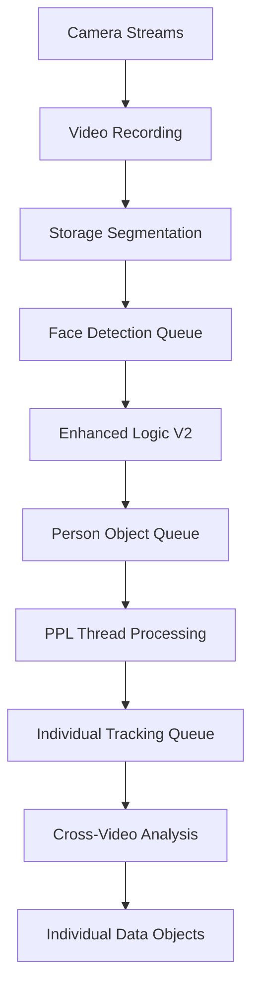

# 🚦 PPL Meta Queuing System - Optimal Resource Utilization Analysis

*PPL Meta Platform v2.19.4 - Intelligent Background Processing Architecture*  
*Date: October 10, 2025*  
*Status: 🔬 THEORETICAL SYSTEM DESIGN*

## 🎯 Executive Summary

This document presents a comprehensive queuing system design for the PPL Meta platform that optimizes CPU and network bandwidth utilization during continuous camera recording operations. The system leverages unused computational resources to perform background face detection, person object creation, and individual tracking without interfering with primary recording functions.

---

## 📋 Section 1: High-Level Platform Process Description

### **PPL Meta Platform Core Workflow**

The PPL Meta platform operates through a sophisticated multi-stage pipeline that transforms raw camera feeds into intelligent individual tracking data:

#### **Stage 1: Video Recording and Storage** 📹
- **Primary Function**: Continuous video capture from multiple camera sources
- **Processing**: Real-time streaming from cameras → local storage segmentation
- **Output**: Time-segmented video files stored in collections
- **Resource Usage**: Moderate CPU, high network I/O, high storage I/O

#### **Stage 2: Automatic Face Detection with Sample Framing** 🎭
- **Primary Function**: Enhanced Logic V2 face detection on stored videos
- **Processing**: Video analysis → face bounding box detection → quality scoring
- **Output**: Face metadata with bbox coordinates and confidence scores
- **Resource Usage**: High CPU (computer vision), moderate storage I/O

#### **Stage 3: People Thread Grouping for Person Objects** 🧑‍🤝‍🧑
- **Primary Function**: Rectangle overlap detection within individual videos
- **Processing**: Face grouping via IoU calculations → person object creation
- **Output**: Person objects with representative faces and movement patterns
- **Resource Usage**: Moderate CPU (spatial calculations), low I/O

#### **Stage 4: Individual Data Objects Creation** 👤
- **Primary Function**: Cross-video individual tracking via ppl-meta-vmeta
- **Processing**: Temporal-spatial analysis → individual identity consolidation
- **Output**: Individual profiles spanning multiple videos and timeframes
- **Resource Usage**: High CPU (complex algorithms), high database I/O

### **Microservice Architecture Overview**

```
🎥 [Cameras] → 📊 [ppl-meta-media] → 💾 [Storage]
                        ↓
🎭 [ppl-meta-vision] ← 🎼 [ppl-meta-orchestrator] → 🔍 [Enhanced Logic V2]
                        ↓                              
🧑‍🤝‍🧑 [PPL Thread] ← 🌐 [ppl-meta-gateway] → 👤 [ppl-meta-vmeta]
```

#### **Service Responsibilities**:

1. **ppl-meta-media** (Port 8000): Video recording, storage management, stream handling
2. **ppl-meta-vision** (Port 8003): Face detection coordination, Enhanced Logic V2 integration
3. **ppl-meta-orchestrator** (Port 8002): Process coordination, queuing system, workflow management
4. **ppl-meta-gateway** (Port 8080): API coordination, authentication, request routing
5. **ppl-meta-vmeta** (Port 8001): Individual tracking, cross-video analysis, person object management

### **Data Flow Pipeline**



**Processing Characteristics**:
- **Real-Time**: Video recording (continuous)
- **Near Real-Time**: Face detection (within minutes)
- **Batch Processing**: Person objects (hourly batches)
- **On-Demand**: Individual tracking (user-initiated)

---

## 📊 Section 2: System Resource Analysis

### **Base Hypothesis Validation**

#### **Hypothesis A: Single Machine Deployment** 🖥️
- **Configuration**: All microservices running on single server
- **Benefits**: Simplified deployment, no network latency between services
- **Constraints**: Shared CPU, memory, and I/O resources
- **Assumption**: Machine has sufficient resources for warehouse-scale operation

#### **Hypothesis B: Continuous Recording Resource Consumption** 📈

**Warehouse Camera Setup Analysis**:
- **Camera Count**: 5 cameras
- **Recording Format**: 1080p @ 30fps (typical)
- **Estimated Resource Usage**:

```
📊 Resource Consumption Breakdown:
┌─────────────────────┬──────────┬─────────────┬─────────────┐
│ Process             │ CPU %    │ Network     │ Storage I/O │
├─────────────────────┼──────────┼─────────────┼─────────────┤
│ Video Recording     │ 15-25%   │ 50 Mbps     │ 45 MB/s     │
│ Stream Processing   │ 10-15%   │ -           │ 25 MB/s     │
│ Service Overhead    │ 5-10%    │ 5 Mbps      │ 5 MB/s      │
├─────────────────────┼──────────┼─────────────┼─────────────┤
│ TOTAL RECORDING     │ 30-50%   │ 55 Mbps     │ 75 MB/s     │
│ AVAILABLE CAPACITY  │ 50-70%   │ Variable    │ Variable    │
└─────────────────────┴──────────┴─────────────┴─────────────┘
```

**Key Insight**: Continuous recording from 5 cameras consumes approximately **30-50% of CPU capacity**, leaving **50-70% available** for background processing.

### **Available Resource Pool**

#### **CPU Resources** 🔥
- **Available**: 50-70% of total CPU capacity
- **Optimal Usage**: Background face detection, person object processing
- **Peak Demand**: Cross-video individual tracking algorithms

#### **Network Bandwidth** 🌐
- **Recording Usage**: 55 Mbps (camera streams)
- **Available**: Depends on total connection (typically 100+ Mbps available)
- **Background Usage**: API calls, database queries, file transfers

#### **Storage I/O** 💾
- **Recording Usage**: 75 MB/s write operations
- **Available**: Read operations for background processing
- **Optimization**: Sequential reads during off-peak hours

---

## 🚦 Section 3: Optimal Queuing System Design

### **Core Queuing Philosophy**

**Principle**: *Maximize utilization of unused CPU and network resources while maintaining real-time recording performance*

#### **Priority-Based Resource Allocation**:
1. **P0 (Critical)**: Video recording (never interrupted)
2. **P1 (High)**: Face detection (near real-time)
3. **P2 (Medium)**: Person object creation (batch processing)
4. **P3 (Low)**: Individual tracking (background processing)

### **Orchestrator-Based Queuing Architecture**

#### **Central Queue Manager** (ppl-meta-orchestrator)

```python
class PPLMetaQueueManager:
    """Central queuing system for optimal resource utilization."""
    
    def __init__(self):
        self.resource_monitor = SystemResourceMonitor()
        self.queues = {
            'face_detection': PriorityQueue(priority=1),
            'person_objects': BatchQueue(priority=2),
            'individual_tracking': BackgroundQueue(priority=3),
            'maintenance': MaintenanceQueue(priority=4)
        }
        self.active_workers = {}
        self.performance_metrics = PerformanceTracker()
    
    def optimize_resource_allocation(self):
        """Dynamically adjust processing based on available resources."""
        cpu_usage = self.resource_monitor.get_cpu_usage()
        network_usage = self.resource_monitor.get_network_usage()
        
        # Calculate available capacity
        available_cpu = max(0, 70 - cpu_usage)  # Leave 30% buffer for recording
        available_network = max(0, 100 - network_usage)
        
        # Adjust worker allocation
        self.allocate_workers(available_cpu, available_network)
```

### **Multi-Tier Queue System**

#### **Tier 1: Face Detection Queue** 🎭
- **Priority**: High (P1)
- **Trigger**: New video file stored
- **Processing**: Enhanced Logic V2 face detection
- **Target Latency**: < 5 minutes per video
- **Resource Allocation**: 30-40% of available CPU

```python
class FaceDetectionQueue:
    """High-priority queue for face detection processing."""
    
    def __init__(self, orchestrator):
        self.max_concurrent_workers = 3
        self.target_latency_minutes = 5
        self.queue = Queue()
        
    async def process_video(self, video_file):
        """Process single video for face detection."""
        # Check system resources before starting
        if not self.orchestrator.can_allocate_resources(cpu=15, network=10):
            await asyncio.sleep(30)  # Wait for resources
            return await self.process_video(video_file)
        
        # Execute face detection
        faces = await enhanced_logic_v2.detect_faces(video_file)
        await self.store_face_metadata(video_file.uuid, faces)
        
        # Queue next stage
        self.orchestrator.queues['person_objects'].add(video_file, faces)
```

#### **Tier 2: Person Object Queue** 🧑‍🤝‍🧑
- **Priority**: Medium (P2)
- **Trigger**: Face detection completion
- **Processing**: PPL Thread rectangle overlap detection
- **Target Latency**: < 30 minutes per batch
- **Resource Allocation**: 20-30% of available CPU

```python
class PersonObjectQueue:
    """Batch processing queue for person object creation."""
    
    def __init__(self, orchestrator):
        self.batch_size = 10  # Process 10 videos at once
        self.batch_timeout = 1800  # 30 minutes max wait
        self.pending_videos = []
        
    async def process_batch(self, video_batch):
        """Process batch of videos for person objects."""
        # Wait for optimal resource window
        await self.wait_for_resources(cpu=25, timeout=300)
        
        # Execute PPL Thread processing
        person_objects = []
        for video in video_batch:
            objects = await ppl_thread.detect_person_objects(video)
            person_objects.extend(objects)
        
        # Store results and queue individual tracking
        await self.store_person_objects(person_objects)
        self.orchestrator.queues['individual_tracking'].add_session_trigger(
            videos=video_batch,
            person_objects=person_objects
        )
```

#### **Tier 3: Individual Tracking Queue** 👤
- **Priority**: Low (P3)
- **Trigger**: Sufficient person objects accumulated OR user request
- **Processing**: Cross-video individual tracking
- **Target Latency**: Background processing (hours)
- **Resource Allocation**: 40-50% of available CPU (during low activity)

```python
class IndividualTrackingQueue:
    """Background queue for cross-video individual tracking."""
    
    def __init__(self, orchestrator):
        self.min_videos_for_auto_trigger = 50
        self.max_processing_duration = 3600  # 1 hour max
        self.session_queue = Queue()
        
    async def auto_trigger_analysis(self):
        """Automatically trigger analysis when sufficient data available."""
        pending_videos = await self.get_unprocessed_videos()
        
        if len(pending_videos) >= self.min_videos_for_auto_trigger:
            # Check for optimal processing window (low system activity)
            if await self.is_optimal_processing_time():
                session = await self.create_auto_session(pending_videos)
                await self.process_tracking_session(session)
    
    async def is_optimal_processing_time(self):
        """Determine if current time is optimal for resource-intensive processing."""
        current_hour = datetime.now().hour
        cpu_usage = self.orchestrator.resource_monitor.get_cpu_usage()
        
        # Prefer processing during low-activity hours
        low_activity_hours = [22, 23, 0, 1, 2, 3, 4, 5, 6]
        is_low_activity_time = current_hour in low_activity_hours
        is_low_cpu_usage = cpu_usage < 40
        
        return is_low_activity_time or is_low_cpu_usage
```

### **Dynamic Resource Allocation Strategy**

#### **Adaptive Worker Scaling** ⚖️

```python
class AdaptiveWorkerManager:
    """Dynamically scale workers based on resource availability."""
    
    def __init__(self):
        self.worker_configs = {
            'face_detection': {'min': 1, 'max': 4, 'cpu_per_worker': 15},
            'person_objects': {'min': 1, 'max': 3, 'cpu_per_worker': 20},
            'individual_tracking': {'min': 0, 'max': 2, 'cpu_per_worker': 30}
        }
    
    def calculate_optimal_workers(self, available_cpu, queue_lengths):
        """Calculate optimal number of workers for each queue."""
        allocation = {}
        remaining_cpu = available_cpu
        
        # Priority-based allocation
        for queue_name in ['face_detection', 'person_objects', 'individual_tracking']:
            config = self.worker_configs[queue_name]
            queue_length = queue_lengths.get(queue_name, 0)
            
            if queue_length == 0:
                allocation[queue_name] = 0
                continue
            
            # Calculate desired workers based on queue length and available CPU
            desired_workers = min(
                queue_length,  # Don't exceed pending items
                remaining_cpu // config['cpu_per_worker'],  # CPU constraint
                config['max']  # Configuration maximum
            )
            
            actual_workers = max(config['min'], desired_workers)
            allocation[queue_name] = actual_workers
            remaining_cpu -= actual_workers * config['cpu_per_worker']
        
        return allocation
```

#### **Resource Monitoring and Throttling** 📊

```python
class SystemResourceMonitor:
    """Monitor system resources and trigger throttling when needed."""
    
    def __init__(self):
        self.cpu_threshold_critical = 85  # Stop background processing
        self.cpu_threshold_warning = 70   # Reduce background processing
        self.network_threshold = 90       # Throttle network-heavy operations
        
    async def monitor_and_adjust(self, queue_manager):
        """Continuously monitor resources and adjust processing."""
        while True:
            cpu_usage = psutil.cpu_percent(interval=1)
            network_usage = self.get_network_utilization()
            
            if cpu_usage > self.cpu_threshold_critical:
                # Emergency throttling
                await queue_manager.emergency_throttle()
                logger.warning(f"🚨 Emergency throttling: CPU at {cpu_usage}%")
                
            elif cpu_usage > self.cpu_threshold_warning:
                # Gradual reduction
                await queue_manager.reduce_background_processing()
                logger.info(f"⚠️ Reducing background processing: CPU at {cpu_usage}%")
                
            else:
                # Normal operation - optimize allocation
                await queue_manager.optimize_resource_allocation()
            
            await asyncio.sleep(10)  # Check every 10 seconds
```

### **Queue Processing Strategies**

#### **Time-Based Processing Windows** ⏰

```python
class ProcessingWindowManager:
    """Manage time-based processing windows for optimal resource usage."""
    
    def __init__(self):
        self.processing_windows = {
            'peak_hours': {
                'hours': list(range(8, 18)),  # 8 AM - 6 PM
                'max_background_cpu': 30,
                'priority_queues_only': True
            },
            'off_peak_hours': {
                'hours': list(range(18, 24)) + list(range(0, 8)),
                'max_background_cpu': 60,
                'enable_intensive_processing': True
            },
            'maintenance_window': {
                'hours': [2, 3, 4],  # 2 AM - 5 AM
                'max_background_cpu': 70,
                'enable_system_maintenance': True
            }
        }
    
    def get_current_window(self):
        """Get current processing window configuration."""
        current_hour = datetime.now().hour
        
        for window_name, config in self.processing_windows.items():
            if current_hour in config['hours']:
                return window_name, config
        
        return 'off_peak_hours', self.processing_windows['off_peak_hours']
```

#### **Intelligent Batch Processing** 📦

```python
class IntelligentBatchProcessor:
    """Smart batching strategy for efficient resource utilization."""
    
    def __init__(self):
        self.batch_strategies = {
            'face_detection': {
                'max_batch_size': 5,
                'timeout_seconds': 300,  # 5 minutes
                'cpu_efficiency_threshold': 0.8
            },
            'person_objects': {
                'max_batch_size': 20,
                'timeout_seconds': 1800,  # 30 minutes
                'memory_efficiency_threshold': 0.7
            }
        }
    
    async def create_optimal_batch(self, queue_name, pending_items):
        """Create optimally-sized batch based on current system state."""
        strategy = self.batch_strategies[queue_name]
        available_cpu = await self.get_available_cpu()
        available_memory = await self.get_available_memory()
        
        # Calculate optimal batch size
        cpu_limited_size = int(available_cpu * strategy['max_batch_size'] / 100)
        memory_limited_size = int(available_memory * strategy['max_batch_size'] / 100)
        resource_limited_size = min(cpu_limited_size, memory_limited_size)
        
        optimal_size = min(
            len(pending_items),
            strategy['max_batch_size'],
            resource_limited_size
        )
        
        return pending_items[:optimal_size]
```

### **Performance Optimization Features**

#### **Predictive Queue Management** 🔮

```python
class PredictiveQueueManager:
    """Predict queue loads and preemptively adjust resources."""
    
    def __init__(self):
        self.historical_data = HistoricalDataAnalyzer()
        self.prediction_horizon = 3600  # 1 hour ahead
        
    async def predict_and_prepare(self):
        """Predict future queue loads and prepare resources."""
        current_time = datetime.now()
        
        # Predict incoming video volumes
        predicted_videos = self.historical_data.predict_video_volume(
            current_time, 
            horizon_seconds=self.prediction_horizon
        )
        
        # Predict resource availability
        predicted_cpu = self.historical_data.predict_cpu_usage(
            current_time,
            horizon_seconds=self.prediction_horizon
        )
        
        # Preemptively adjust queue parameters
        if predicted_videos > current_capacity:
            await self.scale_up_workers()
        elif predicted_cpu > 80:
            await self.prepare_throttling()
```

#### **Quality-Based Processing Prioritization** ⭐

```python
class QualityBasedPrioritizer:
    """Prioritize processing based on content quality and importance."""
    
    def __init__(self):
        self.quality_factors = {
            'face_count': 0.3,
            'video_duration': 0.2,
            'camera_importance': 0.3,
            'time_sensitivity': 0.2
        }
    
    def calculate_processing_priority(self, video_metadata):
        """Calculate processing priority score for video."""
        score = 0
        
        # Face count factor (more faces = higher priority)
        face_count = video_metadata.get('estimated_face_count', 0)
        score += min(face_count / 10, 1.0) * self.quality_factors['face_count']
        
        # Duration factor (optimal duration gets higher priority)
        duration = video_metadata.get('duration_seconds', 0)
        optimal_duration = 300  # 5 minutes
        duration_factor = 1 - abs(duration - optimal_duration) / optimal_duration
        score += max(0, duration_factor) * self.quality_factors['video_duration']
        
        # Camera importance (entrance cameras higher priority)
        camera_type = video_metadata.get('camera_type', 'standard')
        importance_map = {'entrance': 1.0, 'exit': 0.9, 'standard': 0.7}
        score += importance_map.get(camera_type, 0.5) * self.quality_factors['camera_importance']
        
        # Time sensitivity (recent videos higher priority)
        age_hours = (datetime.now() - video_metadata['created_at']).total_seconds() / 3600
        time_factor = max(0, 1 - age_hours / 24)  # Decay over 24 hours
        score += time_factor * self.quality_factors['time_sensitivity']
        
        return min(score, 1.0)
```

### **Integration with Existing Services**

#### **Orchestrator Service Enhancement** 🎼

```python
# ppl-meta-orchestrator/src/queue_manager.py

class PPLMetaOrchestratorQueues:
    """Enhanced orchestrator with integrated queuing system."""
    
    def __init__(self):
        self.queue_manager = PPLMetaQueueManager()
        self.resource_monitor = SystemResourceMonitor()
        self.batch_processor = IntelligentBatchProcessor()
        self.predictive_manager = PredictiveQueueManager()
        
    async def start_queue_processing(self):
        """Start all queue processing workers."""
        # Start resource monitoring
        asyncio.create_task(self.resource_monitor.monitor_and_adjust(self.queue_manager))
        
        # Start predictive management
        asyncio.create_task(self.predictive_manager.predict_and_prepare())
        
        # Start queue processors
        asyncio.create_task(self.process_face_detection_queue())
        asyncio.create_task(self.process_person_object_queue())
        asyncio.create_task(self.process_individual_tracking_queue())
        
        logger.info("🚦 PPL Meta queuing system started")
    
    async def handle_new_video_file(self, video_file):
        """Handle new video file event from ppl-meta-media."""
        # Calculate processing priority
        priority = self.queue_manager.prioritizer.calculate_processing_priority(
            video_file.metadata
        )
        
        # Add to face detection queue
        await self.queue_manager.queues['face_detection'].put(
            item=video_file,
            priority=priority
        )
        
        logger.info(f"📹 Video {video_file.uuid} queued for face detection (priority: {priority:.2f})")
```

## 🎯 Expected System Benefits

### **Resource Utilization Optimization** 📈
- **CPU Utilization**: Increase from 30-50% to 80-90% during background processing
- **Queue Processing**: Automatic face detection within 5 minutes of video storage
- **Background Analysis**: Continuous person object and individual tracking
- **System Efficiency**: Maximize computational value from available hardware

### **Processing Performance** ⚡
- **Face Detection Latency**: < 5 minutes per video
- **Person Object Creation**: < 30 minutes per batch
- **Individual Tracking**: Background processing during low-activity periods
- **System Responsiveness**: No impact on primary recording functions

### **Scalability and Reliability** 🛡️
- **Adaptive Scaling**: Automatic worker adjustment based on resource availability
- **Fault Tolerance**: Queue persistence and recovery mechanisms
- **Resource Protection**: Emergency throttling prevents system overload
- **Predictive Management**: Anticipates and prepares for resource demands

---

## 🎛️ Section 4: PPL Meta Operation Modes (OpModes)

### **OpMode System Overview**

PPL Meta Operation Modes provide product-specific configurations that automatically optimize the queuing system, camera settings, and processing parameters for different use cases. Each OpMode represents a complete operational profile tailored to specific PPL Meta products.

#### **OpMode Configuration Parameters**

Each OpMode controls the following system aspects:

1. **🎥 Camera Configuration**: Which cameras to activate and their recording settings
2. **⏰ Daily Routine**: Time-based activation schedules and processing intensity
3. **📹 Video Segmentation**: Recording segment duration optimization
4. **🔍 Sample Frame Detection**: Frame sampling rate for face detection
5. **🤖 Individual Discovery Automation**: Automatic vs manual individual tracking triggers
6. **📊 Processing Priorities**: Queue priorities and resource allocation adjustments

### **Default Product OpModes**

#### **OpMode 1: Intelligent Signage** 📺
*Transform digital displays into intelligent marketing platforms with demographic-driven content delivery and near real-time audience analytics.*

**Configuration Overview:**
- **Camera Count:** 2 cameras (minimal setup for audience-facing monitoring)
- **Resolution:** 1080p (balanced quality for demographic analysis without excessive storage)
- **Frame Rate:** 30 fps (standard rate sufficient for demographic detection)
- **Detection Interval:** Every 5 frames (6 faces/second - optimized for real-time audience analytics)
- **Quality Threshold:** 0.7 (moderate threshold allowing broader demographic capture)
- **Video Segments:** 5-minute duration (short segments for responsive analytics and privacy compliance)
- **Retention:** 7 days (minimal retention focused on immediate insights, not long-term storage)
- **Processing Priority:** Real-time during business hours, batch processing after hours (cost-effective resource allocation)

**Rationale:** This configuration prioritizes immediate demographic insights for content optimization while maintaining privacy-conscious data retention. The moderate quality threshold ensures broader audience capture for statistical analysis rather than individual identification.

```python
class IntelligentSignageOpMode:
    """OpMode optimized for demographic analysis and audience analytics."""
    
    def __init__(self):
        self.opmode_name = "intelligent_signage"
        self.product_focus = "Demographic analysis and audience engagement"
        
        # Camera Configuration
        self.camera_config = {
            'active_cameras': ['front_facing_1', 'front_facing_2'],  # Audience-facing cameras
            'camera_count': 2,
            'resolution': '1080p',
            'fps': 30,
            'focus_areas': ['audience_zone', 'interaction_area']
        }
        
        # Daily Routine
        self.daily_routine = {
            'business_hours': {
                'start': '08:00',
                'end': '20:00',
                'recording_intensity': 'high',
                'face_detection_priority': 'real_time',  # < 30 seconds
                'demographic_analysis': 'continuous'
            },
            'off_hours': {
                'start': '20:00',
                'end': '08:00',
                'recording_intensity': 'low',
                'face_detection_priority': 'batch',  # Every 30 minutes
                'demographic_analysis': 'disabled'
            }
        }
        
        # Video Segmentation
        self.video_segments = {
            'duration_minutes': 5,  # Short segments for real-time analytics
            'overlap_seconds': 10,  # Overlap for continuity
            'storage_retention_days': 7  # Short retention for privacy
        }
        
        # Sample Frame Detection
        self.frame_sampling = {
            'detection_interval': 5,  # Every 5 frames (6 faces/second)
            'quality_threshold': 0.7,
            'demographic_features': True,
            'emotion_detection': True
        }
        
        # Individual Discovery Automation
        self.individual_automation = {
            'auto_trigger_enabled': True,
            'trigger_conditions': {
                'min_engagement_seconds': 10,  # Person looking at display for 10+ seconds
                'audience_size_threshold': 3,  # Groups of 3+ people
                'demographic_change_detection': True
            },
            'processing_frequency': 'real_time',  # Immediate demographic analysis
            'retention_policy': 'session_only'  # Don't store individual data
        }
        
        # Queue Priorities
        self.queue_priorities = {
            'face_detection': 1,  # Highest priority
            'demographic_analysis': 1,
            'person_objects': 2,
            'individual_tracking': 3  # Lower priority (privacy focused)
        }
```

#### **OpMode 2: Gate Activity** 🚪
*Advanced security monitoring for entrances and corridors with crowd analytics, threat detection, and comprehensive behavioral insights.*

**Configuration Overview:**
- **Camera Count:** 4 cameras (comprehensive coverage of entry/exit points and corridors)
- **Resolution:** 4K (high resolution required for identification and evidence quality)
- **Frame Rate:** 60 fps (high frame rate for accurate movement analysis and behavior detection)
- **Detection Interval:** Every 2 frames (15 faces/second - maximum detection frequency for security)
- **Quality Threshold:** 0.8 (high threshold ensuring clear identification for security purposes)
- **Video Segments:** 15-minute duration (longer segments for comprehensive security analysis)
- **Retention:** 90 days (extended retention for security compliance and investigation needs)
- **Processing Priority:** Real-time 24/7 (continuous security monitoring with maximum responsiveness)

**Rationale:** Security applications require the highest quality settings for identification and evidence. The 4K resolution and high frame rate ensure no security events are missed, while extended retention supports investigation workflows and compliance requirements.

```python
class GateActivityOpMode:
    """OpMode optimized for entrance monitoring and security analysis."""
    
    def __init__(self):
        self.opmode_name = "gate_activity"
        self.product_focus = "Security monitoring and crowd analytics"
        
        # Camera Configuration
        self.camera_config = {
            'active_cameras': ['entrance_1', 'entrance_2', 'corridor_1', 'exit_1'],
            'camera_count': 4,
            'resolution': '4K',  # Higher resolution for identification
            'fps': 60,  # Higher fps for movement analysis
            'focus_areas': ['entry_zone', 'exit_zone', 'queue_area', 'security_checkpoint']
        }
        
        # Daily Routine
        self.daily_routine = {
            'security_hours': {
                'start': '06:00',
                'end': '22:00',
                'recording_intensity': 'maximum',
                'face_detection_priority': 'real_time',
                'behavior_analysis': 'continuous',
                'threat_detection': 'active'
            },
            'night_watch': {
                'start': '22:00',
                'end': '06:00',
                'recording_intensity': 'high',
                'face_detection_priority': 'real_time',
                'motion_sensitivity': 'maximum',
                'alert_threshold': 'low'  # More sensitive at night
            }
        }
        
        # Video Segmentation
        self.video_segments = {
            'duration_minutes': 15,  # Longer segments for security analysis
            'overlap_seconds': 30,
            'storage_retention_days': 90  # Extended retention for security
        }
        
        # Sample Frame Detection
        self.frame_sampling = {
            'detection_interval': 2,  # Every 2 frames (15 faces/second)
            'quality_threshold': 0.8,  # Higher quality for identification
            'behavior_analysis': True,
            'crowd_density_tracking': True
        }
        
        # Individual Discovery Automation
        self.individual_automation = {
            'auto_trigger_enabled': True,
            'trigger_conditions': {
                'entrance_detection': True,  # Anyone entering/exiting
                'suspicious_behavior': True,
                'crowd_threshold': 5,  # Groups of 5+ people
                'dwell_time_seconds': 30  # Loitering detection
            },
            'processing_frequency': 'immediate',
            'cross_camera_tracking': True,
            'retention_policy': 'security_standard'  # 90 days
        }
        
        # Queue Priorities
        self.queue_priorities = {
            'face_detection': 1,
            'behavior_analysis': 1,
            'individual_tracking': 1,  # High priority for security
            'crowd_analytics': 2
        }
```

#### **OpMode 3: Room & Gate Protection** 🏫
*Comprehensive attendance monitoring and access control for educational, healthcare, and corporate environments with automated reporting.*

**Configuration Overview:**
- **Camera Count:** 3 cameras (strategic placement at entrance, interior, and emergency exit)
- **Resolution:** 1080p (sufficient quality for attendance verification without excessive storage costs)
- **Frame Rate:** 30 fps (standard rate adequate for attendance tracking and access control)
- **Detection Interval:** Every 10 frames (3 faces/second - balanced for attendance accuracy and processing efficiency)
- **Quality Threshold:** 0.75 (moderate-high threshold ensuring reliable attendance verification)
- **Video Segments:** 30-minute duration (session-based segments aligning with typical class/meeting periods)
- **Retention:** 30 days (compliance-focused retention for educational/corporate audit requirements)
- **Processing Priority:** Session-based processing (efficient batch processing aligned with operational schedules)

**Rationale:** Educational and corporate environments require reliable attendance tracking with compliance-grade retention. The 30-minute segments align with typical session durations, while moderate processing frequency balances accuracy with cost-effectiveness for routine attendance monitoring.

```python
class RoomGateProtectionOpMode:
    """OpMode optimized for attendance tracking and access control."""
    
    def __init__(self):
        self.opmode_name = "room_gate_protection"
        self.product_focus = "Attendance monitoring and access control"
        
        # Camera Configuration
        self.camera_config = {
            'active_cameras': ['room_entrance', 'room_interior', 'emergency_exit'],
            'camera_count': 3,
            'resolution': '1080p',
            'fps': 30,
            'focus_areas': ['entry_point', 'seating_area', 'exit_point']
        }
        
        # Daily Routine
        self.daily_routine = {
            'operational_hours': {
                'start': '07:00',
                'end': '18:00',
                'recording_intensity': 'high',
                'attendance_tracking': 'active',
                'access_control': 'strict',
                'automated_reporting': 'enabled'
            },
            'maintenance_hours': {
                'start': '18:00',
                'end': '07:00',
                'recording_intensity': 'medium',
                'attendance_tracking': 'security_only',
                'access_control': 'basic'
            }
        }
        
        # Video Segmentation
        self.video_segments = {
            'duration_minutes': 30,  # Session-based segments
            'overlap_seconds': 60,
            'storage_retention_days': 30  # Compliance-based retention
        }
        
        # Sample Frame Detection
        self.frame_sampling = {
            'detection_interval': 10,  # Every 10 frames (3 faces/second)
            'quality_threshold': 0.75,
            'attendance_verification': True,
            'access_authorization': True
        }
        
        # Individual Discovery Automation
        self.individual_automation = {
            'auto_trigger_enabled': True,
            'trigger_conditions': {
                'session_start': True,  # Beginning of class/meeting
                'entry_exit_events': True,
                'attendance_verification': True,
                'unauthorized_access': True
            },
            'processing_frequency': 'session_based',  # Process per session
            'attendance_reports': 'automatic',
            'retention_policy': 'educational_compliance'
        }
        
        # Queue Priorities
        self.queue_priorities = {
            'attendance_tracking': 1,
            'face_detection': 2,
            'access_verification': 1,
            'individual_tracking': 2
        }
```

#### **OpMode 4: Sentinel** 👁️
*Automated security personnel monitoring ensuring vigilant oversight at watch stations with customizable activity detection and alerts.*

**Configuration Overview:**
- **Camera Count:** 3 cameras (focused monitoring of watch stations, security desks, and patrol routes)
- **Resolution:** 1080p (adequate quality for personnel monitoring and attention analysis)
- **Frame Rate:** 30 fps (sufficient for detecting attention lapses and fatigue indicators)
- **Detection Interval:** Every 3 frames (10 faces/second - high frequency for vigilance tracking)
- **Quality Threshold:** 0.8 (high threshold ensuring accurate personnel identification and state analysis)
- **Video Segments:** 10-minute duration (short segments for detailed personnel performance analysis)
- **Retention:** 14 days (personnel monitoring retention balancing oversight needs with privacy)
- **Processing Priority:** Continuous 24/7 (constant vigilance monitoring with immediate alert generation)

**Rationale:** Personnel monitoring requires continuous high-frequency analysis to detect attention lapses and fatigue. The 10-minute segments enable detailed performance reviews, while 14-day retention provides sufficient oversight data without excessive personnel surveillance storage.

```python
class SentinelOpMode:
    """OpMode optimized for security personnel monitoring and vigilance tracking."""
    
    def __init__(self):
        self.opmode_name = "sentinel"
        self.product_focus = "Security personnel vigilance monitoring"
        
        # Camera Configuration
        self.camera_config = {
            'active_cameras': ['watch_station_1', 'security_desk', 'patrol_route_1'],
            'camera_count': 3,
            'resolution': '1080p',
            'fps': 30,
            'focus_areas': ['operator_position', 'screen_viewing_area', 'alert_zones']
        }
        
        # Daily Routine
        self.daily_routine = {
            'shift_monitoring': {
                'start': '00:00',  # 24/7 operation
                'end': '23:59',
                'recording_intensity': 'continuous',
                'vigilance_tracking': 'active',
                'attention_analysis': 'real_time',
                'fatigue_detection': 'enabled'
            }
        }
        
        # Video Segmentation
        self.video_segments = {
            'duration_minutes': 10,  # Short segments for detailed analysis
            'overlap_seconds': 30,
            'storage_retention_days': 14  # Personnel monitoring retention
        }
        
        # Sample Frame Detection
        self.frame_sampling = {
            'detection_interval': 3,  # Every 3 frames (10 faces/second)
            'quality_threshold': 0.8,
            'attention_tracking': True,
            'fatigue_indicators': True,
            'posture_analysis': True
        }
        
        # Individual Discovery Automation
        self.individual_automation = {
            'auto_trigger_enabled': True,
            'trigger_conditions': {
                'shift_change': True,
                'attention_lapse': True,  # When operator looks away
                'fatigue_indicators': True,
                'unauthorized_absence': True
            },
            'processing_frequency': 'continuous',
            'alert_generation': 'immediate',
            'retention_policy': 'personnel_monitoring'
        }
        
        # Queue Priorities
        self.queue_priorities = {
            'vigilance_tracking': 1,  # Highest priority
            'attention_analysis': 1,
            'face_detection': 2,
            'individual_tracking': 2
        }
```

#### **OpMode 5: Security Officer Agent** 👮
*Mobile security enhancement through wearable technology, providing real-time alerts and centralized command integration for field operations.*

**Configuration Overview:**
- **Camera Count:** 3 cameras (body cam, patrol vehicle, and fixed checkpoint for comprehensive mobile coverage)
- **Resolution:** 1080p (optimal balance for mobile streaming and identification quality)
- **Frame Rate:** 30 fps (sufficient for mobile security applications with real-time streaming constraints)
- **Detection Interval:** Every frame (30 faces/second - maximum detection frequency for critical security situations)
- **Quality Threshold:** 0.9 (maximum quality threshold for law enforcement identification accuracy)
- **Video Segments:** 2-minute duration (very short segments for incident response and mobile operations)
- **Retention:** 60 days (legal compliance retention for law enforcement evidence)
- **Processing Priority:** Immediate (maximum priority for threat detection and officer safety)

**Rationale:** Mobile security operations require maximum detection frequency and quality for officer safety and evidence collection. Short video segments support rapid incident response, while extended retention meets law enforcement evidence requirements. Every-frame processing ensures no security threats are missed.

```python
class SecurityOfficerAgentOpMode:
    """OpMode optimized for mobile security and wearable technology integration."""
    
    def __init__(self):
        self.opmode_name = "security_officer_agent"
        self.product_focus = "Mobile security and wearable technology"
        
        # Camera Configuration
        self.camera_config = {
            'active_cameras': ['body_cam_1', 'patrol_vehicle_cam', 'fixed_checkpoint'],
            'camera_count': 3,
            'resolution': '1080p',
            'fps': 30,
            'mobility_support': True,
            'real_time_streaming': True
        }
        
        # Daily Routine
        self.daily_routine = {
            'patrol_shift': {
                'start': 'dynamic',  # Based on shift schedule
                'end': 'dynamic',
                'recording_intensity': 'incident_based',
                'real_time_alerts': 'enabled',
                'command_integration': 'active',
                'location_tracking': 'continuous'
            }
        }
        
        # Video Segmentation
        self.video_segments = {
            'duration_minutes': 2,  # Very short for mobile/incident response
            'overlap_seconds': 5,
            'storage_retention_days': 60,  # Legal compliance
            'incident_flagging': True
        }
        
        # Sample Frame Detection
        self.frame_sampling = {
            'detection_interval': 1,  # Every frame (30 faces/second) - high accuracy needed
            'quality_threshold': 0.9,  # Maximum quality for identification
            'threat_assessment': True,
            'crowd_analysis': True,
            'weapon_detection': True
        }
        
        # Individual Discovery Automation
        self.individual_automation = {
            'auto_trigger_enabled': True,
            'trigger_conditions': {
                'incident_activation': True,
                'crowd_formation': True,
                'suspicious_activity': True,
                'officer_alert': True
            },
            'processing_frequency': 'immediate',
            'command_center_integration': True,
            'retention_policy': 'law_enforcement'
        }
        
        # Queue Priorities
        self.queue_priorities = {
            'threat_detection': 1,  # Maximum priority
            'face_detection': 1,
            'real_time_alerts': 1,
            'individual_tracking': 1
        }
```

#### **OpMode 6: Underage Detector** 🔞
*Specialized point-of-sale age verification system ensuring compliance with age-restricted sales through intelligent estimation algorithms.*

**Configuration Overview:**
- **Camera Count:** 2 cameras (point-of-sale focus and ID verification area for comprehensive age verification)
- **Resolution:** 4K (maximum resolution required for precise facial analysis and age estimation)
- **Frame Rate:** 60 fps (high frame rate for capturing optimal facial features during transactions)
- **Detection Interval:** Every frame (60 faces/second - maximum accuracy for age verification)
- **Quality Threshold:** 0.95 (highest threshold ensuring maximum accuracy for compliance verification)
- **Video Segments:** 1-minute duration (transaction-based short segments for privacy and compliance)
- **Retention:** 365 days (extended regulatory compliance retention for age verification records)
- **Processing Priority:** Immediate real-time (instant verification required for point-of-sale operations)

**Rationale:** Age verification demands the highest technical specifications to ensure regulatory compliance. Maximum resolution and frame rate capture optimal facial details for accurate age estimation, while immediate processing enables real-time point-of-sale verification. Extended retention meets regulatory audit requirements for age-restricted sales.

```python
class UnderageDetectorOpMode:
    """OpMode optimized for age verification and compliance monitoring."""
    
    def __init__(self):
        self.opmode_name = "underage_detector"
        self.product_focus = "Age verification and compliance monitoring"
        
        # Camera Configuration
        self.camera_config = {
            'active_cameras': ['pos_camera_1', 'checkout_verification'],
            'camera_count': 2,
            'resolution': '4K',  # High resolution for facial analysis
            'fps': 60,  # High fps for precise capture
            'focus_areas': ['customer_face_zone', 'id_verification_area']
        }
        
        # Daily Routine
        self.daily_routine = {
            'business_hours': {
                'start': '06:00',  # Early for convenience stores
                'end': '23:00',
                'recording_intensity': 'transaction_based',
                'age_verification': 'active',
                'compliance_monitoring': 'strict',
                'alert_sensitivity': 'high'
            },
            'closed_hours': {
                'start': '23:00',
                'end': '06:00',
                'recording_intensity': 'security_only',
                'age_verification': 'disabled'
            }
        }
        
        # Video Segmentation
        self.video_segments = {
            'duration_minutes': 1,  # Very short, transaction-based
            'overlap_seconds': 2,
            'storage_retention_days': 365,  # Extended for compliance
            'transaction_linking': True
        }
        
        # Sample Frame Detection
        self.frame_sampling = {
            'detection_interval': 1,  # Every frame for maximum accuracy
            'quality_threshold': 0.95,  # Maximum quality for age estimation
            'age_estimation': True,
            'confidence_scoring': True,
            'facial_landmarks': True
        }
        
        # Individual Discovery Automation
        self.individual_automation = {
            'auto_trigger_enabled': True,
            'trigger_conditions': {
                'pos_transaction': True,  # Every transaction
                'age_restricted_item': True,
                'verification_required': True,
                'compliance_audit': True
            },
            'processing_frequency': 'immediate',  # Real-time verification
            'compliance_reporting': 'automatic',
            'retention_policy': 'regulatory_compliance'
        }
        
        # Queue Priorities
        self.queue_priorities = {
            'age_verification': 1,  # Maximum priority
            'face_detection': 1,
            'compliance_monitoring': 1,
            'individual_tracking': 3  # Lower priority for privacy
        }
```

### **OpMode Management System**

#### **OpMode Controller** 🎛️

```python
class PPLMetaOpModeController:
    """Central controller for managing operation modes and their configurations."""
    
    def __init__(self):
        self.available_opmodes = {
            'intelligent_signage': IntelligentSignageOpMode(),
            'gate_activity': GateActivityOpMode(),
            'room_gate_protection': RoomGateProtectionOpMode(),
            'sentinel': SentinelOpMode(),
            'security_officer_agent': SecurityOfficerAgentOpMode(),
            'underage_detector': UnderageDetectorOpMode()
        }
        
        self.active_opmode = None
        self.opmode_history = []
        
    def activate_opmode(self, opmode_name: str):
        """Activate a specific operation mode."""
        if opmode_name not in self.available_opmodes:
            raise ValueError(f"Unknown OpMode: {opmode_name}")
        
        # Deactivate current mode
        if self.active_opmode:
            await self.deactivate_current_opmode()
        
        # Activate new mode
        new_opmode = self.available_opmodes[opmode_name]
        await self.configure_system_for_opmode(new_opmode)
        
        self.active_opmode = new_opmode
        self.opmode_history.append({
            'opmode': opmode_name,
            'activated_at': datetime.now(),
            'configuration': new_opmode.__dict__
        })
        
        logger.info(f"🎛️ Activated OpMode: {opmode_name}")
        
    async def configure_system_for_opmode(self, opmode):
        """Configure all system components for the specified OpMode."""
        
        # Configure cameras
        await self.configure_cameras(opmode.camera_config)
        
        # Configure queuing system
        await self.configure_queues(opmode.queue_priorities)
        
        # Configure daily routine
        await self.schedule_daily_routine(opmode.daily_routine)
        
        # Configure video segmentation
        await self.configure_video_segments(opmode.video_segments)
        
        # Configure frame sampling
        await self.configure_frame_sampling(opmode.frame_sampling)
        
        # Configure individual automation
        await self.configure_individual_automation(opmode.individual_automation)
        
    async def get_opmode_recommendations(self, context: dict):
        """Recommend optimal OpMode based on context."""
        recommendations = []
        
        if context.get('environment') == 'retail':
            if context.get('age_restricted_sales'):
                recommendations.append('underage_detector')
            else:
                recommendations.append('intelligent_signage')
                
        elif context.get('environment') == 'security':
            if context.get('mobile_operations'):
                recommendations.append('security_officer_agent')
            elif context.get('entrance_monitoring'):
                recommendations.append('gate_activity')
            else:
                recommendations.append('sentinel')
                
        elif context.get('environment') == 'institutional':
            recommendations.append('room_gate_protection')
        
        return recommendations
```

#### **OpMode Integration with Queuing System** 🔄

```python
class OpModeAwareQueueManager(PPLMetaQueueManager):
    """Enhanced queue manager that adapts to active OpMode."""
    
    def __init__(self, opmode_controller):
        super().__init__()
        self.opmode_controller = opmode_controller
        
    def adjust_queues_for_opmode(self, opmode):
        """Dynamically adjust queue configurations based on active OpMode."""
        
        # Adjust queue priorities
        for queue_name, priority in opmode.queue_priorities.items():
            if queue_name in self.queues:
                self.queues[queue_name].priority = priority
        
        # Adjust processing frequencies
        if hasattr(opmode, 'individual_automation'):
            automation = opmode.individual_automation
            if automation['processing_frequency'] == 'real_time':
                self.enable_real_time_processing()
            elif automation['processing_frequency'] == 'immediate':
                self.enable_immediate_processing()
            else:
                self.enable_batch_processing()
        
        # Adjust resource allocation based on OpMode requirements
        if opmode.opmode_name == 'security_officer_agent':
            # Allocate maximum resources for mobile security
            self.max_cpu_allocation = 0.9
        elif opmode.opmode_name == 'intelligent_signage':
            # Moderate resources for signage applications
            self.max_cpu_allocation = 0.6
        else:
            # Standard allocation
            self.max_cpu_allocation = 0.7
            
        logger.info(f"🎛️ Queue system adapted for OpMode: {opmode.opmode_name}")
```

### **OpMode Benefits and Use Cases**

#### **Operational Benefits** 📈

| OpMode | Primary Benefit | Resource Optimization | Automation Level |
|--------|----------------|----------------------|------------------|
| **Intelligent Signage** | Real-time demographic analytics | 60% CPU, privacy-focused | Medium |
| **Gate Activity** | Comprehensive security monitoring | 90% CPU, maximum retention | High |
| **Room & Gate Protection** | Automated attendance tracking | 70% CPU, compliance-focused | High |
| **Sentinel** | Personnel vigilance monitoring | 80% CPU, continuous operation | Maximum |
| **Security Officer Agent** | Mobile security enhancement | 90% CPU, real-time alerts | Maximum |
| **Underage Detector** | Compliance and age verification | 95% CPU, transaction-based | Maximum |

#### **Industry Applications** 🏢

- **Retail**: Intelligent Signage + Underage Detector
- **Corporate**: Room & Gate Protection + Sentinel  
- **Security**: Gate Activity + Security Officer Agent
- **Education**: Room & Gate Protection
- **Healthcare**: Gate Activity + Room & Gate Protection
- **Entertainment**: Gate Activity + Underage Detector

---

## 🔬 **QUEUING SYSTEM STATUS**

**✅ THEORETICAL DESIGN COMPLETE**

This comprehensive queuing system design provides optimal utilization of unused CPU and network resources while maintaining the reliability of primary video recording functions. The system includes:

- **🎯 Multi-Tier Priority Queues**: Face detection, person objects, individual tracking
- **⚖️ Dynamic Resource Allocation**: Adaptive worker scaling based on available resources
- **📊 Intelligent Monitoring**: Real-time resource tracking with automatic throttling
- **🔮 Predictive Management**: Anticipatory resource preparation and queue optimization
- **⭐ Quality-Based Prioritization**: Smart processing order based on content importance

**Ready for implementation in ppl-meta-orchestrator microservice!** 🚀

---

**Document Status**: ✅ **COMPLETE SYSTEM DESIGN**  
*Ready for implementation planning and development*  
*PPL Meta Platform v2.19.4 - October 10, 2025*