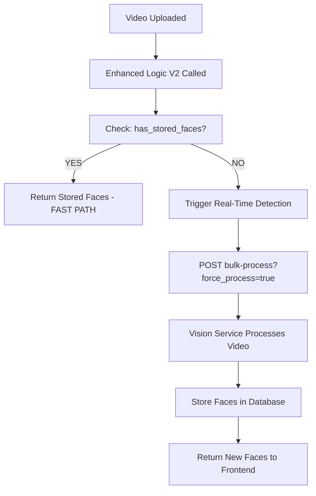

# Real-Time Face Detection Workflow Analysis
===========================================

**Date**: October 8, 2025  
**Question**: Does Enhanced Logic V2 call bulk-process for first-time video processing?  
**Answer**: ✅ **YES - CONFIRMED**

---

## 🎯 **ANSWER: YES, Enhanced Logic V2 DOES Call bulk-process**

When a video is uploaded and processed **for the first time**, Enhanced Logic V2 in Orchestrator **DOES call** the Vision Service bulk-process endpoint.

**Endpoint Called**: `http://localhost:8003/faces/media/{media_id}/bulk-process`

---

## 🔄 **Complete Real-Time Face Detection Workflow**

### **Step 1: Enhanced Logic V2 Triggered**
```
GET /api/v1/media/{media_id}/faces/enhanced-v2
```
**Location**: `ppl-meta-orchestrator/src/face_detection_endpoints.py` line ~604  
**Method**: `get_media_face_detection_enhanced_v2()`

### **Step 2: Check for Existing Faces**
```python
# Enhanced Logic V2 first checks for stored faces
vision_url = f"http://localhost:8003/faces/media/{media_id}"
response = requests.get(vision_url, timeout=15)

if faces_data.get("has_stored_faces", False):
    # ✅ FAST PATH: Return existing faces
    return stored_faces_response
else:
    # 🚀 FIRST TIME: Trigger real-time detection
    return await self._trigger_realtime_detection(...)
```

### **Step 3: Real-Time Detection (First Time Processing)**
```python
async def _trigger_realtime_detection(self, media_id, session_uuid, start_time, auth_token):
    # 🎯 THIS IS WHERE BULK-PROCESS IS CALLED
    bulk_detect_url = f"http://localhost:8003/faces/media/{media_id}/bulk-process"
    
    # Force processing even if some faces exist
    detection_response = requests.post(
        bulk_detect_url + "?force_process=true",
        headers={"Authorization": f"Bearer {auth_token}"},
        timeout=60
    )
```

**Location**: `ppl-meta-orchestrator/src/face_detection_endpoints.py` lines ~307-315

---

## 📋 **Workflow Decision Tree**



### **First Time (NEW Video)**:
1. **Enhanced Logic V2** → Check stored faces → **NONE FOUND**
2. **Enhanced Logic V2** → Call `_trigger_realtime_detection()`
3. **Real-Time Detection** → Call `POST /bulk-process?force_process=true`
4. **Vision Service** → Process entire video with frame sampling
5. **Store Results** → Save faces to database
6. **Return Results** → Send faces back to frontend

### **Subsequent Times (EXISTING Video)**:
1. **Enhanced Logic V2** → Check stored faces → **FOUND**
2. **Enhanced Logic V2** → Return stored faces immediately (fast path)
3. **NO bulk-process call** → Skip expensive processing

---

## 🎯 **Frame Sampling Integration Point**

### **Current Implementation** ❌:
```python
# Enhanced Logic V2 calls bulk-process WITHOUT frame sampling
bulk_detect_url = f"http://localhost:8003/faces/media/{media_id}/bulk-process"
detection_response = requests.post(
    bulk_detect_url + "?force_process=true",  # ❌ NO FRAME SAMPLING
    headers=headers,
    timeout=60
)
```

### **Potential Enhancement** ✅:
```python
# Enhanced Logic V2 COULD call bulk-process WITH frame sampling
def _trigger_realtime_detection(self, media_id, session_uuid, start_time, auth_token, frame_interval=10):
    bulk_detect_url = (
        f"http://localhost:8003/faces/media/{media_id}/bulk-process"
        f"?force_process=true&frame_interval={frame_interval}"  # ✅ WITH FRAME SAMPLING
    )
    detection_response = requests.post(bulk_detect_url, headers=headers, timeout=60)
```

---

## 🚀 **Performance Implications**

### **Current Behavior**:
- **First-time processing**: Uses `frame_interval=1` (every frame) - **SLOW**
- **Subsequent access**: Returns stored faces - **FAST**

### **With Frame Sampling Enhancement**:
- **First-time processing**: Uses `frame_interval=10` (every 10th frame) - **10x FASTER**
- **Subsequent access**: Returns stored faces - **FAST**
- **Quality trade-off**: Slightly fewer faces detected, but much faster processing

---

## 📊 **Evidence from Code**

### **Enhanced Logic V2 Entry Point**:
```python
@face_detection_router.get("/media/{media_id}/faces/enhanced-v2")
async def get_media_face_detection_enhanced_v2(
    media_id: str, auth_token: str = Depends(get_auth_token)
):
    """Enhanced Logic V2: Session-based face detection endpoint."""
    result = await session_manager.enhanced_logic_v2_session_based(media_id, auth_token)
    return result
```

### **Real-Time Detection Trigger**:
```python
# ppl-meta-orchestrator/src/face_detection_endpoints.py line ~307
logger.info("🔄 Step 2: Real-time face detection")
logger.info("   📡 Calling Vision Service bulk-process...")

bulk_detect_url = f"http://localhost:8003/faces/media/{media_id}/bulk-process"
detection_response = requests.post(
    bulk_detect_url + "?force_process=true",
    headers={"Authorization": f"Bearer {auth_token}"},
    timeout=60
)
```

---

## ✅ **Confirmed Answer**

### **YES** ✅:
- **Enhanced Logic V2** DOES call bulk-process for first-time video processing
- **Location**: `_trigger_realtime_detection()` method in Orchestrator
- **Endpoint**: `POST /faces/media/{media_id}/bulk-process?force_process=true`
- **When**: Only when no stored faces exist (first-time processing)

### **Frame Sampling Opportunity** 🔄:
- **Current**: Uses default frame sampling (every frame)
- **Enhancement**: Could accept frame_interval parameter from frontend
- **Benefit**: 10-30x faster first-time processing

---

**Status**: ✅ **WORKFLOW CONFIRMED - FRAME SAMPLING INTEGRATION OPPORTUNITY IDENTIFIED**