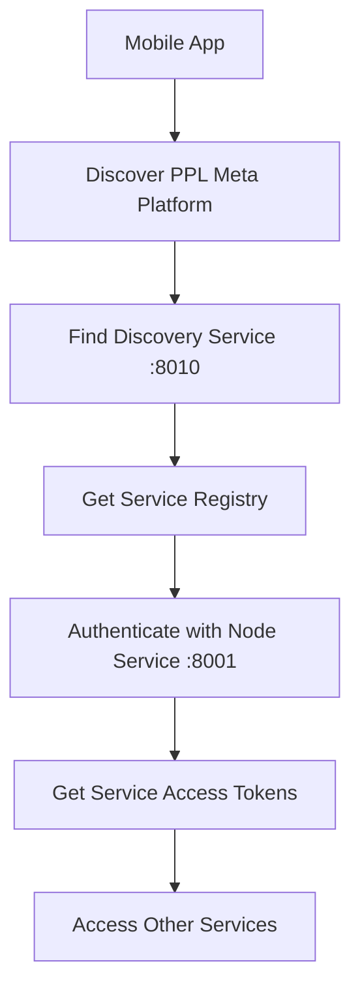
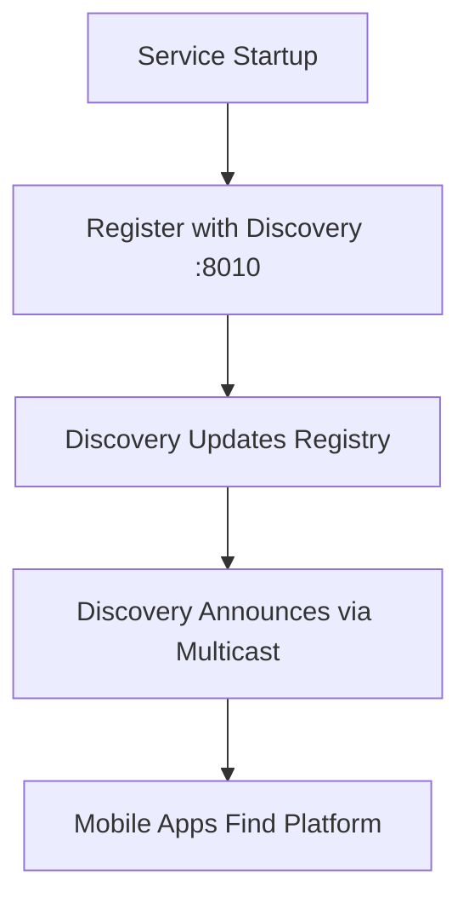

# PPL Meta Microservices Architecture: Network Discovery & Service Management

## 🎯 Architectural Decision: Where Should Network Discovery Live?

### Current Service Responsibilities

| Service | Port | Current Responsibilities |
|---------|------|-------------------------|
| **Node Service** | 8001 | User Management, Authentication, JWT |
| **Gateway Service** | 8080 | API Routing, Rate Limiting, Request Aggregation |
| **Orchestrator Service** | 8002 | Workflow Coordination, Business Logic |
| **Media Service** | 8000 | Media Processing, File Storage |
| **Vision Service** | 8003 | Computer Vision, OpenCV |
| **Cameras Service** | 8005 | Camera Management, RTSP Streaming |

## 🏗️ Separation of Concerns Analysis

### Option 1: Service Discovery as Separate Microservice ✅ **RECOMMENDED**

**Create a dedicated `ppl-meta-discovery` service:**

```
ppl-meta-code/
├── ppl-meta-discovery/        # NEW: Service Discovery Service
│   ├── src/
│   │   ├── main.py            # Discovery server
│   │   ├── multicast.py       # Multicast announcements
│   │   ├── service_registry.py # Service registration
│   │   └── health_checker.py  # Health monitoring
│   ├── Dockerfile
│   └── requirements.txt
├── ppl-meta-gateway/          # Routes requests
├── ppl-meta-node/             # User management only
├── ppl-meta-orchestrator/     # Business logic only
└── ... other services
```

**Why This is Best:**
- **Single Responsibility**: Discovery service only handles service discovery
- **Independent Scaling**: Can scale discovery separately from other concerns
- **Technology Agnostic**: Not tied to user management or routing logic
- **Microservice Independence**: Other services don't depend on user management for discovery
- **Easy Testing**: Can test discovery in isolation

### Option 2: Gateway Service Handles Discovery ⚠️ **POSSIBLE BUT PROBLEMATIC**

**Pros:**
- Gateway already routes requests, so it knows about services
- Centralized entry point for external requests

**Cons:**
- **Tight Coupling**: Discovery logic mixed with routing logic
- **Circular Dependency**: How does the gateway discover itself?
- **Bootstrap Problem**: Gateway needs to start before it can announce services
- **Performance Impact**: Discovery overhead affects request routing

### Option 3: Node Service Handles Discovery ❌ **NOT RECOMMENDED**

**Why This Violates Separation of Concerns:**
- **Mixed Responsibilities**: User management + service discovery = violation of SRP
- **Dependency Confusion**: Services would depend on user service for discovery
- **Authentication Coupling**: Discovery shouldn't require user authentication
- **Scaling Issues**: User management scaling != discovery scaling needs

### Option 4: Orchestrator Handles Discovery ⚠️ **ARCHITECTURALLY LOGICAL BUT COMPLEX**

**Pros:**
- Orchestrator already coordinates between services
- Natural fit for "knowing about all services"

**Cons:**
- **Bootstrap Complexity**: Orchestrator itself needs to be discovered
- **Performance Overhead**: Business logic processing + discovery overhead
- **Mixed Concerns**: Workflow logic + discovery logic

## 🚀 Recommended Architecture: Dedicated Discovery Service

### Service Discovery Microservice (Port 8010)

**Core Responsibilities:**
```python
# ppl-meta-discovery/src/main.py
class ServiceDiscoveryService:
    def __init__(self):
        self.service_registry = {}
        self.health_checker = HealthChecker()
        self.multicast_announcer = MulticastAnnouncer()
    
    # Service registration
    def register_service(self, service_info):
        """Register a service with the discovery system"""
        
    # Service lookup
    def discover_services(self, service_type=None):
        """Return available services"""
        
    # Health monitoring
    def check_service_health(self, service_id):
        """Monitor service health"""
        
    # Network announcements
    def announce_platform(self):
        """Multicast platform availability"""
```

**API Endpoints:**
```
GET  /api/v1/services              # List all services
POST /api/v1/services/register     # Register a service  
GET  /api/v1/services/{id}/health  # Check service health
GET  /api/v1/platform/info         # Platform discovery info
GET  /api/v1/network/announce      # Trigger network announcement
```

## 🔐 Integration with Authentication

### Service-Level Authentication Flow

**1. Mobile App Discovery Process:**


**2. Service Registration Process:**


### Authentication Architecture

**Node Service Remains Authentication Authority:**
```python
# Node service continues to handle:
class NodeService:
    def authenticate_user(self, credentials):
        """Primary user authentication"""
        
    def issue_service_tokens(self, user_id, requested_services):
        """Issue tokens for accessing other services"""
        
    def validate_service_token(self, token, service_id):
        """Validate tokens for service access"""
```

**Discovery Service Handles Network Discovery Only:**
```python
# Discovery service is authentication-agnostic:
class DiscoveryService:
    def get_platform_info(self):
        """Public endpoint - no auth required"""
        return {
            'platform': 'ppl-meta',
            'version': '1.0.0',
            'services': {
                'auth': 'http://192.168.1.5:8001',
                'gateway': 'http://192.168.1.5:8080',
                # ... other services
            }
        }
```

## 📱 Mobile App Integration

### Enhanced Mobile Discovery Flow

```dart
class PPLMetaDiscoveryService {
  // 1. Network discovery (no auth required)
  Future<PPLMetaPlatform?> discoverPlatform() async {
    // Try multiple discovery methods
    final platform = await _tryMulticastDiscovery() ??
                    await _tryTailscaleDiscovery() ??
                    await _tryLocalNetworkScan();
    return platform;
  }
  
  // 2. Authentication (with discovered node service)
  Future<AuthTokens> authenticateUser(String nodeServiceUrl, Credentials creds) async {
    final response = await http.post('$nodeServiceUrl/api/v1/auth/login', 
                                   body: creds);
    return AuthTokens.fromJson(response.data);
  }
  
  // 3. Service access (with tokens)
  Future<void> registerCamera(String camerasServiceUrl, AuthTokens tokens) async {
    final response = await http.post('$camerasServiceUrl/api/v1/cameras/mobile',
                                   headers: {'Authorization': 'Bearer ${tokens.accessToken}'});
  }
}
```

### Discovery Response Format
```json
{
  "platform": "ppl-meta",
  "version": "2.0.0",
  "discovery_service": "http://192.168.1.5:8010",
  "services": {
    "node": {
      "url": "http://192.168.1.5:8001",
      "health": "/api/v1/health",
      "auth_endpoint": "/api/v1/auth/login",
      "capabilities": ["authentication", "user_management"]
    },
    "gateway": {
      "url": "http://192.168.1.5:8080", 
      "health": "/health",
      "capabilities": ["api_routing", "rate_limiting"]
    },
    "cameras": {
      "url": "http://192.168.1.5:8005",
      "health": "/health", 
      "mobile_endpoint": "/api/v1/cameras/mobile",
      "capabilities": ["camera_management", "rtsp_streaming"]
    }
  },
  "network": {
    "multicast_group": "224.1.1.1:12345",
    "discovery_interval": 30,
    "supported_networks": ["wifi", "tailscale", "openvpn"]
  }
}
```

## 🔧 Implementation Strategy

### Phase 1: Create Discovery Service
```bash
# Create new discovery service
mkdir ppl-meta-discovery
cd ppl-meta-discovery

# Initialize service structure
touch src/main.py
touch src/service_registry.py  
touch src/multicast_announcer.py
touch src/health_checker.py
```

### Phase 2: Update Existing Services
```python
# Add to each service's startup
async def startup_event():
    # Register with discovery service
    discovery_client = DiscoveryClient()
    await discovery_client.register_service({
        'name': 'ppl-meta-cameras',
        'url': f'http://{HOST}:{PORT}',
        'health_endpoint': '/health',
        'capabilities': ['camera_management', 'rtsp_streaming']
    })
```

### Phase 3: Update Mobile App
```dart
// Enhanced discovery with service registry
class EnhancedNetworkDiscovery {
  Future<PPLMetaPlatform?> discover() async {
    // 1. Find discovery service
    final discoveryUrl = await findDiscoveryService();
    
    // 2. Get full service registry  
    final services = await getServiceRegistry(discoveryUrl);
    
    // 3. Return platform info
    return PPLMetaPlatform(services: services);
  }
}
```

## 🏆 Benefits of This Architecture

### Separation of Concerns ✅
- **Discovery Service**: Only handles service discovery and registration
- **Node Service**: Only handles user management and authentication  
- **Gateway Service**: Only handles request routing and API aggregation
- **Orchestrator**: Only handles business workflow coordination

### Scalability ✅
- Discovery service can scale independently based on discovery load
- Authentication load doesn't impact discovery performance
- Each service can use appropriate scaling strategies

### Maintainability ✅
- Clear service boundaries and responsibilities
- Easy to test each service in isolation
- Simple to add new services to the platform

### Mobile Integration ✅
- Clean separation between discovery and authentication
- Mobile apps get complete service registry information
- Flexible authentication flow after discovery

## 🎯 Conclusion

**Create a dedicated `ppl-meta-discovery` service** that handles:
- Service registration and health monitoring
- Network announcements (multicast, DNS-SD)
- Service registry API for mobile apps
- Platform information endpoints

**Keep authentication in the Node service** which handles:
- User login and JWT token issuance
- Service-level access token management
- User management and authorization

**Mobile app workflow becomes:**
1. **Discover platform** → Contact discovery service (no auth)
2. **Authenticate user** → Contact node service with credentials  
3. **Access services** → Use tokens to access other services

This maintains clean separation of concerns while providing robust network discovery and authentication capabilities.
