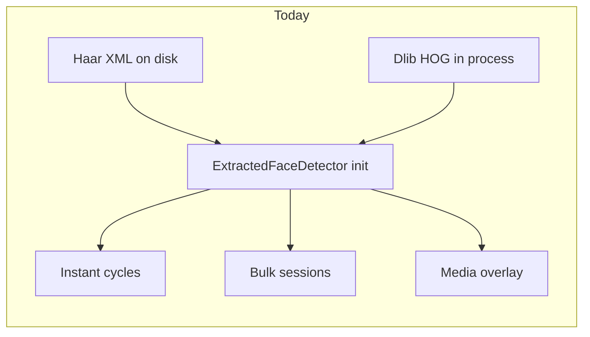
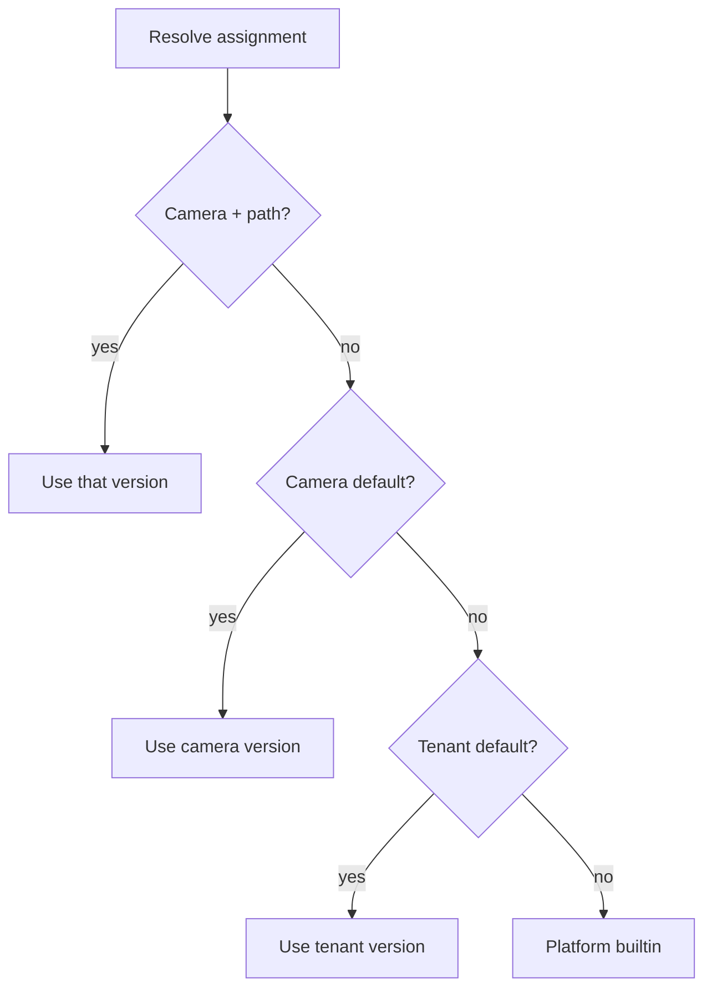
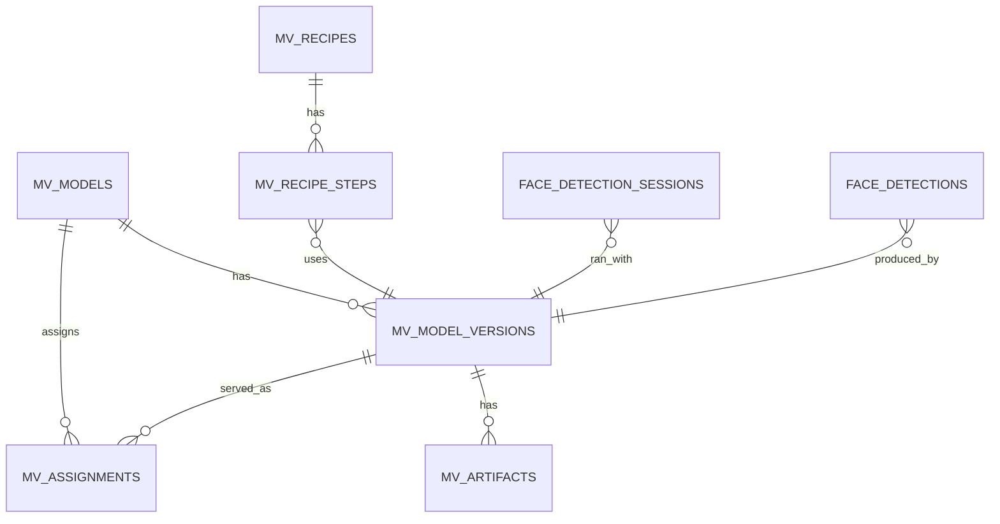

# Detection Model Lifecycle

**Scope:** Platform model registry for Vision inference (instant and bulk)  
**Audience:** Developers and integrators  
**Status:** Accepted design  
**Last updated:** September 2026  
**Documentation version:** 1.1

**See also:** [Frame to Analytics Pipeline](frame-to-analytics-pipeline.md) (current baked-in detectors), [Instant-detection module](instant-detection/Instant-detection%20module.md), [AI Vision Pipeline README](README.md), [Body → MVR People Body](body-mvr-people-body.md), [ppl-meta-models implementation plan](../../proposals/mv-models/ppl-meta-models-implementation-plan.md).

---

## Table of Contents

1. [Executive summary](#1-executive-summary)
2. [Current state](#2-current-state)
3. [Goals and non-goals](#3-goals-and-non-goals)
4. [Model as a first-class object](#4-model-as-a-first-class-object)
5. [Lifecycle states](#5-lifecycle-states)
6. [Assignment scopes and path overrides](#6-assignment-scopes-and-path-overrides)
7. [Face detection models](#7-face-detection-models)
8. [Other machine-vision capabilities](#8-other-machine-vision-capabilities)
9. [Runtime loading and hot-swap](#9-runtime-loading-and-hot-swap)
10. [Provenance on detections](#10-provenance-on-detections)
11. [Data model](#11-data-model)
12. [API sketch](#12-api-sketch)
13. [Service ownership](#13-service-ownership)
14. [Instant vs bulk behaviour](#14-instant-vs-bulk-behaviour)
15. [Frontend](#15-frontend)
16. [Authority licence features](#16-authority-licence-features)
17. [Operator flow](#17-operator-flow)
18. [Rollout phases](#18-rollout-phases)
19. [Design rules](#19-design-rules)
20. [Closed decisions](#20-closed-decisions)

---

## 1. Executive summary

Today face detection is **baked into services**: Vision loads Haar + Dlib at process start (`two_stage`), Media keeps a second copy for overlays, and confidence thresholds live in code. Camera settings expose a `detection_methods` list, but it is not a registry and production paths hardcode `two_stage`.

The accepted design is a **single model registry** in dedicated service **`ppl-meta-models` (:8013)** with upload / validate / activate / deactivate / archive / delete, used by both **instant** and **bulk** detection. Face detection is the first **capability**. Body detection, licence plates, generic objects, and inspection models reuse the same lifecycle with different adapters and downstream stores.

Instant and bulk continue to share a **default** face model (builtin `two_stage`) so quality stays aligned. Operators may assign **per-path overrides** when latency or accuracy requires it. Identity models (VMeta Facenet512, age, gender) stay out of this catalog.

Training is a later bounded context **inside** `ppl-meta-models` (separate worker/queue). It must not share the serving process that answers resolve/activate.

Implementation sequencing, APIs, schema, frontend, and Authority keys: [ppl-meta-models implementation plan](../../proposals/mv-models/ppl-meta-models-implementation-plan.md).

---

## 2. Current state

Grounded in [frame-to-analytics-pipeline.md](frame-to-analytics-pipeline.md) sections 3, 9, and 10.

| Fact | Implication for lifecycle |
|------|---------------------------|
| Production default is Vision `two_stage` (Haar cascade + Dlib validation) | Builtin `two_stage` is the non-deletable platform fallback |
| Artifacts live on disk: `ppl-meta-vision/models/`, `shared/models/`, `ppl-meta-media/models/face_detection/` | Three copies; registry must be the single source of *which* artifact serves |
| `ExtractedFaceDetector` registers methods at init from whatever files load | Need a loader cache; activate must not require process restart |
| Confidence thresholds are code constants (Haar/Dlib/`two_stage` = 0.5); Orchestrator may pass 0.3 | Thresholds belong on the model version, not in detector source |
| Face records store `method` (e.g. `two_stage_haar_dlib`) | Insufficient for rollback/audit; add `model_id` + `model_version` |
| Instant and bulk share detection quality; they diverge at grouping | Default assignment is shared; path override is explicit |
| Instant: 3 frames / 5 s, Vision semaphore max 2, circuit breakers | Instant cannot activate a `bulk`-class model; hard p95 budget **&lt; ~400 ms/frame** |
| Media `SharedFaceDetector` is a local overlay path | Preview uses `preview` latency class or stays on builtin Haar |
| Camera `detection_methods` JSON (`opencv` / `dlib` / `mtcnn` / `yolo`) | Replace with `assigned_model_id` + path overrides |
| VMeta Facenet512 / age / gender are a separate ML stack | Do not mix into the detection registry |
| Profile flag `enable_object_detection` exists but has no artifact | Wire to a `body_detection` (or generic object) assignment |
| `shape_predictor_68_face_landmarks.dat` loads if present on disk | File presence is not activate; `face_landmarks` is assignment-only |



---

## 3. Goals and non-goals

### Goals

- Operators can **upload, validate, activate, deactivate, archive, and delete** detection models without rebuilding Vision.
- **One registry, many capabilities** — face first; body, plates, objects, inspection later without a second admin.
- Instant and bulk can share a default **or** use independent assignments.
- Every detection records the exact model version that produced it.
- Builtin Haar + Dlib remain a mandatory fallback when an upload fails to load or trips a circuit breaker.
- Sessions and instant cycles are **immutable with respect to model**: a swap applies to the next session / next cycle, not mid-job.
- Catalog lives in **`ppl-meta-models`**; Vision infers; Orchestrator and Cameras resolve.

### Non-goals (this module)

- Training UI/workers in the first coding milestone (later increment of `ppl-meta-models`, separate process from catalog serving).
- Versioning of VMeta Facenet512, age, or gender (identity / attributes catalog later).
- Changing Vision 3-tier vs Orchestrator IoU grouping (those stay path-specific).
- Hot-reloading Media with large GPU models for preview overlays.
- Building Inspect inference (`ppl-meta-inspect`).

---

## 4. Model as a first-class object

A **model version** is a versioned artifact plus a **runtime adapter**. Operators never point a camera at a raw `.xml` or `.onnx`. They assign a named version to a **scope** and **path**.

| Field | Description |
|-------|-------------|
| `model_id` | Stable identity of the logical model (e.g. `face-two-stage-builtin`) |
| `version` | Immutable version string (`1.0.0`, content-addressed suffix allowed) |
| `capability` | Task type: `face_detection`, `body_detection`, `license_plate`, … |
| `origin` | `builtin` (shipped, not deletable) or `user` (uploaded) |
| `runtime` | Adapter: `haar`, `dlib_hog`, `two_stage`, `onnx`, `tensorrt`, … |
| `artifact_uris` | Stored files + SHA-256 |
| `hyperparameters` | Confidence, min size, upsample, etc. (moved out of detector code) |
| `output_schema_version` | Must match what the consumer of that capability expects |
| `latency_class` | `preview` \| `instant` \| `bulk` |
| `compatible_paths` | Which paths may activate this version |
| `status` | Lifecycle state (section 5) |

**Pipeline recipes** (cascades) are first-class too, for multi-stage work such as vehicle → plate crop → OCR. A recipe references ordered model versions; it is assigned like a single model.

---

## 5. Lifecycle states

```text
uploaded → validating → ready → active → deactivated → archived → purged
                ↘ failed
```

`ready` vs `active` is intentional: upload never goes live. Activate is a separate, scoped decision.

| Action | Meaning | Guardrails |
|--------|---------|------------|
| **Upload** | Store weights/config, checksum, runtime type, declared I/O schema | Licence `mv_models_upload`; reject unknown runtime; require SHA-256; size limits; do not load into the detector yet |
| **Validate** | Smoke-run on a golden frame set | Face: count + box IoU vs baseline. Instant-capable models also check p95 **&lt; ~400 ms/frame** (Vision semaphore max 2). Fail → `failed` |
| **Activate** | Serving pointer for a `(capability, scope, path)` | Exactly one active per that tuple unless shadow mode is on. Instant-incompatible `latency_class` → **409**. Plates/inspection require a **per-site** golden set to activate on that site |
| **Deactivate** | Stop new assignments; in-flight work finishes on the old version | Unload only when refcount is 0; fall back to platform builtin |
| **Archive** | Immutable, not assignable; kept for audit and replay | Sessions that recorded this version remain interpretable |
| **Delete / purge** | Remove artifact after retention | **Block** while any detection/session references the version; soft-delete then purge files |

Builtin models (`origin=builtin`) can be deactivated as the *default* but cannot be deleted.

Optional **shadow** mode: run a candidate on a camera or path, persist boxes with `serving=false`, and do **not** feed person-objects / MVR / counters until promoted.

---

## 6. Assignment scopes and path overrides

Resolution order (most specific wins):

1. Camera + path (`instant` / `bulk` / `preview`)
2. Camera (all paths)
3. Tenant / site default
4. Platform default (builtin `two_stage` for `face_detection`)



This preserves “same quality on instant and bulk” as the default, while allowing:

| Path | Typical assignment |
|------|-------------------|
| **Bulk / recording** | Accuracy-first face model; same box schema as today |
| **Instant** | Same default, or a lighter model if Vision is saturated; must pass 400 ms p95 |
| **Preview** | Builtin Haar (or any `preview` latency class) — never a bulk GPU ONNX in Media |

A camera setting string such as `["opencv","dlib","yolo"]` is not the catalog. Replace it with `assigned_model_id` plus optional path overrides.

**Cardinality**

| Capability | Active models per camera |
|------------|--------------------------|
| `face_detection` | One per path (pipeline assumes a single face-box source) |
| `body_detection` + `face_detection` | Both may be active (different capabilities) |
| `license_plate` | Usually a recipe (cascade), not a single blob |
| `face_landmarks` | Independent of face boxes; defaults bulk on, instant/preview off |

---

## 7. Face detection models

### Builtin pack (always present)

| `model_id` | Runtime | Role |
|------------|---------|------|
| `face-haar-builtin` | `haar` | Fallback / preview |
| `face-dlib-builtin` | `dlib_hog` | Optional single-stage |
| `face-two-stage-builtin` | `two_stage` | **Platform default** for instant and bulk |
| `face-landmarks-68-builtin` | Dlib 68-point | `face_landmarks` capability; **assignment-only** |

These wrap today’s `ExtractedFaceDetector` methods and artifacts (`haarcascade_frontalface_default.xml`, Dlib HOG, `shape_predictor_68_face_landmarks.dat`). The 68-point predictor is **shipped** as a builtin artifact. It **runs** only when `face_landmarks` is assigned to a scope + path. File-on-disk must not auto-activate.

Default assignments for landmarks:

- **Bulk:** on (MVR crop / pose / embedding hygiene)
- **Instant:** off (stay under the 400 ms budget)
- **Preview:** off

### Uploaded face models

Allowed only if `output_schema_version` matches the face-box contract used by grouping and VMeta, and the installation has `mv_models_upload`:

- Bounding box `x, y, width, height` (frame pixels)
- `confidence`
- Frame / media / session linkage

Incompatible heads (segmentation masks, keypoints-only) must not write `face_detections`.

### Path rules for face

- **Bulk:** stamp `model_id` / `model_version` / `runtime` on `face_detection_sessions` and every face row. Do not switch mid-session. Activate applies to the **next** Enhanced Logic V2 session. Rematerialize with a new model is an explicit operator re-run, not an implicit side effect.
- **Instant:** resolve at **cycle** start (each 3-frame / 5 s burst). Next cycle picks up activate/deactivate. Activating a version whose `latency_class` / `compatible_paths` does not include `instant` returns **409**. Golden-set p95 must be **&lt; ~400 ms/frame** under Vision semaphore max 2.
- **Circuit breaker:** a failing uploaded model trips Vision OPEN and **falls back to builtin `two_stage`**. Instant cameras must not go blind. If `ppl-meta-models` is down, runtimes use the last cached assignment or platform builtin.
- **Preview:** Media `SharedFaceDetector` either follows a `preview` assignment or stays on builtin Haar. It does not load bulk-class uploads.

---

## 8. Other machine-vision capabilities

Do not fork a second lifecycle. Same registry, different **capability**, adapter, and **downstream object**. Faces continue to own `face_detections` → person objects → individuals → MVR. Other capabilities must not overload those tables. Non-face capabilities require licence `mv_models_custom_capability`.

| Capability | Typical runtime | Downstream | Instant | Bulk |
|------------|-----------------|------------|---------|------|
| `face_detection` | Haar/Dlib, later RetinaFace/ONNX | Existing people pipeline | Required; p95 &lt; ~400 ms | Required; quality-first |
| `face_landmarks` | Dlib 68-point (builtin file, assignment-only) | Crop quality, pose, embedding hygiene | Off by default | On by default |
| `body_detection` | YOLO-person | People counters, heatmaps, occupancy; optional IoU link to `person_object_uuid` | Live occupancy overlay; skip if semaphore busy | Full-video tracks |
| `vehicle_detection` | YOLO | Counts, dwell — not MVR | Optional | Forensic log |
| `license_plate` | Detect + OCR recipe | `plate_readings` / watchlists — **separate identity**, never `mvr_people` | Alerts; OCR every Nth cycle (`storage_multiple` pattern) | Full-video plate log |
| `object_detection` | Generic COCO YOLO | Triggers (“if backpack…”) | Instant-first | Optional |
| `inspection_defect` | Per-line trained (EyeNet Inspect) | Defect records, pass/fail | Edge / instant | Not VMeta people |

Camera profile `enable_object_detection` should mean “this camera has an assigned `body_detection` or `object_detection` model”, not a boolean with no artifact.

Instant extra capabilities are **optional stages** on the existing cycle (Vision → Orchestrator → VMeta). A plate model must not add VMeta people round-trips. Independent circuit breakers per capability: a bad plate OCR must not stop face detection.

### Golden-set ownership

| Capability | Platform golden set | Per-site golden set |
|------------|---------------------|---------------------|
| `face_detection` / generic body/object | **Required** to become `ready` — schema, IoU vs baseline, instant p95 | Optional soak on one camera |
| `license_plate` | **Sanity only** — box schema + OCR charset | **Required to activate on that site** |
| `inspection_defect` | None (or toy demo) | **Required** — that line’s labelled defects |

`ppl-meta-models` owns both kinds: platform goldens as builtin data, site goldens as tenant artifacts with the same retention/PII rules as media.

---

## 9. Runtime loading and hot-swap

`ExtractedFaceDetector` currently loads Haar/Dlib once at init. Replace that with a **loader cache** keyed by `model_version`:

1. Activate updates the serving pointer for a scope — it does not immediately unload the previous version.
2. First inference after activate loads weights into the cache.
3. Previous version stays resident until in-flight bulk sessions and instant cycles release it (refcount = 0).
4. Cap concurrent loaded versions (RAM / GPU).
5. Load failure → log, mark version unhealthy, serve builtin fallback.

Vision is the inference host for authoritative instant and bulk work. Media uses the same loader interface **only** for `preview`-class models, or ignores the registry and uses builtin Haar.

Edge / Inspect runtimes (TensorRT on an industrial PC) subscribe to the same catalog assignments but load artifacts locally; they report health back to the registry.

Training jobs (later) run in a **separate worker pool** of `ppl-meta-models`. They must not share the catalog/resolve process.

---

## 10. Provenance on detections

Do this even before user uploads exist (Phase A). Every face (and later body/plate) record should store:

| Field | Purpose |
|-------|---------|
| `model_id` | Logical model |
| `model_version` | Exact artifact |
| `runtime` | Adapter used |
| `confidence_threshold` | Value actually applied |
| `path` | `instant` \| `bulk` \| `preview` |
| `serving` | `true` unless shadow |

Today’s `method = two_stage_haar_dlib` can remain as a derived/display field. Archive and delete are only safe if versions are on the row. A/B and rematerialize depend on the same fields.

---

## 11. Data model

Catalog lives in **`ppl-meta-models`**. Vision owns load + infer and provenance columns on detection tables.



| Table | Owner | Purpose |
|-------|-------|---------|
| `mv_models` | `ppl-meta-models` | Logical model + capability + origin |
| `mv_model_versions` | `ppl-meta-models` | Immutable version, runtime, schema, latency class, status |
| `mv_artifacts` | `ppl-meta-models` | File URI, checksum, size |
| `mv_recipes` / `mv_recipe_steps` | `ppl-meta-models` | Cascades (vehicle → plate → OCR); Phase C |
| `mv_assignments` / `mv_assignment_history` | `ppl-meta-models` | Scope + path → version or recipe |
| `mv_golden_sets` / `mv_golden_items` / `mv_validation_runs` | `ppl-meta-models` | Platform and per-site validate evidence |
| `face_detection_sessions` + `face_detections` | Vision | Existing tables + provenance columns |
| `object_detections` (new) | Vision | Body / generic objects — **not** `face_detections` |
| `plate_readings` (new) | Vision or dedicated store | Plate identity — **not** `mvr_people` |

---

## 12. API sketch

Catalog API is **`ppl-meta-models`**. Base path `/api/v1/mv-models`. Gateway proxy `/models/{path}`.

| Method | Path | Notes |
|--------|------|-------|
| `POST` | `/api/v1/mv-models` | Create logical model (`capability`, display name) |
| `POST` | `/api/v1/mv-models/{id}/versions` | Upload artifacts (multipart) → `uploaded`; requires `mv_models_upload` |
| `POST` | `/api/v1/mv-models/{id}/versions/{ver}/validate` | Run golden set → `ready` or `failed` |
| `POST` | `/api/v1/mv-models/{id}/versions/{ver}/activate` | Body: `scope`, `path`, optional `shadow`. Instant-incompatible → **409** |
| `POST` | `/api/v1/mv-models/{id}/versions/{ver}/deactivate` | Clears assignment; fallback applies |
| `POST` | `/api/v1/mv-models/{id}/versions/{ver}/archive` | Not assignable |
| `DELETE` | `/api/v1/mv-models/{id}/versions/{ver}` | 409 if detections still reference |
| `GET` | `/api/v1/mv-models/resolve` | Query: camera, path, capability → serving version |
| `GET` | `/api/v1/mv-models/{id}/versions` | List + status |

Vision runtime:

| Method | Path | Notes |
|--------|------|-------|
| `GET` | `/health/models` | Loaded versions, refcounts, last error |
| Existing detect endpoints | `/faces/media/{id}/bulk-process`, instant callers | Persist provenance; do not own the catalog |

Missing `eyenet_mv_models` → **403** on catalog mutations; hide homepage tile. Missing `mv_models_upload` → **403** on upload.

---

## 13. Service ownership

| Concern | Owner |
|---------|-------|
| Artifact storage, checksums, assignment, audit, later training jobs | **`ppl-meta-models` (:8013)** |
| Load, infer, session provenance | **ppl-meta-vision** (authoritative instant + bulk) |
| Preview overlay | **ppl-meta-media** (`preview` class or builtin only) |
| Instant cycle scheduling, semaphores, circuit breakers | **ppl-meta-cameras** — resolve model at cycle start |
| Bulk session create + Enhanced Logic V2 | **ppl-meta-orchestrator** — resolve and stamp session with version |
| People identity (MVR) | **ppl-meta-vmeta** — unchanged; consumes face boxes only |
| Licence feature keys and entitlement | **ppl-meta-authority**; Node caches `authority_licence_features` |
| Models UI | **ppl-meta-frontend** — homepage tile + dedicated screens |

---

## 14. Instant vs bulk behaviour

Extends the pipeline [trigger matrix](frame-to-analytics-pipeline.md#10-appendix-trigger-matrix).

| Trigger | Model resolution | When swap applies | Fallback |
|---------|------------------|-------------------|----------|
| Recording / bulk media | At session create (step 0) | Next session only | Builtin `two_stage` if assigned version missing |
| Instant detection | At each sampling cycle | Next 5 s cycle | Circuit breaker → builtin `two_stage` |
| Media preview / overlay | At stream start or assignment change | Next overlay frame batch | Builtin Haar |
| Person-objects / VMeta | N/A (consumers) | Re-run only if faces re-detected | — |

Grouping, materialize, and MVR do not select models. They consume boxes. If a new face model changes recall, person-object counts and analytics will change — operators should shadow first.

Reuse instant `storage_multiple` for expensive non-face stages (e.g. plate OCR every Nth cycle).

---

## 15. Frontend

Dedicated **Models** product surface — not Settings, not camera-settings-only.

| Surface | Role |
|---------|------|
| Homepage **Models** `_ActionCard` | Entry; visible iff licence `eyenet_mv_models` **and** a manage-models role |
| `/models` | Catalog by capability and status |
| `/models/:id` | Version detail, validate results, instant p95 vs 400 ms |
| `/models/assignments` | Camera / tenant / path matrix |
| `/models/golden-sets` | Platform vs per-site clips |
| Later (same tile) | Training jobs / datasets — not a second homepage entry |
| Camera workflow picker | Consume assignment (`assigned_model_id` + path overrides). Operators do not upload weights here |

Upload CTA visible iff `mv_models_upload`. Presence and Signage tiles are currently ungated; Models is the first tile that **must** hide without a licence.

---

## 16. Authority licence features

| Key | Grants |
|-----|--------|
| `eyenet_mv_models` | Catalog UI, list/resolve, activate builtins |
| `mv_models_upload` | User-origin artifacts (`POST .../versions`) |
| `mv_models_custom_capability` | Non-face capabilities (body / plate / object / inspect adapters) |

Wiring (Phase A): entitlement `licence_features` JSON on Authority; activation payload returns the keys; Node `_cache_authority_state()` writes `installation_info.authority_licence_features` (column exists, unused today); `ppl-meta-models` and frontend consume the cache.

---

## 17. Operator flow

1. Upload artifact + metadata (`uploaded`) — requires `mv_models_upload`.
2. Validate on golden clips: count, IoU vs current production, latency (`ready` or `failed`). Instant-capable versions must meet p95 &lt; ~400 ms/frame.
3. Optional shadow on one camera or instant-only (`serving=false`).
4. Activate on one camera **bulk** path; compare person-object counts / false positives. Plates/inspection need a per-site golden set first.
5. Promote to tenant default; activate **instant** only if `compatible_paths` includes `instant` (else **409**).
6. Deactivate previous version (`ready` or leave assigned elsewhere).
7. Archive after soak. Purge only when no session or detection references remain.

Rollback is **activate previous `model_version`**. Keep last-N assignment history per scope.

---

## 18. Rollout phases

### Phase A — Registry without new weights

Stand up `ppl-meta-models`. Register builtin Haar, Dlib, `two_stage`, and landmarks-68 as versions. Persist provenance on sessions and detections. Activate/deactivate **only among builtins**. Instant and bulk can already choose different builtins (e.g. instant `haar`, bulk `two_stage`). Landmarks default assignments as in section 7. Authority keys + gated Models tile. Camera picker for builtins. Fallback if models is down.

### Phase B — Upload and validate

User ONNX/XML into object storage (`mv_models_upload`). Vision loader cache and hot-swap. Golden-set gate (platform face set includes latency). Shadow mode. Per-camera and per-path assignment. Media preview restricted to builtin or `preview` class.

### Phase C — Extra capabilities

`body_detection` and `license_plate` as capabilities (`mv_models_custom_capability`), new detection tables, recipes for cascades, instant optional stages. Per-site goldens required to activate plates/inspection on a site. Keep `mvr_people` face-only until a separate vehicle/plate identity object exists. Wire `enable_object_detection` to an assignment. Training jobs stay a later increment on the same service, not a second tile.

---

## 19. Design rules

1. **One registry, many capabilities** — do not ship a face-only admin and copy it later.
2. **Activate is scoped** — a global “this ONNX is now all cameras, both paths” must not be the only option.
3. **Sessions are immutable wrt model** — mid-job switches wait for the next session or cycle.
4. **Builtin fallback is mandatory** — instant circuit breaker and bulk jobs still run if an upload fails to load or models is unreachable.
5. **Schema compatibility is a field** — a body YOLO must not write `face_detections`.
6. **Identity models stay separate** — Facenet512 / age / gender are a later catalog; swapping them rewrites MVR meaning.
7. **Delete is retention** — archive is the normal end of life; purge only after references are gone.
8. **Shadow before serving** — candidates that feed person-objects or MVR must have passed validate (and preferably a soak).
9. **Catalog is `ppl-meta-models`; inference is Vision** — Orchestrator does not store weights.
10. **Training must not share the serving process** — resolve/activate stay small and always-on.

---

## 20. Closed decisions

Former open questions, locked September 2026:

| Topic | Decision |
|-------|----------|
| Catalog owner | Dedicated **`ppl-meta-models` (:8013)**. Not Orchestrator. Training later is a second bounded context in the same service (separate worker/queue). |
| Infer vs catalog | Vision (`:8003`) loads and infers for instant and bulk. Media overlay uses `preview` class or builtin Haar. Orchestrator and Cameras **resolve** assignments; they do not store weights. |
| Instant latency | Hard budget **p95 &lt; ~400 ms/frame** under Vision semaphore max 2. Instant-incompatible `latency_class` → activate **409**. |
| Licence | Tenant uploads and the Models product surface are Authority-gated: `eyenet_mv_models`, `mv_models_upload`, `mv_models_custom_capability`. |
| Golden sets | Hybrid. Platform set required for contract + IoU + instant p95 (face/body/generic). Per-site set **required to activate on that site** for plates and inspection. Platform plate set is sanity-only (schema/charset). |
| `face_landmarks` | Assignment-only. Ship the 68-point file as builtin; file-on-disk must not auto-run. Defaults: **bulk on**, **instant off**, **preview off**. |
| Frontend | Dedicated screens + homepage **Models** tile (licence + role). Camera workflow keeps an assignment picker only. Do not bury in Settings. |

---

## Document history

| Version | Date | Changes |
|---------|------|---------|
| 1.0 | September 2026 | Initial proposal: face + multi-capability model lifecycle for instant and bulk |
| 1.1 | September 2026 | Accepted design: `ppl-meta-models`, licence keys, golden-set split, landmarks assignment, frontend tile; closed former open questions; link to implementation plan |
