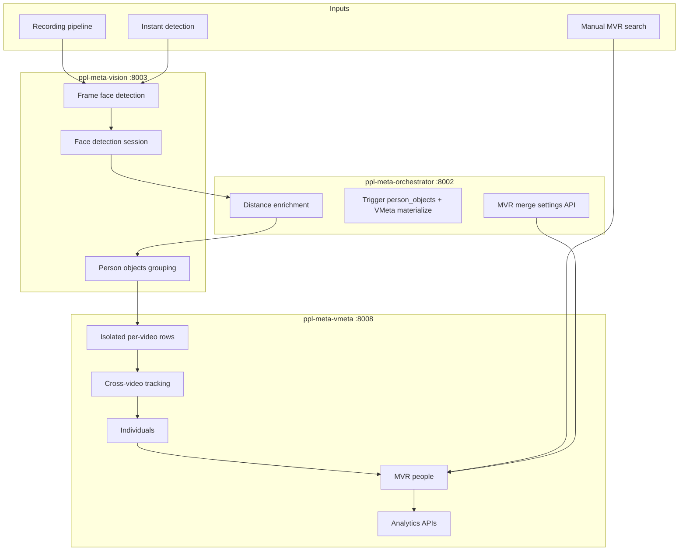
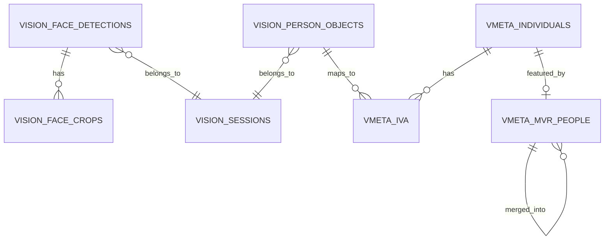

# Frame to Analytics Pipeline

**Scope:** Cross-service AI vision pipeline  
**Audience:** Developers and integrators  
**Status:** Production  
**Last updated:** September 2026  
**Documentation version:** 1.0

---

## Table of Contents

1. [Executive summary](#1-executive-summary)
2. [Pipeline stages](#2-pipeline-stages)
3. [Face detection models and methods](#3-face-detection-models-and-methods)
4. [Person object aggregation](#4-person-object-aggregation-single-video)
5. [VMeta materialization and cross-video individuals](#5-vmeta-materialization-and-cross-video-individuals)
6. [MVR object lifecycle](#6-mvr-object-lifecycle)
7. [Analytics and reporting](#7-analytics-and-reporting)
8. [Data model reference](#8-data-model-reference)
9. [Configuration and operations](#9-configuration-and-operations)
10. [Appendix: trigger matrix](#10-appendix-trigger-matrix)
11. [Known issues and limitations](#11-known-issues-and-limitations)

**See also:** [AI Vision Pipeline README](README.md) for glossary and doc index. Managed detectors (accepted design): [Detection Model Lifecycle](detection-model-lifecycle.md). Implementation: [ppl-meta-models implementation plan](../../proposals/mv-models/ppl-meta-models-implementation-plan.md).

---

## 1. Executive summary

The AI vision pipeline turns raw video frames into stable, searchable people records and analytics. At a high level:

1. **Detect faces** in sampled frames (Vision service, Haar + Dlib two-stage by default).
2. **Group faces into person objects** within a single video (Vision 3-tier cascade, or Orchestrator IoU for instant paths).
3. **Materialize VMeta rows** from persisted person objects (tracking sessions, isolated appearances).
4. **Link videos into individuals** via cross-video tracking (VMeta).
5. **Create and maintain MVR people** — canonical biometric records with Facenet512 embeddings and demographics.
6. **Expose analytics** — demographics, routes, heatmaps, people counters, instant-detection dashboards.

### Entry paths

| Path | Trigger | Primary doc |
|------|---------|-------------|
| **Recording / bulk media** | Media upload, camera recording stop, orchestrator Enhanced Logic V2 | This document (sections 2–7) |
| **Instant detection** | Camera eye-button, 3 frames / 5 s sampling | [Instant-detection module.md](instant-detection/Instant-detection%20module.md) |
| **Manual analysis** | MVR search by videos, merge, cross-video analysis UI | [mvr-merge-module.md](MVR%20merge/mvr-merge-module.md) |

Both recording and instant paths share the same **detection quality** (Vision two-stage). They diverge mainly at **grouping** and **how quickly** data reaches VMeta analytics.

### Architecture overview



---

## 2. Pipeline stages

The **recording path** is coordinated by Orchestrator **Enhanced Logic V2** in [ppl-meta-orchestrator/src/face_detection_endpoints.py](../../../ppl-meta-orchestrator/src/face_detection_endpoints.py).

### Stage table

| Step | Stage | Owner | Persisted output | Ephemeral |
|------|-------|-------|------------------|-----------|
| 0 | Create face detection session | Vision (via Orchestrator) | `face_detection_sessions` | — |
| 1.0 | Frame sampling + face detection | Vision | `face_detections`, `face_crops` | — |
| 1.0b | Distance / center enrichment | Orchestrator | Fields on face records | — |
| 1.5 | Person objects grouping | Vision | `person_objects`, workflow state | Tier-3 embeddings (in-memory only) |
| 1.6 | Session completion | Vision | Session status | — |
| 1.7 | VMeta materialization | VMeta | Isolated rows, `tracking_sessions`, appearances | — |
| 1.8 | Cross-video batch enqueue | Orchestrator | In-memory queue only* | — |
| — | Cross-video tracking | VMeta | `individuals`, `individual_video_appearances` | — |
| — | MVR create / match / merge | VMeta | `mvr_people`, merge hierarchy | — |
| — | Analytics | VMeta (+ proxies) | Aggregated query results | — |

\* **Current limitation:** Step 1.8 enqueues to `PersonObjectsQueue` in the Orchestrator, but there is **no in-repo consumer** for that queue. Continuous cross-video processing is handled separately by VMeta's `BatchEventHandler` / `BatchMonitor` (see section 5).

### Step-by-step (recording path)

#### Step 0 — Session creation

Orchestrator calls Vision to create a `session_uuid` for the media item. Person objects workflow requires this session record.

#### Step 1.0 — Face detection

Orchestrator checks Vision for stored faces (`GET /faces/media/{media_id}`). If none exist, it calls Vision bulk/real-time detection with frame sampling (`frame_interval`, default 10). Results are stored under the session.

**Key files:**
- [ppl-meta-orchestrator/src/face_detection_endpoints.py](../../../ppl-meta-orchestrator/src/face_detection_endpoints.py) — `enhanced_logic_v2_session_based`
- [ppl-meta-vision/src/main.py](../../../ppl-meta-vision/src/main.py) — `/faces/media/{id}/bulk-process`, `/process/media`
- [ppl-meta-vision/src/media_processor.py](../../../ppl-meta-vision/src/media_processor.py)

#### Step 1.0b — Distance enrichment

Stored or fresh faces are passed through `enhance_face_detections_with_distance()` to add center coordinates and distance estimates used downstream.

**Key file:** [ppl-meta-vision/src/distance_calculator.py](../../../ppl-meta-vision/src/distance_calculator.py)

#### Step 1.5 — Person objects

Orchestrator triggers Vision person-objects workflow in **in-memory mode** (`start-from-faces`), passing enhanced face detections directly to avoid DB timing issues.

**Endpoint:** Vision `POST /api/v1/person-objects/workflow/start-from-faces`  
**Key files:**
- [ppl-meta-vision/src/person_objects/ppl_thread_workflow.py](../../../ppl-meta-vision/src/person_objects/ppl_thread_workflow.py)
- [ppl-meta-vision/src/person_objects/person_objects_api.py](../../../ppl-meta-vision/src/person_objects/person_objects_api.py)

#### Step 1.6 — Session completion

Orchestrator marks the Vision face-detection session complete with total face count.

#### Step 1.7 — VMeta materialization

Orchestrator posts persisted person objects to VMeta:

`POST /api/v1/mvr-people/materialize/persisted-person-objects`

Payload: `media_uuid`, `session_uuid`, `person_objects[]`.

**Key files:**
- [ppl-meta-orchestrator/src/face_detection_endpoints.py](../../../ppl-meta-orchestrator/src/face_detection_endpoints.py) — `_materialize_vmeta_from_persisted_person_objects`
- [ppl-meta-vmeta/src/api/routes/mvr_people.py](../../../ppl-meta-vmeta/src/api/routes/mvr_people.py) — `materialize_persisted_person_objects`

#### Step 1.8 — Cross-video enqueue (Orchestrator)

Person objects are pushed to `PersonObjectsQueue` for intended batch cross-video processing. See [known limitations](#118-orchestrator-personobjectsqueue).

#### Cross-video tracking and MVR (VMeta)

After materialization, VMeta's batch pipeline and cross-video algorithms link person objects across videos into **individuals**, then create **MVR people** records. Covered in sections 5–6.

---

## 3. Face detection models and methods

Detectors are **baked into Vision/Media** today (this section). Accepted registry design (upload / activate / deactivate / archive / delete, instant vs bulk assignment, later body/plate models): [detection-model-lifecycle.md](detection-model-lifecycle.md). Implementation: [ppl-meta-models implementation plan](../../proposals/mv-models/ppl-meta-models-implementation-plan.md).

### Production default: two-stage (Haar + Dlib)

The default production method is **`two_stage`**: Haar cascade proposes candidate regions; Dlib validates them. This is used by Vision for bulk/recording processing and is the quality baseline for instant detection.

**Implementation:**
- [ppl-meta-vision/src/extracted_face_detector.py](../../../ppl-meta-vision/src/extracted_face_detector.py) — `ExtractedFaceDetector`
- [shared/face_detection/shared_face_detector.py](../../../shared/face_detection/shared_face_detector.py) — `SharedFaceDetector` (embedded in Media)

**Model artifacts:**

| Artifact | Location |
|----------|----------|
| Haar cascade | `ppl-meta-vision/models/haarcascade_frontalface_default.xml` |
| Dlib frontal detector | Loaded via `dlib` at runtime |
| Shape predictor (optional) | `shape_predictor_68_face_landmarks.dat` (if present) |

Shared copy also under `shared/models/` and `ppl-meta-media/models/face_detection/`.

### Available detection methods

`ExtractedFaceDetector` registers methods at init based on what loads successfully:

| Method | Description |
|--------|-------------|
| `haar` | OpenCV Haar cascade |
| `dlib` | Dlib HOG frontal face detector |
| `two_stage` | Haar candidates + Dlib validation (requires both) |

`detect_faces_multi_method()` can run multiple methods; production paths typically call `two_stage` explicitly.

### Confidence thresholds

Thresholds are **code constants** in `ExtractedFaceDetector.config`, not environment variables:

```python
"confidence_thresholds": {
    "haar": 0.5,
    "dlib": 0.5,
    "two_stage": 0.5,
}
```

Orchestrator face-detection requests may pass `confidence_threshold` (default 0.3) at the API layer.

### Frame and session data

Each face record typically includes:

- `face_detection_id`, `session_uuid`, `media_id` / `video_uuid`
- `frame_number`, bounding box (`x`, `y`, `width`, `height`)
- `confidence`, `method` (e.g. `two_stage_haar_dlib`)
- Optional crop reference in `face_crops`
- After enrichment: center coordinates, distance estimates

**Schema / migrations:**
- [ppl-meta-vision/src/database_postgres.py](../../../ppl-meta-vision/src/database_postgres.py)
- [ppl-meta-vision/migrations/001_session_based_face_detection_schema.sql](../../../ppl-meta-vision/migrations/001_session_based_face_detection_schema.sql)

### Media embedded detection path

For streaming overlays, Media can detect faces locally without a Vision round-trip:

[ppl-meta-media/src/services/face_detection_service.py](../../../ppl-meta-media/src/services/face_detection_service.py) → `SharedFaceDetector`

Use this path for low-latency preview; the recording pipeline uses Vision for authoritative session storage.

### Two embedding paths (do not conflate)

| Path | Model | Persisted? | Purpose |
|------|-------|------------|---------|
| Vision Tier-3 grouping | FaceNet512 via DeepFace (lazy, in-memory) | **No** | Disambiguate person tracks during single-video grouping |
| VMeta MVR processing | Facenet512 via `mvr_processor` | **Yes** (`mvr_people.face_embedding`) | Identity, search, merge, analytics |

Vision Tier-3 is wired in [ppl-meta-vision/src/person_objects/ppl_thread_workflow.py](../../../ppl-meta-vision/src/person_objects/ppl_thread_workflow.py) via `_build_embedding_extractor()`.

---

## 4. Person object aggregation (single-video)

Person objects group frame-level face detections into one person per video. This is **not** cross-video identity; that happens later in VMeta.

**Deep dive:** [Person Objects module.md](person%20objects/Person%20Objects%20module.md)

### Vision path (recording pipeline default)

**Controller:** `PPLThreadWorkflowController`  
**Engine:** `VisionFaceGroupingEngine` — three-tier discrimination cascade:

1. **Tier 1** — Size-proportional position tolerance (replaces legacy fixed % tolerance).
2. **Tier 2** — Velocity vector filter (auto-activates when motion is meaningful; time-normalized px/ms).
3. **Tier 3** — Ephemeral FaceNet512 embedding similarity (auto-activates when embeddings available).

**Entry modes:**

| Mode | How triggered | Data source |
|------|---------------|-------------|
| Session-based | `POST /workflow/start` | Faces loaded from Vision DB for session |
| In-memory (`start-from-faces`) | Orchestrator after Enhanced Logic V2 | Face array in request body |
| Auto-trigger | Orchestrator step 1.5 | Same as in-memory |

**Quality:** `PersonQualityAnalyzer` selects best-face per person object when enabled.

**Persistence:** Vision PostgreSQL tables (`person_objects`, workflow tables) — see Person Objects module doc.

### Orchestrator IoU path (instant / fallback)

Instant detection and some Orchestrator PPL Thread flows use **rectangle overlap grouping** (Union-Find + IoU threshold 0.3), not the Vision 3-tier cascade.

**Key file:** [ppl-meta-orchestrator/src/ppl_thread_endpoints.py](../../../ppl-meta-orchestrator/src/ppl_thread_endpoints.py)

- `_group_faces_by_rectangle_overlap()`
- `grouping_algorithm: "rectangle_overlap_detection"`

Instant detection may persist results directly to VMeta when `storage_multiple` allows — see [Instant-detection module.md](instant-detection/Instant-detection%20module.md).

### When each path is used

| Context | Grouping engine | Persisted as Vision `person_objects`? |
|---------|-----------------|--------------------------------------|
| Recording / Enhanced Logic V2 | Vision 3-tier | Yes |
| Instant detection (typical) | Orchestrator IoU | Configurable; may write VMeta directly |
| PPL Thread regroup from stored objects | Orchestrator IoU on flattened route data | Uses stored person objects as input |

---

## 5. VMeta materialization and cross-video individuals

### Materialization (step 1.7)

`POST /api/v1/mvr-people/materialize/persisted-person-objects` accepts Orchestrator's in-memory person object payload and creates **isolated single-media VMeta rows** without widening `search/by-videos` responsibilities.

Effects include:

- `tracking_sessions` for the media/session
- Per-video appearance records linked to `person_object_uuid`
- Foundation rows for later individual linking

**Key implementation:** `_materialize_single_media_from_persisted_person_objects` in [ppl-meta-vmeta/src/api/routes/mvr_people.py](../../../ppl-meta-vmeta/src/api/routes/mvr_people.py)

Also used by instant-detection storage: [ppl-meta-vmeta/src/api/v1/instant_detection_storage.py](../../../ppl-meta-vmeta/src/api/v1/instant_detection_storage.py)

### Cross-video tracking

Cross-video identity links person objects from different videos into one **individual**.

**Core algorithm:** [ppl-meta-vmeta/src/algorithms/core_algorithm.py](../../../ppl-meta-vmeta/src/algorithms/core_algorithm.py)  
**Supporting modules:** `cross_video_overlap.py`, `video_sequencing.py`, `individual_creator.py`  
**API:** [ppl-meta-vmeta/src/api/v1/cross_video_tracking_simple.py](../../../ppl-meta-vmeta/src/api/v1/cross_video_tracking_simple.py)

Conceptual flow:

1. Compare isolated per-video appearances (overlap, sequencing, embedding similarity).
2. Create or update `individuals`.
3. Write `individual_video_appearances` linking `individual_uuid` ↔ `person_object_uuid` ↔ `video_uuid`.

### Continuous batch processing (VMeta)

Unlike Orchestrator's in-memory queue, VMeta runs a **continuous batch pipeline**:

- [ppl-meta-vmeta/src/services/batch_event_handler.py](../../../ppl-meta-vmeta/src/services/batch_event_handler.py) — subscribes to face-detection completion and recording-stop events
- [ppl-meta-vmeta/src/services/batch_monitor.py](../../../ppl-meta-vmeta/src/services/batch_monitor.py) — accumulates videos per collection until batch threshold, triggers cross-video tracking

This is the **implemented** path for automatic cross-video processing after recording.

### UUID relationships


- One video → many person objects
- One individual → many video appearances (cross-video)
- One individual → typically one MVR at auto-creation (`featured_individual_uuid`)

---

## 6. MVR object lifecycle

**MVR (Machine Vision Representation)** is the canonical biometric record used for search, merge, and analytics.

### Creation from individual

`MVRService.create_mvr_people_from_individual()` in [ppl-meta-vmeta/src/services/mvr_service.py](../../../ppl-meta-vmeta/src/services/mvr_service.py):

1. Fetch person objects for the individual (or use supplied list).
2. Select best-quality person object (`select_best_quality_object`).
3. Run ML stack via `mvr_processor` → Facenet512 embedding, age, gender.
4. Insert `mvr_people` row and `individual_mvr_mapping`.

**ML stack:** [ppl-meta-vmeta/src/ml/mvr_processor.py](../../../ppl-meta-vmeta/src/ml/mvr_processor.py) → `facenet_processor.py`, `age_estimator.py`, `gender_classifier.py`

**Background auto-create:** [ppl-meta-vmeta/src/background/mvr_background_processor.py](../../../ppl-meta-vmeta/src/background/mvr_background_processor.py)

### Match and merge

| Mechanism | File | Notes |
|-----------|------|-------|
| Similarity matching | [mvr_matcher.py](../../../ppl-meta-vmeta/src/services/mvr_matcher.py) | Embedding cosine similarity |
| Hierarchical merge | [hierarchical_mvr_merger.py](../../../ppl-meta-vmeta/src/services/hierarchical_mvr_merger.py) | Search-result and manual merge |
| Default threshold | [settings.py](../../../ppl-meta-vmeta/src/config/settings.py) | `MVR_MERGE_SIMILARITY_THRESHOLD` default **0.60** |

**Orchestrator merge settings** (frontend source of truth for merge rule/threshold in UI):

- `GET/PUT /api/v1/settings/workflow/mvr-merge`
- Defaults: `merge_rule=none`, `merge_threshold=0.70` (UI/orchestrator layer; VMeta auto-merge uses its own default unless overridden)

See [mvr-merge-module.md](MVR%20merge/mvr-merge-module.md) for search-driven merge UX.

### Merge hierarchy

When MVRs merge:

- **Winner** remains the active root (super-individual).
- **Losers** set `merged_into_mvr_uuid` and `is_orphaned=true`.
- Analytics and group membership must use **root UUIDs**, not orphaned children.

### Search and analysis

- `POST /api/v1/mvr-people/search/by-videos` — find existing MVRs for video set
- Persisted merge sessions — `search/by-videos/persisted-merge-session`
- Cross-video analysis screen loads hierarchy-aware aggregates when `hierarchical_merge_applied=true`

### Individual Groups (downstream)

Named collections of known individuals built on MVR data. See [individual-groups/individual-groups.md](individual-groups/individual-groups.md).

**Caveat:** Preview-only merged MVRs cannot be durably added to groups; only persisted winner UUIDs work — [merged-mvr-group-assignment-fact-finding-2026-05-08.md](individual-groups/merged-mvr-group-assignment-fact-finding-2026-05-08.md).

---

## 7. Analytics and reporting

Analytics consume **MVR people** and related VMeta tables. The correct aggregation layer matters for data integrity (see section 11).

### VMeta analytics endpoints

**Router:** [ppl-meta-vmeta/src/api/v1/analytics.py](../../../ppl-meta-vmeta/src/api/v1/analytics.py)

| Endpoint | Purpose |
|----------|---------|
| `GET /demographics` | Gender and age distribution for MVR people in time range |
| `POST /person-routes` | Person movement route analytics |
| `GET /heatmap` | Spatial heatmap generation |
| Camera demographics search | Multi-camera windowed demographics |

### Instant detection analytics

[ppl-meta-vmeta/src/api/v1/instant_detection_analytics.py](../../../ppl-meta-vmeta/src/api/v1/instant_detection_analytics.py)

Approximate people counts and demographics from instant-detection sessions. Dashboard exposes a **Data Source** filter (recording vs instant).

### People counters (Orchestrator)

[ppl-meta-orchestrator/src/api/people_counters_endpoints.py](../../../ppl-meta-orchestrator/src/api/people_counters_endpoints.py)  
[ppl-meta-orchestrator/src/people_counters_worker.py](../../../ppl-meta-orchestrator/src/people_counters_worker.py)

Automated counter evaluation against MVR/search data.

### Media proxy

Frontend and Media may reach VMeta analytics via [ppl-meta-media/src/api/v1/vmeta_proxy.py](../../../ppl-meta-media/src/api/v1/vmeta_proxy.py).

### Vision session analytics

[ppl-meta-vision/src/analytics_service.py](../../../ppl-meta-vision/src/analytics_service.py) — session-level face/person statistics within Vision (pre-MVR).

### What analytics reads

| Report type | Typical source | Risk if wrong layer used |
|-------------|----------------|--------------------------|
| Demographics breakdown | Active `mvr_people` roots in time window | Gender skew if orphaned/merged children included |
| Cross-video analysis | Merged hierarchy or direct MVR UUIDs | Placeholder stats if frontend mixes mock data |
| Instant dashboard | Instant sessions + optional MVR store | Differs from recording aggregates |
| Attendance / counters | MVR search + merge settings | See gender contamination issue doc |

---

## 8. Data model reference

### Service database boundaries



### Vision tables (representative)

| Table | Purpose |
|-------|---------|
| `face_detection_sessions` | Session metadata per media processing run |
| `face_detections` | Per-frame face records |
| `face_crops` | Stored crop images for quality/embedding |
| `person_objects` | Single-video person groups |
| Person objects workflow tables | Workflow state, statistics |

### VMeta tables (representative)

| Table | Purpose |
|-------|---------|
| `tracking_sessions` | Time-bounded detection/materialization sessions |
| `individuals` | Cross-video identity |
| `individual_video_appearances` | Links individual ↔ person_object ↔ video |
| `mvr_people` | Canonical biometric records |
| `individual_mvr_mapping` | Individual ↔ MVR 1:1 mapping |

### Identity flow (one person, one video → analytics)

```
frame → face_detection_id
      → person_object_uuid (Vision grouping)
      → individual_uuid (cross-video)
      → mvr_people_uuid (biometric canonical record)
      → analytics aggregates
```

---

## 9. Configuration and operations

### Key environment variables (VMeta)

| Variable | Default | Purpose |
|----------|---------|---------|
| `EMBEDDING_MODEL` | `Facenet512` | MVR embedding model |
| `MVR_MERGE_SIMILARITY_THRESHOLD` | `0.60` | Auto-merge similarity gate |
| `SIMILARITY_THRESHOLD` | `0.8` | General vector search |
| `VMETA_PORT` | `8008` | Service port |

Source: [ppl-meta-vmeta/src/config/settings.py](../../../ppl-meta-vmeta/src/config/settings.py)

### Merge settings ownership

| Setting | Owner | Endpoint |
|---------|-------|----------|
| `merge_rule`, `merge_threshold` (UI) | Orchestrator | `/api/v1/settings/workflow/mvr-merge` |
| `MVR_MERGE_SIMILARITY_THRESHOLD` (auto-merge) | VMeta | Env / `VmetaSettings` |

### Service ports (local dev)

| Service | Port |
|---------|------|
| Media | 8000 |
| Orchestrator | 8002 |
| Vision | 8003 |
| VMeta | 8008 |

### Operational pointers

- **Rematerialize / repair:** VMeta materialize endpoint; orchestrator scripts for workflow re-trigger
- **Cache invalidation:** Materialize invalidates MVR search cache for affected `video_uuids`
- **Health checks:** `/health` on each service
- **Debugging pipeline:** Trace `session_uuid` from Orchestrator logs through Vision → VMeta materialize response

---

## 10. Appendix: trigger matrix

| Trigger | Detection | Grouping | Materialize | Cross-video | Analytics source |
|---------|-----------|----------|-------------|-------------|------------------|
| Recording / bulk media | Vision `two_stage` | Vision 3-tier cascade | Yes (step 1.7) | VMeta `BatchEventHandler` | VMeta demographics + counters |
| Instant detection | Vision `two_stage` | Orchestrator IoU (typical) | Configurable (`storage_multiple`) | Optional / batched | Instant analytics + MVR store |
| Manual MVR search | N/A | N/A | N/A | N/A | Search/merge session → cross-video analysis |
| Person objects manual API | Existing faces | Vision 3-tier or session | Caller-dependent | Caller-dependent | — |

---

## 11. Known issues and limitations

### 11.1 Orchestrator PersonObjectsQueue

Enhanced Logic V2 step 1.8 enqueues person objects to `PersonObjectsQueue` in the Orchestrator. **No consumer processes this queue in the current codebase.** Cross-video tracking instead relies on VMeta's `BatchEventHandler` / `BatchMonitor` subscribing to completion events.

Planned direction (from code comments): VMeta should own batch accumulation and automatic cross-video triggers. See section 5.

### 11.2 Embedding contamination

Multi-face crops fed to FaceNet produce incorrect embeddings and false high-similarity merges.

**Doc:** [EMBEDDING_CONTAMINATION.md](MVR%20merge/EMBEDDING_CONTAMINATION.md)

### 11.3 Gender contamination in attendance analytics

Aggregating demographics from active `mvr_people` roots without respecting merge hierarchy can skew gender breakdowns.

**Doc:** [ATTENDANCE_MVR_GENDER_CONTAMINATION_ISSUE.md](MVR%20merge/ATTENDANCE_MVR_GENDER_CONTAMINATION_ISSUE.md)

### 11.4 Cross-video statistics tab integrity

The Cross-video Statistics tab may mix real backend fields with frontend placeholder aggregates.

**Doc:** [CROSS_VIDEO_STATISTICS_TAB_DATA_INTEGRITY_ISSUE.md](MVR%20merge/CROSS_VIDEO_STATISTICS_TAB_DATA_INTEGRITY_ISSUE.md)

### 11.5 Single-video demographics at merge time

Proposal to persist demographics at the person-object layer for merge guardrails — partially implemented.

**Doc:** [SINGLE_VIDEO_PERSON_OBJECT_DEMOGRAPHICS_PROPOSAL.md](MVR%20merge/SINGLE_VIDEO_PERSON_OBJECT_DEMOGRAPHICS_PROPOSAL.md)

### 11.6 MVR search persistence

Proposal for durable search-result sessions and reuse of merge-enabled search output.

**Doc:** [MVR_SEARCH_PERSISTENCE_UPGRADE_PROPOSAL.md](MVR%20merge/MVR_SEARCH_PERSISTENCE_UPGRADE_PROPOSAL.md)

### 11.7 Merged MVR group assignment

Preview-only merged MVRs cannot be added to Individual Groups durably.

**Doc:** [merged-mvr-group-assignment-fact-finding-2026-05-08.md](individual-groups/merged-mvr-group-assignment-fact-finding-2026-05-08.md)

### 11.8 Dual grouping and dual embedding paths

Operators and developers must not assume:

- All grouping uses Vision 3-tier (instant uses IoU).
- All embeddings are persisted (Vision Tier-3 is ephemeral).
- Orchestrator enqueue equals cross-video completion (use VMeta batch pipeline).

These distinctions are summarized in sections 3, 4, and 5 of this document.

---

## Document history

| Version | Date | Changes |
|---------|------|---------|
| 1.0 | September 2026 | Initial end-to-end pipeline guide; replaces missing `continuous-individuals-and-mvr-pipeline.md` references |
