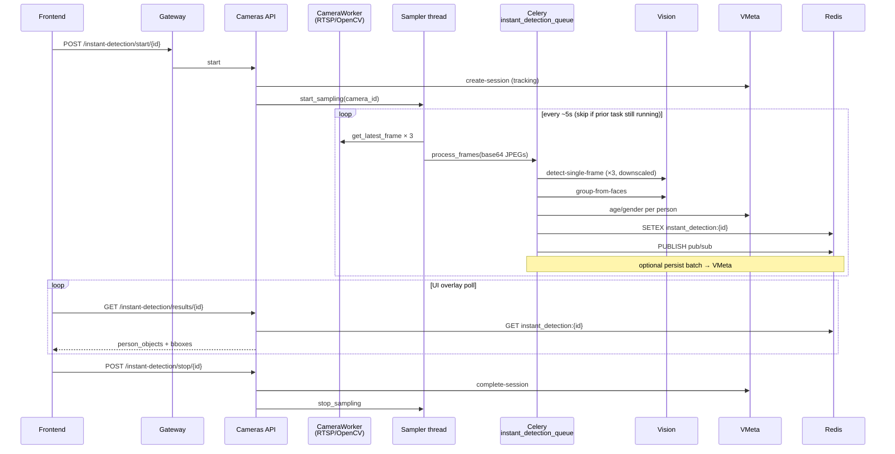
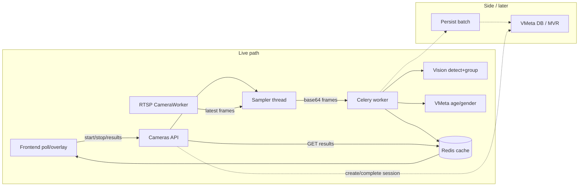

# Instant Detection — Event Path

**Last updated:** September 16, 2026  
**Related:** [Instant-detection module.md](Instant-detection%20module.md)  
**Status:** Operational walkthrough (Lima / production stack)

Instant detection is a **live, memory-first loop**: sample frames from the connected camera worker → Celery → Vision/VMeta → Redis cache → frontend poll/overlay. Persistence to the database is optional and batched later.

---

## High-level sequence

---

## Step-by-step event path

### 1. Preconditions

- Camera is **connected** (RTSP worker open, e.g. Tapo `CameraWorker`).
- Stream is running so the worker keeps a latest-frame buffer.
- Flags:
  - `instant_detection_enabled` and/or `auto_face_detection` (face path)
  - `processing_options.auto_body_detection` for body (needs ONNX; some cameras skip body if runtime is dlib landmarks)

### 2. Start — `POST /api/v1/instant-detection/start/{camera_id}`

In `ppl-meta-cameras` API (`src/api/v1/endpoints/instant_detection.py`):

1. Load camera from DB.
2. Create a **tracking session** in VMeta (`create-session`) with the internal service token.
3. Call `InstantDetectionSampler.start_sampling(camera_id)` — spawns a **background sampler thread** per camera.

Frontend entry: `CameraService.startInstantDetection()` → that POST.

### 3. Sampler loop (cameras process, not Celery)

`InstantDetectionSampler._sample_loop` (`src/services/instant_detection.py`):

1. Confirm queue worker is still `connected`.
2. Capture **3 frames** from the worker buffer (~0 / 0.5 / 1.0s spacing).
3. If a prior Celery task for this camera is still `PENDING` / `STARTED` / `RETRY` / `RECEIVED`, **skip** submit (avoids soft-limit pileups on slow high-res cameras).
4. JPEG + base64 encode → `process_instant_detection.delay(...)` on `instant_detection_queue`.
5. Sleep until next `sampling_interval` (~5s).
6. Every N cycles (`storage_multiple`), queue a **persist** batch for VMeta.

### 4. Celery worker — `instant_detection.process_frames`

`src/tasks/instant_detection_tasks.py` → `process_instant_detection`:

1. Decode frames.
2. Run `_process_frames_sync` → async `_process_3_frames`.

Inside `_process_3_frames` (when face enabled):

1. **Vision** `POST /faces/detect-single-frame` per frame  
   - High-res (e.g. Tapo 2560×1440) is **downscaled to ≤1280px width** (`INSTANT_VISION_MAX_WIDTH`); bboxes are scaled back to full-res for overlay.
2. **Vision** `group-from-faces` → `person_objects`.
3. **VMeta** age/gender on best face per person.
4. Optional body / object / vehicle paths (flag + model dependent).
5. Build result: people count, demographics, bboxes, etc.

Then Celery:

- `SETEX instant_detection:{camera_id}` (TTL 5 minutes)
- Redis **pub/sub** publish
- Optional webhook
- Soft / hard time limits: **100s / 120s** (older deploys used 25s soft limit, which timed out Tapo full-res cycles)

### 5. Frontend consumes results

`GET /api/v1/instant-detection/results/{camera_id}`:

- Reads Redis key first (Celery and API are different processes).
- Returns **404** until the first successful cache write (early polls often 404).
- UI polls and draws boxes on the live stream from `person_objects` / face bboxes.

### 6. Stop — `POST /api/v1/instant-detection/stop/{camera_id}`

1. VMeta `complete-session` (internal service auth).
2. Stop sampler thread.
3. Results key expires or is overwritten/cleared.

### 7. Persistence (side path, not the live overlay)

On storage cycles, face/body payloads go into a Redis batch → Celery flush → VMeta persist. Live UI does **not** wait on DB; it uses the Redis cache.

---

## Component diagram

---

## Key code locations

| Stage | Path |
|-------|------|
| Start / stop / results API | `ppl-meta-cameras/src/api/v1/endpoints/instant_detection.py` |
| Sampler + Vision/VMeta calls | `ppl-meta-cameras/src/services/instant_detection.py` |
| Celery task + Redis cache write | `ppl-meta-cameras/src/tasks/instant_detection_tasks.py` |
| Camera worker frames | `ppl-meta-cameras/src/services/camera_worker.py`, `camera_service_queue.py` |
| Frontend start/results | `ppl-meta-frontend/lib/core/services/camera_service.dart` |
| VMeta session APIs | `ppl-meta-vmeta/src/api/v1/instant_detection_storage.py` |

---

## Operational notes (Tapo / high-res RTSP)

| Symptom | Typical cause |
|---------|----------------|
| Results always 404 | Celery not finishing / soft time limit; or detection never started |
| `auto_face_detection OFF` in Celery logs | Face path skipped; enable `auto_face_detection` or rely on `instant_detection_enabled` OR in current sampler |
| SoftTimeLimitExceeded (~25s) | Old task limits; deploy tasks with soft=100 / hard=120 |
| Connect “fails” then succeeds | RTSP open ~20–35s; connect poll timeout must be ≥45s for RTSP |
| Body path skipped (`dlib_68 not ONNX`) | Body YOLO not assigned; face overlay still works |
| Complete-session 401 | VMeta endpoint must accept internal service token (`get_current_user_or_internal_service`) |

**Successful Tapo cycle means:** connect + stream → worker frames → start → sampler submit → Celery finishes within limit → Redis cache populated → results GET 200 with `person_objects` → overlay drawn.

---

## Per-camera detection interval

Each camera stores `instant_detection_interval_seconds` (pipeline settings, 1–60, default 5).

On **start**, that value becomes the sampler's per-camera cycle period (`CameraSamplerState.sampling_interval`). Saving pipeline settings **hot-updates** a running sampler.

It controls how often a new 3-frame cycle is *attempted*, including sleeps used by the in-flight guard — not Vision time per frame.
