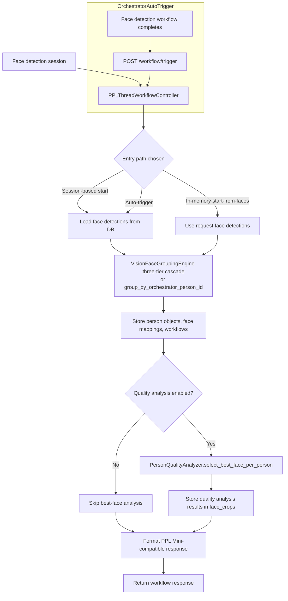

# Person Objects Module

**Service**: `ppl-meta-vision`  
**Module**: `person_objects`  
**Module Version**: 2.4  
**Last Updated**: August 12, 2026  
**Documentation Version**: 2.25.52  
**Status**: Production  
**Primary Purpose**: Group face detections from a single video into person objects, store the results, and expose them through a PPL Meta Mini-compatible API.

**v2.0 Update**: This revision realigns the module documentation with the current implemented codebase. It documents the new in-memory (`from-faces`) processing path, the Orchestrator-driven auto-trigger flow, the expanded 11-endpoint API surface, the three-phase implementation structure, the four-table database schema, and the `person_uuid`/`person_object_uuid` integration fields introduced for downstream vmeta/orchestrator consumption.

**v2.1 Update**: Introduces the **three-tier discrimination cascade** in the face grouping engine. It replaces the legacy percentage-of-position tolerance with a size-proportional tolerance (Tier 1), and adds two discriminators — a velocity vector filter (Tier 2) to disambiguate crossing paths and an embedding similarity gate (Tier 3) to separate visually distinct people moving together. The base grouping behavior is preserved for backward compatibility.

**v2.2 Update**: Makes Tier 2 and Tier 3 **self-regulating and on by default**. Tier 2 auto-activates only when the velocity magnitude indicates meaningful motion, and its velocity is time-normalized (px/ms) so a single global threshold works across cameras with different frame rates and detection intervals. Tier 3 auto-activates only when face embeddings are present, so it is a no-op until embeddings are available. Neither tier requires per-camera configuration in the frontend — the cascade self-regulates.

**v2.3 Update**: Adds **lazy, in-memory embedding extraction** for Tier 3. The engine accepts an optional `embedding_extractor` callable and produces embeddings only for tracks (at creation) and for faces that pass Tier 1 and Tier 2 — not for every detection. Embeddings are cached in memory for the engine's lifetime and never written to the database, eliminating DB connections, blocking I/O, and schema changes. Extraction failures degrade gracefully to a no-op.
**v2.4 Update**: **Wires the Tier 3 extractor into the workflow controller.** `PPLThreadWorkflowController` now builds a lazy, in-memory FaceNet512-based `embedding_extractor` and passes it to the grouping engine. It prefers an in-memory crop supplied on each face record (from-faces path) and otherwise loads the crop from the `face_crops` table by `face_detection_id`, caching per face. The extractor returns `None` (Tier 3 no-op) if numpy/DeepFace is unavailable. Confirmed timestamps: the session-based (DB) path includes `created_at` on every face, so Tier 2 uses real time; the in-memory `from-faces` path relies on the frame-delta fallback unless callers include `created_at`.

---

## Table of Contents

1. [Overview](#overview)
2. [Architecture](#architecture)
3. [Workflow](#workflow)
4. [Grouping Algorithms](#grouping-algorithms)
5. [API Reference](#api-reference)
6. [Data Model](#data-model)
7. [Database Schema](#database-schema)
8. [Configuration](#configuration)
9. [Outputs](#outputs)
10. [Operational Notes](#operational-notes)

---

## Overview

The Person Objects module is the single-video person grouping layer in the Vision service. It takes face detections from a session, groups them into person objects, performs optional quality analysis, stores the results in the Vision database, and returns a response shaped for downstream consumers that expect PPL Meta Mini-style person-object payloads.

The module is implemented across three phases, all owned by the Vision service:

- **Phase 1 — Database schema**: PostgreSQL tables for person objects storage via [person_objects_migrations.py](../../../ppl-meta-vision/src/database/person_objects_migrations.py).
- **Phase 2 — Core algorithms**: `VisionFaceGroupingEngine` (three-tier discrimination cascade: size-proportional tolerance, optional velocity and embedding discriminators) and `PersonQualityAnalyzer` (quality scoring and best-face selection).
- **Phase 3 — Workflow orchestration & API**: `PPLThreadWorkflowController` and the `PersonObjects` FastAPI router that expose the workflow to callers.

The module can be driven two ways:

1. **Session-based** — Workflow reads face detections already stored in the Vision database for a face detection session.
2. **In-memory (`from-faces`)** — The caller sends face detections directly in the request body, bypassing the database read and allowing immediate grouping of freshly detected faces.

It is the step that turns per-frame face detections into stable per-person objects within one video. It is not the cross-video MVR merge layer; MVR merge happens later in the vmeta search and analysis flow.

### Key responsibilities

- Group face detections into person objects for a single video session
- Preserve a PPL Meta Mini-compatible response shape
- Support both orchestrator-provided `person_id` grouping and local three-tier cascade tracking
- Accept in-memory face detections for immediate grouping (`start-from-faces`)
- Auto-trigger processing after a face detection workflow completes
- Select a best-quality face per person when quality analysis is enabled
- Persist workflow state and results in the Vision database
- Expose workflow, session, summary, statistics, cleanup, and health endpoints for integration

---
## Architecture

### Main components

| Component | File | Role |
|---|---|---|
| Workflow controller | [ppl_thread_workflow.py](../../../ppl-meta-vision/src/person_objects/ppl_thread_workflow.py) | Orchestrates the full single-video person-objects workflow |
| Grouping engine | [face_grouping_engine.py](../../../ppl-meta-vision/src/person_objects/face_grouping_engine.py) | Implements the face-to-person grouping logic via the three-tier cascade (size tolerance, optional velocity and embedding discriminators) |
| Quality analyzer | [quality_analyzer.py](../../../ppl-meta-vision/src/person_objects/quality_analyzer.py) | Selects best-quality faces and computes quality summaries |
| API router | [person_objects_api.py](../../../ppl-meta-vision/src/person_objects/person_objects_api.py) | Exposes the workflow and retrieval endpoints |
| Module exports | [\_\_init\_\_.py](../../../ppl-meta-vision/src/person_objects/__init__.py) | Re-exports `VisionFaceGroupingEngine`, `PersonQualityAnalyzer`, `PPLThreadWorkflowController` |
| Database migration | [person_objects_migrations.py](../../../ppl-meta-vision/src/database/person_objects_migrations.py) | Creates the person-objects PostgreSQL schema and indexes |

---

## Workflow

The workflow controller runs the pipeline in a fixed order:

1. Validate the session (or accept in-memory faces) and create a workflow record.
2. Load the face detections for the session — or use the faces passed in-memory.
3. Group detections into person objects.
4. Store the resulting person objects, face mappings, and workflow rows.
5. Run quality analysis if enabled.
6. Persist the quality analysis output.
7. Mark the workflow complete.
8. Return a PPL Meta Mini-compatible response.

### Workflow entry points

| Path | Trigger | Input source |
|---|---|---|
| `start_person_objects_workflow` | Direct `POST /workflows/start` | Session UUID → detections read from the DB |
| `start_person_objects_workflow_from_faces` | `POST /workflows/start-from-faces` | Face detections supplied in the request body |
| `trigger_person_objects_workflow_for_media` | `POST /workflow/trigger` | Called by the Orchestrator when a face detection workflow completes |

### Legacy session support

When a session-based workflow targets media that already has face detections but no session row yet, the controller can create a session on demand via `create_session_for_legacy_media`. It also resolves a session UUID from a media UUID when needed (`find_session_uuid_by_media_uuid`).

---

## Grouping Algorithms

### Grouping decision

The workflow chooses one of two grouping strategies:

- **Orchestrator `person_id` grouping** — If the upstream detections already carry a `person_id`, the engine preserves that grouping so the person objects stay aligned with the orchestrator's identity.
- **Local three-tier cascade** — Otherwise the engine groups by the size-proportional tolerance cascade (Tier 1), with optional velocity (Tier 2) and embedding (Tier 3) discriminators.

### Local grouping — three-tier discrimination cascade

When there is no upstream `person_id`, the engine groups faces through a configurable **three-tier cascade** in [face_grouping_engine.py](../../../ppl-meta-vision/src/person_objects/face_grouping_engine.py):

**Tier 1 — Position tolerance (size-proportional).** A face is matched to a track when it falls within a tolerance of the track's position. The tolerance is proportional to the face's bounding-box size:

- `tolerance = max(bbox_width, bbox_height) * size_tolerance_factor` (default `0.5`)
- A face is within tolerance when `|x1 - x2| <= tolerance` and `|y1 - y2| <= tolerance`
- A weighted combined distance metric (`x * 0.3 + y * 0.3 + euclidean * 0.4`) picks the best candidate

This removes the positional dependency of the old formula (`x_tolerance = x1 * tolerance_percent`), which grew unreasonably with distance from the image origin. When no bbox is available, it falls back to the legacy percentage-of-position tolerance (`x1 * tolerance_percent`, default `20.0%`).

**Tier 2 — Velocity vector discrimination (self-activating, on by default).** A positionally-close face is rejected if it is inconsistent with where the track's smoothed velocity (exponential moving average, `alpha = 0.3`) projects its current position. This disambiguates two people crossing paths even when they momentarily occupy the same pixels:

- `predicted = current_position + velocity * dt`
- Reject when `distance(actual, predicted) > effective_bbox_size * velocity_inconsistency_factor`
- Velocity is **time-normalized** (px/ms using the `created_at` timestamps already on every face), so one global threshold works across cameras with different frame rates and detection intervals (USB, mobile, RTSP, edge). Timestamps are present on the session-based (DB) path; the in-memory `from-faces` path falls back to a frame-delta heuristic unless callers include `created_at`.
- **Self-activating**: velocity discrimination only engages when the track's velocity magnitude exceeds `velocity_activation_threshold` (default `0`, meaning always active when there is any motion). Stationary tracks (velocity ≈ 0) are never rejected, so it is safe to leave on by default.
- Velocity becomes active after `min_frames_for_velocity` (default `2`) frames of history
- A minimum bbox-size floor guards against over-rejecting when no bbox is present

**Tier 3 — Embedding similarity gate (self-gating, on by default).** When both the face and the track carry a face embedding, a positionally-close and velocity-consistent candidate is rejected if its embedding is dissimilar (cosine similarity below `embedding_similarity_threshold`, default `0.6`). This separates two people who are moving together (same velocity) but visually distinct.

Embeddings are produced **lazily and entirely in-memory**, bound to the engine instance's lifetime:

- The engine accepts an optional `embedding_extractor` callable (`embedding_extractor(face_record) -> List[float]`) injected at construction. The `PPLThreadWorkflowController` builds and injects a FaceNet512-based extractor that prefers an in-memory crop on each face record (from-faces path) and otherwise loads the crop from the `face_crops` table by `face_detection_id`, caching per face.
- A track's reference embedding is extracted once at track creation (one call per person).
- A face's embedding is extracted **only when it passes Tier 1 and Tier 2** — i.e. only for the rare genuinely-ambiguous faces, not for every detection.
- Results are cached in-memory per face id and garbage-collected when the engine is destroyed (or reset between sessions). **No database writes, no new tables, no blocking I/O** — the workflow is finite, so the embeddings live only as long as the grouping run.
- Without an extractor (or if extraction fails, e.g. numpy/DeepFace unavailable), Tier 3 silently degrades to a no-op and grouping is unaffected.

Frames are processed chronologically. Position data is derived from bbox center points when only bbox corners are available.

### Grouping statistics

The engine reports:

- `total_faces` and `total_persons`
- `tracked_faces` and `new_faces`
- `frames_processed` and `merge_operations`
- `grouping_efficiency` — `((total_faces - total_persons) / total_faces) * 100`, clamped to `0–100`
- `tolerance_percent` and `algorithm` used
- `tier1_position_matched`, `tier2_velocity_rejected`, `tier3_embedding_rejected` — cascade counters
- `discrimination` — the active cascade configuration (size factor, velocity/gate enabled flags)

---

## API Reference

All endpoints are served under the router prefix `/api/v1/person-objects`. The router is defined in [person_objects_api.py](../../../ppl-meta-vision/src/person_objects/person_objects_api.py).

| Method | Path | Description |
|---|---|---|
| POST | `/workflows/start` | Start a workflow from an existing face detection session |
| POST | `/workflows/start-from-faces` | Start a workflow from in-memory face detections |
| POST | `/workflow/trigger` | Auto-trigger after a face detection workflow completes |
| GET | `/{media_id}` | Get a compact person-objects summary for a media UUID |
| GET | `/sessions/{session_uuid}` | Get full person objects for a session |
| GET | `/workflows/{workflow_id}/status` | Get workflow status |
| GET | `/sessions/{session_uuid}/statistics` | Get detailed session statistics |
| GET | `/sessions/{session_uuid}/summary` | Get a lightweight session summary/status |
| GET | `/media/{media_uuid}/session` | Resolve a session UUID from a media UUID |
| DELETE | `/sessions/{session_uuid}` | Delete person objects, mappings, and workflows for a session |
| GET | `/health` | Health check |

### `POST /workflows/start`

Body (`PersonObjectsWorkflowRequest`):

- `session_uuid` (required)
- optional `tolerance_percent` (`5.0–50.0`)
- optional `enable_quality_analysis` (default `true`)
- optional `enable_age_detection` (default `true`, future enhancement)
- optional `workflow_metadata`

### `POST /workflows/start-from-faces`

Body (`PersonObjectsFromFacesRequest`) accepts the same optional parameters plus an array of face detection objects with fields such as:

- `id`
- `frame_number`
- `bbox_x1`, `bbox_y1`, `bbox_x2`, `bbox_y2`
- `confidence`

Each face may also include `position_x`/`position_y` (or bbox corners), `sharpness`, `exposure`, `contrast`, `noise`, and `size` metrics for quality analysis.

---

## Data Model

The module uses a set of Pydantic request/response models defined in [person_objects_api.py](../../../ppl-meta-vision/src/person_objects/person_objects_api.py).

### Request models

| Model | Purpose |
|---|---|
| `PersonObjectsWorkflowRequest` | Session-based workflow start parameters |
| `PersonObjectsFromFacesRequest` | In-memory workflow start parameters with embedded face detections |

### Main response shapes

| Model | Purpose |
|---|---|
| `GroupTrackingItem` | Per-person grouping record in PPL Mini-compatible format |
| `BestQualityFace` | Best face candidate for a person |
| `ClassifiedFace` | Face-to-person mapping record |
| `PersonObjectsSummary` | Compact summary for media-level display |
| `PersonObjectsWorkflowResponse` | Full workflow response |
| `WorkflowStatusResponse` | Workflow status/state reporting |
| `SessionStatisticsResponse` | Detailed per-session processing statistics |

---

## Database Schema

The schema is created by [person_objects_migrations.py](../../../ppl-meta-vision/src/database/person_objects_migrations.py) and consists of four tables:

| Table | Purpose |
|---|---|
| `person_objects` | Main person entity storage; `person_id` UUID primary key with generated UUIDs |
| `person_face_mappings` | Face-to-person relationship mapping (referential integrity to person objects) |
| `person_workflows` | Workflow execution tracking (`workflow_id`, `session_uuid`, status, input face count, tolerance, processing method, metadata) |
| `face_crops` | Face image data for quality analysis and best-face crops |

The migration also creates supporting indexes for performance and tracks migration completion in a migration-status table so it runs idempotently (`CREATE TABLE IF NOT EXISTS`).

### Stored concepts

The workflow persists or derives these values:

- `person_objects`
- `face_mappings`
- `quality_results`
- `grouping_statistics`
- `workflow_status`

The controller also maintains workflow records in the `person_workflows` table (status `processing` → `completed`/`failed`) for status tracking. Deletion is ordered to preserve referential integrity (`person_face_mappings` → `person_objects` → `person_workflows`).

---

## Configuration

### Orchestrator integration

If the caller does not pass `tolerance_percent`, the workflow fetches the value from orchestrator:

- `GET /api/v1/settings/workflow/velocity-sensitivity`

The Vision controller caches this value (`_velocity_sensitivity_cache`) for a short interval to avoid repeated calls during the same workflow session.

### Auto-trigger

The Orchestrator calls `POST /api/v1/person-objects/workflow/trigger` once a face detection pipeline completes, so person-object grouping runs automatically without a separate UI cue.

### Default behavior

- Default tolerance: `20.0` (percentage fallback when no bbox is present)
- Default size tolerance factor (Tier 1): `0.5`
- Default max processing window: `30` minutes (`max_processing_time_minutes`)
- Batch size: `100`
- Velocity discrimination (Tier 2): on by default, self-activating on motion (`velocity_activation_threshold = 0`, time-normalized px/ms)
- Embedding gate (Tier 3): on by default, self-gating on missing embeddings (`embedding_gate_enabled = True`); uses an optional in-memory `embedding_extractor` when provided

### Quality scoring

The quality analyzer uses weighted component scores and thresholds:

- Weights: sharpness `0.35`, exposure `0.25`, contrast `0.20`, noise `0.10`, size `0.10`
- Thresholds: minimum score `0.3`, good quality `0.6`, excellent quality `0.8`
- Size preferences: minimum `50×50`, optimal `200×200` pixels

### Legacy support

The controller can create a session for legacy media that already has face detections but no session row yet. It also resolves a session UUID from media UUID when needed.

---

## Outputs

The module returns PPL Meta Mini-compatible structures that include:

- workflow metadata
- session UUID
- person objects (each carrying a DB-minted `person_uuid` and `person_object_uuid` for orchestrator/vmeta integration)
- face mappings
- summary statistics
- best-quality face information when enabled

Typical output details include:

- total faces processed
- total persons created
- tracking algorithm used
- tolerance percent used
- grouping efficiency
- cascade counters (`tier1_position_matched`, `tier2_velocity_rejected`, `tier3_embedding_rejected`)
- first/last seen frames

---

## Operational Notes

### What this module does well

- Keeps single-video grouping local and deterministic
- Fixes the positional dependency of the original tolerance formula via size-proportional matching (Tier 1)
- Disambiguates crossing paths with a self-activating velocity filter (Tier 2, on by default)
- Separates visually distinct people moving together with a self-gating embedding gate (Tier 3, on by default)
- Preserves upstream `person_id` grouping when available
- Supports both session-based and in-memory (`from-faces`) processing
- Runs automatically via the Orchestrator trigger after face detection
- Produces stable person objects for downstream display and storage
- Separates grouping from cross-video MVR merge

### What it does not do

- It does not perform cross-video MVR consolidation
- It does not replace the later vmeta merge/search flow
- It does not assume every run has age or gender evidence (`enable_age_detection` is flagged as a future enhancement)

### Related modules

- [MVR Merge Module](../MVR%20merge/mvr-merge-module.md)
- [Single-Video Person-Object Demographics Proposal](../MVR%20merge/SINGLE_VIDEO_PERSON_OBJECT_DEMOGRAPHICS_PROPOSAL.md)

---

## Summary

The Person Objects module is the Vision service's single-video grouping layer. It turns face detections into person objects — whether those detections come from the database after a detection session or are supplied in-memory — stores the results, and returns a response that other services and screens can consume. It auto-triggers after face detection completes, exposes an 11-endpoint API for integration and cleanup, and persists to a dedicated four-table PostgreSQL schema. The workflow is intentionally separate from MVR merge: person objects are created first, and cross-video MVR consolidation happens later.

