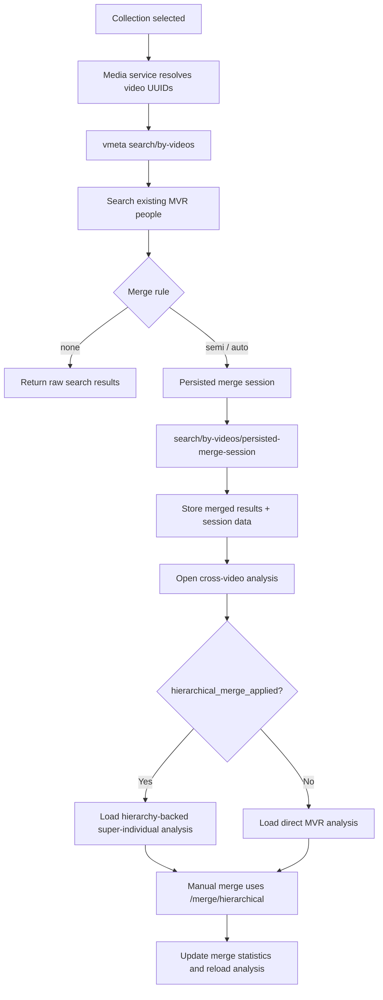

# MVR Merge Module

## Latest Update (2026-04-03)

This module was updated to align with the current implemented behavior in frontend, vmeta, and orchestrator.

### Behavior Deltas

1. Merge settings are backend-owned (headless source of truth).
   - Orchestrator exposes GET and PUT at /api/v1/settings/workflow/mvr-merge.
   - Frontend reads and writes merge rule and threshold through this endpoint.

2. Default merge settings are standardized.
   - merge_rule default is semi.
   - merge_threshold default is 0.70.

3. Local persistence for merge rule/threshold was removed from frontend general settings storage.
   - These two fields are intentionally excluded from SharedPreferences writes.
   - Backward-compatible parsing remains for older local settings payloads.

4. Auto-merge safety now includes confidence-aware cross-gender guardrails.
   - High-confidence conflicting male/female pairs are blocked during automatic edge creation.
   - Confidence gate is 0.80 in current implementation.

5. Documentation sections that previously described guardrails as recommendations were rewritten to describe the implemented state.

## Purpose

This document analyzes the MVR merge functionality that operates on the results of an MVR search, especially the workflow used by the cross-video analysis experience after searching existing MVR people.

The focus is the current search-result-driven merge flow:
- search existing MVR people for a set of videos
- optionally merge duplicate MVR people into super-individuals
- navigate into the cross-video individual analysis screen using those super-individual UUIDs
- load hierarchy-aware aggregated analysis from the merged result

It also includes the latest merge-related work currently reflected in the repo:
- hierarchical merge endpoint usage from the collections screen
- hierarchy-aware loading in the cross-video analysis screen
- manual merge of selected MVR results inside the analysis screen
- propagation of merge statistics through `sessionData`
- backend-owned MVR merge settings (`merge_rule`, `merge_threshold`) exposed by orchestrator

## Flowchart

## High-Level Flow

1. The user selects a collection and time range.
2. The frontend queries the media service for videos in that collection.
3. The frontend sends those video UUIDs to the vmeta MVR search endpoint.
4. vmeta returns existing MVR people already linked to individuals and appearances.
5. The frontend stores the raw MVR search results in `sessionData`.
6. The user can run hierarchical merge on those search results.
7. The merge endpoint groups similar MVR people, picks winners, and orphans losers into super-individuals.
8. The frontend navigates to the cross-video analysis screen using the resulting super-individual UUIDs.
9. The analysis screen detects `hierarchical_merge_applied == true` and loads hierarchy data for each super-individual.
10. The UI renders merged people as a single aggregated analysis card instead of many duplicate cards.

## Main Frontend Entry Points

Relevant frontend files:
- `ppl-meta-frontend/lib/screens/collections_screen.dart`
- `ppl-meta-frontend/lib/screens/person_objects_detail_screen.dart`
- `ppl-meta-frontend/lib/services/media_api_client.dart`

Relevant backend files:
- `ppl-meta-vmeta/src/api/routes/mvr_people.py`
- `ppl-meta-vmeta/src/services/hierarchical_mvr_merger.py`
- `ppl-meta-vmeta/src/database/mvr_repository.py`

Merge settings files:
- `ppl-meta-orchestrator/src/api/workflow_settings_endpoints.py`
- `ppl-meta-orchestrator/src/services/workflow_settings_service.py`
- `ppl-meta-orchestrator/migrations/versions/f19a0d4c2b11_add_mvr_merge_settings_defaults.py`
- `ppl-meta-frontend/lib/providers/settings_providers.dart`

## Current Merge Settings (Headless Source of Truth)

MVR merge settings are now backend-authoritative and managed by orchestrator.
The same endpoint also returns `stored_comparison_enabled`, which the frontend keeps backend-owned alongside merge rule and threshold.

Endpoint:
- `GET /api/v1/settings/workflow/mvr-merge`
- `PUT /api/v1/settings/workflow/mvr-merge`

Backend setting keys:
- `mvr_merge_rule`
   - encoded as numeric setting value in orchestrator:
      - `0` -> `none`
      - `1` -> `semi`
      - `2` -> `auto`
- `mvr_merge_threshold`

Current defaults:
- `merge_rule = semi`
- `merge_threshold = 0.70`
- `stored_comparison_enabled = false`

Validation/range constraints:
- threshold min `0.30`
- threshold max `0.95`

Frontend behavior in headless mode:
- frontend loads merge rule, threshold, and stored-comparison flag from orchestrator during settings load
- frontend updates these backend-owned fields by calling orchestrator `PUT /mvr-merge`
- frontend intentionally does **not** persist these fields in local SharedPreferences
- local settings parsing remains backward-compatible when merge keys are absent

## Search Phase

### Frontend: collection search to video UUID search

The current flow in `collections_screen.dart` does not use the deprecated collection-based MVR search endpoint for the main experience.

Instead it does:

1. `mediaApiClient.searchMedia(...)`
   - fetches all videos in the selected collection within the selected date range
2. `mediaApiClient.searchMVRPeopleByVideos(...)`
   - posts those video UUIDs to `/api/v1/mvr-people/search/by-videos`

This is the current preferred architecture because collection filtering belongs to the media service, while vmeta owns MVR and individual appearance data.

### Frontend request shape

`MediaApiClient.searchMVRPeopleByVideos(...)` sends:
- `video_uuids`
- `limit`
- optional `start_time`
- optional `end_time`

Important detail:
- the current frontend does not send `auto_merge=true` in this request
- search returns existing MVR results first
- merge is triggered later as an explicit follow-up action in the UI

### Backend search endpoint

The main endpoint is:
- `POST /api/v1/mvr-people/search/by-videos`

Defined in:
- `ppl-meta-vmeta/src/api/routes/mvr_people.py`

Its purpose is to search existing MVR people detected in specific videos and return aggregated MVR-person results.

## Search Endpoint Behavior

### What the backend actually queries

The search endpoint:
1. receives a list of `video_uuids`
2. queries `individual_video_appearances` to find all `individual_uuid` values present in those videos
3. uses `individual_mvr_mapping` to find the linked `mvr_people_uuid` values
4. filters out orphaned MVR people
5. for each MVR person, expands its hierarchy if it is already a super-individual
6. fetches all linked individuals and all appearances for those individuals in the provided videos
7. returns one `MVRPersonResult` per MVR person

### Important timestamp behavior

For `search/by-videos`, the backend explicitly does not use `start_time` and `end_time` to filter `individual_video_appearances` rows.

Reason given in code:
- `video_uuids` are the authoritative filter
- media service timestamps refer to video creation windows
- appearance timestamps are within-video timestamps in a different domain
- mixing those timestamp domains would be incorrect

So the search endpoint uses video UUID scope, not appearance-time filtering, for the appearance query.

### Existing hierarchy awareness during search

Even before a new merge is performed, the search endpoint already understands existing MVR hierarchy.

For each MVR record it:
- checks `mvr_merge_hierarchy` for merged children
- sets `is_super_individual`
- collects `merged_mvr_uuids`
- queries all linked individuals for the parent plus merged children
- aggregates all appearances from those linked individuals

That means search results are hierarchy-aware and can already return pre-merged super-individuals as consolidated results.

## Search Result Payload

Each MVR result contains data such as:
- `mvr_people_uuid`
- `individual_uuids`
- `total_appearances`
- `unique_videos`
- `first_seen`
- `last_seen`
- `quality_score`
- `confidence_score`
- `appearances`
- `merged_mvr_uuids`
- `is_super_individual`
- demographics such as age and gender when available

The response also includes `search_parameters`, such as:
- `video_uuids`
- `video_count`
- `start_time`
- `end_time`
- `limit`
- `auto_merge`
- `similarity_threshold`

## Caching Behavior

`search/by-videos` uses cache when possible.

Important rule in the endpoint:
- cache is used only when `force_refresh == false` and `auto_merge == false`

This matters because merging changes hierarchy state, so merge-related reads must bypass stale cached results.

After a successful non-auto-merge search response is built, the backend stores the search result in cache for reuse.

## Merge Phase

There are two merge-related modes in the current codebase.

### 1. Automatic merge inside the search endpoint

The backend search endpoint supports:
- `auto_merge=true`

If enabled and if more than one MVR result exists, the endpoint:
1. creates a `HierarchicalMVRMerger`
2. merges the returned MVR UUIDs
3. recursively re-runs `search_mvr_people_by_videos(...)` with:
   - `force_refresh=True`
   - `auto_merge=False`
4. returns fresh, post-merge results

This is supported server-side today.

### 2. Explicit merge after search in the frontend

The collection flow does not merge on the initial `/search/by-videos` request.
Instead it promotes the search results into a persisted merge session.

This flow is implemented in:
- `ppl-meta-frontend/lib/screens/collections_screen.dart`
- `ppl-meta-frontend/lib/services/media_api_client.dart`

It:
1. reads `_trackingSessionData['search_results']`
2. extracts the current video and camera UUIDs plus the active date window
3. calls `searchPersistedMergedMVRPeopleByVideos(...)`
4. hits `/api/v1/mvr-people/search/by-videos/persisted-merge-session`
5. reads back `search_session_uuid` plus the merged `mvr_people` payload
6. stores the merged results, merge statistics, and persisted session UUID in `sessionData`
7. navigates to the cross-video analysis screen using the merged UUIDs

This is the most visible part of the latest MVR merge work in the frontend.

### Rule-driven behavior in explicit frontend merge

The explicit merge action in the collection flow is now rule-aware:
- if merge rule is `none`, the frontend skips hierarchical merge and navigates with search results
- if merge rule is `semi` or `auto`, the frontend executes hierarchical merge and propagates merge stats

Threshold source:
- default threshold is `0.70`
- effective threshold is read from backend merge settings (`mvr_merge_threshold`)

## Hierarchical Merge Endpoint

The hierarchical merge endpoint is:
- `POST /api/v1/mvr-people/merge/hierarchical`

Defined in:
- `ppl-meta-vmeta/src/api/routes/mvr_people.py`

Request body:
- `mvr_uuids`
- `similarity_threshold`
- `min_similarity_check`

Response contains:
- `super_individuals`
- `merge_groups`
- `statistics`

### What the endpoint does

The route handler itself is thin. It:
- validates input size
- initializes `HierarchicalMVRMerger`
- delegates the merge to `merge_hierarchical(...)`

The core logic lives in:
- `ppl-meta-vmeta/src/services/hierarchical_mvr_merger.py`

## Hierarchical Merger Algorithm

The merger service performs four main steps.

### 1. Fetch candidate MVR people

`_fetch_mvr_people(...)` loads:
- `mvr_people_uuid`
- `face_embedding`
- `quality_score`
- `confidence_score`
- `featured_individual_uuid`
- age/gender fields

Only non-orphaned MVR people are considered.

### 2. Calculate similarity matrix

`_calculate_similarity_matrix(...)` computes pairwise cosine similarity between embeddings.

Behavior:
- uses a sparse matrix representation
- skips pairs below `min_similarity_check`
- stores similarities in both directions for easy lookup

This is an optimization so low-similarity pairs do not pollute the later grouping step.

### 3. Find merge groups

`_find_merge_groups(...)` uses a Union-Find structure to find connected components of similar MVR people.

Grouping rule:
- if similarity between two MVR people is greater than or equal to the merge threshold, they are unioned into the same group

After grouping:
- each group is sorted by `quality_score DESC`
- groups are then sorted by size, then winner quality

### 4. Merge each group

`_merge_group(...)` handles each connected component.

Rules:
- the highest-quality MVR person is the winner
- all others become losers
- losers are orphaned into the winner
- demographics are chosen from the best available member in the group

The returned metadata includes:
- `super_individual_uuid`
- `merged_mvr_uuids`
- `mvr_count`
- `winner_quality`
- per-loser similarity to the winner
- selected demographics

## Repository Persistence During Merge

Hierarchy persistence is handled in the repository layer.

The key write used by the hierarchical merger is:
- `MVRRepository.bulk_orphan_mvr_people(...)`

This updates each losing MVR row with:
- `is_orphaned = TRUE`
- `orphaned_at = NOW()`
- `merged_into_mvr_uuid = winner_uuid`
- `updated_at = NOW()`

The codebase also reads merge hierarchy through:
- `mvr_merge_hierarchy`
- `merged_into_mvr_uuid`
- `individual_mvr_mapping`

So the effective hierarchy model is a combination of:
- explicit hierarchy table reads for merged relationships
- orphan-state reads on MVR rows
- mapping reads to expand from MVR to raw individuals

## Post-Merge Navigation Flow

Once merge completes in `collections_screen.dart`, the frontend updates `sessionData` with:
- `merge_statistics`
- `pre_merge_count`
- `post_merge_count`
- `hierarchical_merge_applied = true`
- the original `search_results`
- original `search_parameters`
- collection metadata

Then it navigates to `PersonObjectsDetailScreen` with:
- `individualUuids = superIndividuals`
- a generated `sessionUuid`
- updated `sessionData`

This is the bridge between merge and analysis.

## Analysis Screen Behavior After Merge

The analysis screen logic lives in:
- `ppl-meta-frontend/lib/screens/person_objects_detail_screen.dart`

The screen checks two flags:
- `context.sessionData['hierarchical_merge_applied'] == true`
- `context.sessionData['search_results'] != null`

If both are true, the screen treats `context.individualUuids` as super-individual UUIDs, not raw individual UUIDs.

### Hierarchy-aware loading

For each super-individual UUID, it calls:
- `GET /api/v1/mvr-people/super-individual/{super_individual_uuid}/hierarchy`

Then it uses:
- `AggregatedIndividualAnalysis.fromSuperIndividual(...)`

This is critical because it avoids loading each merged MVR separately and producing many duplicate cards.

Instead:
- one merged super-individual becomes one aggregated analysis card
- all merged MVR people and their raw linked individuals are represented in a single hierarchy-backed analysis model

### Fallback behavior

If hierarchy lookup fails, the screen falls back to direct single-MVR loading.

That keeps the screen usable even if hierarchy data is incomplete or temporarily unavailable.

## Manual Merge From the Analysis Screen

The analysis screen also supports manual merge after results are displayed.

User flow:
- select two or more individuals
- open Actions dialog
- choose Merge
- choose similarity threshold with a slider
- execute merge

Implementation:
- `_showMergeConfirmationDialog()` collects the threshold
- `_executeMerge()` performs the API call

Behavior split:
- if `hierarchical_merge_applied == true`, it calls `mediaApiClient.mergeMVRPeople(...)`
- otherwise it calls the older cross-video tracking merge endpoint for raw individuals

So when the screen is showing MVR-search-based results, manual merge uses the hierarchical MVR merge endpoint as well.

### Frontend merge client

`MediaApiClient.mergeMVRPeople(...)` posts to:
- `/api/v1/mvr-people/merge/hierarchical`

with:
- `mvr_uuids`
- `similarity_threshold`
- `min_similarity_check = 0.50`

It normalizes the backend response into a simpler frontend structure containing:
- `predominant_individual_uuid`
- `merged_individual_uuids`
- `similarity_score`
- `message`
- `statistics`

After a successful merge, the screen clears the selection and reloads cross-video data.

## Latest Merge-Related Work Reflected in the Repo

The latest relevant work visible in this code includes the following.

### 1. Search-first, persisted-merge-session-second workflow

The collection flow now clearly separates:
- fetching existing MVR people by video UUIDs
- promoting them through the persisted merge-session endpoint
- carrying the merge result forward into analysis

This gives the UI clearer control over when merge happens and what statistics are shown.

### 2. SessionData-based merge state propagation

The frontend now preserves merge context in `sessionData`, especially:
- `hierarchical_merge_applied`
- `merge_statistics`
- `pre_merge_count`
- `post_merge_count`
- `search_results`
- `persisted_merge_session_uuid`
- `persisted_merge_session_reused`

That allows downstream screens to know whether they should load hierarchy-backed super-individuals.

### 3. Hierarchy-backed cross-video loading

`PersonObjectsDetailScreen` now loads merged MVR search results through the hierarchy endpoint and builds a single aggregated card per super-individual instead of exploding them back into separate MVR entries.

### 4. Merge statistics surfaced to the user

`CollectionsScreen` now displays merge summary information such as:
- original MVR people count
- final unique individuals count
- merges performed
- standalone individuals
- reduction percentage

This makes merge effects visible before entering the analysis screen.

## Why This Is Not Just a Frontend Concern

The MVR merge behavior depends on both frontend orchestration and backend hierarchy semantics.

Frontend responsibilities:
- choose when to search and when to merge
- carry merge state in `sessionData`
- navigate with super-individual UUIDs
- load hierarchy-backed analysis

Backend responsibilities:
- search existing MVR people correctly across videos
- detect pre-existing merged hierarchy
- compute similarity-based merge groups
- orphan losers into winners
- expose hierarchy for later reads

If either side is wrong, the user-visible result breaks:
- wrong backend hierarchy means duplicate or incomplete people
- wrong frontend session handling means merged results may still render as separate cards

## Current Design Characteristics

### 1. Search-by-videos is the preferred search path

`search/by-collection` is explicitly marked deprecated.

The preferred flow is:
- media service resolves collection → video UUIDs
- vmeta resolves video UUIDs → MVR people

### 2. Search endpoint supports auto-merge, but UI mainly merges explicitly

The backend has built-in support for `auto_merge=true`, but the visible frontend flow currently prefers the persisted merge-session path in the collection workflow and uses the hierarchical merge endpoint for manual analysis-time merge.

This means there are two valid integration patterns in the codebase.

### 3. Winner selection is quality-based

Within a merge group, the best quality MVR wins.

That is simple and predictable, but it also means the visible identity after merge is determined more by feature quality than chronology or user intent.

### 4. Hierarchy expansion affects downstream modules

Anything that consumes merged MVR results must be hierarchy-aware.

This includes:
- cross-video aggregated analysis
- route loading for merged MVR people
- best-image and demographics display
- group operations on analysis cards

## Current Safety Behavior: Gender Guard in Auto-Merge Paths

The backend now enforces a confidence-aware gender guard in automatic merge edge creation.

Implemented behavior:
1. normalize labels to binary values (`male`, `female`) when available
2. allow merge if one or both sides are unknown/non-binary/missing
3. allow merge if labels match
4. block merge edge only when labels conflict **and** both sides are above the confidence gate

Current confidence gate:
- `gender_conflict_min_confidence = 0.80`

Where it is applied:
- hierarchical MVR merge grouping in `HierarchicalMVRMerger._find_merge_groups(...)`
- cross-video automatic graph edge creation in `cross_video_tracking_simple.py`

Operational impact:
- reduces high-confidence male/female false auto-merges
- preserves merge recall in uncertain/low-confidence demographics cases
- keeps manual workflows available for operator-driven correction

## Current Threshold Defaults in Merge-Related Paths

The codebase now consistently uses `0.70` as the default merge threshold in key paths:
- hierarchical MVR merge service default threshold
- cross-video merge request defaults
- group duplicate-check defaults
- frontend general settings defaults (when backend settings are unavailable)

## File Index

Frontend:
- `ppl-meta-frontend/lib/screens/collections_screen.dart`
- `ppl-meta-frontend/lib/screens/person_objects_detail_screen.dart`
- `ppl-meta-frontend/lib/services/media_api_client.dart`
- `ppl-meta-frontend/lib/providers/settings_providers.dart`
- `ppl-meta-frontend/lib/models/settings_models.dart`

Backend:
- `ppl-meta-vmeta/src/api/routes/mvr_people.py`
- `ppl-meta-vmeta/src/services/hierarchical_mvr_merger.py`
- `ppl-meta-vmeta/src/database/mvr_repository.py`
- `ppl-meta-vmeta/src/api/v1/cross_video_tracking_simple.py`
- `ppl-meta-orchestrator/src/api/workflow_settings_endpoints.py`
- `ppl-meta-orchestrator/src/services/workflow_settings_service.py`
- `ppl-meta-orchestrator/migrations/versions/f19a0d4c2b11_add_mvr_merge_settings_defaults.py`

Existing related doc:
- `docs/modules/instant-detection/MVR-People-Merge-Worker.md`

## Short Conclusion

The current MVR merge functionality is a search-result consolidation pipeline.

The frontend first searches existing MVR people by video UUIDs, then either promotes that result through the persisted merge-session endpoint or performs manual hierarchical merge in analysis, and then navigates to the cross-video analysis screen using the merged UUIDs. The backend supplies the hierarchy math and persistence, while the frontend supplies the session-state propagation and hierarchy-aware rendering.

The latest work in this area made the pipeline much clearer and more robust by:
- separating search from merge
- adding persisted merge-session reuse for the collection flow
- surfacing merge statistics in the UI
- carrying merge state into analysis explicitly
- loading merged results through hierarchy rather than flattening them back into duplicate cards
- moving merge settings authority to backend workflow settings endpoints
- standardizing defaults to `semi` + `0.70`
- enforcing confidence-aware cross-gender auto-merge guardrails
