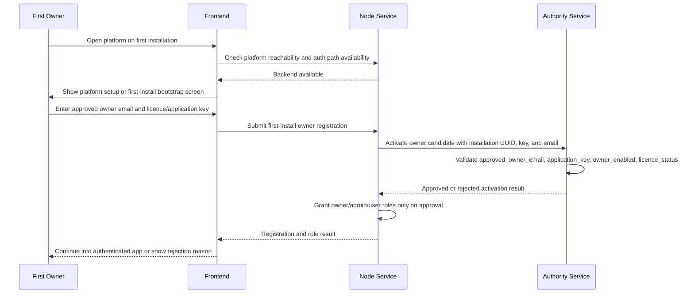

# bootstap eyenet

## Scope

This document describes the current bootstrap status for first installation across the main user-facing path:

- `autonomous/ppl-meta-authority`
- `ppl-meta-node`
- `ppl-meta-frontend`

It does not describe the full installer, proxy, or deployment automation for the rest of the platform. It focuses on the first-install startup and first-login journey as it is currently implemented, together with the intended target flow.

## Expected First-Install Behaviour

The expected platform bootstrap journey is:

1. Start the backend services first.
2. Start the frontend after the backend is available.
3. Present a first-login path for the owner.
4. Let the first owner register using the owner email that is associated with the licence key or application key.
5. Verify that owner against Authority.
6. Let Node grant the correct local roles after Authority approves the owner.

This is the intended platform story, but it is not yet implemented as one unified first-install flow.

## End-To-End Bootstrap Specification

### Target Bootstrap Sequence

The intended end-to-end bootstrap sequence for a new installation is:

1. Start the backend platform services.
2. Confirm the platform can serve the frontend and the frontend can resolve the backend endpoints it needs.
3. Open the frontend.
4. If platform connection details are missing, collect them in the frontend bootstrap setup screen.
5. Route the user to the first-install login or registration experience.
6. Let the first real owner register with the email that matches the licensed owner email for the installation.
7. Let Node submit that owner candidate to Authority using the installation identity and application key.
8. Let Authority verify that the requested owner email is approved for that installation and that the licence is active.
9. If approved, let Node grant local `owner`, `admin`, and `user` roles.
10. Let the frontend continue into the normal authenticated application.

### Current As-Built Sequence

The current repository does not yet execute the above as one formal bootstrap orchestration. The as-built flow is split into four layers:

1. backend startup
2. frontend platform connectivity bootstrap
3. frontend authentication against Node
4. owner approval and role convergence through Authority and Node

That means the platform already has most of the contract pieces, but not yet one canonical first-install owner journey.

## Service Responsibilities During Bootstrap

### Frontend responsibilities

The frontend already behaves like a bootstrap shell for platform connectivity.

Current frontend startup behavior includes:

- launching through `PPLMetaBootstrapApp`
- running an app bootstrap sequence before normal navigation
- checking whether runtime platform connection setup is required
- presenting `PlatformConnectionSetupScreen` when setup is needed
- continuing into the main routed app after setup succeeds

Current frontend authentication behavior includes:

- redirecting unauthenticated users to `/login`
- exposing `/register`
- exposing `/verify-email`
- storing authentication state locally
- logging in against Node using `/api/v1/users/login`

Current implication:

- the frontend already owns environment bootstrap and auth routing
- the frontend does not yet implement a dedicated first-install owner onboarding wizard tied directly to licence key validation
- the frontend currently treats bootstrap as connection setup plus normal login and registration, not as a special installation activation journey

### Node responsibilities

Node currently owns the local application account system and the local role assignment outcome.

Its current responsibilities during bootstrap include:

- creating the local database and installation information if needed
- seeding local development accounts used by the current implementation
- handling user registration through `/api/v1/users/register`
- handling user login through `/api/v1/users/login`
- checking with Authority whether a first user should be accepted as the approved owner
- assigning the local roles that result from that check
- caching the effective authority-linked installation state locally

Current implication:

- Node is already the service that turns Authority approval into actual local access roles
- Node is the current bridge between registration UX and Authority approval
- Node still contains development bootstrap users and fallback behavior that make the first-install story less clean than the intended production model

### Authority responsibilities

Authority currently owns installation approval, owner approval, and temporary control-plane bootstrap access.

Its current responsibilities during bootstrap include:

- storing the installation and entitlement contract
- storing `application_key` and `approved_owner_email`
- returning owner approval state for a specific email
- activating an installation-owner combination through the activation endpoint
- exposing a temporary bootstrap admin entry point for initial privileged authority access

Current implication:

- Authority is already the source of truth for whether the requested owner is valid for the licensed installation
- Authority still requires a separate bootstrap-admin path for initial privileged access to the Authority workspace
- Authority currently supports the owner-verification contract, but the control-plane bootstrap still begins with admin bootstrap rather than owner bootstrap

## Current Status

### 1. Backend-first bootstrap is only partially represented

The current repository does support starting backend services before frontend access, but the first-install sequence is not yet formalized as a single bootstrap workflow that coordinates backend startup, frontend startup, and owner onboarding.

In practice, the bootstrap behavior currently lives across frontend setup, Authority control-plane bootstrap, and Node registration or role convergence as separate concerns.

### 1a. Frontend startup exists, but not yet as owner-first installation bootstrap

The frontend already has a startup bootstrap layer.

It currently:

- initializes configuration at app start
- determines whether platform connection setup is required
- renders a setup screen when connectivity configuration is missing or invalid
- routes unauthenticated users to login or register screens once setup is complete

Current implication:

- the frontend already supports bootstrapping the runtime connection to the platform
- the frontend does not yet drive a first-install owner activation workflow based on licence key plus approved owner email
- the frontend still depends on the existing Node login and registration surfaces after setup

### 2. Authority currently owns the first privileged access path

Authority currently exposes a bootstrap-only admin path through:

- `POST /api/v1/auth/bootstrap-admin`

That endpoint is disabled by default and only works when `AUTHORITY_BOOTSTRAP_ADMIN_ENABLED=true` is set.

When enabled, it creates or returns the transitional bootstrap admin account:

- email: `admin@authority.local`
- password: `change-this-admin-password`

Current implication:

- the first supported privileged login is currently the bootstrap authority admin
- the first supported login is not yet the final owner self-registration flow
- this bootstrap admin path is explicitly temporary and intended to be turned off after initial setup

### 3. Authority already holds the owner-verification contract

Although Authority currently starts with bootstrap admin access, it already contains the data contract needed for owner-linked installation verification.

The installation and entitlement records already store:

- `application_key`
- `approved_owner_email`
- `owner_enabled`
- `licence_status`
- `installation_uuid`

Authority also exposes the APIs that Node uses for this contract:

- `GET /api/v1/installations/{installation_uuid}`
- `GET /api/v1/owners/{email}`
- `POST /api/v1/installations/activate`

Current implication:

- Authority already knows which owner email is approved for a given installation and application key
- Authority is already the source of truth for licence state and owner approval
- this part of the intended bootstrap model exists, but it is not yet the primary first-login UX

### 4. Node currently converges local startup roles from Authority

During startup, Node initializes local users and roles, then attempts to converge owner assignment using Authority.

Current startup behavior in Node includes:

- creation of local baseline development users if they do not already exist
- creation of a privileged development account for local use
- a startup verification call to Authority to determine whether an approved owner exists for the installation
- role convergence that preserves admin access locally while applying owner role assignment when Authority identifies an approved owner

Current implication:

- Node already consumes Authority-approved owner information during startup
- Node can align local owner role assignment with the approved owner email returned by Authority
- Node still carries development bootstrap behavior and fallback accounts, so it is not yet a clean production-first installer bootstrap path

### 5. First user registration in Node is conditionally owner-aware

Node registration already contains logic for first-user handling.

If the registering user is the first local user:

- Node asks Authority to activate that owner candidate
- if Authority approves the candidate, Node grants `owner`, `admin`, and `user`
- if Authority does not approve the candidate, Node keeps the user at `user`

Current implication:

- the owner-registration mechanism is partially present in Node
- owner elevation is already linked to Authority approval
- the overall platform still does not expose this as the single documented first-install flow because the frontend, Authority, and Node still bootstrap different parts of the journey independently

### 6. Frontend to backend handoff is normal auth, not dedicated install activation

After frontend setup completes, the main app router currently behaves like a standard authenticated application.

Current frontend handoff behavior is:

- redirect unauthenticated users to `/login`
- allow navigation to `/register`
- allow navigation to `/verify-email`
- authenticate against Node
- continue to the normal application routes after login

Current implication:

- the user-facing bootstrap handoff is already usable for login and registration
- the first-install owner case is handled indirectly through Node registration logic rather than through a distinct installation bootstrap UI
- the system is functionally close to the desired story, but the UX is still generic auth rather than guided installation bootstrap

## Current Bootstrap Reality For First Installation

Today, the practical first-install situation is:

1. Backend services must be running before the frontend can complete useful setup and authentication.
2. The frontend can bootstrap connection setup, but then falls into normal login and registration behavior.
3. Authority is still the control-plane bootstrap entry point for first privileged administrative access.
4. The first privileged control-plane user is currently the bootstrap admin in Authority, not the final owner journey.
5. Authority already stores the licence key or application key to approved owner email mapping.
6. Node already uses that Authority data to decide local owner approval and local role convergence.
7. The intended owner-first bootstrap story exists in pieces across frontend, Node, and Authority, but not yet as one end-to-end startup and onboarding flow.

## Gap Between Expected And Current Behaviour

The desired behavior is:

- backend starts
- frontend starts
- frontend guides the first-install owner through the dedicated bootstrap journey
- first real user registers as owner using the email validated by the licence key
- Authority verifies the owner
- Node applies the correct owner roles
- frontend lands the approved owner inside the normal authenticated experience

The current behavior is:

- frontend bootstraps platform connectivity, then switches to generic auth routes
- Authority bootstrap admin is still required for the first privileged control-plane access
- owner verification by approved owner email and application key already exists in Authority
- Node already reacts to Authority approval during startup and first-user registration
- the frontend-led owner-first bootstrap journey is not yet the single canonical first-install path

## Recommended Canonical Future Flow

For this bootstrap story to become the single supported first-install path, the platform should converge on this behavior:

1. Backend services start and publish healthy endpoints.
2. Frontend bootstraps connectivity and confirms the platform is reachable.
3. Frontend detects that no owner has completed installation bootstrap yet.
4. Frontend presents a first-install owner activation flow instead of generic login.
5. The owner enters the approved email and the installation-linked licence key or application key.
6. Node submits the activation request to Authority using the current installation identity.
7. Authority approves or rejects the owner based on `approved_owner_email`, `application_key`, `owner_enabled`, and `licence_status`.
8. Node grants local owner roles only when Authority returns approval.
9. Frontend transitions the newly approved owner into the standard authenticated application.
10. Authority bootstrap admin is no longer needed for the normal first-install owner journey, except for break-glass or support-only scenarios.

## Sequence Diagram

## Implementation Tasks

### Frontend

The frontend needs to become the canonical owner-first bootstrap surface instead of dropping directly into generic login and registration.

Required changes:

1. Detect first-install bootstrap state before routing to the standard login screen.
2. Add a dedicated first-install owner bootstrap screen after platform connectivity setup completes.
3. Collect the approved owner email and the licence key or application key in that bootstrap screen.
4. Call a dedicated Node bootstrap endpoint instead of using the generic register screen for the first owner path.
5. Surface Authority rejection reasons in user-facing language.
6. Continue to the normal authenticated application only after Node confirms owner approval and login readiness.
7. Keep generic `/login` and `/register` as secondary flows for non-bootstrap users and later users.

### Node

Node needs to expose a clean installation bootstrap API instead of relying on generic first-user registration behavior plus development fallback paths.

Required changes:

1. Add a dedicated first-install bootstrap endpoint for owner activation.
2. Accept the owner email and licence key or application key as explicit bootstrap inputs.
3. Resolve the effective installation identity consistently before contacting Authority.
4. Call Authority activation and verification using the installation UUID, application key, and owner email.
5. Grant local `owner`, `admin`, and `user` roles only when Authority returns an approved result.
6. Return structured rejection reasons when Authority denies the owner candidate.
7. Separate development bootstrap user seeding from the production first-install bootstrap path.
8. Add an explicit bootstrap-state check so the frontend can know whether the installation still needs first-owner activation.

### Authority

Authority needs to remain the source of truth for installation approval while reducing dependence on bootstrap-admin for the standard first-install story.

Required changes:

1. Keep `approved_owner_email`, `application_key`, `owner_enabled`, and `licence_status` as the authoritative activation contract.
2. Ensure the activation API is the primary contract for owner-first installation bootstrap.
3. Return stable machine-readable rejection reasons for invalid key, wrong owner email, disabled owner, inactive licence, and installation mismatch.
4. Expose a minimal bootstrap-status contract that Node can query without requiring separate operator interpretation.
5. Limit bootstrap-admin usage to break-glass administration, recovery, and support scenarios once the owner-first path is complete.
6. Document the exact lifecycle for moving from temporary admin bootstrap to standard owner-first activation.

### Cross-Service Integration

The three services need one shared definition of bootstrap completion.

Required changes:

1. Define a single bootstrap state model: not started, awaiting owner activation, owner approved, bootstrap complete.
2. Align frontend messaging, Node responses, and Authority rejection reasons to that model.
3. Decide whether the licence key entered in the frontend is always the same value as `application_key` or whether a translation step is required.
4. Define the post-approval login behavior so the first owner does not need to manually switch from bootstrap to normal login.
5. Add end-to-end tests that cover success, wrong email, wrong key, disabled owner, inactive licence, and re-entry after bootstrap completion.

## Phased Delivery Plan

### Phase 1: Bootstrap visibility

Goal: make the current bootstrap state observable to the frontend without changing the full onboarding flow yet.

Deliverables:

1. Add a Node endpoint that reports bootstrap state, effective installation identity, authority configuration status, cached approved owner email, and whether bootstrap is already complete.
2. Define the bootstrap state values returned by Node.
3. Let the frontend query that endpoint during startup after platform connectivity setup.
4. Keep existing login and registration behavior unchanged when bootstrap is already complete.

Exit criteria:

1. Frontend can determine whether to show generic login or a future first-install bootstrap screen.
2. Node returns stable bootstrap state data without requiring an authenticated user.

### Phase 2: Dedicated owner bootstrap API

Goal: introduce a clean backend contract for first-owner activation.

Deliverables:

1. Add a dedicated Node bootstrap activation endpoint.
2. Accept owner email and licence key or application key as explicit input.
3. Validate bootstrap eligibility before attempting activation.
4. Call Authority activation using the effective installation UUID and supplied key.
5. Return machine-readable success and rejection responses.

Exit criteria:

1. First-owner activation no longer depends on generic first-user registration side effects.
2. Rejection reasons are stable enough for frontend handling.

### Phase 3: Frontend first-install experience

Goal: replace generic first-install registration with a guided owner bootstrap flow.

Deliverables:

1. Add a dedicated first-install bootstrap screen in the frontend.
2. Route to that screen only when Node reports bootstrap is not complete.
3. Submit owner activation requests to the new Node bootstrap endpoint.
4. Render user-facing messages for rejection cases.
5. Continue to the standard authenticated app automatically on success.

Exit criteria:

1. A brand-new installation presents a guided owner bootstrap path instead of generic login.
2. A completed installation skips bootstrap and goes directly to normal auth.

### Phase 4: Bootstrap-admin demotion

Goal: reduce Authority bootstrap-admin to break-glass usage only.

Deliverables:

1. Document bootstrap-admin as recovery-only.
2. Remove bootstrap-admin from the standard first-install operational story.
3. Add operator guidance for support and recovery paths.

Exit criteria:

1. Owner-first activation is the default first-install flow.
2. Bootstrap-admin is no longer required in normal onboarding.

## Ticket Breakdown

### Frontend tickets

1. FE-BS-001: Query Node bootstrap state during app startup after platform connectivity setup.
2. FE-BS-002: Add first-install bootstrap screen for approved owner activation.
3. FE-BS-003: Route between bootstrap, login, and register based on Node bootstrap state.
4. FE-BS-004: Render Authority rejection reasons as user-facing messages.
5. FE-BS-005: Auto-transition approved first owner into normal authenticated app state.

### Node tickets

1. NODE-BS-001: Add unauthenticated bootstrap-state endpoint to licensing API.
2. NODE-BS-002: Define bootstrap state response contract and state values.
3. NODE-BS-003: Add dedicated first-owner bootstrap activation endpoint.
4. NODE-BS-004: Separate production bootstrap flow from development seed-user behavior.
5. NODE-BS-005: Add tests for bootstrap-state and activation success or failure paths.

### Authority tickets

1. AUTH-BS-001: Stabilize activation rejection reasons for owner-first bootstrap.
2. AUTH-BS-002: Document Authority activation as the primary owner-first bootstrap contract.
3. AUTH-BS-003: Add a minimal operator-facing bootstrap completion and recovery guide.
4. AUTH-BS-004: Reclassify bootstrap-admin as break-glass only in operational documentation.

### Cross-service tickets

1. BOOT-BS-001: Define shared bootstrap state names and meanings across services.
2. BOOT-BS-002: Decide whether frontend licence input maps directly to `application_key`.
3. BOOT-BS-003: Define post-approval session creation and login behavior.
4. BOOT-BS-004: Add end-to-end coverage for first-install bootstrap scenarios.

## Summary

For the current scope of `ppl-meta-frontend`, `ppl-meta-authority`, and `ppl-meta-node`, the platform is mid-transition.

The frontend already bootstraps connectivity and routes users through login, registration, and email verification. Authority already provides the verification model based on installation, application key, and approved owner email. Node already consumes that model to activate or converge owner roles. However, the actual first-install bootstrap experience is still split across these three services. The platform does not yet present one unified owner-first installation flow, and the temporary Authority bootstrap admin path still remains part of the current control-plane bootstrap reality.

## Related Documents

1. [BOOTSTRAP_TESTING_GUIDE.md](/Users/nickgklezakos/Documents/ppl-meta-code/docs/modules/bootstrap/BOOTSTRAP_TESTING_GUIDE.md)
2. [BOOTSTRAP_RESET_AND_RESTORE.md](/Users/nickgklezakos/Documents/ppl-meta-code/docs/modules/bootstrap/BOOTSTRAP_RESET_AND_RESTORE.md)
