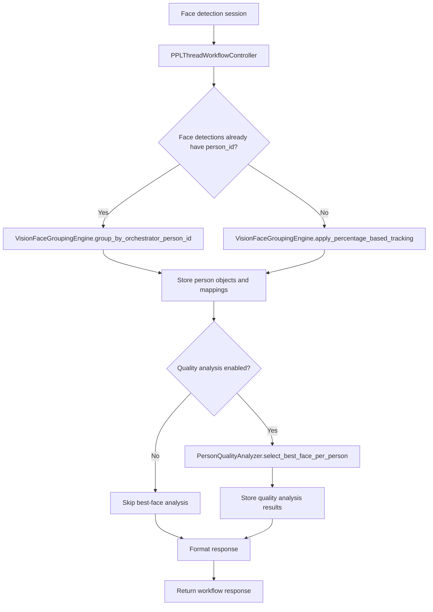

# Person Objects Module

**Service**: `ppl-meta-vision`  
**Module**: `person_objects`  
**Primary Purpose**: Group face detections from a single video into person objects, store the results, and expose them through a PPL Meta Mini-compatible API.

---

## Table of Contents

1. [Overview](#overview)
2. [Architecture](#architecture)
3. [Workflow](#workflow)
4. [Grouping Algorithms](#grouping-algorithms)
5. [API Reference](#api-reference)
6. [Data Model](#data-model)
7. [Configuration](#configuration)
8. [Outputs](#outputs)
9. [Operational Notes](#operational-notes)

---

## Overview

The Person Objects module is the single-video person grouping layer in the Vision service. It takes face detections from a session, groups them into person objects, performs optional quality analysis, stores the results in the Vision database, and returns a response shaped for downstream consumers that expect PPL Meta Mini-style person-object payloads.

This module is the step that turns per-frame face detections into stable per-person objects within one video. It is not the cross-video MVR merge layer; MVR merge happens later in the vmeta search and analysis flow.

### Key responsibilities

- Group face detections into person objects for a single video session
- Preserve a PPL Meta Mini-compatible response shape
- Support both orchestrator-provided `person_id` grouping and local percentage-based tracking
- Select a best-quality face per person when quality analysis is enabled
- Persist workflow state and results in the Vision database
- Expose workflow, session, summary, and health endpoints for integration

---

## Architecture

### Main components

| Component | File | Role |
|---|---|---|
| Workflow controller | [ppl_thread_workflow.py](../../../ppl-meta-vision/src/person_objects/ppl_thread_workflow.py) | Orchestrates the full single-video person-objects workflow |
| Grouping engine | [face_grouping_engine.py](../../../ppl-meta-vision/src/person_objects/face_grouping_engine.py) | Implements the face-to-person grouping logic |
| Quality analyzer | [quality_analyzer.py](../../../ppl-meta-vision/src/person_objects/quality_analyzer.py) | Selects best-quality faces and computes quality summaries |
| API router | [person_objects_api.py](../../../ppl-meta-vision/src/person_objects/person_objects_api.py) | Exposes the workflow and retrieval endpoints |

---

## Workflow

The workflow controller runs the pipeline in a fixed order:

1. Validate the session and create a workflow record.
2. Load the face detections for the session.
3. Group detections into person objects.
4. Store the resulting person objects and face mappings.
5. Run quality analysis if enabled.
6. Persist the quality analysis output.
7. Mark the workflow complete.
8. Return a PPL Meta Mini-compatible response.

### Grouping decision

The workflow chooses one of two grouping paths:

- If face detections already contain `person_id`, the controller preserves the orchestrator grouping by calling `group_by_orchestrator_person_id(...)`.
- Otherwise, it uses `apply_percentage_based_tracking(...)`, the local chronological position-based grouping algorithm.

The default tolerance comes from the orchestrator workflow setting `velocity_sensitivity` when the caller does not provide `tolerance_percent`.

### Workflow shape

The controller is implemented in [ppl_thread_workflow.py](../../../ppl-meta-vision/src/person_objects/ppl_thread_workflow.py) and is responsible for:

- discovering the session for a media UUID
- creating legacy sessions when needed
- fetching velocity sensitivity from orchestrator
- orchestrating grouping and quality analysis
- formatting the final response

---

## Grouping Algorithms

### 1. Orchestrator-preserved grouping

When `person_id` already exists on the incoming face detections, the module does not recluster the faces. It groups by the provided `person_id` values and keeps the upstream grouping intact.

This path is important when another service has already done the temporal/person tracking.

### 2. Percentage-based tracking

When no `person_id` is present, the local grouping engine walks the detections in chronological frame order and assigns faces to the nearest active track when the position distance stays within the configured percentage tolerance.

Key characteristics:

- chronological processing by `frame_number`
- track reuse based on position distance
- new track creation when no match exists
- quality-weighted person object summary
- same basic shape as the PPL Meta Mini grouping output

### 3. Quality scoring

The grouping engine computes aggregate quality from the underlying face detections using:

- sharpness
- brightness
- detection confidence

The person object keeps the aggregated quality score, face count, original face IDs, and first/last seen frame values.

---

## API Reference

The API router lives in [person_objects_api.py](../../../ppl-meta-vision/src/person_objects/person_objects_api.py) under the prefix `/api/v1/person-objects`.

### Core endpoints

| Method | Path | Purpose |
|---|---|---|
| `POST` | `/api/v1/person-objects/workflows/start` | Start a person-objects workflow from a face detection session |
| `POST` | `/api/v1/person-objects/workflows/start-from-faces` | Start a workflow from in-memory face detections |
| `POST` | `/api/v1/person-objects/workflow/trigger` | Trigger workflow execution from a media-driven request |
| `GET` | `/api/v1/person-objects/{media_id}` | Return a summary view for a media UUID |
| `GET` | `/api/v1/person-objects/sessions/{session_uuid}` | Get the stored workflow/person-objects result for a session |
| `GET` | `/api/v1/person-objects/workflows/{workflow_id}/status` | Return workflow execution status |
| `GET` | `/api/v1/person-objects/sessions/{session_uuid}/summary` | Return a compact session summary |
| `GET` | `/api/v1/person-objects/sessions/{session_uuid}/statistics` | Return session statistics |
| `GET` | `/api/v1/person-objects/media/{media_uuid}/session` | Resolve the session UUID for a media UUID |
| `GET` | `/api/v1/person-objects/health` | Health check |

### Request inputs

The workflow start endpoints accept:

- `session_uuid`
- optional `tolerance_percent`
- optional `enable_quality_analysis`
- optional `enable_age_detection`
- optional `workflow_metadata`

The face-based start endpoint additionally accepts an array of face detection objects with fields such as:

- `id`
- `frame_number`
- `bbox_x1`, `bbox_y1`, `bbox_x2`, `bbox_y2`
- `confidence`

---

## Data Model

The module uses lightweight response and tracking models defined in [person_objects_api.py](../../../ppl-meta-vision/src/person_objects/person_objects_api.py).

### Main shapes

| Model | Purpose |
|---|---|
| `GroupTrackingItem` | Per-person grouping record in PPL Mini-compatible format |
| `SummaryStatistics` | Aggregated processing statistics |
| `BestQualityFace` | Best face candidate for a person |
| `ClassifiedFace` | Face-to-person mapping record |
| `PersonObjectsSummary` | Compact summary for media-level display |
| `PersonObjectsWorkflowResponse` | Full workflow response |

### Stored concepts

The workflow persists or derives these values:

- `person_objects`
- `face_mappings`
- `quality_results`
- `grouping_statistics`
- `workflow_status`

The controller also maintains workflow records in the Vision database for status tracking.

---

## Configuration

### Orchestrator integration

If the caller does not pass `tolerance_percent`, the workflow fetches the value from orchestrator:

- `GET /api/v1/settings/workflow/velocity-sensitivity`

The Vision controller caches this value for a short interval to avoid repeated calls during the same workflow session.

### Default behavior

- Default tolerance: `20.0`
- Default max processing window: `30` minutes
- Batch size: `100`

### Legacy support

The controller can create a session for legacy media that already has face detections but no session row yet. It also resolves a session UUID from media UUID when needed.

---

## Outputs

The module returns PPL Meta Mini-compatible structures that include:

- workflow metadata
- session UUID
- person objects
- face mappings
- summary statistics
- best-quality face information when enabled

Typical output details include:

- total faces processed
- total persons created
- tracking algorithm used
- tolerance percent used
- grouping efficiency
- first/last seen frames

---

## Operational Notes

### What this module does well

- Keeps single-video grouping local and deterministic
- Preserves upstream `person_id` grouping when available
- Produces stable person objects for downstream display and storage
- Separates grouping from cross-video MVR merge

### What it does not do

- It does not perform cross-video MVR consolidation
- It does not replace the later vmeta merge/search flow
- It does not assume every run has age or gender evidence

### Related modules

- [MVR Merge Module](../MVR%20merge/mvr-merge-module.md)
- [Single-Video Person-Object Demographics Proposal](../MVR%20merge/SINGLE_VIDEO_PERSON_OBJECT_DEMOGRAPHICS_PROPOSAL.md)

---

## Summary

The Person Objects module is the Vision service’s single-video grouping layer. It turns face detections into person objects, stores the results, and returns a response that other services and screens can consume. The workflow is intentionally separate from MVR merge: person objects are created first, and cross-video MVR consolidation happens later.
