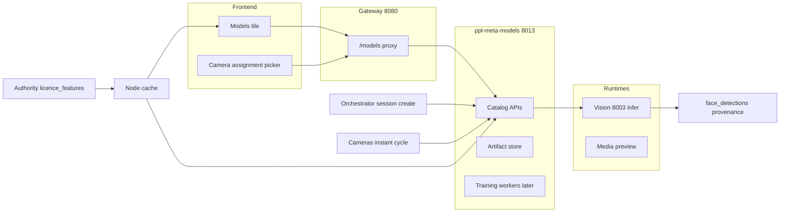

# PPL Meta Models Implementation Plan

**Date**: September 7, 2026  
**Status**: Draft Implementation  
**Depends On**: [Detection Model Lifecycle](../../modules/AI-vision-pipeline/detection-model-lifecycle.md), [Frame to Analytics Pipeline](../../modules/AI-vision-pipeline/frame-to-analytics-pipeline.md)

---

## Purpose

This document turns the accepted detection-model lifecycle into an implementation plan for **`ppl-meta-models`**.

The service is the platform catalog for machine-vision **detection** models: versioned artifacts, assignments, golden-set validation, and (later) training jobs. It does **not** run frame inference. Instant and bulk detection continue to infer in Vision; Media keeps a cheap preview path.

The design goal is one registry for many capabilities (face first, then body, plates, objects, inspection) without putting weights, GPU jobs, or training loops on Orchestrator or Vision.

---

## Scope

The implementation of `ppl-meta-models` should include, across Phases A–C:

1. catalog entities for models, versions, artifacts, assignments, and assignment history
2. resolve API used by Orchestrator (bulk session create) and Cameras (instant cycle start)
3. activate / deactivate among builtins (Phase A) then user uploads (Phase B)
4. provenance columns on Vision `face_detection_sessions` and `face_detections`
5. Authority licence feature keys and Node cache wiring
6. frontend Models tile, dedicated screens, and camera assignment picker
7. golden-set storage and validate gate (platform + per-site)
8. extra capabilities and cascade recipes (Phase C)

Out of scope for the first coding milestone (Phase A):

- user artifact upload and ONNX runtimes
- training UI or training workers
- swapping VMeta Facenet512 / age / gender
- changing Vision 3-tier vs Orchestrator IoU grouping
- building Inspect inference (`ppl-meta-inspect`)
- writing body/plate detections into `face_detections` or `mvr_people`

Training is described here as a later increment of **this** service (separate worker/queue), not a second homepage tile and not an Orchestrator feature.

---

## Naming Decision

Canonical names:

- service: `ppl-meta-models`
- local port: **8013**
- API base path: `/api/v1/mv-models`
- gateway proxy: `/models/{path}`
- homepage tile: **Models**
- frontend routes: `/models`, `/models/:id`, `/models/assignments`, `/models/golden-sets`
- licence keys: `eyenet_mv_models`, `mv_models_upload`, `mv_models_custom_capability`
- semantic prefix: `mv_` on catalog tables

Do not name the service `ppl-meta-vision-models` or fold it into Orchestrator. Do not use Bootcore strings such as `advanced_analytics` for this product.

Builtin `model_id` values:

- `face-haar-builtin`
- `face-dlib-builtin`
- `face-two-stage-builtin` (platform default for `instant` and `bulk`)
- `face-landmarks-68-builtin` (`face_landmarks` capability; assignment-only)

Paths: `instant` | `bulk` | `preview`.

---

## Architecture Role

`ppl-meta-models` is a headless REST service in the same tier as Presence (`ppl-meta-presence`, port 8011). Template: FastAPI + `/health` + config port, following [ppl-meta-presence/src/main.py](../../../ppl-meta-presence/src/main.py).

It sits between:

- the frontend Models workspace and camera assignment picker
- Gateway (`:8080`) proxy
- Orchestrator bulk session create
- Cameras instant-detection cycles
- Vision (consumer of resolved version; owner of inference)
- Authority / Node licence cache
- later: training workers attached to this service, not to the catalog process

It owns catalog, artifacts, assignment policy, validation evidence, and (later) training job records. It does not own face grouping, MVR, or camera sampling.

If `ppl-meta-models` is unreachable, Vision/Cameras/Orchestrator use the last cached assignment or platform builtin `face-two-stage-builtin`. Instant cameras must not go blind.

---

## Core Responsibilities

### 1. Model catalog

Maintain logical models (`capability`, `origin`) and immutable versions (`runtime`, `output_schema_version`, `latency_class`, `compatible_paths`, lifecycle `status`).

Seed builtins at first boot. Builtin rows are not deletable.

### 2. Artifact storage

Store checksummed files (Haar XML, optional ONNX, 68-point dat). Phase A may reference files already on Vision disk; Phase B stores uploads in object storage owned by this service.

### 3. Assignment and resolve

Exactly one serving assignment per `(capability, scope, path)` unless shadow is on.

Resolve order: camera+path → camera → tenant/site → platform default.

Keep `mv_assignment_history` for rollback (activate previous version).

### 4. Validate

Run golden sets before `ready`. Instant-capable versions must record p95 latency vs **&lt; ~400 ms/frame** under Vision semaphore max 2.

### 5. Licence enforcement

Refuse catalog mutations without `eyenet_mv_models`. Refuse upload without `mv_models_upload`. Refuse non-face capabilities without `mv_models_custom_capability`.

### 6. Training jobs (later increment)

Queue, dataset pointers, and experiment metadata. Separate process from catalog/resolve. Out of Phase A–C required outcomes.

---

## Service Dependencies

### Gateway

Add `"models": "http://localhost:8013"` to `SERVICES` in [ppl-meta-gateway/src/api/v1/router.py](../../../ppl-meta-gateway/src/api/v1/router.py) and a `/models/{path:path}` proxy mirroring `_proxy_to_presence_service`.

### Orchestrator

Expected dependency: `MODELS_SERVICE_URL`.

Required behavior: at Vision session create in [face_detection_endpoints.py](../../../ppl-meta-orchestrator/src/face_detection_endpoints.py) (`_create_vision_session` / Enhanced Logic V2 step 0), `GET /resolve` for `path=bulk`, `capability=face_detection`, stamp `model_id` / `model_version` on the session payload. Do not store weights. Mid-job activate does not change the current session.

### Cameras

Expected dependency: resolve at each instant cycle start in [instant_detection.py](../../../ppl-meta-cameras/src/services/instant_detection.py).

Required behavior: `path=instant`. Circuit breaker OPEN → builtin `two_stage`. Extra capabilities (Phase C) are optional stages with independent breakers.

Workflow settings today: `detection_methods` JSON in [workflow_settings.py](../../../ppl-meta-cameras/src/schemas/workflow_settings.py) and [camera.py](../../../ppl-meta-cameras/src/models/camera.py). Replace over time with `assigned_model_id` plus path overrides. API: [cameras.py](../../../ppl-meta-cameras/src/api/v1/endpoints/cameras.py) `/{device_id}/workflow-settings`.

### Vision

Expected dependency: resolved version id, not a catalog DB.

Required behavior:

- persist provenance on [face_detection_sessions](../../../ppl-meta-vision/migrations/001_session_based_face_detection_schema.sql) and `face_detections`
- loader cache in [extracted_face_detector.py](../../../ppl-meta-vision/src/extracted_face_detector.py) keyed by `model_version`
- `GET /health/models` for loaded versions, refcounts, last error
- do not auto-run landmarks because `shape_predictor_68_face_landmarks.dat` is on disk
- load failure → builtin `two_stage`

Session request schema: [api_models.py](../../../ppl-meta-vision/src/api_models.py) `FaceDetectionSessionRequest` — extend with provenance fields. Session insert: [session_manager.py](../../../ppl-meta-vision/src/session_manager.py).

### Media

Preview overlay [face_detection_service.py](../../../ppl-meta-media/src/services/face_detection_service.py) / `SharedFaceDetector`: `preview` latency class or builtin Haar. Never load bulk-class uploads.

### VMeta

No catalog integration. Continues to consume face boxes and person objects. Grouping/MVR do not select models.

### Node / Authority

See [Installation identity and licence context](#installation-identity-and-licence-context).

### Compose / nginx / tasks (coding phases, not this docs slice)

- `ppl-meta-models/Dockerfile` `EXPOSE 8013`
- [docs/deployment/docker/docker-compose.ecosystem.yml](../../deployment/docker/docker-compose.ecosystem.yml)
- [docs/deployment/nginx/nginx-local-dev.conf](../../deployment/nginx/nginx-local-dev.conf) upstream + `/health/models`
- [deployment/windows-installer/docker-compose.windows-installer.yml](../../../deployment/windows-installer/docker-compose.windows-installer.yml)
- `.vscode/tasks.json` start/stop/health port lists

Avoid ports already taken: 8000–8011, 8012 (presence sim), 8015 (matrix), 8080 (gateway). **8013** is free.

---

## Authentication and user context

Reuse existing Gateway → Node service-auth (`.env.service-auth` / `SERVICE_SECRET`) the same way Presence does. Models APIs are not a second login.

Frontend calls Gateway `/models/...` with the user token. Catalog mutations require a **manage-models** role in addition to licence `eyenet_mv_models`. Exact RBAC capability string should be added next to existing helpers in [user.dart](../../../ppl-meta-frontend/lib/core/models/user.dart) (`canManageRoles` pattern).

Internal resolve calls from Orchestrator and Cameras use service-auth, not an operator token.

---

## Installation identity and licence context

Authority today enforces licence **lifecycle** and capacity (`max_platform_nodes`), not per-module feature keys. Node has `installation_info.authority_licence_features` ([installation_info.py](../../../ppl-meta-node/src/models/installation_info.py), migration `e46e0315d6e1`) but `_cache_authority_state()` in [authority_service.py](../../../ppl-meta-node/src/services/authority_service.py) **does not write it**. Homepage tiles including Presence and Signage are **not** licence-gated.

Models is the first product surface that **must** hide without a licence. Phase A includes this plumbing:

1. Authority entitlement stores `licence_features` JSON array.
2. Activation / GET installation returns `licence_features`.
3. Node `_cache_authority_state()` writes `authority_licence_features`.
4. `ppl-meta-models` reads Node cache (or Gateway-exposed licence status) and returns 403 when keys are missing.
5. Frontend hides the Models tile without `eyenet_mv_models`; hides upload without `mv_models_upload`.

| Key | Grants |
|-----|--------|
| `eyenet_mv_models` | Catalog UI, list/resolve, activate builtins |
| `mv_models_upload` | `POST .../versions` user-origin artifacts |
| `mv_models_custom_capability` | Non-face capabilities (Phase C) |

Naming follows Inspect (`eyenet_inspect`, `inspect_custom_model`). Do not collide with Bootcore `features_enabled` maps in [licences.py](../../../ppl-meta-node/src/api/licences.py).

---

## Domain model

Suggested fields. SQL/Alembic is a coding-phase artifact; this plan locks names.

### MvModel

- `model_id` (PK, slug)
- `display_name`
- `capability` (`face_detection`, `face_landmarks`, `body_detection`, `vehicle_detection`, `license_plate`, `object_detection`, `inspection_defect`)
- `origin` (`builtin` | `user`)
- `created_at`, `updated_at`

### MvModelVersion

- `model_id`, `version` (composite unique)
- `runtime` (`haar`, `dlib_hog`, `two_stage`, `onnx`, `tensorrt`, …)
- `output_schema_version`
- `latency_class` (`preview` | `instant` | `bulk`)
- `compatible_paths` (JSON list)
- `hyperparameters` (JSON; confidence, min size, upsample)
- `status` (`uploaded` | `validating` | `ready` | `active` | `deactivated` | `archived` | `failed` | `purged`)
- `origin` inherited; builtin versions cannot be purged

### MvArtifact

- `version` FK
- `uri`, `sha256`, `size_bytes`, `filename`

### MvAssignment

- `capability`
- `scope_type` (`platform` | `tenant` | `camera`)
- `scope_id` (nullable for platform)
- `path` (`instant` | `bulk` | `preview`)
- `model_id`, `version` (or `recipe_id` in Phase C)
- `shadow` (bool)
- unique on (`capability`, `scope_type`, `scope_id`, `path`) excluding extra shadow rows

### MvAssignmentHistory

- previous pointer, actor, timestamp — rollback = activate previous version

### MvRecipe / MvRecipeStep (Phase C)

- ordered versions for cascades (vehicle → plate crop → OCR)

### MvGoldenSet / MvGoldenItem / MvValidationRun

- `kind` (`platform` | `site`)
- `capability`
- `site_id` nullable
- items: media URI + expected boxes / OCR text
- runs: version, metrics (count error, IoU, p95_ms), result (`ready` | `failed`)

Platform set **required** for face/body/generic to become `ready` (schema, IoU, instant p95). Per-site set **required to activate on that site** for plates and inspection. Platform plate set is sanity-only (schema/charset).

### Vision provenance (Phase A)

Add columns on `face_detection_sessions` and `face_detections`:

- `model_id`
- `model_version`
- `runtime`
- `confidence_threshold`
- `path`
- `serving` (true unless shadow)

Keep `method` as derived/display (e.g. `two_stage_haar_dlib`).

Phase C: new Vision tables `object_detections` and `plate_readings`. Never write those into `face_detections` or `mvr_people`.

---

## REST API plan

Base: `/api/v1/mv-models`. Gateway: `/models/{path}`.

### Phase A endpoints

- `GET /health`
- `GET /api/v1/mv-models` — list catalog (builtins)
- `GET /api/v1/mv-models/{id}`
- `GET /api/v1/mv-models/{id}/versions`
- `GET /api/v1/mv-models/resolve?camera_id&path&capability`
- `POST /api/v1/mv-models/{id}/versions/{ver}/activate` — builtins only; body `scope`, `path`, optional `shadow`
- `POST /api/v1/mv-models/{id}/versions/{ver}/deactivate`
- Vision `GET /health/models`

Activate of a version whose `compatible_paths` does not include the requested path returns **409**. No operator override in v1.

Missing `eyenet_mv_models` → **403** on mutations. Resolve may remain available to services so detection does not stop; still fall back to builtin if unlicensed custom assignment is present.

### Phase B endpoints

- `POST /api/v1/mv-models` — create logical model
- `POST /api/v1/mv-models/{id}/versions` — multipart upload → `uploaded`; requires `mv_models_upload`
- `POST /api/v1/mv-models/{id}/versions/{ver}/validate`
- `POST /api/v1/mv-models/{id}/versions/{ver}/archive`
- `DELETE /api/v1/mv-models/{id}/versions/{ver}` — **409** if sessions/detections reference the version
- `GET/POST /api/v1/mv-golden-sets` and items
- `GET /api/v1/mv-models/{id}/versions/{ver}/validation-runs`

### Phase C endpoints

- recipe CRUD
- capability-filtered list including body/plate/object (requires `mv_models_custom_capability`)
- Vision optional detect stages for body/plate (not VMeta people materialize)

---

## Frontend flow mapping

Copy Presence: `GoRoute` in [app_router.dart](../../../ppl-meta-frontend/lib/presentation/navigation/app_router.dart) plus `_ActionCard` in [home_screen.dart](../../../ppl-meta-frontend/lib/presentation/screens/home/home_screen.dart).

### Responsibility split

| Surface | Owns |
|---------|------|
| Homepage **Models** tile | Entry. Show iff `eyenet_mv_models` **and** manage-models role |
| `/models` | Catalog by capability and status |
| `/models/:id` | Version detail, artifacts, validate results, p95 vs 400 ms |
| `/models/assignments` | Camera / tenant / path matrix |
| `/models/golden-sets` | Platform vs per-site clips |
| Later routes under `/models/...` | Training jobs — same tile |
| Camera workflow | [workflow_settings_section.dart](../../../ppl-meta-frontend/lib/presentation/widgets/settings/workflow_settings_section.dart) assignment picker only |

Do not add a Settings subsection as the home for this module. Do not upload weights from the camera form.

Upload CTA iff `mv_models_upload`.

---

## Instant vs bulk touchpoints

| Trigger | Who resolves | When | Fallback |
|---------|--------------|------|----------|
| Recording / bulk | Orchestrator at session create | Next session only | Builtin `two_stage` |
| Instant | Cameras at cycle start (3 frames / 5 s) | Next cycle | Circuit breaker → builtin `two_stage` |
| Preview | Media at stream start | Next overlay batch | Builtin Haar |
| Person-objects / VMeta | Do not resolve | Re-detect to change boxes | — |

Landmarks: default assignment bulk on, instant off, preview off. Running 68-point on instant is an explicit activate and must still meet the 400 ms budget if `compatible_paths` includes `instant`.

---

## Delivery phases

### Phase A — Registry without new weights (minimum executable milestone)

- `ppl-meta-models` service on **8013**, Gateway proxy, health
- seed four builtins; platform default both face paths = `face-two-stage-builtin`
- landmarks builtin registered; default assignments as above; **no** auto-load from disk
- `GET /resolve`; activate/deactivate builtins only
- Vision provenance columns; `method` still populated
- Orchestrator stamps bulk sessions; Cameras resolve instant cycles
- Authority `licence_features` + Node cache; Models tile gated
- camera picker for builtins; fallback if models is down
- instant Haar vs bulk `two_stage` is a supported assignment (latency escape hatch)

Phase A is complete when a camera can run instant on `face-haar-builtin` and bulk on `face-two-stage-builtin`, both sessions show provenance, and an unlicensed user does not see the Models tile.

### Phase B — Upload and validate

- multipart upload, SHA-256, `mv_models_upload`
- Vision loader cache / hot-swap; refcount unload
- platform golden set for face includes IoU + p95 &lt; ~400 ms
- shadow activate (`serving=false`); do not feed person-objects / MVR
- Media preview restricted to builtin or `preview` class
- archive / delete with 409 on references

### Phase C — Extra capabilities

- `body_detection`, `license_plate`, generic `object_detection` behind `mv_models_custom_capability`
- recipes for plate cascade
- Vision `object_detections` / `plate_readings`
- per-site golden sets required to activate plates/inspection on that site
- `enable_object_detection` means an assigned body/object model
- instant optional stages + `storage_multiple` for OCR
- keep `mvr_people` face-only

Training workers/UI are **after** Phase C, same service, same tile.

---

## Recommended implementation order

1. Authority `licence_features` + Node cache write/read (tile gating depends on this).
2. `ppl-meta-models` skeleton (health, seed builtins, resolve, activate builtins).
3. Gateway proxy, compose, nginx, VS Code tasks.
4. Vision provenance + loader cache for builtins; stop landmarks auto-load.
5. Orchestrator session stamp; Cameras cycle resolve + fallback.
6. Frontend tile + catalog + assignments + camera picker.
7. Phase B upload, golden sets, shadow, hot-swap.
8. Phase C capabilities, recipes, new Vision tables.
9. Training increment (not required for A–C).

---

## Minimum executable milestone

Phase A as defined above. Do not start Phase B uploads until provenance and licence gating work on builtins.

---

## Security requirements

- checksum every artifact; reject unknown runtimes
- size limits on upload
- PII on site golden sets (faces/plates) follows media retention
- service-auth on resolve; user token + role + licence on mutations
- builtin artifacts are not tenant-deletable
- training workers (later) isolated from the catalog process so a training OOM cannot take down resolve

---

## Risks

1. **Licence plumbing is new.** Presence/Signage tiles are ungated. If Authority `licence_features` slips, the Models tile will ship always-visible. Mitigation: Phase A includes Authority + Node cache, not a frontend-only hide.
2. **Resolve on the instant hot path.** Extra HTTP per 5 s cycle can fail. Mitigation: cache assignment on the camera worker; timeout → builtin; circuit breaker already exists.
3. **Dual copies of Haar/Dlib** (Vision, Media, shared). Phase A references existing files; Phase B must not let Media load bulk ONNX.
4. **Provenance vs old `method`.** Analytics that key on `two_stage_haar_dlib` must keep working. Keep `method` derived.
5. **Mid-session activate.** Operators may expect instant cutover. Document and enforce next-session / next-cycle only.
6. **400 ms budget on 4K RTSP.** Platform goldens may pass while site cameras fail. Mitigation: optional site soak; auto-409 if `compatible_paths` lacks `instant`.
7. **Delete vs analytics.** Purging a version that detections reference breaks audit. Hard 409 until references are gone.

---

## Implementation-readiness gaps

- Authority has no `licence_features` column/API yet.
- Node `authority_licence_features` is never written.
- Frontend has no licence-feature helper; only RBAC `capabilities`.
- `ExtractedFaceDetector` loads Haar/Dlib/predictor at init from disk.
- Camera `detection_methods` is a string list, unused as a registry.
- No Gateway `models` entry; port 8013 unused.
- Vision sessions have `metadata` JSONB but no first-class provenance columns.

---

## Out of scope recap

- Training UI/workers (described, not Phase A–C required)
- Facenet512 / age / gender catalog
- Vision 3-tier vs Orchestrator IoU change
- `ppl-meta-inspect` inference service
- Operator override of instant 409 for bulk-class models (v1)

---

## Reference files

| Area | Path |
|------|------|
| Lifecycle (accepted design) | [docs/modules/AI-vision-pipeline/detection-model-lifecycle.md](../../modules/AI-vision-pipeline/detection-model-lifecycle.md) |
| Pipeline | [docs/modules/AI-vision-pipeline/frame-to-analytics-pipeline.md](../../modules/AI-vision-pipeline/frame-to-analytics-pipeline.md) |
| Presence plan (pattern) | [docs/proposals/presence/ppl-meta-presence-implementation-plan.md](../presence/ppl-meta-presence-implementation-plan.md) |
| Presence service template | [ppl-meta-presence/src/main.py](../../../ppl-meta-presence/src/main.py) |
| Gateway SERVICES | [ppl-meta-gateway/src/api/v1/router.py](../../../ppl-meta-gateway/src/api/v1/router.py) |
| Orchestrator session create | [ppl-meta-orchestrator/src/face_detection_endpoints.py](../../../ppl-meta-orchestrator/src/face_detection_endpoints.py) |
| Instant cycles | [ppl-meta-cameras/src/services/instant_detection.py](../../../ppl-meta-cameras/src/services/instant_detection.py) |
| Camera workflow schema | [ppl-meta-cameras/src/schemas/workflow_settings.py](../../../ppl-meta-cameras/src/schemas/workflow_settings.py) |
| Detector init | [ppl-meta-vision/src/extracted_face_detector.py](../../../ppl-meta-vision/src/extracted_face_detector.py) |
| Vision session schema | [ppl-meta-vision/migrations/001_session_based_face_detection_schema.sql](../../../ppl-meta-vision/migrations/001_session_based_face_detection_schema.sql) |
| Media preview | [ppl-meta-media/src/services/face_detection_service.py](../../../ppl-meta-media/src/services/face_detection_service.py) |
| Home tiles | [ppl-meta-frontend/lib/presentation/screens/home/home_screen.dart](../../../ppl-meta-frontend/lib/presentation/screens/home/home_screen.dart) |
| Router | [ppl-meta-frontend/lib/presentation/navigation/app_router.dart](../../../ppl-meta-frontend/lib/presentation/navigation/app_router.dart) |
| Camera picker UI | [ppl-meta-frontend/lib/presentation/widgets/settings/workflow_settings_section.dart](../../../ppl-meta-frontend/lib/presentation/widgets/settings/workflow_settings_section.dart) |
| Node licence cache column | [ppl-meta-node/src/models/installation_info.py](../../../ppl-meta-node/src/models/installation_info.py) |
| Node cache write | [ppl-meta-node/src/services/authority_service.py](../../../ppl-meta-node/src/services/authority_service.py) |

---

## Recommended next steps

1. Implement Phase A in Agent mode against this plan (service skeleton, builtins, provenance, resolve, licence cache, gated tile).
2. Do not start Phase B until the minimum executable milestone is true on a local camera (instant Haar, bulk two-stage, tile hidden without licence).
