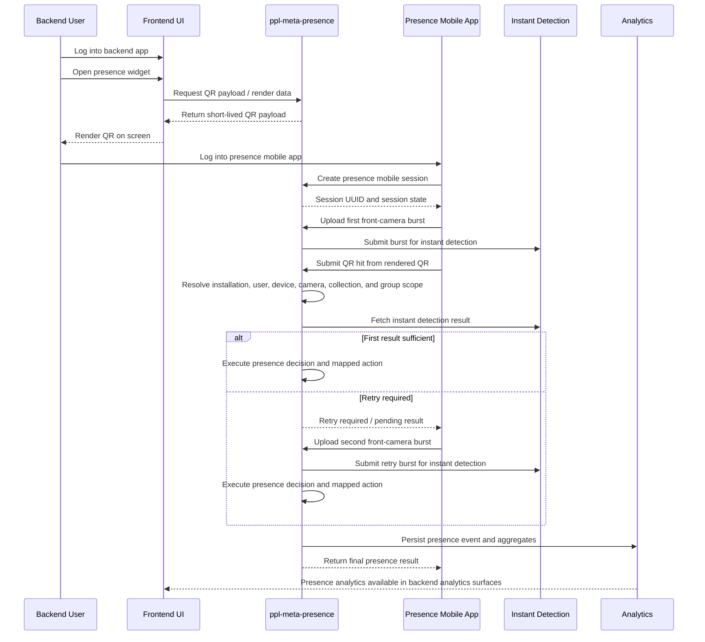

# Eyenet Presence

**Date**: May 30, 2026  
**Status**: Proposal  
**Scope**: Introduce two new PPL Meta services, `ppl-meta-presence` and `ppl-meta-presence-mobile`, to support presence identity, mobile presence flows, QR-based session initiation, instant-detection-driven presence decisions, and presence analytics  
**Related Platform Areas**: installation identity, software licensing, user identity, device identity, instant detection, triggers and actions, individual groups, cameras, collections, analytics, mobile onboarding

---

## Purpose

This proposal introduces a new PPL Meta product area named **Eyenet Presence**.

The proposal covers two new services:

1. `ppl-meta-presence`
2. `ppl-meta-presence-mobile`

The business goal is to let a mobile user initiate a presence interaction by logging into a mobile app, scanning a QR rendered by the platform installation, and allowing the platform to decide what presence action should occur based on short front-camera feeds processed through the existing instant detection stack.

The proposed design reuses existing platform capabilities wherever possible:

- installation identity and licence concepts
- user identity from the existing platform login domain
- device identity from the mobile device and the platform installation
- existing mobile login process from `ppl_meta_mobile_camera`
- existing platform discovery and endpoint resolution process from `ppl_meta_mobile_camera`
- existing camera registration and device identification process from `ppl_meta_mobile_camera`
- existing mobile feed transport and streaming process from `ppl_meta_mobile_camera`
- instant detection processing already available in the platform
- existing triggers and actions endpoints
- existing individual groups and person matching logic
- existing camera and collection concepts
- existing analytics framework and widgets

The new services should extend those existing capabilities rather than create a parallel identity or analytics system from scratch.

In particular, the mobile presence solution should inherit and adapt the proven process and code surface already present in [ppl_meta_mobile_camera](/Users/nickgklezakos/Documents/ppl-meta-code/ppl_meta_mobile_camera) for user login, platform connection, camera registration, and feed submission.

---

## Executive Summary

Eyenet Presence is proposed as a headless backend service plus a Flutter mobile application.

The backend service, `ppl-meta-presence`, owns presence-specific identity and orchestration. It models a hierarchy of presence profiles rooted in a common base entity and expanded into:

- installation presence profile
- device presence profile
- user presence profile

The same domain should also reserve explicit presence resources inside the platform:

- presence-type camera
- presence-type collection
- presence-type individual groups
- presence-type triggers and actions

The mobile application, `ppl-meta-presence-mobile`, provides the user-facing workflow. A user logs in, starts a scan flow, captures a short front-camera burst for instant detection, scans a QR code using the back camera, and receives a presence action result from the backend. If the first instant detection attempt does not yield a satisfactory result by the time QR scanning succeeds, the app runs a second front-camera burst while displaying a holding animation.

The backend service then:

1. receives short mobile feeds
2. maps those feeds into existing instant detection processing
3. evaluates results against presence-specific groups, collections, and rules
4. executes existing trigger and action flows
5. returns a presence action result to the mobile app and preserves the outcome in analytics

---

## Business Problem

The platform already has the components needed for face-oriented instant detection and automated actions, but it does not currently package them into a presence-oriented product flow.

The missing capability is a dedicated presence domain that can answer questions such as:

- which installation is this mobile app trying to interact with?
- which mobile device is involved in the interaction?
- which logged-in user initiated the attempt?
- which reserved presence camera and presence collection are in scope for the scenario?
- does the detected individual belong to the correct presence group for that user or installation?
- what presence action should happen when a match or non-match occurs?
- how should these events be represented in analytics?

This proposal addresses that gap by introducing a presence-specific service boundary and a mobile workflow built for presence scenarios.

---

## Proposed Services

## 1. `ppl-meta-presence`

`ppl-meta-presence` is a headless backend service. It exposes REST endpoints in the same style as the other PPL Meta services.

Its responsibilities are:

- manage the presence identity of the current platform installation
- manage the installation UUID and software licence context as part of presence identity
- extend presence identity to device identity and logged-in user identity
- serve the `ppl-meta-presence-mobile` application with presence-specific functionality
- consume short front-camera feeds from the mobile app
- use those short feeds with existing instant detection endpoints
- evaluate presence results using existing triggers, actions, group membership, camera, and collection mechanisms
- render presence information as QR payloads for mobile session initiation
- preserve presence-specific analytics widgets and datasets
- reserve and manage a specific presence-type camera for presence scenarios
- reserve and manage a specific presence-type collection for presence scenarios

This service does not replace Node, Cameras, Gateway, or Analytics. It sits alongside them as a presence domain orchestrator.

## 2. `ppl-meta-presence-mobile`

`ppl-meta-presence-mobile` is a Flutter mobile application.

Its responsibilities are:

- authenticate the user against the existing platform authentication model
- hold a mobile-device presence context
- execute the presence interaction flow discussed for QR plus front-camera short-feed capture
- upload short front-camera bursts to the backend
- scan QR codes with the back camera
- display presence progress states and presence result states

The first implementation should explicitly reuse the existing mobile camera application processes from [ppl_meta_mobile_camera](/Users/nickgklezakos/Documents/ppl-meta-code/ppl_meta_mobile_camera), specifically:

- `EnhancedAuthenticationService` and the hybrid discovery-based login flow
- the current persisted token and discovered platform-services model
- `AutoCameraRegistrationService` for mobile-device identity anchoring where presence needs registered device context
- `MobileStreamingService` and related feed submission patterns for short burst transport

The mobile application should avoid simultaneous dual-camera dependence as a primary requirement. The recommended implementation is the sequential capture flow already discussed:

1. front camera short burst
2. back camera QR scan
3. optional second front camera short burst if needed

---

## Core Domain Model

## Base Presence Profile

The central concept should be a base entity named **Presence Profile**.

This base profile represents the common identity contract across presence-aware actors.

Suggested common fields:

- `presence_profile_uuid`
- `profile_type`
- `parent_presence_profile_uuid`
- `status`
- `display_name`
- `external_reference`
- `created_at`
- `updated_at`
- `metadata`

Suggested `profile_type` values:

- `installation`
- `device`
- `user`

## Installation Presence Profile

Each PPL Meta installation should have its own presence profile.

Suggested fields in addition to the base entity:

- `installation_uuid`
- `licence_uuid` or software licence reference
- `licence_status`
- `installation_name`
- `platform_version`
- `site_name`
- `tenant_context`

This installation profile becomes the root presence identity for that local deployment.

## Device Presence Profile

Each device on which the platform or a presence client is installed should have its own child presence profile.

Suggested fields:

- `device_uuid`
- `installation_uuid`
- `device_type`
- `device_name`
- `device_platform`
- `device_model`
- `hardware_fingerprint` where appropriate
- `last_seen_at`

This profile is a child of the installation presence profile.

## User Presence Profile

Each authenticated user should have a user presence profile.

Suggested fields:

- `user_uuid`
- `installation_uuid`
- `email`
- `username`
- `display_name`
- `role_summary`
- `presence_enabled`

This profile should also be modeled as a child of the installation presence profile.

## Relationship Model

The relationships should be:

- one installation presence profile per platform installation
- multiple device presence profiles under one installation profile
- multiple user presence profiles under one installation profile
- optional device-to-user association during an active mobile session

Conceptually:

```text
Presence Profile
└── Installation Presence Profile
    ├── Device Presence Profile(s)
    └── User Presence Profile(s)
```

This gives the platform a normalized presence identity graph without duplicating core installation or user ownership responsibilities from other services.

---

## Presence Service Capabilities

The `ppl-meta-presence` service should expose the following capability groups.

## Identity And Profile Endpoints

- manage installation presence profile
- manage device presence profiles
- manage user presence profiles
- resolve parent-child profile relationships
- expose current installation presence state

Example endpoint categories:

- `GET /api/v1/presence/profiles`
- `GET /api/v1/presence/profiles/{profile_uuid}`
- `GET /api/v1/presence/installations/current`
- `GET /api/v1/presence/devices`
- `GET /api/v1/presence/users`

## Mobile Session Endpoints

The service should serve the mobile app with session-oriented endpoints such as:

- create presence mobile session
- accept short feed uploads
- query session state
- query action result state
- return QR payload metadata

Example categories:

- `POST /api/v1/presence/mobile/sessions`
- `POST /api/v1/presence/mobile/sessions/{session_uuid}/feeds/front-burst`
- `GET /api/v1/presence/mobile/sessions/{session_uuid}`
- `GET /api/v1/presence/mobile/sessions/{session_uuid}/result`
- `GET /api/v1/presence/qr/current`

## Instant Detection Orchestration

The service should not re-implement instant detection. It should orchestrate it.

Required behavior:

- consume short front-camera burst feeds from the mobile app
- map those feeds into the existing instant detection input model
- store correlation between mobile session, user, installation, and instant detection request
- poll or receive instant detection results
- normalize those results into a presence decision model

This makes `ppl-meta-presence` an orchestration boundary rather than a second vision service.

## Trigger And Action Integration

The service should consume existing platform trigger and action endpoints to carry out presence outcomes.

Examples:

- mark user as present
- unlock a presence-enabled workflow
- open a gate or device action where supported
- create a log or notification event
- reject presence and return denial state

The presence service should define presence-specific trigger semantics while still using the existing trigger/action infrastructure.

## Individual Group Integration

The platform already has individual groups. The presence service should extend them with presence-oriented usage.

Required support:

- a specific presence-type individual group should exist for each logged-in user where required by the use case
- the service should use group membership to decide whether the detected individual matches the expected presence group
- the service should support actions for both match and non-match conditions

This avoids building a second people-grouping system only for presence.

## Presence-Type Camera And Collection Integration

Presence scenarios should also reserve dedicated platform resources in the same way that presence-specific individual groups and triggers/actions are reserved.

Required support:

- a specific presence-type camera should be created or designated for presence scenarios
- a specific presence-type collection should be created or designated for presence scenarios
- the reserved presence camera should be the canonical camera reference used by presence instant detection flows, widgets, actions, and analytics
- the reserved presence collection should be the canonical collection that contains the reserved presence camera and any presence-bound entities required by the scenario
- the presence service should manage the lifecycle, assignment, and validation rules for these resources

This gives the presence domain dedicated platform anchors for detection, routing, grouping, and analytics in the same way that it reserves presence-type groups and triggers/actions.

## QR Rendering And QR Payload Endpoints

The presence service should render presence information in the form of QRs shown on screen.

QR content should identify the installation and session context needed by the mobile app to perform a presence transaction.

Suggested payload contents:

- installation UUID
- presence session UUID or short-lived challenge token
- nonce
- expiry timestamp
- optional platform URL hint
- optional device or kiosk reference

QR payloads should be short-lived and signed or otherwise protected against replay.

## Analytics Responsibilities

The presence service should preserve its own analytics widgets under Analytics.

Examples:

- successful presence attempts over time
- failed presence attempts over time
- presence result breakdown by user
- presence result breakdown by device
- match rate by presence group
- match rate by reserved presence collection
- retry rate between first and second front-camera burst
- presence action execution outcomes

The service should publish data in a way compatible with the existing analytics system instead of inventing a standalone analytics UI.

---

## Mobile Application Behavior

`ppl-meta-presence-mobile` should implement the following user flow.

## Typical Presence Use Case Scenario

1. A user logs into the presence mobile app.
2. The user taps the screen to start a presence interaction.
3. The app activates the front camera and captures a short burst of frames.
4. The burst is uploaded to `ppl-meta-presence` for instant detection processing.
5. The app disposes the front camera.
6. The app activates the back camera and starts QR scanning.
7. The user points the phone at the platform QR code.
8. When a QR hit succeeds, the app notifies the backend which installation and session it is targeting.
9. The backend checks whether the first instant detection attempt has already yielded a successful presence decision.
10. If yes, the backend returns the presence action result.
11. If not, the app shows a short holding animation and executes a second front-camera short burst.
12. The second burst is uploaded and evaluated.
13. The backend uses existing instant detection, individual group matching, trigger/action logic, and reserved presence camera and collection semantics to determine the final presence result.
14. The mobile app displays the presence result to the user.

This flow satisfies the business requirement without depending on concurrent front and back camera sessions.

## Simple Presence Use Case

The following simple presence use case is supported by the current documentation and should be treated as the baseline business scenario for the first release.

1. A platform user logs into the backend application through the frontend UI.
2. The user opens the presence UI widget in the backend application.
3. The backend application requests a presence QR from `ppl-meta-presence` and renders it on screen.
4. An end user logs into `ppl-meta-presence-mobile`.
5. The mobile app starts a presence session and begins the presence interaction flow aimed at the QR rendered on screen.
6. The mobile app captures the first front-camera burst and uploads it through the inherited mobile feed transport path.
7. The mobile app scans the rendered QR with the back camera.
8. The backend correlates the QR hit, mobile session, registered device identity, reserved presence resources, and instant detection results.
9. If needed, the mobile app performs a second front-camera burst.
10. The backend executes the resulting presence decision and persists the event.
11. Upon successful presence resolution, presence analytics become available in the backend analytics surfaces.

Clarification:

- successful QR scanning alone is not considered final success
- final success means the presence session has completed, instant detection has yielded a sufficient result, presence decisioning has run, and the resulting event has been persisted for analytics

## Simple Presence Sequence Diagram



## Why Sequential Capture Is Recommended

The mobile application should not make simultaneous dual-camera operation a core requirement because:

- device support is inconsistent across Android and iOS
- common Flutter camera plugins cannot guarantee concurrent front and back sessions across arbitrary devices
- the business requirement only needs a few front-camera frames, not a live front preview
- sequential capture is simpler, more robust, and easier to support operationally

The first implementation should therefore use a sequential two-phase approach with optional retry.

---

## Backend Presence Decision Flow

The backend decision process should be:

1. create or reuse a presence mobile session
2. receive first front-camera burst
3. submit it to existing instant detection processing
4. wait for QR hit to associate the attempt with a specific installation and session target
5. resolve the logged-in mobile user and their presence user profile
6. resolve the presence-specific individual group associated with that user
7. resolve the reserved presence camera and reserved presence collection associated with the target installation and user context
8. fetch instant detection result
9. evaluate whether the detected individual belongs to the expected presence individual group and target presence collection scope
10. map the outcome to a presence-specific trigger and action flow
11. execute the resulting action via existing endpoints
12. persist analytics and audit information
13. return a presence action result to the mobile app

If the first instant detection result is missing or insufficient when QR scanning completes, the service should request or accept a second front-camera burst before finalizing the presence outcome.

---

## Required Extensions To Existing Platform Concepts

## 1. Presence-Type Individual Groups

The existing individual groups should be extended with a new semantic type for presence.

Suggested concept:

- `group_type = presence`

Behavioral expectation:

- a presence-type group may be created for each logged-in user
- the group contains the individuals that should count as valid matches for that user in a presence scenario
- the presence service uses this group as the match target when evaluating instant detection results

This enables user-specific presence logic without changing the core group infrastructure.

## 2. Presence-Type Camera And Collection

The existing camera and collection model should be extended with explicit presence semantics.

Suggested concepts:

- `camera_type = presence`
- `collection_type = presence`

Behavioral expectation:

- one reserved presence camera should exist per installation or per configured presence station, depending on deployment scope
- one reserved presence collection should exist per installation or per presence workflow scope
- the reserved presence camera should be attached to the reserved presence collection
- presence detection results, actions, and analytics should be attributable to these reserved resources
- the presence service should validate that presence mobile sessions resolve to an allowed reserved presence camera and collection before executing actions

This gives the domain an explicit camera and collection contract instead of treating presence as only an overlay on generic platform resources.

## 3. Presence-Type Triggers And Actions

The existing triggers and actions model should be extended with a presence semantic layer.

Suggested concepts:

- `trigger_type = presence_match`
- `trigger_type = presence_no_match`
- `trigger_type = presence_retry_required`
- `action_type = presence_grant`
- `action_type = presence_deny`
- `action_type = presence_notify`
- `action_type = presence_log`

These should be creatable and manageable through the existing endpoints and UI widgets, not through a completely separate control plane.

## 4. Presence Analytics Widgets

The analytics layer should gain presence-specific widgets while remaining within the current analytics framework.

Suggested widgets:

- presence success rate
- presence failure rate
- presence events by user
- presence events by installation
- presence events by device
- average retries per successful presence resolution
- action outcomes by trigger type

---

## Proposed Service Boundaries

## Responsibilities Of `ppl-meta-presence`

Own directly:

- presence profile model
- presence mobile session model
- presence QR generation and validation
- mapping mobile short feeds into instant detection orchestration
- presence result decision logic
- presence-specific analytics aggregation contract
- reserved presence camera and collection lifecycle rules

Reuse from existing services:

- installation UUID and licence truth where already owned by existing platform lifecycle services
- user authentication and user records from Node or the current auth domain
- instant detection from the current detection pipeline
- triggers and actions from the current automation domain
- people matching and individual groups from the current platform data domain
- camera and collection persistence from the current platform data domain
- analytics rendering framework from the current analytics domain

## Responsibilities Of `ppl-meta-presence-mobile`

Own directly:

- mobile login UX
- short front-camera burst capture UX
- QR scan UX
- holding animation and retry UX
- result display UX
- mobile session persistence for in-flight operations

Reuse from existing services:

- existing authentication flows
- existing platform networking patterns
- current mobile image upload and streaming patterns where useful
- concrete auth, discovery, registration, and feed transport processes from `ppl_meta_mobile_camera`

---

## Suggested REST Surface

The exact contract can evolve, but the initial backend API should cover the following areas.

## Profile And Identity

- `GET /api/v1/presence/installations/current`
- `GET /api/v1/presence/profiles/me`
- `GET /api/v1/presence/users/{user_uuid}/profile`
- `GET /api/v1/presence/devices/{device_uuid}/profile`

## Mobile Session Lifecycle

- `POST /api/v1/presence/mobile/sessions`
- `GET /api/v1/presence/mobile/sessions/{session_uuid}`
- `POST /api/v1/presence/mobile/sessions/{session_uuid}/qr-hit`
- `GET /api/v1/presence/mobile/sessions/{session_uuid}/result`

## Feed Upload And Detection

- `POST /api/v1/presence/mobile/sessions/{session_uuid}/feeds/front-burst`
- `POST /api/v1/presence/mobile/sessions/{session_uuid}/feeds/front-burst/retry`
- `GET /api/v1/presence/mobile/sessions/{session_uuid}/instant-detection-status`

## Camera And Collection Operations

- `GET /api/v1/presence/cameras`
- `POST /api/v1/presence/cameras/reserve`
- `GET /api/v1/presence/collections`
- `POST /api/v1/presence/collections/reserve`
- `POST /api/v1/presence/mobile/sessions/{session_uuid}/bind-resources`

## QR Operations

- `POST /api/v1/presence/qr/render`
- `GET /api/v1/presence/qr/current`
- `POST /api/v1/presence/qr/validate`

## Analytics

- `GET /api/v1/presence/analytics/summary`
- `GET /api/v1/presence/analytics/by-user`
- `GET /api/v1/presence/analytics/by-device`
- `GET /api/v1/presence/analytics/outcomes`

---

## Security And Data Handling Considerations

Presence touches identity, facial detection results, device identity, and user behavior. The proposal should therefore assume the following controls.

## Authentication And Authorization

- mobile users authenticate with existing platform auth
- backend presence endpoints require user context and capability checks
- installation-level presence configuration endpoints require admin-level permissions

## QR Protection

- QR payloads should be signed or backed by short-lived server-side session tokens
- QR tokens should expire quickly
- replay should be rejected

## Feed Data Minimization

- front-camera feeds should be intentionally short
- the service should avoid retaining raw frames longer than necessary
- retention policy should favor derived results and audit records over long-lived raw image storage unless explicitly required

## Auditability

The system should store:

- who initiated the presence attempt
- which installation and device were involved
- which reserved presence camera and collection were resolved
- what individual group and rule set were evaluated
- what trigger or action was executed
- final result and timestamps

---

## Suggested Data Entities

The following backend entities are likely required.

## Presence Profile

- base identity record

## Presence Mobile Session

Suggested fields:

- `session_uuid`
- `installation_uuid`
- `device_uuid`
- `user_uuid`
- `qr_token`
- `status`
- `created_at`
- `expires_at`

## Presence Detection Attempt

Suggested fields:

- `attempt_uuid`
- `session_uuid`
- `attempt_index`
- `capture_phase` such as `pre_qr` or `post_qr_retry`
- `instant_detection_request_id`
- `instant_detection_status`
- `instant_detection_result_payload`
- `created_at`

## Presence Action Result

Suggested fields:

- `result_uuid`
- `session_uuid`
- `matched_group_uuid`
- `resolved_camera_uuid`
- `resolved_collection_uuid`
- `trigger_type`
- `action_type`
- `decision`
- `reason_code`
- `executed_at`

---

## Analytics Model

The presence service should preserve its own analytics widgets within the existing analytics experience.

At minimum, it should publish aggregates for:

- number of presence attempts
- number of successful matches
- number of unsuccessful matches
- number of retries
- success rate by user
- success rate by installation
- success rate by device
- success rate by reserved presence collection
- executed action distribution

This keeps presence measurable as a first-class product area.

---

## Implementation Strategy

The recommended implementation sequence is:

## Phase 1. Backend Skeleton

- create `ppl-meta-presence` service scaffold
- define presence profile entities and mobile session entities
- add QR render and QR validation endpoints
- add mobile session lifecycle endpoints
- add reserved presence camera and collection endpoints

## Phase 2. Instant Detection Integration

- connect short-feed upload endpoints to the existing instant detection flow
- add correlation IDs between presence sessions and instant detection requests
- normalize detection results into a presence decision model
- bind detection requests to reserved presence camera and collection resources

## Phase 3. Trigger, Action, And Resource Extensions

- introduce presence-type group semantics
- introduce presence-type camera and collection semantics
- introduce presence-type trigger and action semantics
- ensure these can be created from existing endpoints and widgets

## Phase 4. Mobile App

- create `ppl-meta-presence-mobile` Flutter app
- implement login flow
- implement front-burst then QR scan workflow
- implement holding animation and second-burst retry flow
- implement result screen

## Phase 5. Analytics

- publish presence events and aggregates
- add presence widgets to analytics

---

## Key Recommendations

1. implement presence as an orchestration service, not as a second vision service
2. model installation, device, and user presence as child profiles of a shared base presence profile entity
3. reuse existing instant detection, triggers/actions, individual groups, cameras, and collections instead of cloning those capabilities
4. prefer a sequential mobile capture flow over concurrent dual-camera requirements
5. introduce explicit presence-type group, camera, collection, and trigger/action semantics through existing platform management surfaces
6. keep presence analytics inside the current analytics framework

---

## Open Questions

The following questions should be resolved before implementation is finalized:

1. should the installation presence profile be owned fully by `ppl-meta-presence`, or should it reference canonical installation records owned elsewhere?
2. should presence-specific individual groups, cameras, and collections be auto-created for each installation or user, or created only when presence is enabled for that scope?
3. should front-camera short bursts be retained temporarily for debugging, or discarded immediately after result derivation?
4. should QR payloads represent a static installation identity with a dynamic short-lived session token, or a fully dynamic session-only QR?
5. what exact presence actions are in-scope for the first release?
6. should the mobile app be a standalone Flutter application or an extension of the existing mobile camera application?

---

## Conclusion

Eyenet Presence can be added to the platform cleanly by introducing one headless orchestration service and one Flutter mobile application.

The backend service, `ppl-meta-presence`, should own presence identity, mobile-session orchestration, QR handling, presence decisioning, and reserved presence resource management while reusing the platform's existing instant detection, trigger/action, people-group, camera, collection, and analytics infrastructure.

The mobile service, `ppl-meta-presence-mobile`, should implement the practical and device-safe user flow already discussed: a short front-camera burst, QR scan with the back camera, and a second short front-camera burst only if the first detection result is not yet sufficient.

This approach provides a concrete product path for presence scenarios while keeping the design consistent with the broader PPL Meta platform architecture.
