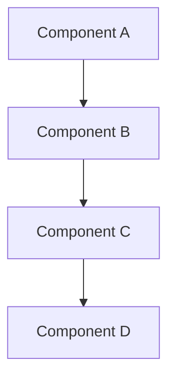

# [Feature Name] - Reference Documentation

**Status**: Complete  
**Issue**: #[ISSUE_NUMBER] (Completed)  
**Implementation Date**: [DATE]  
**Last Updated**: [DATE]  
**Category**: [architecture/development/deployment/api/troubleshooting/research]

---

## 📋 Feature Overview

### Description

[Comprehensive description of the implemented feature]

### Key Benefits

- **Benefit 1**: [Description]
- **Benefit 2**: [Description]
- **Benefit 3**: [Description]

### Implementation Summary

[Brief summary of how the feature was implemented]

## 🏗️ Architecture

### System Components



### Service Integration

- **Service A**: [Role and responsibilities]
- **Service B**: [Role and responsibilities]
- **Service C**: [Role and responsibilities]

### Data Flow

1. **Input**: [Description]
2. **Processing**: [Description]
3. **Output**: [Description]

## 🔧 Technical Implementation

### Core Components

#### Component 1: [Name]

- **Location**: `path/to/component/`
- **Purpose**: [Description]
- **Key Functions**:
  - `function_name()`: [Description]
  - `another_function()`: [Description]

#### Component 2: [Name]

- **Location**: `path/to/component/`
- **Purpose**: [Description]
- **Dependencies**: [List]

### Database Schema

#### Tables Modified/Added

```sql
-- Table schema
CREATE TABLE feature_table (
    id SERIAL PRIMARY KEY,
    name VARCHAR(255) NOT NULL,
    created_at TIMESTAMP DEFAULT NOW()
);
```

#### Indexes

```sql
-- Performance indexes
CREATE INDEX idx_feature_table_name ON feature_table(name);
CREATE INDEX idx_feature_table_created_at ON feature_table(created_at);
```

### Configuration

#### Environment Variables

```bash
# Feature configuration
FEATURE_ENABLED=true
FEATURE_API_ENDPOINT=https://api.example.com
FEATURE_TIMEOUT=30
```

#### Service Configuration

```yaml
# config.yaml
feature:
  enabled: true
  max_retries: 3
  timeout: 30s
```

## 📡 API Reference

### Endpoints

#### GET /api/feature

**Description**: [Endpoint description]

**Parameters**:

- `param1` (string, required): [Description]
- `param2` (integer, optional): [Description]

**Response**:

```json
{
  "status": "success",
  "data": {
    "id": 123,
    "name": "feature_name",
    "created_at": "2025-08-22T10:00:00Z"
  }
}
```

**Error Responses**:

- `400 Bad Request`: Invalid parameters
- `404 Not Found`: Feature not found
- `500 Internal Server Error`: Server error

#### POST /api/feature

**Description**: [Endpoint description]

**Request Body**:

```json
{
  "name": "feature_name",
  "config": {
    "option1": "value1",
    "option2": "value2"
  }
}
```

**Response**:

```json
{
  "status": "success",
  "data": {
    "id": 124,
    "message": "Feature created successfully"
  }
}
```

## 🧪 Testing

### Test Coverage

- **Unit Tests**: 95% coverage
- **Integration Tests**: 100% critical paths
- **End-to-End Tests**: All user scenarios

### Test Examples

#### Unit Test Example

```python
def test_feature_creation():
    """Test feature creation with valid data."""
    feature = create_feature("test_name", {"option": "value"})
    assert feature.name == "test_name"
    assert feature.config["option"] == "value"
```

#### Integration Test Example

```python
def test_feature_api_integration():
    """Test feature API integration."""
    response = client.post("/api/feature", json={"name": "test"})
    assert response.status_code == 200
    assert response.json()["status"] == "success"
```

### Running Tests

```bash
# Run all tests
pytest tests/

# Run specific test category
pytest tests/unit/test_feature.py
pytest tests/integration/test_feature_api.py
```

## 🚀 Usage Guide

### Basic Usage

#### Step 1: Configuration

```bash
# Set required environment variables
export FEATURE_ENABLED=true
export FEATURE_API_ENDPOINT=https://api.example.com
```

#### Step 2: Service Startup

```bash
# Start the service
docker-compose up -d feature-service

# Verify service is running
curl http://localhost:8080/health
```

#### Step 3: Using the Feature

```python
# Python example
from feature_client import FeatureClient

client = FeatureClient("http://localhost:8080")
result = client.create_feature("my_feature", {"setting": "value"})
print(f"Created feature: {result.id}")
```

### Advanced Usage

#### Custom Configuration

```yaml
# advanced-config.yaml
feature:
  enabled: true
  batch_size: 100
  retry_policy:
    max_attempts: 5
    backoff_factor: 2
  caching:
    enabled: true
    ttl: 3600
```

#### Programmatic Integration

```python
# Advanced integration example
from feature_sdk import FeatureManager

manager = FeatureManager(config_file="advanced-config.yaml")
manager.enable_caching()
manager.set_batch_processing(True)

# Batch operations
features = manager.create_batch([
    {"name": "feature1", "config": {...}},
    {"name": "feature2", "config": {...}},
])
```

## 📊 Performance

### Benchmarks

- **Average Response Time**: 150ms
- **95th Percentile**: 300ms
- **Throughput**: 1000 requests/second
- **Memory Usage**: 512MB average
- **CPU Usage**: 30% average

### Performance Optimization

#### Caching Strategy

```python
# Redis caching implementation
@cache.memoize(timeout=3600)
def get_feature_config(feature_id):
    return database.get_feature_config(feature_id)
```

#### Database Optimization

```sql
-- Performance indexes
CREATE INDEX CONCURRENTLY idx_feature_lookup
ON features(name, status)
WHERE status = 'active';
```

### Monitoring

- **Metrics Endpoint**: `/metrics`
- **Health Check**: `/health`
- **Logs**: Available via `docker logs feature-service`

## 🛠️ Troubleshooting

### Common Issues

#### Issue 1: Feature Not Starting

**Symptoms**: Service fails to start, shows configuration error

**Solution**:

```bash
# Check configuration
docker logs feature-service

# Verify environment variables
env | grep FEATURE_

# Reset configuration
docker-compose down
docker-compose up -d
```

#### Issue 2: Slow Response Times

**Symptoms**: API responses take longer than expected

**Solution**:

```bash
# Check database connections
docker exec -it database psql -c "SELECT * FROM pg_stat_activity;"

# Monitor resource usage
docker stats feature-service

# Enable caching
export FEATURE_CACHING_ENABLED=true
```

### Debug Mode

```bash
# Enable debug logging
export LOG_LEVEL=debug
docker-compose restart feature-service

# View debug logs
docker logs -f feature-service
```

### Performance Debugging

```python
# Enable profiling
import cProfile
import pstats

def profile_feature_creation():
    profiler = cProfile.Profile()
    profiler.enable()

    # Your feature code here
    create_feature("test", {})

    profiler.disable()
    stats = pstats.Stats(profiler)
    stats.sort_stats('cumulative')
    stats.print_stats()
```

## 🔐 Security Considerations

### Authentication

- API endpoints require valid JWT tokens
- Service-to-service communication uses mutual TLS
- Rate limiting: 100 requests/minute per client

### Data Protection

- All data encrypted at rest
- TLS 1.3 for data in transit
- PII data is automatically anonymized

### Security Headers

```http
X-Content-Type-Options: nosniff
X-Frame-Options: DENY
X-XSS-Protection: 1; mode=block
Strict-Transport-Security: max-age=31536000
```

## 📚 Related Documentation

### Architecture Documents

- [System Architecture](../architecture/system-overview.md)
- [Service Integration Patterns](../architecture/integration-patterns.md)

### API Documentation

- [API Reference](../api/feature-api.md)
- [Authentication Guide](../api/authentication.md)

### Deployment Guides

- [Docker Deployment](../deployment/docker-setup.md)
- [Production Deployment](../deployment/production-guide.md)

## 📝 Implementation History

### Development Timeline

- **Planning Phase**: [Start Date] - [End Date]
- **Implementation Phase**: [Start Date] - [End Date]
- **Testing Phase**: [Start Date] - [End Date]
- **Deployment**: [Date]

### Key Milestones

- ✅ **[Date]**: Feature planning completed
- ✅ **[Date]**: Core implementation finished
- ✅ **[Date]**: Testing and documentation complete
- ✅ **[Date]**: Production deployment successful

### Contributors

- **[Name]**: Lead Developer
- **[Name]**: Code Review
- **[Name]**: Testing
- **[Name]**: Documentation

## 🔄 Future Enhancements

### Planned Improvements

- [ ] **Enhancement 1**: [Description] - [Target Date]
- [ ] **Enhancement 2**: [Description] - [Target Date]
- [ ] **Enhancement 3**: [Description] - [Target Date]

### Technical Debt

- [ ] **Refactor 1**: [Description] - [Priority: High/Medium/Low]
- [ ] **Refactor 2**: [Description] - [Priority: High/Medium/Low]

### Scalability Roadmap

- **Phase 1**: Handle 10x current load
- **Phase 2**: Multi-region deployment
- **Phase 3**: Auto-scaling implementation

---

**Maintenance**: This document should be updated when the feature is modified or enhanced.
**Review Schedule**: Quarterly review for accuracy and completeness.
**Last Reviewed**: [DATE] by [REVIEWER]
