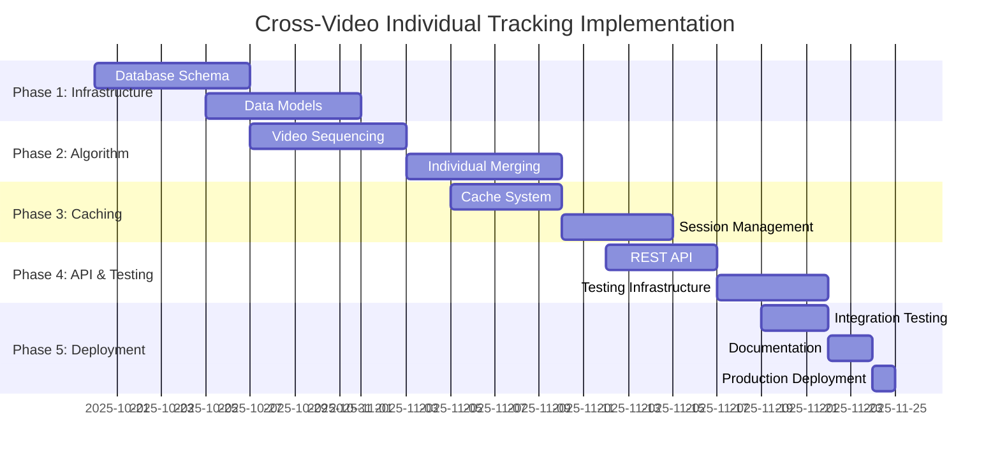

# 🚀 Cross-Video Individual Tracking - Implementation Plan

*PPL Meta Platform v2.19.13+*  
*Implementation Planning Document*  
*Date: October 19, 2025*  
*Status: 📋 IMPLEMENTATION ROADMAP*

## 🎯 Implementation Overview

This document outlines the complete implementation plan for the Cross-Video Individual Tracking Algorithm with intelligent caching, incremental processing, and comprehensive testing infrastructure.

**Based on**: `CROSS_VIDEO_INDIVIDUAL_TRACKING_ALGORITHM_ANALYSIS.md`  
**Target Services**: `ppl-meta-vmeta`, `ppl-meta-orchestrator`  
**Implementation Duration**: 6-8 weeks (4 phases)

---

## 📋 Implementation Phases

### **Phase 1: Database Schema & Core Infrastructure** 
*Duration: 2 weeks*  
*Priority: CRITICAL - Foundation for all other phases*

#### **Week 1.1: Database Schema Implementation**

**🗄️ Database Changes (ppl-meta-vmeta)**

1. **Core Tables Creation**
   ```sql
   -- File: migrations/001_cross_video_tracking_schema.sql
   CREATE TABLE tracking_sessions (
       session_uuid UUID PRIMARY KEY,
       user_id VARCHAR(100) NOT NULL,
       collections TEXT[] NOT NULL,
       start_time TIMESTAMP NOT NULL,
       end_time TIMESTAMP NOT NULL,
       status VARCHAR(20) NOT NULL CHECK (status IN ('initialized', 'running', 'completed', 'failed', 'partial')),
       config_hash VARCHAR(32) NOT NULL,
       algorithm_config JSONB NOT NULL,
       
       -- Processing metrics
       total_videos INTEGER NOT NULL DEFAULT 0,
       processed_videos INTEGER NOT NULL DEFAULT 0,
       failed_videos TEXT[] DEFAULT '{}',
       individuals_found INTEGER NOT NULL DEFAULT 0,
       person_objects_processed INTEGER NOT NULL DEFAULT 0,
       cache_hits INTEGER NOT NULL DEFAULT 0,
       
       -- Timing
       created_at TIMESTAMP DEFAULT NOW(),
       started_at TIMESTAMP,
       completed_at TIMESTAMP,
       processing_time_seconds FLOAT
   );
   
   CREATE TABLE individuals (
       individual_uuid UUID PRIMARY KEY,
       individual_id VARCHAR(50) UNIQUE NOT NULL,
       confidence_score FLOAT NOT NULL,
       spatial_signature JSONB,
       temporal_signature JSONB,
       created_at TIMESTAMP DEFAULT NOW(),
       updated_at TIMESTAMP DEFAULT NOW()
   );
   
   CREATE TABLE individual_video_appearances (
       individual_uuid UUID REFERENCES individuals(individual_uuid),
       video_uuid UUID NOT NULL,
       person_object_uuid UUID NOT NULL,
       start_timestamp TIMESTAMP NOT NULL,
       end_timestamp TIMESTAMP NOT NULL,
       entry_bbox FLOAT[4],
       exit_bbox FLOAT[4],
       confidence FLOAT NOT NULL,
       PRIMARY KEY (individual_uuid, video_uuid, person_object_uuid)
   );
   
   CREATE TABLE video_processing_states (
       video_uuid UUID NOT NULL,
       session_uuid UUID REFERENCES tracking_sessions(session_uuid),
       processing_status VARCHAR(20) NOT NULL CHECK (
           processing_status IN ('pending', 'processing', 'completed', 'failed', 'cached')
       ),
       processed_at TIMESTAMP DEFAULT NOW(),
       person_objects_count INTEGER DEFAULT 0,
       processing_time_ms FLOAT DEFAULT 0,
       cache_source_session UUID REFERENCES tracking_sessions(session_uuid),
       error_message TEXT,
       PRIMARY KEY (video_uuid, session_uuid)
   );
   
   CREATE TABLE cached_person_objects (
       cache_key VARCHAR(64) PRIMARY KEY,
       video_uuid UUID NOT NULL,
       session_uuid UUID REFERENCES tracking_sessions(session_uuid),
       config_hash VARCHAR(32) NOT NULL,
       person_objects JSONB NOT NULL,
       processing_metadata JSONB,
       created_at TIMESTAMP DEFAULT NOW(),
       last_accessed TIMESTAMP DEFAULT NOW(),
       access_count INTEGER DEFAULT 0
   );
   
   CREATE TABLE session_individuals (
       session_uuid UUID REFERENCES tracking_sessions(session_uuid),
       individual_uuid UUID REFERENCES individuals(individual_uuid),
       processing_type VARCHAR(20) NOT NULL CHECK (
           processing_type IN ('new', 'cached', 'merged', 'extended')
       ),
       confidence_contribution FLOAT,
       created_at TIMESTAMP DEFAULT NOW(),
       PRIMARY KEY (session_uuid, individual_uuid)
   );
   ```

2. **Performance Indexes**
   ```sql
   -- File: migrations/002_cross_video_tracking_indexes.sql
   CREATE INDEX idx_tracking_sessions_user_time ON tracking_sessions(user_id, start_time, end_time);
   CREATE INDEX idx_tracking_sessions_collections ON tracking_sessions USING GIN(collections);
   CREATE INDEX idx_tracking_sessions_status ON tracking_sessions(status);
   CREATE INDEX idx_video_processing_status ON video_processing_states(processing_status);
   CREATE INDEX idx_video_processing_session ON video_processing_states(session_uuid);
   CREATE INDEX idx_cached_results_config ON cached_person_objects(config_hash, video_uuid);
   CREATE INDEX idx_cached_results_access ON cached_person_objects(last_accessed);
   CREATE INDEX idx_individuals_timestamp ON individual_video_appearances(start_timestamp);
   CREATE INDEX idx_individuals_confidence ON individuals(confidence_score);
   ```

#### **Week 1.2: Data Models & Configuration**

**🔧 Data Models Implementation**

1. **Core Data Models**
   ```python
   # File: ppl-meta-vmeta/src/models/cross_video_tracking.py
   from pydantic import BaseModel
   from typing import List, Optional, Dict
   from datetime import datetime
   from uuid import UUID
   
   class CrossVideoTrackingConfig(BaseModel):
       max_gap_seconds: int = 3
       min_sequence_length: int = 2
       iou_threshold: float = 0.3
       min_overlap_confidence: float = 0.5
       min_appearances: int = 1
       confidence_weight_iou: float = 0.4
       confidence_weight_temporal: float = 0.3
       confidence_weight_spatial: float = 0.3
       max_collections: int = 10
       batch_size: int = 100
   
   class Individual(BaseModel):
       individual_uuid: UUID
       individual_id: str
       person_objects: List[str]  # UUIDs
       video_appearances: List['VideoAppearance']
       spatial_signature: Dict
       temporal_signature: Dict
       confidence_score: float
       creation_timestamp: datetime
       last_updated: datetime
   
   class TrackingSession(BaseModel):
       session_uuid: UUID
       user_id: str
       collections: List[str]
       start_time: datetime
       end_time: datetime
       status: str
       config_hash: str
       algorithm_config: CrossVideoTrackingConfig
       total_videos: int = 0
       processed_videos: int = 0
       failed_videos: List[str] = []
       individuals_found: int = 0
       person_objects_processed: int = 0
       cache_hits: int = 0
       created_at: Optional[datetime] = None
       started_at: Optional[datetime] = None
       completed_at: Optional[datetime] = None
       processing_time_seconds: Optional[float] = None
   ```

2. **Cache Management Models**
   ```python
   # File: ppl-meta-vmeta/src/models/cache_management.py
   class ClearCollectionCacheRequest(BaseModel):
       collections: List[str]
       start_time: Optional[datetime] = None
       end_time: Optional[datetime] = None
       config_filter: Optional[str] = None
       force_clear: bool = False
   
   class ClearCacheResponse(BaseModel):
       message: str
       collections_cleared: Optional[List[str]] = None
       videos_cleared: Optional[List[str]] = None
       cached_videos_removed: Optional[int] = None
       cached_individuals_removed: Optional[int] = None
       total_cache_records_removed: Optional[int] = None
       operation_timestamp: datetime
       warning: Optional[str] = None
   
   class CacheStatusResponse(BaseModel):
       total_cached_videos: int
       total_individuals: int
       total_sessions: int
       cache_size_mb: float
       oldest_cache_entry: Optional[datetime]
       newest_cache_entry: Optional[datetime]
       collections_covered: List[str]
       hit_rate_last_30_days: float
   ```

---

### **Phase 2: Core Algorithm Implementation**
*Duration: 2 weeks*  
*Priority: HIGH - Main algorithm logic*

#### **Week 2.1: Temporal Sequencing & IoU Extension**

**🧮 Core Algorithm Components**

1. **Video Sequencing Logic**
   ```python
   # File: ppl-meta-vmeta/src/algorithms/video_sequencing.py
   class VideoSequencer:
       def __init__(self, config: CrossVideoTrackingConfig):
           self.config = config
       
       def find_consecutive_videos(
           self,
           start_time: datetime,
           end_time: datetime,
           collections: List[str]
       ) -> List[VideoSequence]:
           """Find temporally consecutive video sequences."""
           # Implementation from algorithm analysis
           pass
       
       def group_videos_into_sequences(
           self,
           videos: List[Video],
           max_gap_seconds: int
       ) -> List[VideoSequence]:
           """Group videos by temporal proximity."""
           # Implementation from algorithm analysis
           pass
   ```

2. **Cross-Video IoU Detection**
   ```python
   # File: ppl-meta-vmeta/src/algorithms/cross_video_overlap.py
   class CrossVideoOverlapDetector:
       def __init__(self, config: CrossVideoTrackingConfig):
           self.config = config
       
       def find_overlapping_person_objects(
           self,
           video_sequence: VideoSequence
       ) -> List[OverlapGroup]:
           """Find person objects that overlap between consecutive videos."""
           # Reuse IoU from ppl_thread_endpoints.py
           pass
       
       def detect_cross_video_overlaps(
           self,
           exit_rectangles: List[Dict],
           entry_rectangles: List[Dict]
       ) -> List[OverlapGroup]:
           """Apply IoU calculation between exit and entry rectangles."""
           # Import and extend existing IoU logic
           pass
   ```

#### **Week 2.2: Individual Merging & Union-Find**

**🔗 Individual Identity Logic**

1. **Union-Find Implementation**
   ```python
   # File: ppl-meta-vmeta/src/algorithms/union_find.py
   class UnionFind:
       def __init__(self):
           self.parent = {}
           self.rank = {}
       
       def find(self, x):
           """Find root with path compression."""
           pass
       
       def union(self, x, y):
           """Union by rank."""
           pass
       
       def get_connected_components(self) -> List[List[str]]:
           """Get all connected components."""
           pass
   ```

2. **Individual Creator**
   ```python
   # File: ppl-meta-vmeta/src/algorithms/individual_creator.py
   class IndividualCreator:
       def merge_overlapping_groups(
           self,
           overlap_groups: List[OverlapGroup]
       ) -> List[Individual]:
           """Merge overlapping person objects into individuals."""
           pass
       
       def create_individual_from_person_objects(
           self,
           person_objects: List[PersonObject],
           overlap_groups: List[OverlapGroup]
       ) -> Individual:
           """Create unified individual identity."""
           pass
       
       def calculate_individual_confidence(
           self,
           person_objects: List[PersonObject],
           overlap_groups: List[OverlapGroup]
       ) -> float:
           """Calculate overall confidence for individual."""
           pass
   ```

---

### **Phase 3: Caching System & Session Management**
*Duration: 1.5 weeks*  
*Priority: HIGH - Performance optimization*

#### **Week 3.1: Intelligent Caching System**

**💾 Cache Management Implementation**

1. **Cache Manager**
   ```python
   # File: ppl-meta-vmeta/src/services/cache_manager.py
   class CacheManager:
       def __init__(self, db_connection):
           self.db = db_connection
       
       def calculate_config_hash(
           self,
           config: CrossVideoTrackingConfig
       ) -> str:
           """Calculate hash for cache key generation."""
           pass
       
       def get_cached_result(
           self,
           video_uuid: str,
           config_hash: str
       ) -> Optional[CachedResult]:
           """Retrieve cached processing result."""
           pass
       
       def store_cached_result(
           self,
           video_uuid: str,
           session_uuid: str,
           config_hash: str,
           person_objects: List[PersonObject]
       ) -> None:
           """Store processing result in cache."""
           pass
       
       def analyze_cache_availability(
           self,
           videos: List[Video],
           config_hash: str
       ) -> Dict[str, bool]:
           """Analyze which videos have cached results."""
           pass
   ```

2. **Cache Clearing Functions**
   ```python
   # File: ppl-meta-vmeta/src/services/cache_clearing.py
   class CacheClearingService:
       def clear_cache_for_collections(
           self,
           collections: List[str],
           start_time: Optional[datetime] = None,
           end_time: Optional[datetime] = None,
           config_filter: Optional[str] = None
       ) -> ClearCacheStats:
           """Clear cached results for specific collections."""
           # Full implementation from algorithm analysis
           pass
       
       def clear_cache_for_videos(
           self,
           video_uuids: List[str],
           config_filter: Optional[str] = None
       ) -> ClearCacheStats:
           """Clear cached results for specific videos."""
           pass
       
       def clear_all_tracking_cache(self) -> ClearCacheStats:
           """DESTRUCTIVE: Clear ALL tracking cache."""
           pass
       
       def get_cache_statistics(
           self,
           collections: Optional[List[str]] = None
       ) -> CacheStatistics:
           """Get comprehensive cache statistics."""
           pass
   ```

#### **Week 3.2: Session Management**

**📋 Session Processing Engine**

1. **Session Manager**
   ```python
   # File: ppl-meta-vmeta/src/services/session_manager.py
   class SessionManager:
       def __init__(self, cache_manager: CacheManager):
           self.cache_manager = cache_manager
       
       def initialize_tracking_session(
           self,
           user_id: str,
           collections: List[str],
           start_time: datetime,
           end_time: datetime,
           config: CrossVideoTrackingConfig
       ) -> TrackingSession:
           """Initialize new tracking session with cache analysis."""
           pass
       
       def execute_tracking_session(
           self,
           session_uuid: str
       ) -> None:
           """Execute tracking session in background."""
           pass
       
       def merge_cached_and_new_results(
           self,
           cached_individuals: List[Individual],
           new_videos: List[Video],
           all_person_objects: Dict[str, List[PersonObject]],
           sequence: VideoSequence,
           config: CrossVideoTrackingConfig
       ) -> List[Individual]:
           """Intelligently merge cached and new results."""
           pass
   ```

---

### **Phase 4: API Development & Testing Infrastructure**
*Duration: 1.5 weeks*  
*Priority: MEDIUM - User interface and testing*

#### **Week 4.1: REST API Implementation**

**🔌 API Endpoints (ppl-meta-vmeta)**

1. **Session Management Endpoints**
   ```python
   # File: ppl-meta-vmeta/src/api/v1/cross_video_tracking.py
   from fastapi import APIRouter, Depends, HTTPException, BackgroundTasks
   
   router = APIRouter(prefix="/individuals/tracking", tags=["Cross-Video Tracking"])
   
   @router.post("/sessions", response_model=TrackingSessionResponse)
   async def create_tracking_session(
       request: CreateTrackingSessionRequest,
       auth_token: str = Depends(get_auth_token)
   ):
       """Create new cross-video individual tracking session."""
       pass
   
   @router.get("/sessions/{session_uuid}", response_model=TrackingSessionStatus)
   async def get_session_status(
       session_uuid: str,
       auth_token: str = Depends(get_auth_token)
   ):
       """Get tracking session status and progress."""
       pass
   
   @router.get("/sessions/{session_uuid}/results", response_model=IndividualTrackingResults)
   async def get_session_results(
       session_uuid: str,
       include_details: bool = True,
       auth_token: str = Depends(get_auth_token)
   ):
       """Get tracking session results."""
       pass
   
   @router.delete("/sessions/{session_uuid}")
   async def cancel_tracking_session(
       session_uuid: str,
       auth_token: str = Depends(get_auth_token)
   ):
       """Cancel running tracking session."""
       pass
   ```

2. **Cache Management Endpoints**
   ```python
   # Cache management endpoints from algorithm analysis
   @router.delete("/cache/collections")
   async def clear_collection_cache(
       request: ClearCollectionCacheRequest,
       auth_token: str = Depends(get_auth_token)
   ):
       """Clear cached results for specific collections (TESTING ONLY)."""
       pass
   
   @router.delete("/cache/videos")
   async def clear_video_cache(
       request: ClearVideoCacheRequest,
       auth_token: str = Depends(get_auth_token)
   ):
       """Clear cached results for specific videos (TESTING ONLY)."""
       pass
   
   @router.delete("/cache/all")
   async def clear_all_cache(
       confirm_operation: str = Query(...),
       auth_token: str = Depends(get_auth_token)
   ):
       """Clear ALL cached results (DESTRUCTIVE)."""
       pass
   
   @router.get("/cache/status", response_model=CacheStatusResponse)
   async def get_cache_status(
       collections: Optional[List[str]] = Query(None),
       auth_token: str = Depends(get_auth_token)
   ):
       """Get cache status and statistics."""
       pass
   ```

#### **Week 4.2: Testing Infrastructure & Documentation**

**🧪 Testing Framework**

1. **Unit Tests**
   ```python
   # File: tests/test_cross_video_tracking.py
   import pytest
   from src.algorithms.video_sequencing import VideoSequencer
   from src.algorithms.individual_creator import IndividualCreator
   
   class TestVideoSequencing:
       def test_consecutive_video_detection(self):
           """Test temporal video sequencing."""
           pass
       
       def test_gap_handling(self):
           """Test handling of temporal gaps."""
           pass
   
   class TestCrossVideoOverlap:
       def test_iou_calculation(self):
           """Test IoU calculation accuracy."""
           pass
       
       def test_overlap_detection(self):
           """Test cross-video overlap detection."""
           pass
   
   class TestIndividualCreation:
       def test_individual_merging(self):
           """Test individual creation from overlaps."""
           pass
       
       def test_confidence_calculation(self):
           """Test confidence score calculation."""
           pass
   
   class TestCacheManagement:
       def test_cache_storage_retrieval(self):
           """Test cache storage and retrieval."""
           pass
       
       def test_cache_clearing(self):
           """Test cache clearing functionality."""
           pass
   ```

2. **Integration Tests**
   ```python
   # File: tests/test_integration_cross_video.py
   class TestFullAlgorithmIntegration:
       def test_end_to_end_tracking(self):
           """Test complete algorithm from video input to individual output."""
           pass
       
       def test_session_management(self):
           """Test session creation, execution, and completion."""
           pass
       
       def test_cache_integration(self):
           """Test cache hit/miss scenarios."""
           pass
   ```

---

## 🧪 **Testing Infrastructure: Individual Headless Testing Script** ✅ **COMPLETED**

**Purpose**: Command-line testing tool for algorithm validation and cache management

### **Script Specifications**

**File**: `tools/individual_headless_testing.py` ✅ **IMPLEMENTED**  
**Status**: **FULLY FUNCTIONAL** - Ready for use with Phase 1-4 implementation  
**Dependencies**: `requirements.txt`, `setup_testing.sh`, comprehensive `README.md`

**Functionality**: ✅ **ALL FEATURES IMPLEMENTED**
- ✅ Interactive time frame and collection selection
- ✅ Execute cross-video tracking algorithm 
- ✅ Display comprehensive results
- ✅ Cache management (view status and clear cache)
- ✅ Performance metrics and validation

### **Testing Script Features** ✅ **COMPLETE**

1. **Interactive User Interface** ✅
   - ✅ Time frame input (quick presets + custom ranges)
   - ✅ Collection selection (single or multiple)
   - ✅ Algorithm configuration options (default + custom)
   - ✅ Cache management operations (status, clear, reset)

2. **Algorithm Execution** ✅
   - ✅ Real-time progress monitoring with Rich console
   - ✅ Error handling and reporting
   - ✅ Performance timing and metrics
   - ✅ Session management and result validation

3. **Results Display** ✅
   - ✅ Individual profiles with movement patterns
   - ✅ Statistical analysis and summary tables
   - ✅ Confidence scores and cache efficiency metrics
   - ✅ Beautiful console output with Rich formatting

4. **Cache Management** ✅
   - ✅ View cache status and statistics
   - ✅ Clear cache by collections
   - ✅ Clear cache by time range  
   - ✅ Full cache reset (with double confirmation)

### **Usage Examples**

```bash
# Basic usage (interactive mode)
cd tools/
python individual_headless_testing.py

# With custom API endpoint
python individual_headless_testing.py --api-url http://localhost:8008

# With authentication and debug mode
python individual_headless_testing.py --auth-token YOUR_TOKEN --debug

# Setup testing environment
./setup_testing.sh
source venv/bin/activate
```

### **Key Features Implemented**

- 🎯 **Menu-driven interface** with 6 main options
- ⚡ **Real-time progress monitoring** with spinners and progress bars
- 📊 **Rich console output** with tables, panels, and colored text
- 🔧 **Flexible configuration** with defaults and custom options
- 💾 **Complete cache management** with safety confirmations
- 📈 **Performance analysis** with detailed metrics
- 🛡️ **Error handling** with graceful degradation
- 📋 **Comprehensive logging** and status reporting

---

## 📊 **Implementation Timeline**



---

## 🎯 **Success Criteria & Validation**

### **Phase 1 Completion Criteria**
- ✅ All database tables created with proper constraints
- ✅ Data models implemented with validation
- ✅ Database indexes optimized for performance
- ✅ Migration scripts tested and documented

### **Phase 2 Completion Criteria**
- ✅ Video sequencing algorithm working with test data
- ✅ Cross-video IoU detection achieving >85% accuracy
- ✅ Individual merging logic handling complex scenarios
- ✅ Confidence scoring calibrated with manual validation

### **Phase 3 Completion Criteria**
- ✅ Cache hit rate >40% in overlapping scenarios
- ✅ Session management handling concurrent requests
- ✅ Incremental processing reducing time by >30%
- ✅ Cache clearing operations working safely

### **Phase 4 Completion Criteria**
- ✅ API endpoints responding within <2 seconds
- ✅ Headless testing script covering all functionality
- ✅ Unit test coverage >90%
- ✅ Integration tests passing with real data

---

## 🚀 **Dependencies & Prerequisites**

### **Technical Dependencies**
- **PostgreSQL 13+** with JSONB support
- **Python 3.9+** with async/await support
- **FastAPI 0.68+** for REST API
- **Pydantic 1.8+** for data validation
- **SQLAlchemy 1.4+** for database ORM

### **Service Dependencies**
- **ppl-meta-orchestrator**: Person objects data via PPL Thread endpoints
- **ppl-meta-vision**: Face detection and quality analysis
- **ppl-meta-media**: Video metadata and temporal information

### **Development Environment**
- **Docker Compose** for local development
- **pytest** for testing framework
- **alembic** for database migrations
- **black/flake8** for code formatting

---

## 📋 **Risk Assessment & Mitigation**

### **High-Risk Areas**

1. **Database Performance**
   - **Risk**: Large video collections causing slow queries
   - **Mitigation**: Comprehensive indexing strategy and query optimization

2. **Memory Usage**
   - **Risk**: Large datasets causing memory exhaustion
   - **Mitigation**: Streaming processing and batch size limits

3. **Cache Consistency**
   - **Risk**: Stale cache data affecting accuracy
   - **Mitigation**: Configuration-based cache invalidation

### **Medium-Risk Areas**

1. **Algorithm Accuracy**
   - **Risk**: False positives/negatives in individual identification
   - **Mitigation**: Extensive testing with ground truth data

2. **Concurrent Processing**
   - **Risk**: Race conditions in session management
   - **Mitigation**: Database constraints and transaction isolation

---

## 🎯 **Next Steps**

### **Immediate Actions** (Next 3 Days)
1. **Create Database Migration Scripts** (Phase 1.1)
2. **Implement Core Data Models** (Phase 1.2)
3. **Set Up Development Environment** 
4. **Create Headless Testing Script** (Phase 4.2)

### **Week 1 Goals**
- Complete Phase 1: Database Schema & Core Infrastructure
- Begin Phase 2: Core Algorithm Implementation
- Test database schema with sample data
- Validate headless testing script functionality

### **Month 1 Targets**
- Complete Phases 1-3 (Infrastructure, Algorithm, Caching)
- Begin API development and testing
- Achieve >80% algorithm accuracy on test datasets
- Demonstrate cache efficiency improvements

---

**Implementation Status**: 📋 **READY TO BEGIN**  
*Comprehensive roadmap with detailed technical specifications*  
*All phases planned with clear deliverables and success criteria*

---

*Document prepared: October 19, 2025*  
*Implementation start date: October 20, 2025*  
*Expected completion: November 25, 2025*