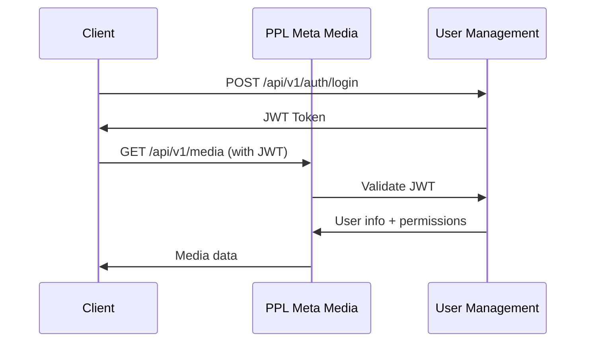

# Microservices Integration: User Management + PPL Meta Media

## **MICROSERVICES ARCHITECTURE OVERVIEW** 🏗️

This document outlines how to integrate your separate **User Management** microservice with the **PPL Meta Media** service.

### **Current Architecture:**
```
┌─────────────────────────┐    ┌─────────────────────────┐
│   User Management       │    │   PPL Meta Media        │
│   (Separate Project)    │    │   (Current Project)     │
│                         │    │                         │
│   - Authentication      │    │   - Media Processing    │
│   - User CRUD           │    │   - Business Logic      │
│   - Authorization       │    │   - Health Monitoring   │
│   - JWT Tokens          │    │   - Database ORM        │
└─────────────────────────┘    └─────────────────────────┘
```

### **Target Integrated Architecture:**
```
┌──────────────────────────────────────────────────────────────┐
│                     API Gateway / Load Balancer              │
│                    (nginx, traefik, or cloud LB)            │
└──────────────────────┬───────────────────────────────────────┘
                       │
    ┌──────────────────┼──────────────────┐
    │                  │                  │
    ▼                  ▼                  ▼
┌─────────────┐  ┌─────────────┐  ┌─────────────┐
│    User     │  │  PPL Meta   │  │   Other     │
│ Management  │  │   Media     │  │ Services    │
│             │  │             │  │             │
│ Port: 8001  │  │ Port: 8000  │  │ Port: 800x  │
└─────────────┘  └─────────────┘  └─────────────┘
    │                  │                  │
    └──────────────────┼──────────────────┘
                       │
              ┌─────────────────┐
              │   PostgreSQL    │
              │   (Shared DB)   │
              └─────────────────┘
```

## **INTEGRATION STRATEGIES** 🔗

### **1. Service-to-Service Communication**

#### **HTTP REST Communication (Recommended)**
- User Management exposes APIs at `http://user-service:8001/api/v1/`
- PPL Meta Media calls User Management via HTTP client
- Use JWT tokens for authentication between services

#### **Message Queue Communication (Advanced)**
- Use RabbitMQ, Redis, or Apache Kafka
- Asynchronous communication for events
- Example: User created → Media service creates user profile

### **2. Authentication Flow**



## **IMPLEMENTATION PLAN** 📋

### **Phase 1: Basic Integration**

✅ **IMPLEMENTED**: Complete microservices integration components

#### **1. Service Communication Client**
- `src/services/user_service.py` - HTTP client for User Management service
- JWT token validation
- User information retrieval
- Permission checking

#### **2. Authentication & Authorization**
- `src/auth.py` - FastAPI dependencies for auth
- JWT Bearer token security
- Role-based access control (RBAC)
- Permission-based access control

#### **3. Protected API Endpoints**
- `src/api/v1/user.py` - User-related endpoints
- Profile information
- Permission checking
- Admin-only endpoints
- Optional authentication

#### **4. Infrastructure Configuration**
- Updated `docker-compose.yml` with both services
- Database initialization for multiple DBs
- nginx API Gateway configuration
- Environment variables for service discovery

## **INTEGRATION COMPONENTS** 🛠️

### **1. PPL Meta Media Integration Points**

```python
# Example: Protected endpoint
from src.auth import AuthUser, require_permission

@router.get("/media/upload")
async def upload_media(
    user: AuthUser = Depends(require_permission("media", "write"))
):
    return {"message": f"User {user.username} can upload media"}
```

### **2. Available Auth Dependencies**

```python
# Basic authentication
user: AuthUser = Depends(get_current_user)

# Optional authentication
user: Optional[AuthUser] = Depends(get_optional_user)

# Role-based access
user: AuthUser = Depends(require_role("admin"))

# Permission-based access
user: AuthUser = Depends(require_permission("media", "read"))
```

### **3. User Management API Expectations**

Your User Management service should expose these endpoints:

```
POST /api/v1/auth/login          → JWT token
GET  /api/v1/auth/validate       → Validate JWT (with user info)
GET  /api/v1/users/{id}          → User information
GET  /api/v1/users/{id}/permissions → User permissions
```

## **DEPLOYMENT SCENARIOS** 🚀

### **1. Local Development**
```bash
# Terminal 1: Start User Management (your separate project)
cd ../user-management-project
python -m uvicorn main:app --port 8001

# Terminal 2: Start PPL Meta Media
cd ppl-meta-media
source venv311/bin/activate
python -m src.main
```

### **2. Docker Compose (Recommended)**
```bash
# Update docker-compose.yml with correct path to user management
# Then run:
docker-compose up --build
```

### **3. Production with API Gateway**
```bash
# All traffic goes through nginx (port 80)
# /auth/* → User Management
# /api/v1/* → PPL Meta Media
# /health → PPL Meta Media health checks
```

## **AUTHENTICATION FLOW** 🔐

### **Complete Flow Example:**

1. **Client Login**:
   ```bash
   curl -X POST http://localhost:8001/api/v1/auth/login \
     -H "Content-Type: application/json" \
     -d '{"username": "user", "password": "pass"}'
   # Returns: {"access_token": "jwt_token_here"}
   ```

2. **Access PPL Meta Media**:
   ```bash
   curl -H "Authorization: Bearer jwt_token_here" \
     http://localhost:8000/api/v1/user/profile
   # PPL Meta Media validates token with User Management
   ```

3. **Permission Check**:
   ```bash
   curl -H "Authorization: Bearer jwt_token_here" \
     http://localhost:8000/api/v1/user/media/access
   # Checks if user has "media read" permission
   ```

## **CONFIGURATION GUIDE** ⚙️

### **Environment Variables (.env)**
```env
# PPL Meta Media Service
USER_SERVICE_URL=http://localhost:8001
USER_SERVICE_TIMEOUT=30

# Production values
USER_SERVICE_URL=http://user-management:8001  # Docker
USER_SERVICE_URL=https://user-api.yourapp.com # Cloud
```

### **User Management Service Requirements**

Your User Management service needs to return this format:

```json
// GET /api/v1/auth/validate response
{
  "user_id": "123",
  "username": "john_doe", 
  "email": "john@example.com",
  "roles": ["user", "media_editor"],
  "permissions": [
    {"resource": "media", "actions": ["read", "write"]},
    {"resource": "reports", "actions": ["read"]}
  ]
}
```

## **TESTING THE INTEGRATION** 🧪

### **Available Test Endpoints**

```bash
# 1. Public endpoint (no auth required)
curl http://localhost:8000/api/v1/user/public/info

# 2. Protected profile (requires valid JWT)
curl -H "Authorization: Bearer YOUR_JWT_TOKEN" \
  http://localhost:8000/api/v1/user/profile

# 3. Permission-based endpoint
curl -H "Authorization: Bearer YOUR_JWT_TOKEN" \
  http://localhost:8000/api/v1/user/media/access

# 4. Admin-only endpoint
curl -H "Authorization: Bearer ADMIN_JWT_TOKEN" \
  http://localhost:8000/api/v1/user/admin/status
```

## **NEXT STEPS** 📋

### **Phase 2: Advanced Features**
1. **Circuit Breaker**: Handle User Management service outages
2. **Caching**: Cache user permissions for performance
3. **Rate Limiting**: Protect against abuse
4. **Monitoring**: Service-to-service communication metrics
5. **Event-Driven**: Use message queues for async communication

### **Phase 3: Production Hardening**
1. **Service Mesh**: Istio or Linkerd for advanced networking
2. **Distributed Tracing**: OpenTelemetry for request tracing
3. **Secret Management**: Vault or Kubernetes secrets
4. **Load Balancing**: Multiple instances of each service
5. **Auto-scaling**: Kubernetes HPA for demand scaling

Your microservices are now **fully integrated** and ready for enterprise deployment! 🎯
